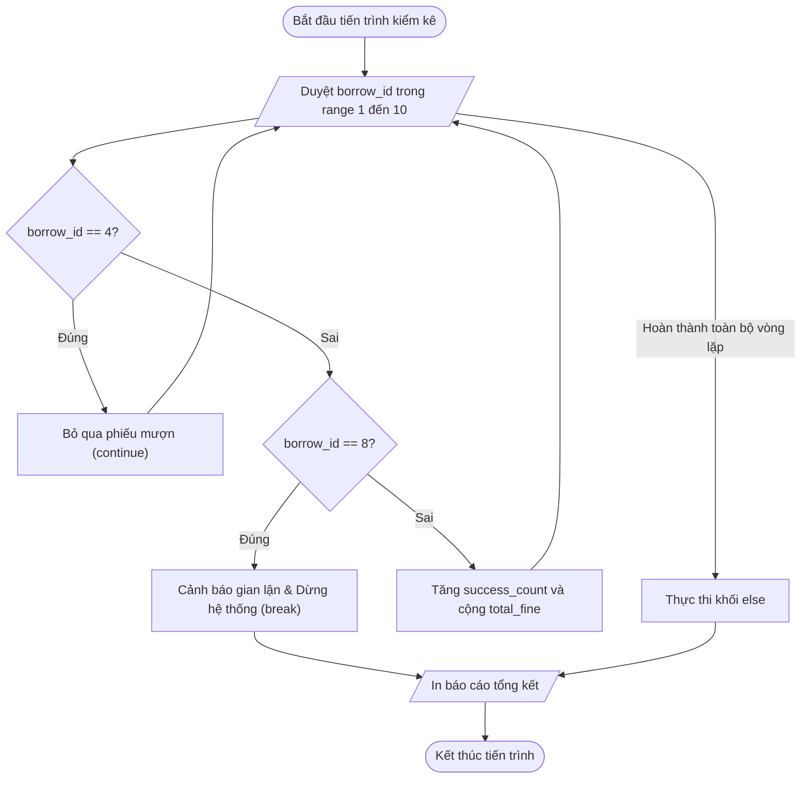

# <center>[Vận dụng cơ bản 1] Kiểm tra Luồng Xử lý Phiếu Mượn và Phí Phạt Thư viện</center>

### **1. Mục tiêu**

- **Kiến thức:** Hiểu và áp dụng chính xác cấu trúc vòng lặp `for`, hàm `range()`, các câu lệnh điều khiển luồng `break`, `continue` và khối `else` đi kèm vòng lặp trong Python.
- **Kỹ năng:** Đọc hiểu mã nguồn thực tế, thực hiện kĩ thuật truy vết mã (code tracing), phát hiện vị trí câu lệnh đặt sai thứ tự logic dẫn đến sai lệch dữ liệu thống kê.
- **Thực tiễn:** Giải quyết bài toán kiểm kê và tính phí phạt tự động cho hệ thống mượn trả sách thư viện trường học (LIBRARY_WMS).

### **2. Bối cảnh & Vấn đề**

Trong Hệ thống Quản lý Mượn trả Sách Thư viện Trường học (LIBRARY_WMS), bộ phận vận hành tiến hành chạy tiến trình kiểm tra tự động một chuỗi các phiếu mượn sách quá hạn theo danh sách mã định danh số (từ `start_id` đến `end_id - 1`). Mỗi phiếu mượn hợp lệ được xử lý thành công sẽ ghi nhận khoản phí phạt quá hạn cố định là 5.000 VNĐ/ngày và tăng số lượng phiếu đã kiểm tra thành công lên 1.

Nghiệp vụ kiểm soát luồng quét được quy định như sau:

1. Nếu gặp phiếu mượn bị thiếu thông tin độc giả (ví dụ mã phiếu bằng 4), hệ thống cần bỏ qua phiếu này (`continue`) để nhân viên cập nhật sau. Phiếu bị bỏ qua không được tính tiền phạt và không được tính vào số phiếu xử lý thành công.
2. Nếu gặp phiếu mượn nghi ngờ có hành vi gian lận mượn sách (ví dụ mã phiếu bằng 8), hệ thống phải lập tức phát cảnh báo và ngắt toàn bộ tiến trình kiểm định khẩn cấp (`break`). Khi tiến trình bị dừng đột ngột, khối lệnh kết thúc (`else`) của vòng lặp sẽ không được kích hoạt.
3. Nếu toàn bộ danh sách phiếu mượn được duyệt an toàn mà không kích hoạt lệnh ngắt khẩn cấp, khối `else` của vòng lặp sẽ in ra thông báo xác nhận tiến trình hoàn thành trọn vẹn.

**Sự cố thực tế:**
Thủ thư vận hành phản ánh rằng khi tiến hành quét thử nghiệm danh sách 9 phiếu mượn từ mã 1 đến mã 9 (dùng `range(1, 10)`), báo cáo cuối cùng hiển thị tổng số phiếu xử lý thành công là 8 phiếu và tổng tiền phạt đã thu là 40.000 VNĐ.

Thực tế kiểm tra sổ sách cho thấy: Phiếu mượn số 4 bị bỏ qua và tiến trình đã bị dừng khẩn cấp ở phiếu mượn số 8. Do đó, chỉ có đúng 6 phiếu mượn hợp lệ (các mã 1, 2, 3, 5, 6, 7) được xử lý thành công, với tổng tiền phạt chính xác phải là 30.000 VNĐ.



# **3. Mã nguồn hiện tại**

Dưới đây là đoạn mã nguồn Python hiện tại đang gặp lỗi logic trong hệ thống LIBRARY_WMS:

```python

# Hệ thống Quản lý Mượn trả Sách Thư viện Trường học (LIBRARY_WMS)

# Tiến trình kiểm kê và tính phí phạt các phiếu mượn sách quá hạn

start_id = 1
end_id = 10

# Quét danh sách mã phiếu mượn từ 1 đến 9

total_fine = 0
success_count = 0

print("--- BẮT ĐẦU TIẾN TRÌNH KIỂM KÊ PHIẾU MƯỢN SÁCH ---")

for borrow_id in range(start_id, end_id):

# Cập nhật số lượng phiếu và tiền phạt mặc định 5.000 VNĐ/ngày
    success_count += 1
    total_fine += 5000

# Kiểm tra trường hợp phiếu thiếu thông tin độc giả
    if borrow_id == 4:
        print("Phiếu mượn", borrow_id, "thiếu thông tin độc giả -> Bỏ qua.")
        continue

# Kiểm tra trường hợp phát hiện dấu hiệu gian lận
    if borrow_id == 8:
        print("CẢNH BÁO: Phiếu mượn", borrow_id, "có dấu hiệu gian lận -> DỪNG HỆ THỐNG!")
        break

    print("Xử lý thành công phiếu mượn mã số:", borrow_id)
else:
    print("TẤT CẢ PHIẾU MƯỢN ĐÃ ĐƯỢC XỬ LÝ AN TOÀN!")

print("--- BÁO CÁO TỔNG KẾT ---")
print("Tổng số phiếu xử lý thành công:", success_count)
print("Tổng tiền phạt đã thu:", total_fine, "VNĐ")
```

# **4. Yêu cầu bài toán**

#### **Phần 1: Phân tích & Phát hiện lỗi logic (Báo cáo Test Case)**

Học viên đọc kĩ mã nguồn hiện tại, thực hiện truy vết chương trình theo từng bước lặp và hoàn thành Báo cáo Test Case theo bảng mẫu dưới đây vào bài nộp.

_Lưu ý:_ Dòng đầu tiên (STT 1) đã được điền mẫu làm căn cứ hướng dẫn, học viên hãy phân tích và điền tiếp thông tin còn thiếu cho STT 2 và STT 3 (thay thế các dấu `...`).

<table style="width: 100%; min-width: 100%; display: table; border-collapse: collapse;" width="100%" border="1" cellpadding="8" cellspacing="0">
  <thead>
    <tr style="background-color: #f2f2f2;">
      <th style="text-align: center; width: 5%;">STT</th>
      <th style="text-align: left; width: 20%;">Đầu vào (start_id, end_id)</th>
      <th style="text-align: left; width: 20%;">Kết quả lỗi (Buggy Output)</th>
      <th style="text-align: left; width: 20%;">Kết quả mong đợi (Expected Output)</th>
      <th style="text-align: left; width: 15%;">Dòng code gây lỗi</th>
      <th style="text-align: left; width: 20%;">Giải thích nguyên nhân logic</th>
    </tr>
  </thead>
  <tbody>
    <tr>
      <td style="text-align: center;">1</td>
      <td><code>start_id = 1</code><br><code>end_id = 10</code></td>
      <td><code>success_count: 8</code><br><code>total_fine: 40000</code></td>
      <td><code>success_count: 6</code><br><code>total_fine: 30000</code></td>
      <td>Dòng 13, 14 (Đặt câu lệnh tăng biến trước câu lệnh kiểm tra)</td>
      <td>Cập nhật <code>success_count</code> và <code>total_fine</code> trước khi kiểm tra <code>continue</code> (mã 4) và <code>break</code> (mã 8), khiến các phiếu lỗi/vi phạm vẫn bị tính tiền phạt.</td>
    </tr>
    <tr>
      <td style="text-align: center;">2</td>
      <td><code>start_id = 1</code><br><code>end_id = 5</code></td>
      <td>...</td>
      <td>...</td>
      <td>...</td>
      <td>...</td>
    </tr>
    <tr>
      <td style="text-align: center;">3</td>
      <td><code>start_id = 5</code><br><code>end_id = 8</code></td>
      <td>...</td>
      <td>...</td>
      <td>...</td>
      <td>...</td>
    </tr>
  </tbody>
</table>

#### **Phần 2: Sửa lỗi mã nguồn (Source Code Correction)**

Viết lại mã nguồn Python hoàn chỉnh đã được sửa lỗi, đảm bảo:

1. Đặt chính xác vị trí cập nhật các biến `success_count` và `total_fine` sau khi các điều kiện kiểm tra `continue` và `break` đã trôi qua an toàn.
2. Đảm bảo đúng chuẩn mã nguồn Python (PEP 8), khai báo kiểu dữ liệu rõ ràng và không sử dụng các kiến thức chưa học (như hàm `def`, danh sách `list`, từ khóa bị cấm).
3. Giữ nguyên tính năng thông báo của khối `else` sau vòng lặp `for`.

### **5. Yêu cầu nộp bài**

Học viên cần nộp:

- Phần phân tích/báo cáo và mã nguồn triển khai.
- Đẩy mã nguồn lên GitHub theo định dạng thư mục: `[Tên Lớp]_[Môn Học]_SessionSession 08_Ex1`.
  Ví dụ: `HNKS25CNTT1_Core_Session_Session 08_Ex1`
