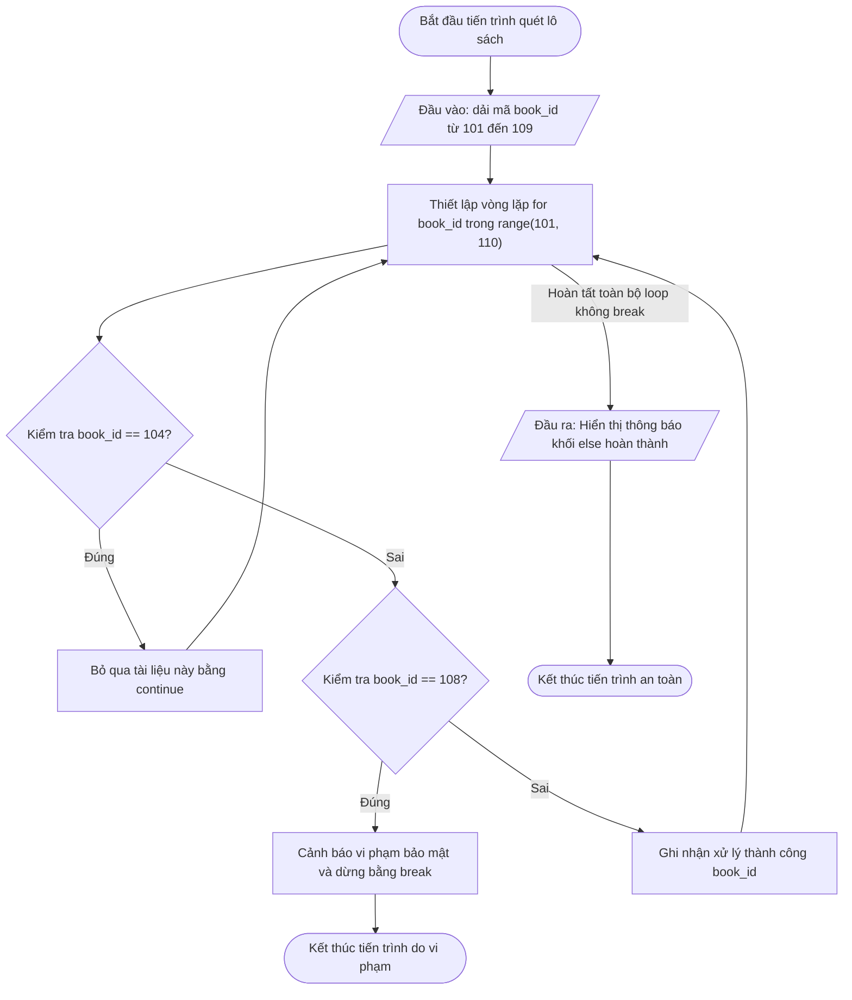

## <center>[Vận dụng cơ bản 3] Sửa lỗi luồng quét duyệt mã tài liệu thư viện</center>

### **1. Mục tiêu**

- **Hiểu và áp dụng đúng cấu trúc điều khiển vòng lặp:** Sử dụng chính xác các câu lệnh `break`, `continue` và khối `else` kết hợp với vòng lặp `for` và hàm `range()`.
- **Phân tích luồng thực thi (Code Tracing):** Truy vết từng bước chạy của vòng lặp để phát hiện lỗi ngắt luồng sai nghiệp vụ.
- **Sửa lỗi mã nguồn (Debugging):** Điều chỉnh câu lệnh điều khiển luồng trong ứng dụng Quản lý Mượn trả Sách Thư viện (LIBRARY_WMS) nhằm đảm bảo hệ thống quét và xử lý đúng danh sách tài liệu.

### **2. Bối cảnh & Vấn đề**

Trong Hệ thống Quản lý Mượn trả Sách Thư viện (`LIBRARY_WMS`), mô-đun tự động phụ trách việc quét danh sách mã số tài liệu mượn (được đại diện bằng các số nguyên liên tiếp trong một khoảng `range`).

Quy trình kiểm tra nghiệp vụ được thiết lập như sau:

1.  **Duyệt từng mã sách:** Hệ thống lần lượt quét các mã sách trong danh sách được chỉ định.
2.  **Tài liệu lỗi nhãn vị trí nhẹ (Mã 104):** Nếu tài liệu bị thiếu thông tin vị trí lưu kho, hệ thống cần ghi nhận thông báo bỏ qua tài liệu này để kiểm tra thủ công sau, đồng thời **tiếp tục quét các tài liệu còn lại** trong lô mượn.
3.  **Tài liệu vi phạm bảo mật nghiêm trọng (Mã 108):** Nếu tài liệu nằm trong danh sách cảnh báo vi phạm bảo mật khẩn cấp, hệ thống phải **dừng lập tức toàn bộ tiến trình quét** để phong tỏa.
4.  **Thông báo hoàn thành toàn bộ:** Nếu tiến trình quét duyệt hết tất cả tài liệu trong lô mà không kích hoạt cảnh báo vi phạm bảo mật khẩn cấp, hệ thống sẽ thực thi khối `else` của vòng lặp để in thông báo xác nhận an toàn.



**Sự cố thực tế:**
Bộ phận thủ thư phản ánh rằng khi tiến hành quét lô sách từ mã `101` đến `109`, ngay khi hệ thống quét tới mã `104` (tài liệu bị thiếu nhãn vị trí), toàn bộ tiến trình bị ngắt đột ngột. Các tài liệu hợp lệ phía sau (từ `105` đến `107`) không được kiểm tra, đồng thời thông báo xác nhận hoàn thành từ khối `else` cũng không xuất hiện.

### **3. Mã nguồn hiện tại**

Đoạn mã nguồn bên dưới đang được triển khai trong ứng dụng nhưng chứa lỗi điều khiển luồng:

```python
# Hệ thống Quản lý Mượn trả Sách Thư viện (LIBRARY_WMS)
# Kiểm tra danh sách mã tài liệu mượn từ mã 101 đến 109

print("--- KÍCH HOẠT TIẾN TRÌNH KIỂM TRA MÃ SÁCH TỰ ĐỘNG ---")

# Duyệt qua các mã sách từ 101 đến 109
for book_id in range(101, 110):
    # Kiểm tra trường hợp tài liệu bị thiếu nhãn vị trí (mã 104)
    if book_id == 104:
        print("Tài liệu mã", book_id, "bị thiếu nhãn vị trí -> Bỏ qua tài liệu này")
        break

    # Kiểm tra trường hợp tài liệu thuộc danh sách vi phạm bảo mật (mã 108)
    if book_id == 108:
        print("CẢNH BÁO: Tài liệu mã", book_id, "có dấu hiệu vi phạm quy chế -> DỪNG HỆ THỐNG!")
        break

    print("Xử lý thành công tài liệu mã số:", book_id)
else:
    print("TẤT CẢ TÀI LIỆU TRONG LƯỢT QUÉT ĐÃ ĐƯỢC XÁC THỰC AN TOÀN!")
```

### **4. Yêu cầu bài toán**

#### **Phần 1: Báo cáo phân tích và truy vết lỗi (Code Tracing)**

Học viên tiến hành thực thi thử nghiệm mã nguồn hiện tại, phân tích luồng điều khiển và hoàn thành bảng báo cáo Test Case bên dưới vào bài nộp.
[NOTE] Học viên tham khảo dòng 1 (STT 1) đã được điền mẫu chuẩn để thực hiện tiếp cho các trường hợp còn lại.

<table style="width: 100%; min-width: 100%; display: table; border-collapse: collapse;" width="100%" border="1" cellpadding="8">
  <thead>
    <tr style="background-color: #f2f2f2;">
      <th style="text-align: center;">STT</th>
      <th style="text-align: left;">Dải dữ liệu đầu vào (Input)</th>
      <th style="text-align: left;">Kết quả thực tế bị lỗi (Buggy Output)</th>
      <th style="text-align: left;">Kết quả mong đợi (Expected Output)</th>
      <th style="text-align: center;">Dòng code gây lỗi</th>
      <th style="text-align: left;">Nguyên nhân & Phân tích (Logic Note)</th>
    </tr>
  </thead>
  <tbody>
    <tr>
      <td style="text-align: center;">1</td>
      <td>Quét dải mã sách <code>range(101, 106)</code> chứa mã 104 bị thiếu nhãn vị trí.</td>
      <td>
        Xử lý thành công tài liệu mã số: 101<br>
        Xử lý thành công tài liệu mã số: 102<br>
        Xử lý thành công tài liệu mã số: 103<br>
        Tài liệu mã 104 bị thiếu nhãn vị trí -> Bỏ qua tài liệu này<br>
        <em>(Dừng chương trình, bỏ sót mã 105 và không in thông báo else)</em>
      </td>
      <td>
        Xử lý thành công tài liệu mã số: 101<br>
        Xử lý thành công tài liệu mã số: 102<br>
        Xử lý thành công tài liệu mã số: 103<br>
        Tài liệu mã 104 bị thiếu nhãn vị trí -> Bỏ qua tài liệu này<br>
        Xử lý thành công tài liệu mã số: 105<br>
        TẤT CẢ TÀI LIỆU TRONG LƯỢT QUÉT ĐÃ ĐƯỢC XÁC THỰC AN TOÀN!
      </td>
      <td style="text-align: center;">Dòng 10 (câu lệnh <code>break</code>)</td>
      <td>Sử dụng câu lệnh <code>break</code> khi gặp mã 104 khiến toàn bộ vòng lặp <code>for</code> bị thoát lập tức thay vì chỉ bỏ qua mã 104 bằng câu lệnh <code>continue</code>. Do bị ngắt bởi <code>break</code>, khối <code>else</code> của vòng lặp không được kích hoạt.</td>
    </tr>
    <tr>
      <td style="text-align: center;">2</td>
      <td>Quét dải mã sách <code>range(101, 110)</code> chứa mã 104 (lỗi nhẹ) và mã 108 (vi phạm).</td>
      <td>...</td>
      <td>...</td>
      <td style="text-align: center;">...</td>
      <td>...</td>
    </tr>
    <tr>
      <td style="text-align: center;">3</td>
      <td>Quét dải mã sách <code>range(101, 104)</code> toàn bộ mã hợp lệ.</td>
      <td>...</td>
      <td>...</td>
      <td style="text-align: center;">...</td>
      <td>...</td>
    </tr>
  </tbody>
</table>

#### **Phần 2: Sửa lỗi mã nguồn (Source Code Correction)**

- Chỉnh sửa đoạn mã Python để xử lý đúng nghiệp vụ:
  - Tài liệu mã `104`: Dùng từ khóa phù hợp để bỏ qua mã này và tiếp tục vòng lặp cho các mã kế tiếp.
  - Tài liệu mã `108`: Dùng từ khóa phù hợp để dừng ngắt khẩn cấp toàn bộ hệ thống.
  - Khối `else`: Đảm bảo hiển thị câu thông báo hoàn tất an toàn khi toàn bộ dải sách được duyệt xong mà không bị ngắt bởi cảnh báo vi phạm bảo mật (mã 108).
- Đoạn mã phải tuân thủ chuẩn PEP 8, thụt lề 4 khoảng trắng, không chứa cú pháp chưa học.

### **5. Yêu cầu nộp bài**

Học viên cần nộp:

- Phần phân tích/báo cáo bảng Test Case và mã nguồn đã được sửa lỗi hoàn chỉnh.
- Đẩy mã nguồn lên GitHub theo định dạng thư mục: `[Tên Lớp]_[Môn Học]_Session08_Ex3`.
  Ví dụ: `HNKS25CNTT1_Core_Session08_Ex3`
