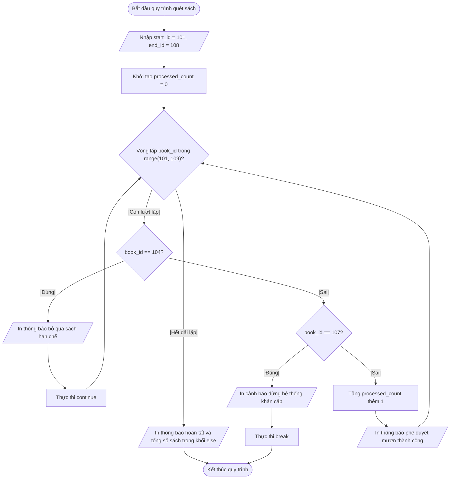

## <center>[Vận dụng cơ bản 4] Sửa lỗi luồng kiểm tra danh mục mượn sách theo lô</center>

### **1. Mục tiêu**
* Phân tích và phát hiện lỗi vị trí đặt câu lệnh điều khiển luồng (`continue`, `break`) trong vòng lặp `for` với hàm `range()`.
* Nắm vững cơ chế hoạt động và vai trò của khối `else` kết hợp trong vòng lặp `for` khi xử lý luồng lặp có điều kiện dừng khẩn cấp.
* Rèn luyện kỹ năng truy vết mã nguồn (code tracing) và lập Báo cáo Test Case để xác định chính xác dòng mã gây lỗi nghiệp vụ.
* Cấu trúc lại mã nguồn Python tuân thủ quy chuẩn kiểm tra điều kiện an toàn trước khi ghi nhận nghiệp vụ mượn sách.

### **2. Bối cảnh & Vấn đề**
Trong phân hệ xử lý dữ liệu của **Hệ thống Quản lý Mượn trả Sách Thư viện Trường học (LIBRARY_WMS)**, chức năng "Quét dải mã sách mượn tự động" được thiết kế để tự động duyệt qua các mã số tài liệu từ `start_id` đến `end_id` nhằm phê duyệt lượt mượn hàng loạt cho thủ thư.

Quy tắc nghiệp vụ của hệ thống quy định:
1. Mỗi mã sách hợp lệ trong dải quét sẽ được ghi nhận phê duyệt mượn thành công và tăng biến đếm `processed_count`.
2. Nếu mã sách thuộc danh mục hạn chế mượn (ví dụ: `book_id == 104`), hệ thống phải lập tức bỏ qua sách này bằng câu lệnh `continue`, không được in thông báo phê duyệt mượn và không được tăng biến đếm.
3. Nếu mã sách bị đánh dấu rủi ro an ninh/báo mất (ví dụ: `book_id == 107`), hệ thống phải dừng ngay toàn bộ tiến trình quét bằng câu lệnh `break`, đồng thời không được thực thi khối `else` của vòng lặp.
4. Khối `else` của vòng lặp `for` chỉ được phép thực thi khi toàn bộ dải quét được duyệt an toàn mà không bị ngắt bởi câu lệnh `break`.

**Vấn đề thực tế:** Nhân viên thư viện phản ánh rằng hệ thống hiện tại hoạt động sai nghiệp vụ nghiêm trọng. Khi chạy thử dải mã sách từ `101` đến `108`, đối với sách mã `104` (hạn chế mượn), màn hình vẫn hiển thị thông báo "Phê duyệt mượn thành công" và cộng biến đếm trước khi in dòng chữ bỏ qua. Tương tự, tại sách mã `107` (bị báo mất), hệ thống vẫn phê duyệt mượn thành công sách này trước khi đưa ra cảnh báo dừng khẩn cấp.

### **3. Mã nguồn hiện tại**
Dưới đây là đoạn mã nguồn Python legacy đang gặp lỗi điều khiển luồng nghiệp vụ:

```python
# Hệ thống Quản lý Mượn trả Sách Thư viện Trường học (LIBRARY_WMS)
# Phân hệ: Quét dải mã sách mượn tự động

start_id = 101
end_id = 108
processed_count = 0

print("--- BẮT ĐẦU TIẾN TRÌNH QUÉT MƯỢN SÁCH THEO LÔ ---")

for book_id in range(start_id, end_id + 1):
    # Ghi nhận phê duyệt mượn sách và tăng biến đếm
    print("Phê duyệt mượn thành công sách mã số:", book_id)
    processed_count += 1

    # Kiểm tra sách thuộc danh mục hạn chế mượn
    if book_id == 104:
        print("Đã bỏ qua sách mã số:", book_id, "(Danh mục hạn chế)")
        continue

    # Kiểm tra sách bị báo mất hoặc gặp sự cố an ninh
    if book_id == 107:
        print("CẢNH BÁO GIÁM SÁT: Dừng hệ thống do sách mã số:", book_id, "bị báo mất!")
        break
else:
    print("Tất cả sách trong dải đã được kiểm tra an toàn. Tổng số sách hợp lệ:", processed_count)

print("--- KẾT THÚC TIẾN TRÌNH ---")
```

### **4. Yêu cầu bài toán**

#### **Phần 1: Lập Báo cáo Test Case & Phân tích lỗi logic (Code Tracing)**
Học viên tiến hành chạy thử và truy vết mã nguồn từng bước (step-by-step trace). Điền đầy đủ dữ liệu vào bảng Báo cáo Test Case dưới đây. Lưu ý: Dòng 1 đã được cung cấp mẫu, học viên cần tự phân tích và hoàn thành các dòng 2 và 3 (`...`).

<table style="width: 100%; min-width: 100%; display: table; border-collapse: collapse;" width="100%" border="1" cellpadding="8" cellspacing="0">
  <thead>
    <tr style="background-color: #f2f2f2;">
      <th style="text-align: center; width: 5%;">STT</th>
      <th style="text-align: left; width: 20%;">Dữ liệu đầu vào (Input)</th>
      <th style="text-align: left; width: 25%;">Kết quả thực tế từ mã lỗi (Buggy Output)</th>
      <th style="text-align: left; width: 25%;">Kết quả mong đợi (Expected Output)</th>
      <th style="text-align: center; width: 10%;">Dòng code gây lỗi</th>
      <th style="text-align: left; width: 15%;">Giải thích nguyên nhân (Logic Note)</th>
    </tr>
  </thead>
  <tbody>
    <tr>
      <td style="text-align: center;">1</td>
      <td><code>start_id = 101</code><br><code>end_id = 104</code></td>
      <td>In thông báo mượn thành công sách 104, sau đó mới in dòng bỏ qua sách 104. <code>processed_count</code> = 4.</td>
      <td>Không in mượn thành công sách 104, chỉ in dòng bỏ qua sách 104. <code>processed_count</code> = 3.</td>
      <td style="text-align: center;">Dòng 12 - 13</td>
      <td>Mã nguồn thực hiện in ấn và cộng biến đếm trước khi kiểm tra điều kiện <code>continue</code> của sách 104.</td>
    </tr>
    <tr>
      <td style="text-align: center;">2</td>
      <td><code>start_id = 101</code><br><code>end_id = 107</code></td>
      <td>...</td>
      <td>...</td>
      <td style="text-align: center;">...</td>
      <td>...</td>
    </tr>
    <tr>
      <td style="text-align: center;">3</td>
      <td><code>start_id = 101</code><br><code>end_id = 103</code></td>
      <td>...</td>
      <td>...</td>
      <td style="text-align: center;">...</td>
      <td>...</td>
    </tr>
  </tbody>
</table>

#### **Phần 2: Sửa lỗi mã nguồn & Thiết kế sơ đồ thuật toán chuẩn**
1. Thực hiện sửa đổi đoạn mã nguồn Python legacy để đảm bảo:
   * Kiểm tra điều kiện bỏ qua (`continue`) và điều kiện dừng khẩn cấp (`break`) **trước** khi ghi nhận mượn sách thành công và tăng biến đếm.
   * Sử dụng đúng cấu trúc vòng lặp `for...else` để in báo cáo tổng kết chỉ khi toàn bộ tiến trình diễn ra không bị ngắt bởi `break`.
2. Trực quan hóa luồng xử lý chuẩn sau khi sửa lỗi bằng sơ đồ Mermaid (sử dụng chính xác 5 hình khối chuẩn):



### **5. Yêu cầu nộp bài**
Học viên cần nộp:
* Phần phân tích/báo cáo và mã nguồn triển khai.
* Đẩy mã nguồn lên GitHub theo định dạng thư mục: `[Tên Lớp]_[Môn Học]_SessionSession 08_Ex4`.
  Ví dụ: `HNKS25CNTT1_Core_Session_Session 08_Ex4`