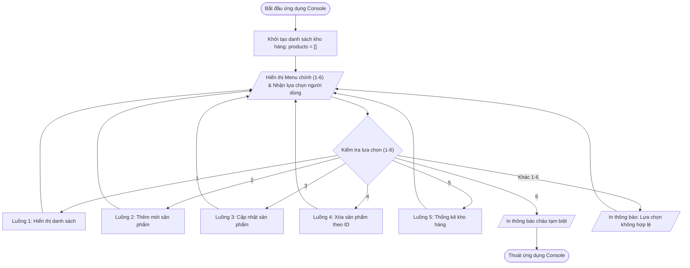
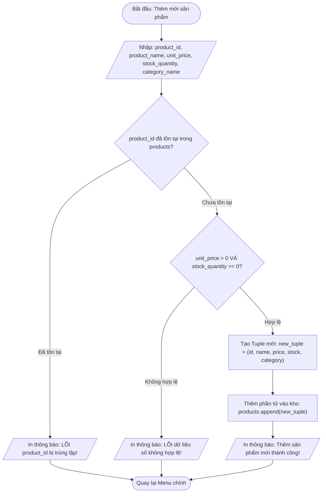
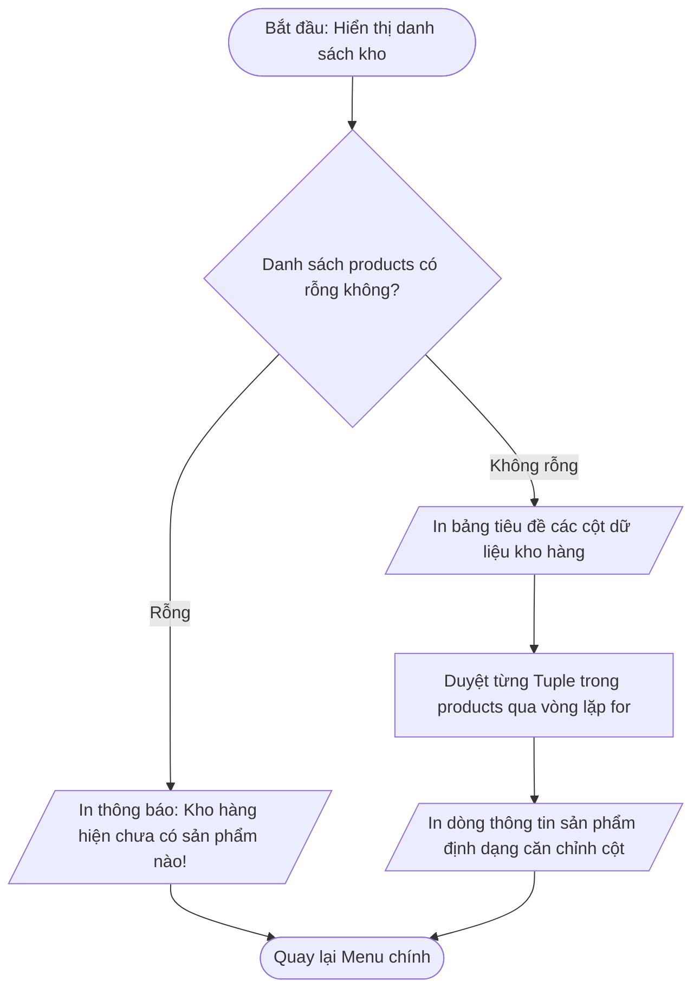
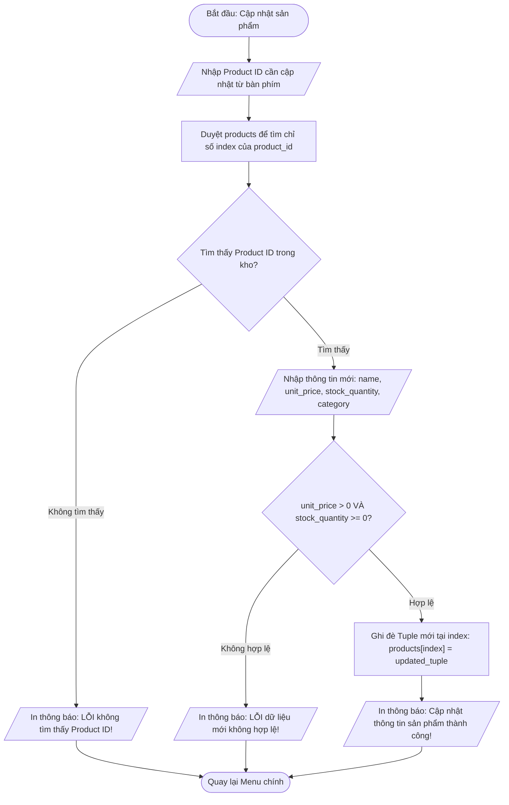
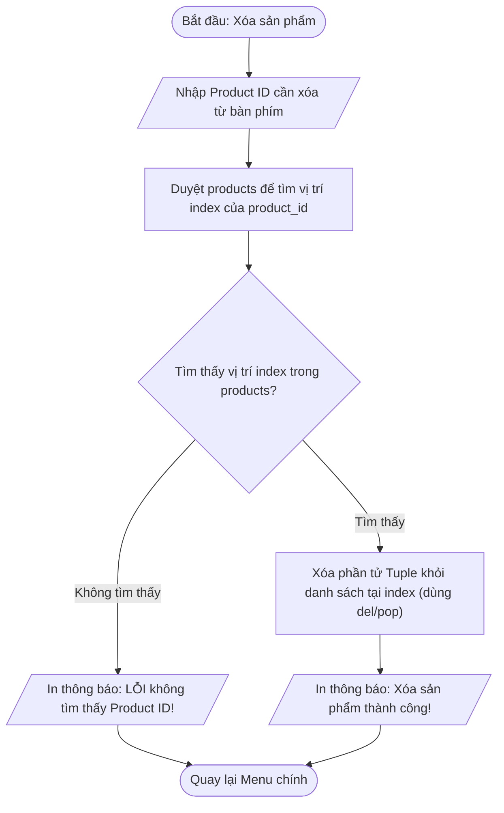
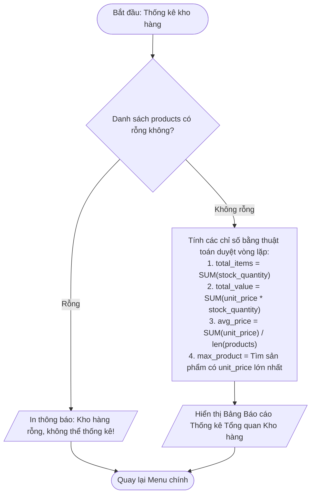

## <center>Tài liệu đặc tả Hệ thống Quản lý Kho Sản phẩm Console (Console Product Inventory Management System)</center>

---

### **1. Tổng quan hệ thống**

Hệ thống **Console Product Inventory Management System** là ứng dụng dòng lệnh (CLI Core Application) được thiết kế trên nền tảng Python 3.12, phục vụ tác nghiệp quản lý danh sách sản phẩm trong kho dành cho các cửa hàng vừa và nhỏ. Hệ thống vận hành theo cơ chế lập trình tuần tự (procedural programming), lưu trữ dữ liệu động trong bộ nhớ RAM thông qua cấu trúc dữ liệu danh sách (`list`) chứa các bộ dữ liệu (`tuple`), tuân thủ chặt chẽ phạm vi kiến thức cơ bản (không sử dụng cấu trúc Dictionary, Set, Hàm tự định nghĩa `def`, Lớp OOP hay Pytest).

Ứng dụng cung cấp giao diện menu tương tác qua Console, cho phép người dùng thực hiện đầy đủ các thao tác cơ bản: thêm mới, hiển thị danh sách, cập nhật thông tin, xóa sản phẩm và tính toán các chỉ số thống kê kho hàng với cơ chế xử lý lỗi đầu vào an toàn.

---

### **2. Đặc tả chức năng (Functional Requirements)**

Dưới đây là danh sách các chức năng hệ thống được thiết kế theo dạng menu điều hướng Console. Tất cả các luồng xử lý đều sử dụng cấu trúc điều khiển vòng lặp và câu lệnh rẽ nhánh tuần tự.

<table style="width: 100%; min-width: 100%; display: table; border-collapse: collapse;" width="100%" border="1" cellSpacing="0" cellPadding="6">
  <thead>
    <tr style="background-color: #f2f4f7; text-align: left;">
      <th style="width: 25%;">Tên chức năng / Mã logic</th>
      <th style="width: 35%;">Mô tả nghiệp vụ</th>
      <th style="width: 40%;">Điều kiện tiên quyết & Xử lý kết quả</th>
    </tr>
  </thead>
  <tbody>
    <tr>
      <td><b>[Hiển thị Menu chính]</b><br><code>display_menu_logic</code></td>
      <td>In ra màn hình Console danh sách các tùy chọn thao tác từ 1 đến 6 và nhận lựa chọn người dùng.</td>
      <td><b>Đầu vào:</b> Chuỗi ký tự từ bàn phím.<br><b>Kết quả:</b> Chuyển hướng luồng xử lý tới khối lệnh tương ứng.</td>
    </tr>
    <tr>
      <td><b>[Thêm mới sản phẩm]</b><br><code>add_product_logic</code></td>
      <td>Nhập thông tin sản phẩm (mã, tên, đơn giá, số lượng, loại) và đóng gói thành <code>tuple</code> để chèn vào <code>list</code>.</td>
      <td><b>Đầu vào:</b> <code>product_id</code>, <code>product_name</code>, <code>unit_price</code>, <code>stock_quantity</code>, <code>category_name</code>.<br><b>Kiểm tra:</b> <code>product_id</code> không được trùng, đơn giá > 0, số lượng >= 0.</td>
    </tr>
    <tr>
      <td><b>[Hiển thị danh sách sản phẩm]</b><br><code>view_products_logic</code></td>
      <td>Duyệt qua danh sách <code>list</code> và in toàn bộ sản phẩm dưới dạng bảng định dạng căn chỉnh chuẩn.</td>
      <td><b>Điều kiện:</b> Kiểm tra nếu danh sách rỗng thì thông báo "Kho hàng hiện chưa có sản phẩm".<br><b>Kết quả:</b> Hiển thị bảng dữ liệu có tiêu đề cột.</td>
    </tr>
    <tr>
      <td><b>[Cập nhật sản phẩm theo ID]</b><br><code>update_product_logic</code></td>
      <td>Tìm kiếm sản phẩm theo <code>product_id</code>. Nếu tìm thấy, cho phép nhập lại tên, giá, số lượng và loại mới.</td>
      <td><b>Điều kiện:</b> <code>product_id</code> tồn tại trong danh sách.<br><b>Xử lý:</b> Ghi đè bộ <code>tuple</code> cũ bằng bộ <code>tuple</code> mới tại vị trí chỉ số (index) tìm thấy.</td>
    </tr>
    <tr>
      <td><b>[Xóa sản phẩm theo ID]</b><br><code>delete_product_logic</code></td>
      <td>Tìm kiếm sản phẩm theo <code>product_id</code> và loại bỏ phần tử ra khỏi danh sách thông qua phương thức <code>pop()</code> hoặc <code>del</code>.</td>
      <td><b>Điều kiện:</b> <code>product_id</code> tồn tại trong danh sách.<br><b>Xử lý:</b> Xóa phần tử và hiển thị thông báo xác nhận thành công.</td>
    </tr>
    <tr>
      <td><b>[Tính toán thống kê kho]</b><br><code>calculate_summary_logic</code></td>
      <td>Duyệt danh sách để tính tổng số lượng sản phẩm, tổng giá trị kho hàng và tìm sản phẩm có giá trị cao nhất.</td>
      <td><b>Công thức:</b> Tổng giá trị = SUM(<code>unit_price * stock_quantity</code>).<br><b>Kết quả:</b> Hiển thị các chỉ số tổng hợp ra Console.</td>
    </tr>
    <tr>
      <td><b>[Thoát chương trình]</b><br><code>exit_program_logic</code></td>
      <td>Kết thúc vòng lặp chính của ứng dụng và đưa ra lời chào tạm biệt.</td>
      <td><b>Xử lý:</b> Gán biến cờ điều khiển vòng lặp <code>is_running = False</code>.</td>
    </tr>
  </tbody>
</table>

#### 📌 Sơ đồ luồng chi tiết từng Chức năng nghiệp vụ

##### **Sơ đồ 2.1: Luồng điều hướng Menu chính (`display_menu_logic`)**



##### **Sơ đồ 2.2: Luồng nghiệp vụ Thêm mới sản phẩm (`add_product_logic`)**



##### **Sơ đồ 2.3: Luồng nghiệp vụ Hiển thị danh sách sản phẩm (`view_products_logic`)**



##### **Sơ đồ 2.4: Luồng nghiệp vụ Cập nhật sản phẩm theo ID (`update_product_logic`)**



##### **Sơ đồ 2.5: Luồng nghiệp vụ Xóa sản phẩm theo ID (`delete_product_logic`)**



##### **Sơ đồ 2.6: Luồng nghiệp vụ Tính toán thống kê kho (`calculate_summary_logic`)**



---

### **3. Đặc tả phi chức năng (Non-Functional Requirements)**

1. **Hiệu năng (Performance):**
   - Phản hồi các thao tác menu gần như tức thì (< 50ms) trong môi trường Console local.
   - Quản lý dữ liệu tối ưu trong phạm vi bộ nhớ RAM cho danh sách lên đến 5,000 phần tử tuple.

2. **Độ tin cậy & Xử lý lỗi (Reliability & Robustness):**
   - Ứng dụng không bao giờ bị dừng đột ngột (crash) khi người dùng nhập sai kiểu dữ liệu (ví dụ: nhập chữ vào ô đơn giá/số lượng).
   - Khôi phục luồng điều khiển về menu chính ngay sau khi bắt và thông báo lỗi.

3. **Tính khả dụng (Usability):**
   - Màn hình Console hiển thị thông tin rõ ràng bằng tiếng Việt có dấu, căn chỉnh khoảng cách các cột bằng f-string (`{var:<15}`).
   - Hướng dẫn nhập liệu trực quan, rõ ràng ở từng bước.

4. **Tính bảo trì & Chuẩn mã nguồn (Maintainability & Code Standards):**
   - Mã nguồn chạy trực tiếp trên môi trường ảo `venv` của Python 3.12.
   - Tất cả các tên biến, tên chỉ số đều đặt bằng Tiếng Anh chuẩn `snake_case` (ví dụ: `inventory_list`, `unit_price`, `stock_quantity`).
   - Cấu trúc mã thuần túy thủ tục (procedural logic), không khai báo hàm custom hay lớp đối tượng.

---

### **4. Đặc tả dữ liệu (Data Model / Schemas)**

Hệ thống sử dụng một danh sách chính (`list`) để quản lý toàn bộ dữ liệu. Mỗi sản phẩm được đại diện bởi một bộ dữ liệu không thay đổi (`tuple`) gồm 5 phần tử cố định theo vị trí chỉ số (index).

#### **Cấu trúc bộ dữ liệu Sản phẩm (Product Tuple Schema):**

`product_tuple = (product_id, product_name, unit_price, stock_quantity, category_name)`

<table style="width: 100%; min-width: 100%; display: table; border-collapse: collapse;" width="100%" border="1" cellSpacing="0" cellPadding="6">
  <thead>
    <tr style="background-color: #f2f4f7; text-align: left;">
      <th style="width: 15%;">Vị trí Index</th>
      <th style="width: 25%;">Tên trường (English Variable)</th>
      <th style="width: 20%;">Kiểu dữ liệu Python</th>
      <th style="width: 40%;">Ràng buộc dữ liệu (Validation Rules)</th>
    </tr>
  </thead>
  <tbody>
    <tr>
      <td><code>0</code></td>
      <td><code>product_id</code></td>
      <td><code>str</code></td>
      <td>Không được rỗng, không được chứa khoảng trắng thừa, phải là duy nhất.</td>
    </tr>
    <tr>
      <td><code>1</code></td>
      <td><code>product_name</code></td>
      <td><code>str</code></td>
      <td>Không được rỗng, độ dài từ 2 đến 100 ký tự.</td>
    </tr>
    <tr>
      <td><code>2</code></td>
      <td><code>unit_price</code></td>
      <td><code>float</code></td>
      <td>Giá trị số thực dương (> 0).</td>
    </tr>
    <tr>
      <td><code>3</code></td>
      <td><code>stock_quantity</code></td>
      <td><code>int</code></td>
      <td>Giá trị số nguyên không âm (>= 0).</td>
    </tr>
    <tr>
      <td><code>4</code></td>
      <td><code>category_name</code></td>
      <td><code>str</code></td>
      <td>Tên nhóm hàng, không được để rỗng.</td>
    </tr>
  </tbody>
</table>

#### **Mô tả logic thao tác dữ liệu bằng danh sách (Pseudocode Logic Schema):**

```python
# Cấu trúc lưu trữ chính
inventory_list = [
    ("PRD001", "Laptop Dell XPS", 25000000.0, 5, "Electronics"),
    ("PRD002", "Wireless Mouse", 450000.0, 20, "Accessories")
]

# Truy cập phần tử sản phẩm tại chỉ số i:
# product_id     = inventory_list[i][0]
# product_name   = inventory_list[i][1]
# unit_price     = inventory_list[i][2]
# stock_quantity = inventory_list[i][3]
# category_name  = inventory_list[i][4]
```

---

### **5. Quy tắc kiểm soát lỗi và Xử lý ngoại lệ (Exception Handling & Error Rules)**

Hệ thống quản lý lỗi thông qua cơ chế kiểm soát ngoại lệ nguyên bản của Python (`try-except`) kết hợp với các câu lệnh kiểm tra điều kiện (`if-else`). Tuyệt đối không sử dụng cấu trúc phản hồi API (REST API JSON envelope) hay mã trạng thái HTTP.

#### **1. Các ngoại lệ Native Python cần bắt:**

- `ValueError`: Xảy ra khi người dùng nhập chuỗi văn bản vào các trường yêu cầu kiểu số như `float(input())` cho `unit_price` hoặc `int(input())` cho `stock_quantity`.
- `IndexError`: Ngăn ngừa truy cập vượt quá chiều dài danh sách khi thao tác tìm kiếm hoặc cập nhật.

#### **2. Quy tắc bắt lỗi nghiệp vụ (Business Rule Validations):**

- **Trùng lặp Mã sản phẩm:** Trước khi thêm mới, duyệt danh sách từ đầu đến cuối bằng vòng lặp `for`. Nếu `product_id` đã tồn tại, hiển thị thông báo lỗi và hủy thao tác thêm.
- **Dữ liệu số không hợp lệ:** Nếu `unit_price <= 0` hoặc `stock_quantity < 0`, yêu cầu nhập lại hoặc hủy phiên nhập.
- **Danh sách rỗng:** Trước khi thực hiện chức năng Xem, Cập nhật, Xóa, Thống kê, kiểm tra `len(inventory_list) == 0`.

#### **3. Mẫu thông báo lỗi hiển thị Console:**

- Lỗi kiểu dữ liệu: `"[LỖI] Đơn giá và số lượng phải là chữ số hợp lệ. Vui lòng thử lại!"`
- Lỗi trùng mã: `"[LỖI] Mã sản phẩm '{product_id}' đã tồn tại trong hệ thống!"`
- Lỗi không tìm thấy: `"[LỖI] Không tìm thấy sản phẩm có mã '{product_id}'!"`

---

### **6. Bảng tổng hợp tình huống lỗi (Edge Cases Mapping)**

<table style="width: 100%; min-width: 100%; display: table; border-collapse: collapse;" width="100%" border="1" cellSpacing="0" cellPadding="6">
  <thead>
    <tr style="background-color: #f2f4f7; text-align: left;">
      <th style="width: 20%;">Mã tình huống</th>
      <th style="width: 25%;">Tình huống biên (Edge Case)</th>
      <th style="width: 25%;">Ngoại lệ / Điều kiện phát hiện</th>
      <th style="width: 30%;">Hành vi xử lý của ứng dụng</th>
    </tr>
  </thead>
  <tbody>
    <tr>
      <td><code>EC-01</code></td>
      <td>Nhập chữ hoặc ký tự đặc biệt vào trường Đơn giá hoặc Số lượng.</td>
      <td>Ngoại lệ <code>ValueError</code> khi ép kiểu <code>float()</code> / <code>int()</code>.</td>
      <td>Hiển thị cảnh báo lỗi bằng chữ màu đỏ/rõ ràng, không thêm dữ liệu rác, quay lại menu chính.</td>
    </tr>
    <tr>
      <td><code>EC-02</code></td>
      <td>Nhập mã sản phẩm đã có sẵn trong danh sách khi thêm mới.</td>
      <td>Biến cờ <code>is_duplicate = True</code> khi duyệt <code>inventory_list</code>.</td>
      <td>Thông báo mã trùng lặp, từ chối thêm mới và yêu cầu dùng mã khác.</td>
    </tr>
    <tr>
      <td><code>EC-03</code></td>
      <td>Nhập mã sản phẩm không tồn tại khi thực hiện Cập nhật hoặc Xóa.</td>
      <td>Duyệt hết danh sách nhưng biến cờ <code>found_index == -1</code>.</td>
      <td>Hiển thị thông báo "Không tìm thấy sản phẩm" và ngưng thao tác.</td>
    </tr>
    <tr>
      <td><code>EC-04</code></td>
      <td>Chọn các chức năng Xem, Cập nhật, Xóa, Thống kê khi danh sách đang trống.</td>
      <td>Biểu thức <code>len(inventory_list) == 0</code> trả về <code>True</code>.</td>
      <td>Thông báo "Kho hàng hiện đang trống", không thực hiện vòng lặp xử lý.</td>
    </tr>
    <tr>
      <td><code>EC-05</code></td>
      <td>Nhập giá trị Đơn giá là số âm hoặc bằng 0 (VD: -50000).</td>
      <td>Kiểm tra điều kiện <code>unit_price <= 0</code>.</td>
      <td>Thông báo "Đơn giá sản phẩm phải lớn hơn 0" và yêu cầu nhập lại.</td>
    </tr>
    <tr>
      <td><code>EC-06</code></td>
      <td>Người dùng chọn tùy chọn không nằm trong danh mục (VD: nhập "99").</td>
      <td>Rẽ nhánh <code>else</code> trong cấu trúc <code>if-elif-else</code> của menu.</td>
      <td>Thông báo "Lựa chọn không hợp lệ. Vui lòng chọn từ 1 đến 6!".</td>
    </tr>
  </tbody>
</table>

---

### **7. Quy trình chạy thử nghiệm Console (Console Execution & Test Scenarios)**

Kịch bản kiểm thử toàn diện thực thi ứng dụng dòng lệnh theo luồng tuần tự trong môi trường Python 3.12 (`venv`).

#### **Kịch bản kiểm thử tích hợp (Console Execution Flow):**

##### **Bước 1: Khởi tạo ứng dụng & Kiểm tra menu chính**

- **Thao tác:** Chạy file chương trình `python main.py`.
- **Kết quả mong đợi:** Hiển thị Menu Console dạng:
  ```text
  ==================================================
  QUẢN LÝ KHO SẢN PHẨM CONSOLE
  ==================================================
  1. Thêm mới sản phẩm
  2. Xem danh sách sản phẩm
  3. Cập nhật sản phẩm theo Mã
  4. Xóa sản phẩm theo Mã
  5. Thống kê tổng quan kho hàng
  6. Thoát chương trình
  ==================================================
  Vui lòng chọn chức năng (1-6):
  ```

##### **Bước 2: Thử nghiệm thêm mới sản phẩm hợp lệ (Tùy chọn 1)**

- **Nhập liệu:**
  - Lựa chọn: `1`
  - Mã sản phẩm: `P001`
  - Tên sản phẩm: `Bàn phím Cơ`
  - Đơn giá: `1200000`
  - Số lượng: `10`
  - Danh mục: `Phụ kiện`
- **Kết quả mong đợi:** Thêm thành công `("P001", "Bàn phím Cơ", 1200000.0, 10, "Phụ kiện")` vào `inventory_list`. Hiển thị thông báo: `"==> Thêm sản phẩm 'P001' thành công!"`.

##### **Bước 3: Thử nghiệm kích hoạt ngoại lệ ValueError & Trùng mã**

- **Nhập liệu lỗi 1:** Nhập đơn giá là `abc` -> **Kết quả:** Bắt ngoại lệ `ValueError`, in lỗi và trở về menu.
- **Nhập liệu lỗi 2:** Thêm sản phẩm mới với mã `P001` -> **Kết quả:** Phát hiện `is_duplicate == True`, in lỗi trùng mã và hủy thao tác.

##### **Bước 4: Thử nghiệm xem danh sách và căn chỉnh cột (Tùy chọn 2)**

- **Thao tác:** Chọn `2`.
- **Kết quả mong đợi:** Đưa ra bảng căn chỉnh bằng f-string:
  ```text
  ----------------------------------------------------------------------------------
  MÃ SP    | TÊN SẢN PHẨM         | ĐƠN GIÁ (VNĐ)    | SỐ LƯỢNG | NHÓM HÀNG
  ----------------------------------------------------------------------------------
  P001     | Bàn phím Cơ          | 1,200,000        | 10       | Phụ kiện
  ----------------------------------------------------------------------------------
  ```

##### **Bước 5: Thử nghiệm tính toán thống kê (Tùy chọn 5)**

- **Thao tác:** Chọn `5`.
- **Kết quả mong đợi:** Duyệt danh sách và in báo cáo:
  ```text
  ==================================================
  BÁO CÁO THỐNG KÊ KHO HÀNG
  ==================================================
  - Tổng số mặt hàng: 1
  - Tổng số lượng tồn kho: 10 sản phẩm
  - Tổng giá trị kho hàng: 12,000,000 VNĐ
  - Sản phẩm giá trị cao nhất: Bàn phím Cơ (1,200,000 VNĐ)
  ==================================================
  ```

##### **Bước 6: Thử nghiệm thoát chương trình (Tùy chọn 6)**

- **Thao tác:** Chọn `6`.
- **Kết quả mong đợi:** Gán `is_running = False`, ứng dụng in thông báo `"Cảm ơn bạn đã sử dụng chương trình. Tạm biệt!"` và kết thúc phiên làm việc an toàn.
