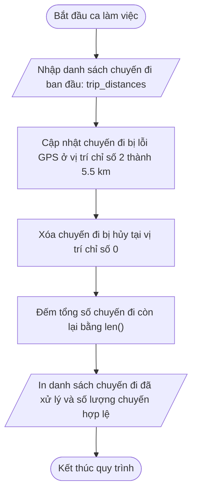

## <center>[Vận dụng cơ bản 2] Điều chỉnh chỉ số khi cập nhật và xóa chuyến đi trong Hệ thống GrabRide</center>

### **1. Mục tiêu**
*   **Kiến thức:** Hiểu rõ cơ chế thay đổi vị trí chỉ số (index shift) của các phần tử trong `list` mutable khi thực hiện thao tác xóa phần tử bằng câu lệnh `del`.
*   **Kỹ năng:** Vận dụng thành thạo cú pháp cập nhật giá trị `list[index] = new_value`, xóa phần tử theo chỉ số `del list[index]` và kiểm tra độ dài danh sách `len()`.
*   **Tư duy:** Phát triển kỹ năng đọc vết mã nguồn (code tracing), phát hiện sự cố sai lệch chỉ số do thay đổi thứ tự thực thi lệnh và đề xuất giải pháp sửa lỗi bảo toàn tính đúng đắn của dữ liệu nghiệp vụ.

### **2. Bối cảnh & Vấn đề**
Trong hệ thống đặt xe công nghệ **GrabRide**, việc quản lý danh sách các chuyến đi hoàn thành trong một ca làm việc của tài xế là vô cùng quan trọng. Mỗi chuyến đi được ghi nhận dưới dạng quãng đường di chuyển (tính bằng km) trong một danh sách Python (`trip_distances`).

Quy trình xử lý dữ liệu cuối ca làm việc yêu cầu thực hiện hai tác vụ điều chỉnh:
1.  **Cập nhật dữ liệu:** Chuyến đi tại vị trí chỉ số 2 (gốc) bị lỗi định vị GPS nên quãng đường bị ghi nhận thiếu. Cần cập nhật lại quãng đường chính xác của chuyến đi này thành `5.5` km.
2.  **Xóa dữ liệu:** Chuyến đi tại vị trí chỉ số 0 bị khách hàng hủy ngay khi tài xế vừa bấm bắt đầu, do đó cần phải xóa chuyến đi này khỏi danh sách bằng câu lệnh `del`.
3.  **Báo cáo:** Kiểm tra và in ra tổng số chuyến đi hợp lệ còn lại bằng hàm `len()`.

**Phản ánh từ hệ thống và tài xế:**
Tài xế phản ánh rằng chuyến đi đường dài `8.2` km của họ bất ngờ bị sửa thành `5.5` km trong báo cáo, trong khi chuyến đi bị lỗi định vị `1.5` km vẫn giữ nguyên giá trị sai. Điều này gây thất thoát doanh thu nghiêm trọng cho tài xế.Sơ đồ dòng luồng nghiệp vụ mong muốn (Business Workflow):



### **3. Mã nguồn hiện tại**
Dưới đây là đoạn mã nguồn Python 3.12 hiện tại do lập trình viên thử nghiệm triển khai nhưng đang gặp lỗi logic:

```python
# Virtualenv: venv | Python 3.12
# Chuẩn PEP 8 & Type Hints

# Danh sách quãng đường di chuyển của các chuyến đi trong ca (km)
trip_distances: list[float] = [2.5, 4.0, 1.5, 8.2, 0.5]
print("Danh sách chuyến đi ban đầu: trip_distances)

# Xóa chuyến đi bị hủy tại vị trí chỉ số 0
del trip_distances[0]

# Cập nhật quãng đường chuẩn cho chuyến đi gặp lỗi GPS ở vị trí chỉ số 2
trip_distances[2] = 5.5

# Đếm tổng số chuyến đi hợp lệ còn lại
remaining_trip_count: int = len(trip_distances)

# In kết quả sau khi xử lý
print("Danh sách chuyến đi sau cập nhật: trip_distances)
print("Tổng số chuyến đi hợp lệ: remaining_trip_count)
```

### **4. Yêu cầu bài toán**

#### **Phần 1: Tracing mã nguồn & Lập bảng báo cáo Test Case (30 điểm)**
Học viên tiến hành chạy thử đoạn mã trên, phân tích hiện tượng dồn chỉ số (index shifting) khi dùng `del` và hoàn thiện bảng báo cáo vết chạy chương trình dưới đây vào báo cáo bài nộp.

<table style="width: 100%; min-width: 100%; display: table; border-collapse: collapse;" width="100%" border="1" cellPadding="8">
  <thead>
    <tr style="background-color: #f2f2f2;">
      <th style="text-align: center; width: 5%;">STT</th>
      <th style="text-align: left; width: 25%;">Đầu vào (Input)</th>
      <th style="text-align: left; width: 25%;">Đầu ra thực tế (Buggy Output)</th>
      <th style="text-align: left; width: 25%;">Đầu ra kỳ vọng (Expected Output)</th>
      <th style="text-align: left; width: 20%;">Dòng code gây lỗi & Giải thích nguyên nhân</th>
    </tr>
  </thead>
  <tbody>
    <tr>
      <td style="text-align: center;">1</td>
      <td><code>trip_distances = [2.5, 4.0, 1.5, 8.2, 0.5]</code></td>
      <td>Danh sách: <code>[4.0, 1.5, 5.5, 0.5]</code><br/>Số chuyến: <code>4</code></td>
      <td>Danh sách: <code>[4.0, 5.5, 8.2, 0.5]</code><br/>Số chuyến: <code>4</code></td>
      <td><strong>Dòng 11:</strong> <code>trip_distances[2] = 5.5</code><br/><strong>Nguyên nhân:</strong> Do thực hiện <code>del trip_distances[0]</code> ở dòng 8 trước, các phần tử phía sau bị dịch sang trái 1 vị trí. Chỉ số 2 lúc này trỏ vào <code>8.2</code> chứ không phải <code>1.5</code>.</td>
    </tr>
    <tr>
      <td style="text-align: center;">2</td>
      <td><code>trip_distances = [1.0, 3.0, 2.0, 9.0]</code></td>
      <td>...</td>
      <td>...</td>
      <td>...</td>
    </tr>
    <tr>
      <td style="text-align: center;">3</td>
      <td><code>trip_distances = [5.0, 10.0, 0.8, 4.5, 6.0]</code></td>
      <td>...</td>
      <td>...</td>
      <td>...</td>
    </tr>
  </tbody>
</table>

#### **Phần 2: Sửa đổi và hoàn thiện mã nguồn Python (40 điểm)**
*   Chỉnh sửa đoạn mã nguồn Python 3.12 để đảm bảo các thao tác cập nhật giá trị và xóa phần tử diễn ra đúng theo yêu cầu nghiệp vụ GrabRide.
*   Yêu cầu mã nguồn tuân thủ nghiêm ngặt chuẩn PEP 8, có Type Hints đầy đủ và không sử dụng các hàm/phương thức cấm (`append`, `pop`, `insert`, `remove`, `def`, `class`, `dict`, `tuple`).

### **5. Yêu cầu nộp bài**
Học viên cần nộp:
*   Phần phân tích/báo cáo bảng Test Case và mã nguồn đã khắc phục lỗi.
*   Đẩy mã nguồn lên GitHub theo định dạng thư mục: `[Tên Lớp]_[Môn Học]_Session10_Ex2`.
    Ví dụ: `HNKS25CNTT1_Core_Session10_Ex2`