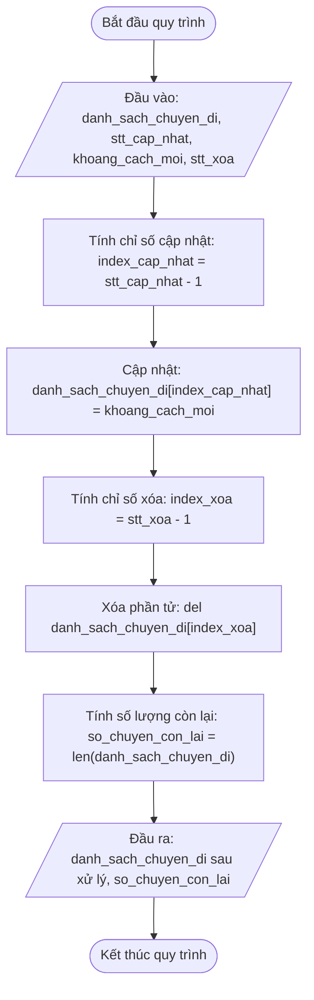

## <center>[Vận dụng cơ bản 4] Sửa lỗi cập nhật và xóa chuyến đi GrabRide</center>

### **1. Mục tiêu**
*   **Hiểu và áp dụng thao tác cập nhật (Update) và xóa (Delete):** Sử dụng thành thạo cú pháp gán lại giá trị theo chỉ số `list[index] = new_value` và lệnh `del list[index]`.
*   **Phát hiện và xử lý lỗi lệch chỉ số (Off-by-one Error):** Nhận diện sự chênh lệch giữa chỉ số tính từ 1 (Số thứ tự - STT nghiệp vụ hiển thị cho người dùng) và chỉ số tính từ 0 (Index mảng/danh sách trong ngôn ngữ Python).
*   **Thống kê quy mô danh sách:** Sử dụng đúng hàm `len()` để xác định chính xác tổng số phần tử còn lại sau các thao tác biến đổi dữ liệu.

### **2. Bối cảnh & Vấn đề**
Bộ phận điều phối của hệ thống Đặt xe công nghệ GrabRide đang gặp sự cố trên ứng dụng quản lý ca làm việc của tài xế. Danh sách lưu trữ khoảng cách di chuyển (km) của các chuyến đi trong ngày đang bị sai lệch nghiêm trọng. 

Người điều hành phản ánh rằng khi họ nhập yêu cầu cập nhật lại khoảng cách cho chuyến đi thứ 3 và hủy chuyến đi thứ 2 trong danh sách, hệ thống lại cập nhật nhầm khoảng cách của chuyến đi thứ 4 và xóa mất chuyến đi thứ 3 đang hoạt động. Điều này dẫn đến tính sai cước phí thanh toán và gây ra khiếu nại từ cả tài xế lẫn khách hàng.### **3. Mã nguồn hiện tại**
Dưới đây là chương trình Python đang vận hành bị phản ánh có lỗi logic:

```python
# Virtualenv: venv | Python 3.12
# Chuẩn PEP 8 & Type Hints

# Danh sách khoảng cách các chuyến đi trong ca (đơn vị: km)
danh_sach_chuyen_di: list[int] = [5, 12, 8, 20, 3]
print("Danh sách chuyến đi ban đầu: danh_sach_chuyen_di)

# Nhập số thứ tự chuyến đi cần cập nhật và khoảng cách mới
stt_cap_nhat: int = 3
khoang_cach_moi: int = 15

# Thực hiện cập nhật thông tin chuyến đi
danh_sach_chuyen_di[stt_cap_nhat] = khoang_cach_moi

# Nhập số thứ tự chuyến đi cần hủy
stt_xoa: int = 2

# Thực hiện xóa chuyến đi khỏi hệ thống
del danh_sach_chuyen_di[stt_xoa]

# Đếm tổng số chuyến đi còn lại
so_chuyen_con_lai: int = len(danh_sach_chuyen_di)

print("Danh sách chuyến đi sau xử lý: danh_sach_chuyen_di)
print("Tổng số chuyến đi còn lại: so_chuyen_con_lai)
```

### **4. Yêu cầu bài toán**

#### **Phần 1: Phân tích & Báo cáo Test Case (Tracing Bug)**
Học viên tiến hành chạy thử chương trình, phân tích luồng thực thi và hoàn thành bảng báo cáo Test Case bên dưới. Hàng đầu tiên đã được điền mẫu làm căn cứ thực hiện.

<table style="width: 100%; min-width: 100%; display: table; border-collapse: collapse;" width="100%" border="1">
  <thead>
    <tr style="background-color: #f2f2f2;">
      <th style="padding: 8px; text-align: center;">STT</th>
      <th style="padding: 8px; text-align: left;">Dữ liệu đầu vào (Input)</th>
      <th style="padding: 8px; text-align: left;">Kết quả lỗi hiện tại (Buggy Output)</th>
      <th style="padding: 8px; text-align: left;">Kết quả kỳ vọng (Expected Output)</th>
      <th style="padding: 8px; text-align: left;">Dòng code gây lỗi (Failing Line)</th>
      <th style="padding: 8px; text-align: left;">Giải thích nguyên nhân (Logic Note)</th>
    </tr>
  </thead>
  <tbody>
    <tr>
      <td style="padding: 8px; text-align: center;">1</td>
      <td style="padding: 8px;"><code>danh_sach = [5, 12, 8, 20, 3]</code><br><code>stt_cap_nhat = 3</code><br><code>khoang_cach_moi = 15</code><br><code>stt_xoa = 2</code></td>
      <td style="padding: 8px;">Danh sách: <code>[5, 12, 15, 3]</code><br>Tổng còn lại: <code>4</code></td>
      <td style="padding: 8px;">Danh sách: <code>[5, 15, 20, 3]</code><br>Tổng còn lại: <code>4</code></td>
      <td style="padding: 8px;">Dòng 12 & Dòng 18</td>
      <td style="padding: 8px;">Dùng trực tiếp STT người dùng nhập (tính từ 1) làm chỉ số index (tính từ 0), khiến hệ thống thao tác sai vị trí trên danh sách.</td>
    </tr>
    <tr>
      <td style="padding: 8px; text-align: center;">2</td>
      <td style="padding: 8px;"><code>danh_sach = [10, 4, 7]</code><br><code>stt_cap_nhat = 1</code><br><code>khoang_cach_moi = 9</code><br><code>stt_xoa = 3</code></td>
      <td style="padding: 8px;">...</td>
      <td style="padding: 8px;">...</td>
      <td style="padding: 8px;">...</td>
      <td style="padding: 8px;">...</td>
    </tr>
    <tr>
      <td style="padding: 8px; text-align: center;">3</td>
      <td style="padding: 8px;"><code>danh_sach = [15, 22, 18, 5]</code><br><code>stt_cap_nhat = 4</code><br><code>khoang_cach_moi = 30</code><br><code>stt_xoa = 1</code></td>
      <td style="padding: 8px;">...</td>
      <td style="padding: 8px;">...</td>
      <td style="padding: 8px;">...</td>
      <td style="padding: 8px;">...</td>
    </tr>
  </tbody>
</table>

#### **Phần 2: Sửa mã nguồn chương trình**
Học viên viết lại chương trình Python hoàn chỉnh, chỉnh sửa công thức tính chỉ số index (`index = stt - 1`) trước khi thực hiện thao tác cập nhật và xóa phần tử.

Sơ đồ quy trình chuẩn sau khi điều chỉnh:



### **5. Yêu cầu nộp bài**
Học viên cần nộp:
*   Phần phân tích/báo cáo và mã nguồn triển khai.
*   Đẩy mã nguồn lên GitHub theo định dạng thư mục: `[Tên Lớp]_[Môn Học]_SessionSession 10_Ex4`.
    Ví dụ: `HNKS25CNTT1_Core_Session_Session 10_Ex4`