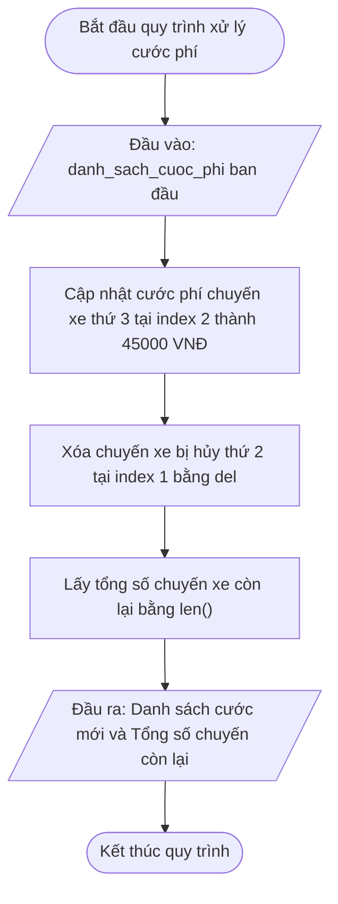

## <center>[Vận dụng cơ bản 6] Sửa lỗi thứ tự cập nhật và xóa chuyến xe GrabRide</center>

### **1. Mục tiêu**
*   **Phân tích sự cố dịch chuyển chỉ số (Index Drift):** Hiểu rõ cơ chế thay đổi vị trí phần tử trong danh sách động (`list`) khi thực hiện các thao tác biến đổi dữ liệu.
*   **Vận dụng thao tác Cập nhật và Xóa phần tử List:** Sử dụng chính xác cú pháp gán theo index `list[index] = value` và câu lệnh xóa `del list[index]` đúng thứ tự nghiệp vụ.
*   **Xác định độ dài tập hợp:** Sử dụng hàm `len()` để truy xuất chính xác tổng số phần tử còn lại trong danh sách sau thao tác biến đổi.
*   **Rèn luyện kỹ năng Debug & Tracing:** Lập bảng phân tích Test Case để phát hiện điểm sai sót trong mã nguồn legacy và đề xuất phương án sửa lỗi tối ưu tuân thủ PEP 8 và Type Hints.

### **2. Bối cảnh & Vấn đề**
Trong hệ thống quản lý ca làm việc của dịch vụ đặt xe công nghệ GrabRide, mỗi tài xế khi nhận ca sẽ được phân công một danh sách các chuyến xe cần thực hiện cùng cước phí dự kiến tương ứng. Danh sách này được lưu trữ dưới dạng một danh sách số nguyên (`list[int]`).

Trong ca trực, điều phối viên hệ thống cần thực hiện 2 thao tác nghiệp vụ theo yêu cầu từ khách hàng và tài xế:
1. Cập nhật lại giá cước cho chuyến xe thứ 3 (vị trí chỉ số index 2 ban đầu) từ 20.000 VNĐ lên 45.000 VNĐ do khách hàng thay đổi điểm đến.
2. Hủy chuyến xe thứ 2 (vị trí chỉ số index 1 ban đầu) khỏi hệ thống do khách hàng báo bận.

**Triệu chứng sự cố trên hệ thống:**
Khách hàng đi chuyến xe thứ 4 gửi khiếu nại rằng cước phí chuyến đi của họ bị tự động hạ từ 85.000 VNĐ xuống còn 45.000 VNĐ. Trong khi đó, tài xế phản ánh rằng chuyến xe thứ 3 của họ vẫn giữ nguyên cước phí cũ 20.000 VNĐ thay vì 45.000 VNĐ như đã thỏa thuận. Lập trình viên tiền nhiệm đã viết chương trình cập nhật dữ liệu nhưng kết quả đầu ra bị sai lệch hoàn toàn so với thực tế.### **3. Mã nguồn hiện tại**
Dưới đây là đoạn mã nguồn hiện tại trong tệp `main.py` đang gặp lỗi logic nghiệp vụ:

```python
# Tệp tin: main.py
# Virtualenv: venv | Python 3.12
# Chuẩn PEP 8 & Type Hints

# Khởi tạo danh sách cước phí 5 chuyến xe trong lượt của tài xế (đơn vị: VNĐ)
danh_sach_cuoc_phi: list[int] = [35000, 50000, 20000, 85000, 25000]
print("Danh sách cước phí ban đầu: danh_sach_cuoc_phi)

# Thao tác xử lý danh sách chuyến xe theo yêu cầu nghiệp vụ
# Thực hiện xóa chuyến xe thứ 2 bị hủy (vị trí index 1)
del danh_sach_cuoc_phi[1]

# Thực hiện cập nhật cước phí chuyến xe thứ 3 thành 45000 VNĐ
danh_sach_cuoc_phi[2] = 45000

# Kiểm tra tổng số chuyến xe còn lại trong lượt
so_luong_con_lai: int = len(danh_sach_cuoc_phi)

print("Danh sách cước phí sau xử lý: danh_sach_cuoc_phi)
print("Tổng số chuyến xe còn lại: so_luong_con_lai)
```

Sơ đồ luồng xử lý chuẩn nghiệp vụ (Workflow Target):



### **4. Yêu cầu bài toán**

Học viên phải hoàn thành 2 phần nhiệm vụ sau:

#### **Phần 1: Báo cáo phân tích lỗi & Bảng kịch bản kiểm thử (Test Case Report)**
Tạo bảng phân tích chi tiết kịch bản chạy chương trình, chỉ rõ dòng mã gây lỗi và giải thích cơ chế dẫn đến lỗi sai chỉ số.

<table style="width: 100%; min-width: 100%; display: table; border-collapse: collapse;" width="100%" border="1">
  <thead>
    <tr style="background-color: #f2f2f2;">
      <th style="padding: 8px; text-align: center;">STT</th>
      <th style="padding: 8px; text-align: left;">Đầu vào (danh_sach_cuoc_phi)</th>
      <th style="padding: 8px; text-align: left;">Kết quả hiện tại (Buggy Output)</th>
      <th style="padding: 8px; text-align: left;">Kết quả kỳ vọng (Expected Output)</th>
      <th style="padding: 8px; text-align: left;">Dòng code gây lỗi (Line)</th>
      <th style="padding: 8px; text-align: left;">Giải thích nguyên nhân logic (Logic Note)</th>
    </tr>
  </thead>
  <tbody>
    <tr>
      <td style="padding: 8px; text-align: center;">1</td>
      <td style="padding: 8px;"><code>[35000, 50000, 20000, 85000, 25000]</code></td>
      <td style="padding: 8px;">Danh sách: <code>[35000, 20000, 45000, 25000]</code><br>Số lượng: <code>4</code></td>
      <td style="padding: 8px;">Danh sách: <code>[35000, 45000, 85000, 25000]</code><br>Số lượng: <code>4</code></td>
      <td style="padding: 8px;">Dòng 10 (<code>del danh_sach_cuoc_phi[1]</code>)</td>
      <td style="padding: 8px;">Do lệnh <code>del</code> thực hiện trước làm danh sách bị thu hẹp, phần tử thứ 3 ban đầu (index 2) bị dồn về index 1. Khi gọi <code>danh_sach_cuoc_phi[2] = 45000</code> ở dòng 13, chương trình đã ghi đè nhầm vào phần tử thứ 4 ban đầu.</td>
    </tr>
    <tr>
      <td style="padding: 8px; text-align: center;">2</td>
      <td style="padding: 8px;"><code>[12000, 18000, 30000, 40000]</code></td>
      <td style="padding: 8px;">...</td>
      <td style="padding: 8px;">...</td>
      <td style="padding: 8px;">...</td>
      <td style="padding: 8px;">...</td>
    </tr>
    <tr>
      <td style="padding: 8px; text-align: center;">3</td>
      <td style="padding: 8px;"><code>[40000, 60000, 15000, 90000, 110000]</code></td>
      <td style="padding: 8px;">...</td>
      <td style="padding: 8px;">...</td>
      <td style="padding: 8px;">...</td>
      <td style="padding: 8px;">...</td>
    </tr>
  </tbody>
</table>

#### **Phần 2: Mã nguồn hoàn thiện (Source Code Fix)**
Sửa lại tệp `main.py` đảm bảo tuân thủ các quy tắc:
*   Thực hiện thao tác Cập nhật cước phí chuyến xe thứ 3 trước, sau đó mới thực hiện thao tác Xóa chuyến xe thứ 2 bị hủy.
*   In ra màn hình kết quả danh sách sau xử lý và độ dài danh sách chính xác.
*   Tuân thủ chuẩn PEP 8, đặt tên biến chuẩn `snake_case` và khai báo Type Hints đầy đủ.

### **5. Yêu cầu nộp bài**
Học viên cần nộp:
*   Phần phân tích/báo cáo và mã nguồn triển khai.
*   Đẩy mã nguồn lên GitHub theo định dạng thư mục: `[Tên Lớp]_[Môn Học]_Session10_Ex6`.
    Ví dụ: `HNKS25CNTT1_Core_Session10_Ex6`