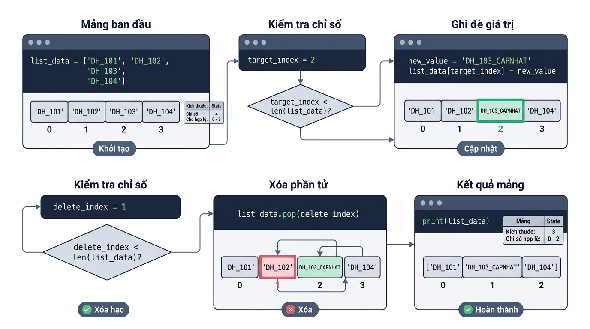

```markmap

# Tập hợp Dữ liệu Động Mutable: Danh sách (List) và Thao tác CRUD

## Lesson 01 — Khởi tạo và Truy xuất Danh sách (List)

### Khái niệm & Vai trò
- Định nghĩa ngắn gọn: Kiểu dữ liệu mutable lưu tập hợp phần tử có thứ tự.
- Vai trò: Quản lý nhiều giá trị trong một biến duy nhất với khả năng sửa đổi.

### Cú pháp & Giải nghĩa
- Khai báo cú pháp chuẩn:
```

python
  don_gia: list[int] = [15000, 32000, 45000]
  gia_dau: int = don_gia[0]

```- Giải thích thành phần:
  - `list[int]`: Type Hint xác định kiểu dữ liệu các phần tử trong danh sách.
  - `[0]`: Chỉ số index vị trí phần tử, bắt đầu đếm từ 0.

### Ví dụ thực hành
- Kịch bản áp dụng: Truy xuất đơn giá các sản phẩm trong hệ thống bán hàng.
```

python
  don_gia_hang: list[int] = [15000, 32000, 45000, 89000]
  gia_dau_tien: int = don_gia_hang[0]
  gia_cuoi_cung: int = don_gia_hang[-1]
  print("Giá item 1: gia_dau_tien)
  print("Giá item cuối: gia_cuoi_cung)

```- Giải thích ví dụ: Dùng index `0` lấy giá đầu và index `-1` lấy giá phần tử cuối.

### Lưu ý triển khai
- **Lỗi IndexError**: Xảy ra khi truy xuất chỉ số vượt quá phạm vi `len(list) - 1`.
- **Lưu ý định dạng**: Đặt tên biến dạng `snake_case` số nhiều và khai báo Type Hints rõ ràng.

## Lesson 02 — Thao tác Thêm mới phần tử vào List

### Khái niệm & Vai trò
- Định nghĩa ngắn gọn: Mở rộng kích thước danh sách bằng cách thêm phần tử mới.
- Vai trò: Ghi nhận thêm dữ liệu phát sinh vào tập hợp trong quá trình thực thi.

### Cú pháp & Giải nghĩa
- Khai báo cú pháp chuẩn:
```

python
  danh_sach.append(gia_tri_moi)
  danh_sach.insert(vi_tri_index, gia_tri_moi)

```- Giải thích thành phần:
  - `append()`: Thêm phần tử mới vào vị trí cuối cùng của danh sách.
  - `insert()`: Chèn phần tử vào chỉ số chỉ định và dời các phần tử sau sang phải.

### Ví dụ thực hành
- Kịch bản áp dụng: Quản lý danh sách mã học viên đăng ký tại Rikkei Academy.
```

python
  ma_hoc_vien: list[int] = [1001, 1002, 1003]
  ma_hoc_vien.append(1004)
  ma_hoc_vien.insert(0, 9999)
  print("Danh sách học viên: ma_hoc_vien)

```- Giải thích ví dụ: Dùng `append` thêm mã 1004 vào cuối, `insert(0)` chèn mã ưu tiên 9999 vào đầu.

### Lưu ý triển khai
- **Biến đổi trực tiếp**: Phương thức thay đổi danh sách gốc và trả về giá trị `None`.
- **Lưu ý định dạng**: Không gán biến bằng kết quả gọi hàm `danh_sach = danh_sach.append(...)`.

## Lesson 03 — Thao tác Cập nhật và Xóa phần tử List (Update & Delete)

### Khái niệm & Vai trò
- Định nghĩa ngắn gọn: Gán lại giá trị mới và loại bỏ phần tử khỏi danh sách.
- Vai trò: Duy trì tính chính xác của dữ liệu kho hàng khi thông tin thay đổi.

### Cú pháp & Giải nghĩa
- Khai báo cú pháp chuẩn:
```

python
  kho_hang[index] = gia_tri_moi
  del kho_hang[index]
  so_luong: int = len(kho_hang)

```- Giải thích thành phần:
  - `kho_hang[index]`: Gán trực tiếp giá trị mới ghi đè giá trị cũ tại chỉ số `index`.
  - `del`: Câu lệnh xóa triệt để phần tử tại vị trí chỉ định và dồn index.
  - `len()`: Hàm trả về tổng số phần tử hiện tại có trong danh sách.

### Ví dụ thực hành
- Kịch bản áp dụng: Cập nhật tồn kho và xóa sản phẩm ngưng bán tại Rikkei Mart.
```

python
  kho_hang: list[int] = [100, 250, 400, 150, 800]
  kho_hang[2] = 450
  del kho_hang[1]
  so_luong_con_lai: int = len(kho_hang)
  print("Kho hàng sau xử lý: kho_hang)
  print("Tổng số mặt hàng còn lại: so_luong_con_lai)

```- Giải thích ví dụ: Ghi đè index 2 thành 450, dùng `del` xóa index 1, đếm lại độ dài bằng `len()`.
- 

### Lưu ý triển khai
- **Lỗi dịch chuyển chỉ số**: Xóa phần tử bằng `del` làm giảm độ dài list và dời chỉ số của các phần tử phía sau.
- **Lưu ý định dạng**: Thụt lề 4 khoảng trắng chuẩn PEP 8 và khai báo Type Hints `list[int]` rõ ràng.

## Liên kết hệ thống
- Mối quan hệ logic: Lesson 01 (Khởi tạo/Truy xuất index) -> Lesson 02 (Bổ sung phần tử động) -> Lesson 03 (Cập nhật và xóa tối ưu bộ nhớ).
- Luồng dữ liệu xuyên suốt: `list` ban đầu -> `append()` thêm dữ liệu -> `[index]` sửa đổi -> `del` xóa dữ liệu dư thừa -> `len()` kiểm định đầu ra.
- Ứng dụng tổng hợp: Xây dựng trọn vẹn các module CRUD quản lý tập hợp dữ liệu động như giỏ hàng và danh mục kho hàng.
```
