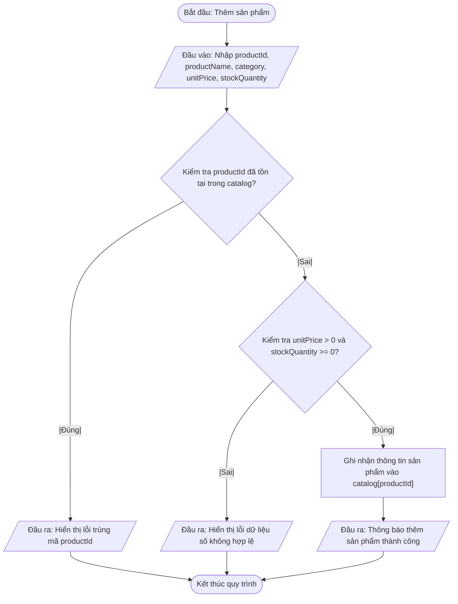
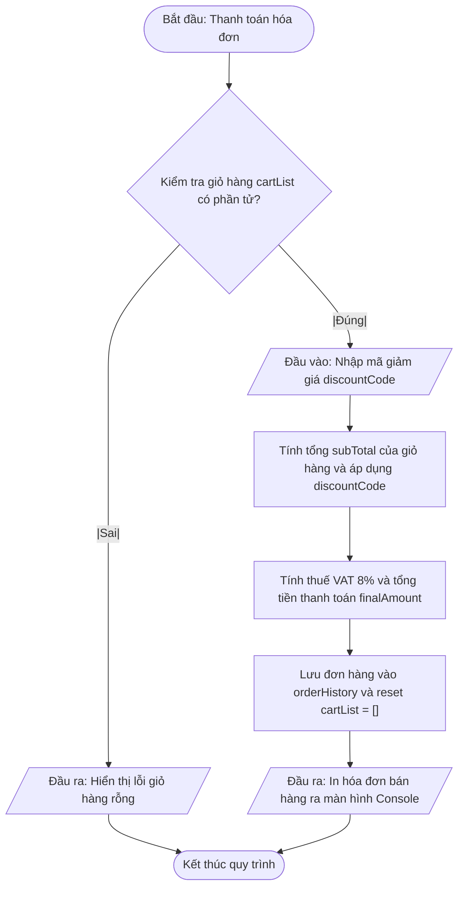

# <center>Tài liệu đặc tả Hệ thống Quản lý Bán hàng Console (Phần 1) (Console Sales Management System - Part 1)</center>

### **1. Tổng quan hệ thống**

Hệ thống Quản lý Bán hàng Console (Phần 1) là ứng dụng dòng lệnh (CLI - Command Line Interface) được thiết kế nhằm mục đích quản lý kho hàng, xử lý giỏ hàng, tính toán hóa đơn bán hàng và xuất báo cáo thống kê doanh thu cơ bản. Hệ thống được triển khai trên nền tảng **Python 3.12**, tuân thủ triệt để chuẩn mã nguồn **PEP 8**, áp dụng cơ chế **Type Hints** đầy đủ và vận hành trong môi trường ảo hóa **virtualenv** trên Cursor / Windsurf AI IDE.

Ở giai đoạn Phần 1, hệ thống tập trung hoàn toàn vào mô hình **Lập trình Cốt lõi (CLI Core Application)** và **Lập trình thủ tục / cấu trúc (Procedural Programming)**. Toàn bộ dữ liệu được quản lý trong bộ nhớ (In-memory Data Structure) thông qua các cấu trúc dữ liệu nguyên bản của Python như `dict`, `list`, `tuple`, `set`. Hệ thống tuyệt đối không sử dụng Lập trình hướng đối tượng (OOP Class), không kết nối Cơ sở dữ liệu SQL hay dịch vụ Web REST API.

---

### **2. Đặc tả chức năng (Functional Requirements)**

Hệ thống bao gồm 5 chức năng cốt lõi được liệt kê trong bảng dưới đây:

<table style="width: 100%; min-width: 100%; display: table; border-collapse: collapse;" width="100%" border="1" cellpadding="8" cellspacing="0">
  <thead>
    <tr style="background-color: #f2f2f2; text-align: left;">
      <th style="width: 5%;">STT</th>
      <th style="width: 15%;">Mã chức năng</th>
      <th style="width: 25%;">Tên chức năng / Hàm</th>
      <th style="width: 30%;">Mô tả chi tiết</th>
      <th style="width: 12.5%;">Đầu vào</th>
      <th style="width: 12.5%;">Đầu ra</th>
    </tr>
  </thead>
  <tbody>
    <tr>
      <td>1</td>
      <td>REQ-F01</td>
      <td><b>[Thêm sản phẩm mới vào kho]</b><br><code>addProduct()</code></td>
      <td>Kiểm tra trùng lặp khóa chính <code>productId</code>. Kiểm tra điều kiện giá bán và số lượng tồn kho. Lưu thông tin vào <code>productCatalog</code>.</td>
      <td><code>catalog: dict</code><br><code>productId: str</code><br><code>productName: str</code><br><code>category: str</code><br><code>unitPrice: float</code><br><code>stockQuantity: int</code></td>
      <td><code>tuple[bool, str]</code> (Trạng thái và thông báo)</td>
    </tr>
    <tr>
      <td>2</td>
      <td>REQ-F02</td>
      <td><b>[Tra cứu & Tìm kiếm sản phẩm]</b><br><code>searchProduct()</code></td>
      <td>Tìm kiếm sản phẩm theo tên hoặc danh mục theo cơ chế khớp một phần chuỗi (substring match, không phân biệt hoa thường).</td>
      <td><code>catalog: dict</code><br><code>keyword: str</code></td>
      <td><code>list[dict]</code> (Danh sách sản phẩm tìm thấy)</td>
    </tr>
    <tr>
      <td>3</td>
      <td>REQ-F03</td>
      <td><b>[Thêm sản phẩm vào giỏ hàng]</b><br><code>addToCart()</code></td>
      <td>Kiểm tra tồn tại của <code>productId</code> và kiểm tra số lượng tồn kho <code>stockQuantity</code>. Cập nhật giỏ hàng <code>cartList</code> và trừ số lượng tương ứng trong kho.</td>
      <td><code>cartList: list</code><br><code>catalog: dict</code><br><code>productId: str</code><br><code>quantity: int</code></td>
      <td><code>tuple[bool, str]</code> (Trạng thái và thông báo)</td>
    </tr>
    <tr>
      <td>4</td>
      <td>REQ-F04</td>
      <td><b>[Thanh toán & Xuất hóa đơn]</b><br><code>checkoutOrder()</code></td>
      <td>Tính tổng tiền các món hàng, áp dụng mã giảm giá <code>discountCode</code> (nếu có), tính thuế VAT, tạo đơn hàng <code>orderRecord</code> và làm rỗng giỏ hàng.</td>
      <td><code>cartList: list</code><br><code>catalog: dict</code><br><code>discountCode: str</code></td>
      <td><code>dict</code> (Thông tin hóa đơn chi tiết)</td>
    </tr>
    <tr>
      <td>5</td>
      <td>REQ-F05</td>
      <td><b>[Báo cáo doanh thu & Tồn kho]</b><br><code>generateSalesReport()</code></td>
      <td>Tổng hợp doanh thu lũy kế từ các đơn hàng đã thanh toán, liệt kê sản phẩm sắp hết hàng (tồn kho dưới ngưỡng cấu hình).</td>
      <td><code>orderHistory: list</code><br><code>catalog: dict</code><br><code>lowStockThreshold: int</code></td>
      <td><code>dict</code> (Dữ liệu thống kê tổng hợp)</td>
    </tr>
  </tbody>
</table>

<br>

##### **Sơ đồ 2.1: Luồng nghiệp vụ Thêm sản phẩm mới vào kho**



# **Sơ đồ 2.2: Luồng nghiệp vụ Thêm sản phẩm vào giỏ hàng**

```mermaid
flowchart TD
    A([Bắt đầu: Thêm vào giỏ hàng]) --> B[/Đầu vào: Nhập productId và quantity cần mua/]
    B --> C{Kiểm tra productId có tồn tại trong catalog?}
    C --|Sai|--> D[/Đầu ra: Hiển thị lỗi mã sản phẩm không tồn tại/]
    D --> E([Kết thúc quy trình])
    C --|Đúng|--> F{Kiểm tra quantity <= catalog[productId]['stockQuantity']?}
    F --|Sai|--> G[/Đầu ra: Hiển thị lỗi số lượng tồn kho không đủ/]
    G --> E
    F --|Đúng|--> H["Trừ stockQuantity trong catalog và thêm/cập nhật item vào cartList"]
    H --> I[/Đầu ra: Thông báo thêm vào giỏ hàng thành công/]
    I --> E
```

# **Sơ đồ 2.3: Luồng nghiệp vụ Thanh toán hóa đơn**



---

### **3. Đặc tả phi chức năng (Non-Functional Requirements)**

1. **Hiệu năng & Tốc độ xử lý (Performance):**
   - Tốc độ xử lý mọi thao tác dữ liệu trên bộ nhớ (In-memory) phải hoàn tất dưới **20ms** trên môi trường console chuẩn.
   - Luồng ứng dụng phải phản hồi tức thì với thao tác nhập liệu của người dùng.

2. **Tiêu chuẩn Mã nguồn & Cú pháp (Code Standard & Syntax):**
   - 100% mã nguồn tuân thủ tiêu chuẩn **PEP 8** (sử dụng 4 khoảng trắng lề, độ dài dòng không quá 79-88 ký tự).
   - Sử dụng triệt để tính năng **Type Hints** của Python 3.12 (ví dụ: `dict[str, Any]`, `list[dict[str, Any]]`, `tuple[bool, str]`).
   - Tên biến, tham số và hàm chuẩn 100% bằng Tiếng Anh có ý nghĩa, tuân thủ dạng `camelCase` (ví dụ: `productId`, `calculateSubtotal()`).

3. **Môi trường vận hành (Runtime Environment):**
   - Vận hành tương thích trên **Python 3.12** độc lập trong môi trường cách ly **virtualenv**.
   - Không phụ thuộc vào bất kỳ thư viện bên ngoài (Third-party packages) nào ngoài thư viện chuẩn của Python.

4. **Trải nghiệm giao diện Console (CLI UX/UI Design):**
   - Màn hình menu dạng chữ được căn chỉnh rõ ràng bằng ký tự ASCII (ví dụ: `=== QUẢN LÝ BÁN HÀNG ===`).
   - Có cơ chế xóa màn hình console hoặc hiển thị phân đoạn minh bạch giữa các menu thao tác.

---

### **4. Đặc tả dữ liệu (Data Model / Schemas)**

Hệ thống sử dụng các cấu trúc dữ liệu nguyên bản (Native Data Structures) của Python được khai báo kiểu dữ liệu rõ ràng:

#### **4.1. Danh mục kho hàng (Product Catalog Schema)**
Cấu trúc dạng `dict[str, dict[str, Any]]` sử dụng `productId` làm khóa chính:

```python

# Cấu trúc mẫu dữ liệu Danh mục kho hàng
productCatalog: dict[str, dict[str, str | float | int]] = {
    "PROD001": {
        "productId": "PROD001",
        "productName": "Bàn phím cơ Không dây",
        "category": "Phụ kiện",
        "unitPrice": 1250000.0,
        "stockQuantity": 15
    },
    "PROD002": {
        "productId": "PROD002",
        "productName": "Chuột Gaming Ultra Light",
        "category": "Phụ kiện",
        "unitPrice": 850000.0,
        "stockQuantity": 30
    }
}
```

# **4.2. Giỏ hàng hiện tại (Shopping Cart Schema)**
Cấu trúc dạng `list[dict[str, Any]]` chứa các mặt hàng chọn mua:

```python

# Cấu trúc mẫu dữ liệu Giỏ hàng
cartList: list[dict[str, str | float | int]] = [
    {
        "productId": "PROD001",
        "productName": "Bàn phím cơ Không dây",
        "unitPrice": 1250000.0,
        "quantity": 2,
        "itemTotal": 2500000.0
    }
]
```

# **4.3. Lịch sử đơn hàng đã thanh toán (Order History Schema)**
Cấu trúc dạng `list[dict[str, Any]]` lưu trữ danh sách đơn hàng đã hoàn tất:

```python

# Cấu trúc mẫu dữ liệu Đơn hàng
orderHistory: list[dict[str, str | float | list[dict[str, Any]]]] = [
    {
        "orderId": "ORD-20241025-001",
        "timestamp": "2024-10-25 14:30:00",
        "items": [
            {
                "productId": "PROD001",
                "productName": "Bàn phím cơ Không dây",
                "unitPrice": 1250000.0,
                "quantity": 2,
                "itemTotal": 2500000.0
            }
        ],
        "grossTotal": 2500000.0,
        "discountAmount": 250000.0,
        "vatAmount": 180000.0,
        "finalAmount": 2430000.0
    }
]
```

---

### **5. Quy tắc kiểm soát lỗi và Xử lý ngoại lệ (Exception Handling & Error Rules)**

1. **Cơ chế bọc lỗi nhập liệu người dùng (Input Validation & Recovery):**
   - Sử dụng các khối `try-except` tại vòng lặp tương tác menu CLI để bắt các ngoại lệ hệ thống nguyên bản:
     - `ValueError`: Bắt lỗi khi người dùng nhập chuỗi ký tự vào ô yêu cầu giá trị số (`unitPrice`, `stockQuantity`, `quantity`).
     - `KeyError`: Bắt lỗi khi truy xuất khóa sản phẩm không tồn tại trong từ điển `productCatalog`.
     - `ZeroDivisionError` / `IndexError`: Bắt các lỗi thao tác trên danh sách và tính toán số học.

2. **Nguyên tắc thông báo lỗi trên Console (CLI Error Output Standard):**
   - Mọi thông báo lỗi phải được in rõ ràng ra màn hình kèm tiền tố định dạng `[LỖI]`, giải thích lý do thất bại và hướng dẫn hành vi khắc phục cho người dùng.
   - Sau khi báo lỗi, ứng dụng **không được dừng đột ngột (crash)** mà phải khôi phục luồng điều khiển về Menu chính.

3. **Cấm tuyệt đối các mô hình web server / HTTP API:**
   - CẤM sử dụng định dạng JSON Envelope API Response (ví dụ: `{"status": "error "code": 400}`).
   - CẤM sử dụng các mã trạng thái HTTP Status Code (200, 400, 404, 500) và các công cụ REST API (Swagger, DTO, Controller).

---

### **6. Bảng tổng hợp tình huống lỗi (Edge Cases Mapping)**

<table style="width: 100%; min-width: 100%; display: table; border-collapse: collapse;" width="100%" border="1" cellpadding="8" cellspacing="0">
  <thead>
    <tr style="background-color: #f2f2f2; text-align: left;">
      <th style="width: 5%;">STT</th>
      <th style="width: 20%;">Tình huống biên (Edge Case)</th>
      <th style="width: 25%;">Nguyên nhân</th>
      <th style="width: 25%;">Hành vi xử lý (Handling Logic)</th>
      <th style="width: 25%;">Thông báo hiển thị CLI</th>
    </tr>
  </thead>
  <tbody>
    <tr>
      <td>1</td>
      <td>Trùng mã sản phẩm khi thêm mới</td>
      <td>Người dùng nhập <code>productId</code> đã tồn tại trong <code>productCatalog</code>.</td>
      <td>Bắt điều kiện <code>if productId in productCatalog</code>, từ chối ghi đè dữ liệu và giữ nguyên catalog.</td>
      <td><code>[LỖI] Mã sản phẩm 'PROD001' đã tồn tại trong hệ thống! Vui lòng dùng mã khác.</code></td>
    </tr>
    <tr>
      <td>2</td>
      <td>Nhập đơn giá hoặc số lượng âm/không hợp lệ</td>
      <td>Nhập giá trị <code>unitPrice <= 0</code> hoặc <code>stockQuantity < 0</code> hoặc nhập chữ vào trường số.</td>
      <td>Bắt ngoại lệ <code>ValueError</code> hoặc kiểm tra số liệu `<= 0`, yêu cầu nhập lại.</td>
      <td><code>[LỖI] Đơn giá phải là số thực dương và số lượng phải là số nguyên không âm!</code></td>
    </tr>
    <tr>
      <td>3</td>
      <td>Thêm vào giỏ hàng số lượng vượt quá tồn kho</td>
      <td>Số lượng yêu cầu <code>quantity</code> lớn hơn <code>stockQuantity</code> khả dụng.</td>
      <td>Kiểm tra điều kiện <code>quantity > stockQuantity</code>, từ chối thêm vào giỏ.</td>
      <td><code>[LỖI] Rất tiếc, sản phẩm 'PROD001' chỉ còn 5 item trong kho (Yêu cầu: 10).</code></td>
    </tr>
    <tr>
      <td>4</td>
      <td>Thanh toán khi giỏ hàng rỗng</td>
      <td>Thực hiện chức năng thanh toán khi <code>len(cartList) == 0</code>.</td>
      <td>Kiểm tra danh sách rỗng, hủy luồng thanh toán và gợi ý người dùng mua hàng.</td>
      <td><code>[LỖI] Giỏ hàng của bạn đang rỗng. Vui lòng thêm sản phẩm trước khi thanh toán!</code></td>
    </tr>
    <tr>
      <td>5</td>
      <td>Nhập mã giảm giá không hợp lệ</td>
      <td>Nhập mã <code>discountCode</code> không nằm trong danh sách khuyến mãi khả thi.</td>
      <td>Hệ thống coi như không áp dụng giảm giá (tỷ lệ 0%), tiếp tục thanh toán theo giá gốc.</td>
      <td><code>[CẢNH BÁO] Mã giảm giá không hợp lệ hoặc đã hết hạn. Đơn hàng áp dụng giá gốc.</code></td>
    </tr>
  </tbody>
</table>

---

### **7. Quy trình chạy thử nghiệm Console (Console Execution & Test Scenarios)**

#### **7.1. Khởi tạo môi trường lập trình**

```bash

# Khởi tạo môi trường ảo Python 3.12
python3.12 -m venv venv

# Kích hoạt môi trường ảo (Linux/macOS)
source venv/bin/activate

# Kích hoạt môi trường ảo (Windows PowerShell)
.\venv\Scripts\Activate.ps1

# Chạy ứng dụng console chính
python main.py
```

# **7.2. Kịch bản thử nghiệm kiểm chứng hệ thống (Test Scenarios)**

1. **Kịch bản Test 1: Khởi tạo và Thêm mới sản phẩm hợp lệ & không hợp lệ**
   - **Bước 1:** Chọn chức năng `1. Thêm sản phẩm`.
   - **Bước 2:** Nhập `productId` = `P01`, `productName` = `Chuột Logitech`, `category` = `Linh kiện`, `unitPrice` = `500000`, `stockQuantity` = `10`. -> *Kỳ vọng: Hệ thống thông báo thành công.*
   - **Bước 3:** Thử nhập lại `productId` = `P01` với tên khác. -> *Kỳ vọng: Hệ thống báo lỗi trùng mã.*
   - **Bước 4:** Thử nhập `unitPrice` = `-50000`. -> *Kỳ vọng: Hệ thống báo lỗi giá trị âm.*

2. **Kịch bản Test 2: Thao tác Giỏ hàng & Kiểm tra số lượng tồn kho**
   - **Bước 1:** Chọn chức năng `3. Thêm vào giỏ hàng`.
   - **Bước 2:** Nhập `productId` = `P01`, `quantity` = `3`. -> *Kỳ vọng: Thêm thành công. Stock kho P01 giảm từ 10 xuống 7.*
   - **Bước 3:** Tiếp tục chọn thêm `P01` với `quantity` = `8`. -> *Kỳ vọng: Hệ thống báo lỗi vượt quá tồn kho khả dụng (chỉ còn 7).*

3. **Kịch bản Test 3: Thanh toán Đơn hàng & Tính toán Thuế / Giảm giá**
   - **Bước 1:** Chọn chức năng `4. Thanh toán hóa đơn`.
   - **Bước 2:** Nhập mã giảm giá `SALE10` (Giảm 10%).
   - **Bước 3:** Hệ thống in hóa đơn dạng bảng Console:
     - Gross Total: `1,500,000 VND` (3 * 500,000)
     - Discount (10%): `150,000 VND`
     - VAT (8% trên số tiền còn lại 1,350,000): `108,000 VND`
     - Final Total: `1,458,000 VND`
   - **Bước 4:** Kiểm tra danh sách giỏ hàng `cartList` sau khi thanh toán. -> *Kỳ vọng: Giỏ hàng tự động được làm rỗng (`[]`).*

4. **Kịch bản Test 4: Báo cáo Thống kê Doanh thu**
   - **Bước 1:** Chọn chức năng `5. Xem báo cáo doanh thu`.
   - **Bước 2:** Kiểm tra tổng doanh thu ghi nhận. -> *Kỳ vọng: Tổng doanh thu hiển thị chính xác `1,458,000 VND` và ghi nhận 1 đơn hàng thành công.*
