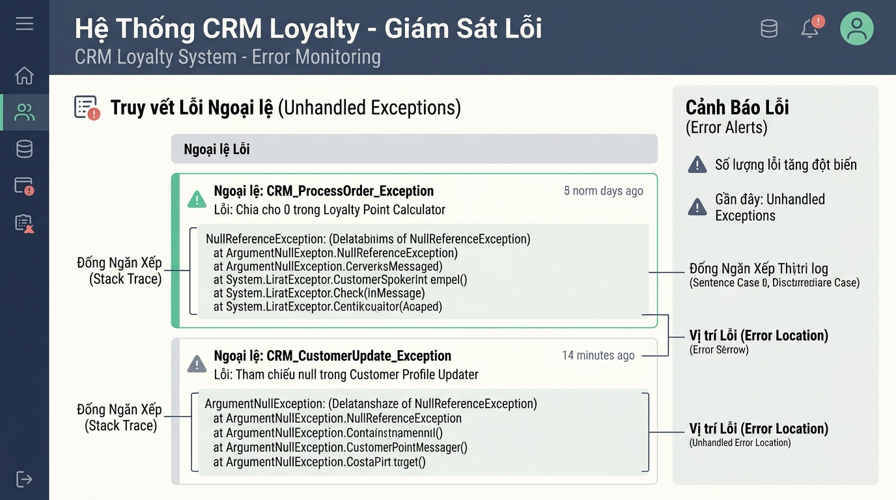

## <center>[Vận dụng cơ bản 1] Khắc phục lỗi kiểm chuẩn dữ liệu và xử lý ngoại lệ trong hệ thống CRM</center>

### **1. Mục tiêu**
*   Phát hiện các lỗi logic nghiệp vụ, thiếu kiểm chuẩn dữ liệu đầu vào (validation) và thiếu xử lý ngoại lệ trong mã nguồn quản lý CRM thực tế.
*   Thực hành kỹ thuật kích hoạt ngoại lệ chủ động với câu lệnh `raise` (`ValueError`, `TypeError`, `KeyError`) để bảo vệ tính toàn vẹn của dữ liệu hệ thống.
*   Xây dựng báo cáo kiểm thử (Test Case Report) chứng minh lỗi và tiến hành tái cấu trúc (refactor) mã nguồn tuân thủ tiêu chuẩn PEP 8 và Python 3.12 Core.

### **2. Bối cảnh & Vấn đề**
Trong hệ thống Quản lý Quan hệ Khách hàng (CRM), phân hệ quản lý thông tin khách hàng và phân hạng hội viên (Customer Loyalty & Tier Management) chịu trách nhiệm tự động tích lũy doanh số giao dịch (`total_spend`) và cập nhật hạng thành viên (`BRONZE`, `SILVER`, `GOLD`).

Một lập trình viên cấp dưới đã viết phương thức `update_spend` trong lớp `CRMLeadManager`. Tuy nhiên, đoạn mã nguồn này chưa được kiểm chuẩn dữ liệu đầu vào và thiếu hoàn toàn cơ chế kiểm soát ngoại lệ. Khi đưa vào chạy thử nghiệm, hệ thống gặp các lỗi nghiêm trọng:
1. Cho phép cập nhật số tiền chi tiêu là số âm hoặc bằng 0, khiến tổng doanh số bị giảm bất hợp lý.
2. Khi tìm kiếm một mã khách hàng không tồn tại, chương trình bị dừng đột ngột (crash) do lỗi `KeyError` chưa được bắt.
3. Khi nhận tham số số tiền sai kiểu dữ liệu (ví dụ truyền chuỗi chữ hoặc kiểu `bool`), chương trình gặp lỗi tính toán hoặc báo lỗi hệ thống không thân thiện.


<p align="center">
  
</p>


### **3. Mã nguồn hiện tại**
Dưới đây là mã nguồn Python 3.12 đang bị lỗi logic và thiếu kiểm chuẩn ngoại lệ:

```python
class CRMLeadManager:
    """Hệ thống quản lý chi tiêu và phân hạng khách hàng trong CRM."""

    def __init__(self) -> None:
        self.customers: dict[str, dict[str, int | str]] = {
            "CUST001": {"name": "Nguyen Van A", "total_spend": 5000000, "tier": "BRONZE"},
            "CUST002": {"name": "Tran Thi B", "total_spend": 25000000, "tier": "SILVER"},
        }

    def update_spend(self, customer_id: str, amount: int) -> str:
        """Cập nhật tổng chi tiêu và tự động tính lại hạng khách hàng."""
        # [CẢNH BÁO]: Đoạn mã bên dưới chưa kiểm tra customer_id và amount hợp lệ
        customer = self.customers[customer_id]
        customer["total_spend"] += amount

        spend = customer["total_spend"]
        if spend >= 50000000:
            customer["tier"] = "GOLD"
        elif spend >= 20000000:
            customer["tier"] = "SILVER"
        else:
            customer["tier"] = "BRONZE"

        return customer["tier"]
```

### **4. Yêu cầu bài toán**

#### **Phần 1: Lập báo cáo kiểm thử (Test Case Report)**
Học viên tiến hành chạy thử mã nguồn hiện tại với các dữ liệu thử nghiệm và hoàn thành bảng báo cáo Test Case theo mẫu dưới đây (tối thiểu 03 trường hợp):

<table style="width: 100%; min-width: 100%; display: table; border-collapse: collapse;" width="100%" border="1">
  <thead>
    <tr style="background-color: #f2f2f2;">
      <th style="padding: 8px; text-align: left;">STT</th>
      <th style="padding: 8px; text-align: left;">Dữ liệu đầu vào (Input)</th>
      <th style="padding: 8px; text-align: left;">Kết quả hiện tại (Buggy Output)</th>
      <th style="padding: 8px; text-align: left;">Kết quả kỳ vọng (Expected Output)</th>
      <th style="padding: 8px; text-align: left;">Phân tích nguyên nhân</th>
    </tr>
  </thead>
  <tbody>
    <tr>
      <td style="padding: 8px;">1</td>
      <td style="padding: 8px;"><code>customer_id = "CUST999"</code>, <code>amount = 1000000</code></td>
      <td style="padding: 8px;">Crash chương trình với <code>KeyError: 'CUST999'</code></td>
      <td style="padding: 8px;">Ném ngoại lệ <code>KeyError</code> với thông báo rõ ràng</td>
      <td style="padding: 8px;">Chưa kiểm tra sự tồn tại của khóa trong dictionary</td>
    </tr>
    <tr>
      <td style="padding: 8px;">2</td>
      <td style="padding: 8px;"><code>customer_id = "CUST001"</code>, <code>amount = -2000000</code></td>
      <td style="padding: 8px;">Doanh số giảm xuống 3,000,000 VNĐ mà không báo lỗi</td>
      <td style="padding: 8px;">Ném ngoại lệ <code>ValueError</code> thông báo số tiền phải > 0</td>
      <td style="padding: 8px;">Thiếu điều kiện validate giá trị <code>amount > 0</code></td>
    </tr>
    <tr>
      <td style="padding: 8px;">3</td>
      <td style="padding: 8px;"><code>customer_id = "CUST001"</code>, <code>amount = "500000"</code></td>
      <td style="padding: 8px;">Crash chương trình với <code>TypeError</code> do cộng <code>int</code> với <code>str</code></td>
      <td style="padding: 8px;">Ném ngoại lệ <code>TypeError</code> yêu cầu kiểu dữ liệu <code>int</code></td>
      <td style="padding: 8px;">Thiếu kiểm tra kiểu dữ liệu của đối số đầu vào</td>
    </tr>
  </tbody>
</table>

#### **Phần 2: Sửa lỗi mã nguồn và bổ sung Validate / Exception Handling**
Tái cấu trúc (refactor) lại phương thức `update_spend` trong lớp `CRMLeadManager` nhằm đáp ứng các quy tắc nghiệp vụ sau:
1. **Kiểm tra sự tồn tại của mã khách hàng**: Nếu `customer_id` không có trong `self.customers`, kích hoạt chủ động ngoại lệ `KeyError` kèm thông báo: `f"Mã khách hàng '{customer_id}' không tồn tại trong hệ thống CRM."`.
2. **Kiểm tra kiểu dữ liệu**: Nếu `amount` không phải là kiểu `int` hoặc là kiểu `bool` (ví dụ `isinstance(amount, bool)` trả về `True`), kích hoạt chủ động ngoại lệ `TypeError` kèm thông báo: `"Số tiền chi tiêu phải là số nguyên (int)."`.
3. **Kiểm tra giá trị hợp lệ**: Nếu `amount <= 0`, kích hoạt chủ động ngoại lệ `ValueError` kèm thông báo: `"Số tiền chi tiêu phát sinh phải lớn hơn 0."`.
4. **Quy tắc phân hạng thành viên**:
   - `total_spend >= 50,000,000`: Hạng `GOLD`.
   - `20,000,000 <= total_spend < 50,000,000`: Hạng `SILVER`.
   - `total_spend < 20,000,000`: Hạng `BRONZE`.
5. Mã nguồn phải có đầy đủ Type Hints (`str`, `int`), tuân thủ chuẩn PEP 8, và các tên biến/hàm sử dụng tiếng Anh đúng quy chuẩn.

### **5. Yêu cầu nộp bài**
Học viên cần nộp:
*   Phần phân tích/báo cáo và mã nguồn triển khai.
*   Đẩy mã nguồn lên GitHub theo định dạng thư mục: `[Tên Lớp]_[Môn Học]_Session14_Ex01`.
    Ví dụ: `HNKS25CNTT1_Core_Session14_Ex01`