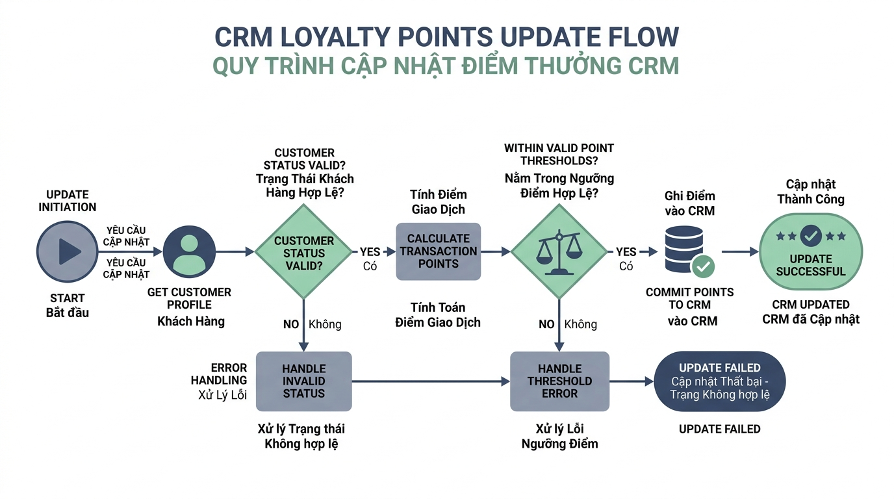

## <center>[Vận dụng cơ bản 2] Sửa lỗi và xử lý ngoại lệ trong tính năng cập nhật điểm thân thiết CRM</center>

### **1. Mục tiêu**
*   **Hiểu và áp dụng xử lý ngoại lệ chuẩn Python 3.12:** Nắm vững cách chủ động kích hoạt lỗi với `raise` (`ValueError`, `KeyError`, `TypeError`) và xử lý an toàn bằng khối `try-except-else-finally`.
*   **Phân tích và phát hiện lỗi logic hệ thống (Debugging):** Nhận diện các lỗ hổng kiểm soát dữ liệu trong phân hệ quản lý khách hàng thân thiết (CRM).
*   **Xây dựng báo cáo kiểm thử (Test Case Report):** Trình bày chi tiết bảng các kịch bản kiểm thử chứng minh sự sai lệch giữa hành vi mã nguồn cũ và yêu cầu nghiệp vụ thực tế.
*   **Chuẩn hóa mã nguồn nghiệp vụ (Refactoring):** Viết lại mã nguồn tuân thủ PEP 8, bổ sung Type Hints đầy đủ và đảm bảo toàn vẹn dữ liệu bộ nhớ trong.

### **2. Bối cảnh & Vấn đề**
Trong phân hệ CRM của công ty thương mại dịch vụ, tính năng cộng điểm thưởng tích lũy (`loyalty_points`) được gọi tự động sau mỗi giao dịch hoàn tất của khách hàng. Điểm tích lũy này quyết định hạng thành viên và các ưu đãi chiết khấu trực tiếp.

Tuy nhiên, đoạn mã nguồn xử lý cập nhật điểm do lập trình viên cũ bàn giao lại đang phát sinh nhiều sự cố trên hệ thống thực tế:
*   Chương trình bị dừng đột ngột (crash) khi mã khách hàng (`customer_id`) không tồn tại trong cơ sở dữ liệu bộ nhớ trong.
*   Hệ thống cho phép cộng số điểm âm hoặc số 0, dẫn đến việc giảm điểm tích lũy của khách hàng một cách phi lý.
*   Hệ thống vẫn cập nhật điểm thành công cho các tài khoản đang ở trạng thái bị khóa hoặc ngừng hoạt động (`inactive`).
*   Không có cơ chế bắt và phân loại ngoại lệ an toàn ở tầng gọi hàm.


<p align="center">
  
</p>


### **3. Mã nguồn hiện tại**
Dưới đây là mã nguồn Python 3.12 legacy đang chứa các lỗi nghiệp vụ và thiếu sót về kiểm soát ngoại lệ:

```python
# Cơ sở dữ liệu khách hàng trong bộ nhớ (In-memory CRM database)
customer_database: dict[str, dict[str, str | int]] = {
    "CUST001": {"name": "Nguyen Van A", "points": 150, "status": "active"},
    "CUST002": {"name": "Tran Thi B", "points": 500, "status": "inactive"},
    "CUST003": {"name": "Le Van C", "points": 0, "status": "active"}
}

def update_loyalty_points(database: dict, customer_id: str, points_to_add: int) -> dict:
    # [BUG 1]: Truy cập trực tiếp key không qua kiểm tra, gây KeyError làm dừng chương trình
    customer = database[customer_id]
    
    # [BUG 2]: Không kiểm tra trạng thái hoạt động (status) của tài khoản khách hàng
    # [BUG 3]: Không kiểm tra points_to_add > 0, chấp nhận số âm hoặc kiểu dữ liệu sai
    customer["points"] = customer["points"] + points_to_add
    
    return customer

# Khối chạy thử nghiệm nghiệp vụ hiện tại
try:
    print("[TEST 1] Cộng điểm âm:")
    res1 = update_loyalty_points(customer_database, "CUST001", -50)
    print("Kết quả:", res1)
    
    print("[TEST 2] Cộng điểm cho tài khoản inactive:")
    res2 = update_loyalty_points(customer_database, "CUST002", 100)
    print("Kết quả:", res2)
    
    print("[TEST 3] Mã khách hàng không tồn tại:")
    res3 = update_loyalty_points(customer_database, "CUST999", 200)
    print("Kết quả:", res3)
except Exception as e:
    print("Lỗi chung không xác định:", e)
```

### **4. Yêu cầu bài toán**

Học viên thực hiện bài tập qua 2 phần việc bắt buộc:

#### **Phần 1: Lập báo cáo kiểm thử lỗi (Test Case Report)**
Phân tích mã nguồn legacy và hoàn thiện bảng báo cáo kiểm thử gồm tối thiểu 3 kịch bản lỗi đại diện cho 3 vấn đề nghiệp vụ đã nêu. 

Sử dụng cấu trúc bảng HTML sau để trình bày trong báo cáo:

<table style="width: 100%; min-width: 100%; display: table; border-collapse: collapse;" width="100%" border="1">
  <thead>
    <tr>
      <th style="padding: 8px; text-align: center;">STT</th>
      <th style="padding: 8px; text-align: left;">Tên kịch bản kiểm thử</th>
      <th style="padding: 8px; text-align: left;">Dữ liệu đầu vào (Input)</th>
      <th style="padding: 8px; text-align: left;">Kết quả hiện tại (Buggy Output)</th>
      <th style="padding: 8px; text-align: left;">Kết quả kỳ vọng (Expected Output)</th>
    </tr>
  </thead>
  <tbody>
    <tr>
      <td style="padding: 8px; text-align: center;">1</td>
      <td style="padding: 8px;">Cộng số điểm âm cho khách hàng</td>
      <td style="padding: 8px;">customer_id="CUST001", points_to_add=-50</td>
      <td style="padding: 8px;">Điểm giảm từ 150 xuống 100, trả về dict thành công.</td>
      <td style="padding: 8px;">Ném ngoại lệ ValueError với thông báo số điểm phải lớn hơn 0.</td>
    </tr>
    <tr>
      <td style="padding: 8px; text-align: center;">2</td>
      <td style="padding: 8px;">...</td>
      <td style="padding: 8px;">...</td>
      <td style="padding: 8px;">...</td>
      <td style="padding: 8px;">...</td>
    </tr>
    <tr>
      <td style="padding: 8px; text-align: center;">3</td>
      <td style="padding: 8px;">...</td>
      <td style="padding: 8px;">...</td>
      <td style="padding: 8px;">...</td>
      <td style="padding: 8px;">...</td>
    </tr>
  </tbody>
</table>

#### **Phần 2: Sửa lỗi mã nguồn và tái cấu trúc (Refactoring)**
Viết lại hàm `update_loyalty_points` và khối xử lý thực thi theo các tiêu chuẩn sau:
1. **Ràng buộc mã khách hàng:** Nếu `customer_id` không có trong `database`, chủ động kích hoạt lỗi `raise KeyError(f"Mã khách hàng '{customer_id}' không tồn tại trong hệ thống.")`.
2. **Ràng buộc trạng thái tài khoản:** Nếu tài khoản có `status != "active"`, chủ động kích hoạt lỗi `raise ValueError(f"Tài khoản '{customer_id}' đang ở trạng thái không hoạt động.")`.
3. **Ràng buộc giá trị điểm cộng:**
   * Nếu `points_to_add` không phải là kiểu số nguyên (`int`), chủ động kích hoạt lỗi `raise TypeError("Số điểm tích lũy bổ sung phải là số nguyên.")`.
   * Nếu `points_to_add <= 0`, chủ động kích hoạt lỗi `raise ValueError("Số điểm tích lũy bổ sung phải lớn hơn 0.")`.
4. **Xử lý ngoại lệ tại tầng gọi hàm:**
   * Viết đoạn mã chạy thử nghiệm các trường hợp kiểm thử trong khối `try-except-else-finally`.
   * Bắt chính xác từng loại ngoại lệ `KeyError`, `ValueError`, `TypeError` để in thông báo lỗi rõ ràng. Không dùng bare `except:` hoặc bắt `Exception` chung chung.
   * Khối `else` chỉ thực hiện in thông báo thành công khi cập nhật điểm hoàn tất.
   * Khối `finally` in nhật ký hoàn thành phiên xử lý.
5. **Quy chuẩn mã nguồn:** Tuân thủ 100% chuẩn PEP 8, khai báo Type Hints rõ ràng cho tất cả tham số và giá trị trả về (`dict[str, str | int]`).

### **5. Yêu cầu nộp bài**
Học viên cần nộp:
*   Phần phân tích/báo cáo và mã nguồn triển khai.
*   Đẩy mã nguồn lên GitHub theo định dạng thư mục: `[Tên Lớp]_[Môn Học]_Session14_Ex02`.
    Ví dụ: `HNKS25CNTT1_Core_Session14_Ex02`