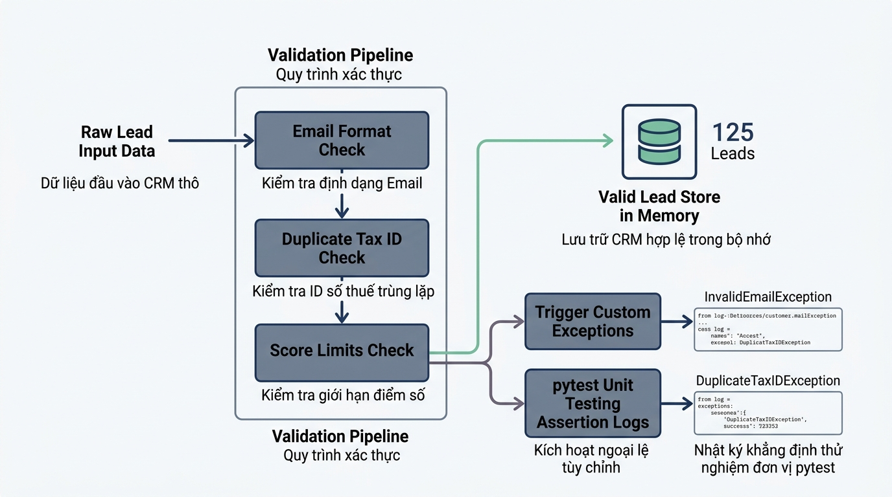

## <center>[Vận dụng chuyên sâu] Xây dựng Subsystem Quản lý Lead và Đánh giá Hạng Khách hàng CRM</center>

### **1. Mục tiêu**
*   **Kiến trúc ngoại lệ nâng cao**: Thiết kế và triển khai hệ thống các lớp ngoại lệ tùy chỉnh (Custom Exceptions) phân tầng kế thừa từ lớp `Exception` chuẩn của Python.
*   **Kiểm chuẩn & Quản lý trạng thái**: Tự phát triển cơ chế kiểm chuẩn dữ liệu đầu vào (Data Validation), chặn bẫy trùng lặp và tính toán phân hạng khách hàng tiềm năng (Lead Rating) lưu trữ trong bộ nhớ RAM.
*   **Ứng dụng Pytest 8.3 toàn diện**: Viết bộ kiểm thử đơn vị (Unit Tests) sử dụng Pytest bao phủ toàn bộ các kịch bản thành công và thất bại, khai thác triệt để `pytest.fixture` và `pytest.raises`.
*   **Tư duy thiết kế hệ thống độc lập**: Tự xây dựng toàn bộ mã nguồn từ bản thiết kế sơ đồ/mã giả cá nhân mà không dựa vào mã khung (Skeleton Code).

### **2. Bối cảnh & Vấn đề**
Một doanh nghiệp kinh doanh dịch vụ giải pháp doanh nghiệp đang vận hành hệ thống Quản lý Quan hệ Khách hàng (CRM). Trong phân hệ Quản lý Lead (Khách hàng tiềm năng), dữ liệu thu thập từ các chiến dịch tiếp thị thường gặp nhiều lỗi dữ liệu nghiêm trọng như:
1.  Nhân viên nhập sai định dạng Email hoặc Số điện thoại.
2.  Số định danh thuế (Tax Code) hoặc Email bị trùng lặp với Lead đã có trong hệ thống.
3.  Điểm tiềm năng (Lead Score) bị nhập vượt quá khoảng cho phép (0 - 100).

Nếu dữ liệu bẩn này được lưu trữ, các tiến trình tiếp theo như phân bổ nhân viên chăm sóc hoặc tính tiền hoa hồng sẽ bị hỏng toàn bộ. Do đó, hệ thống yêu cầu một module xử lý nghiệp vụ có khả năng tự động Validate dữ liệu, ném ra các ngoại lệ tùy chỉnh có định danh rõ ràng, đồng thời đi kèm bộ test tự động sử dụng thư viện Pytest 8.3 để đảm bảo độ tin cậy 100% trước khi đưa vào vận hành.


<p align="center">
  
</p>


### **3. Quy tắc nghiệp vụ**

#### **3.1 Hệ thống ngoại lệ tùy chỉnh (Custom Exceptions)**
Học viên cần thiết kế cây thừa kế ngoại lệ chuẩn hóa như sau:
*   `CRMBaseException`: Ngoại lệ cơ sở cho toàn bộ hệ thống CRM (Kế thừa từ `Exception`).
*   `InvalidLeadDataError`: Ném ra khi thông tin Email, Số điện thoại hoặc Mã số thuế không đúng quy chuẩn (Kế thừa từ `CRMBaseException`).
*   `LeadScoreOutOfRangeError`: Ném ra khi điểm Lead Score nhỏ hơn 0 hoặc lớn hơn 100 (Kế thừa từ `CRMBaseException`).
*   `DuplicateLeadError`: Ném ra khi Email hoặc Tax Code đã tồn tại trong hệ thống (Kế thừa từ `CRMBaseException`).

#### **3.2 Quy tắc Kiểm chuẩn dữ liệu (Validation Rules)**
<table style="width: 100%; min-width: 100%; display: table; border-collapse: collapse;" width="100%" border="1">
  <thead>
    <tr>
      <th style="padding: 8px; text-align: left;">Trường dữ liệu</th>
      <th style="padding: 8px; text-align: left;">Kiểu dữ liệu</th>
      <th style="padding: 8px; text-align: left;">Quy tắc kiểm tra</th>
      <th style="padding: 8px; text-align: left;">Ngoại lệ kích hoạt</th>
    </tr>
  </thead>
  <tbody>
    <tr>
      <td style="padding: 8px;">`lead_id`</td>
      <td style="padding: 8px;">`str`</td>
      <td style="padding: 8px;">Chuỗi không rỗng, bắt đầu bằng tiền tố `LEAD_`</td>
      <td style="padding: 8px;">`InvalidLeadDataError`</td>
    </tr>
    <tr>
      <td style="padding: 8px;">`email`</td>
      <td style="padding: 8px;">`str`</td>
      <td style="padding: 8px;">Phải chứa ký tự `@` và kết thúc bằng `.com` hoặc `.vn`, không chứa khoảng trắng</td>
      <td style="padding: 8px;">`InvalidLeadDataError`</td>
    </tr>
    <tr>
      <td style="padding: 8px;">`phone`</td>
      <td style="padding: 8px;">`str`</td>
      <td style="padding: 8px;">Phải bắt đầu bằng chữ số `0`, độ dài đúng 10 chữ số toàn số</td>
      <td style="padding: 8px;">`InvalidLeadDataError`</td>
    </tr>
    <tr>
      <td style="padding: 8px;">`tax_code`</td>
      <td style="padding: 8px;">`str | None`</td>
      <td style="padding: 8px;">Nếu khác `None`, phải là chuỗi từ 10 đến 13 chữ số toàn số</td>
      <td style="padding: 8px;">`InvalidLeadDataError`</td>
    </tr>
    <tr>
      <td style="padding: 8px;">`score`</td>
      <td style="padding: 8px;">`int`</td>
      <td style="padding: 8px;">Phải là số nguyên nằm trong khoảng từ `0` đến `100` (bao gồm 0 và 100)</td>
      <td style="padding: 8px;">`LeadScoreOutOfRangeError`</td>
    </tr>
  </tbody>
</table>

#### **3.3 Quy tắc Tính hạng Khách hàng (Lead Tiering)**
Dựa trên điểm `score` hợp lệ, hệ thống tự động gán hạng cho Lead:
*   Điểm từ `0` đến `39`: Hạng `"BRONZE"`
*   Điểm từ `40` đến `69`: Hạng `"SILVER"`
*   Điểm từ `70` đến `89`: Hạng `"GOLD"`
*   Điểm từ `90` đến `100`: Hạng `"PLATINUM"`

#### **3.4 Mẫu cấu trúc dữ liệu lưu trữ (Visual Reference Only)**
```text
Dữ liệu một Lead thành công trong bộ nhớ RAM:
{
    "lead_id": "LEAD_1001",
    "full_name": "Nguyen Van A",
    "email": "nva@corp.vn",
    "phone": "0912345678",
    "tax_code": "0101234567",
    "score": 85,
    "tier": "GOLD"
}
```

### **4. Yêu cầu đầu ra**

#### **Phần 1: Báo cáo phân tích và Thiết kế giải pháp (Bắt buộc)**
Học viên trình bày báo cáo phân tích trước khi viết mã nguồn:
1.  **Sơ đồ cấu trúc I/O**: Mô tả chi tiết kiểu dữ liệu đầu vào và đầu ra cho từng hàm nghiệp vụ.
2.  **Mô tả giải thuật (Pseudocode/Flowchart)**: Biểu diễn các bước kiểm tra từ Validate Email -> Phone -> Tax Code -> Trùng lặp -> Score -> Phân hạng -> Thêm vào danh sách bộ nhớ.

#### **Phần 2: Triển khai mã nguồn Python 3.12 và Bộ kiểm thử Pytest**
Học viên tự viết mã nguồn từ đầu (không sử dụng skeleton code):
1.  **File 1 (`crm_system.py`)**:
    *   Khai báo đầy đủ các lớp Custom Exception theo yêu cầu tại mục 3.1.
    *   Xây dựng lớp/module `LeadManager` quản lý danh sách Lead lưu trên bộ nhớ RAM.
    *   Hàm thêm Lead phải sử dụng cấu trúc `try-except-else-finally` hợp lý để ghi log hoặc giải phóng trạng thái xử lý.
    *   Sử dụng Type Hints chuẩn Python 3.12 (`str | None`, `dict[str, Any]`, v.v.).
2.  **File 2 (`test_crm_system.py`)**:
    *   Sử dụng thư viện `pytest 8.3`.
    *   Tạo nhất 1 `@pytest.fixture` để khởi tạo đối tượng `LeadManager` chứa sẵn 1-2 Lead mẫu.
    *   Viết tối thiểu 6 test cases độc lập kiểm thử các trường hợp:
        *   Test thêm Lead hợp lệ và kiểm tra hạng `tier` được tính chính xác.
        *   Test ném ngoại lệ `InvalidLeadDataError` khi Email sai format.
        *   Test ném ngoại lệ `InvalidLeadDataError` khi Số điện thoại sai format.
        *   Test ném ngoại lệ `LeadScoreOutOfRangeError` khi điểm âm (< 0) hoặc vượt 100.
        *   Test ném ngoại lệ `DuplicateLeadError` khi đăng ký trùng Email hoặc Tax Code.
        *   Sử dụng `pytest.raises` để bắt đúng ngoại lệ và assert thông điệp lỗi (`str(exc_info.value)`).

### **5. Yêu cầu nộp bài**
Học viên cần nộp:
*   Phần phân tích/báo cáo và mã nguồn triển khai.
*   Đẩy mã nguồn lên GitHub theo định dạng thư mục: `[Tên Lớp]_[Môn Học]_Session14_Ex03`.
    Ví dụ: `HNKS25CNTT1_Core_Session14_Ex03`