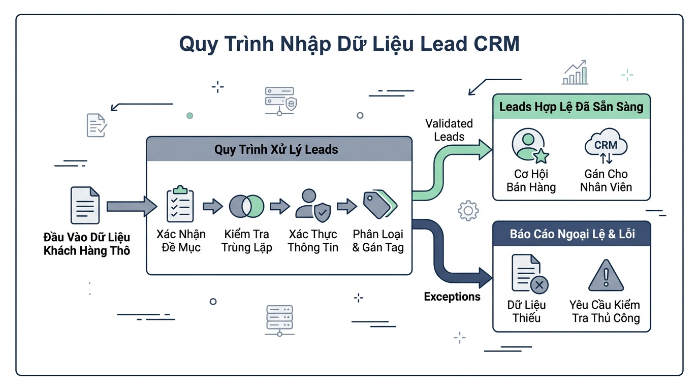

## 
[Phân tích] Thiết kế Subsystem Validate và Xử lý Ngoại lệ trong Module CRM Lead Management

### **1. Mục tiêu**
*   **Kỹ năng Phân tích & So sánh:** Nghiên cứu, đánh giá và so sánh hai chiến lược thiết kế xử lý lỗi khi kiểm định dữ liệu khách hàng tiềm năng (CRM Lead Ingestion): Chiến lược tích lũy danh sách lỗi (Error Accumulator / Return Flag Pattern) và Chiến lược phân cấp Ngoại lệ chủ động (Custom Exception Hierarchy Pattern với `raise`).
*   **Kỹ thuật Ngoại lệ nâng cao:** Triển khai cấu trúc lớp Exception tự định nghĩa kế thừa từ lớp cơ bản, sử dụng linh hoạt các khối lệnh `try-except-else-finally` để phân loại và xử lý lỗi chính xác theo chuẩn Python 3.12 Core.
*   **Kiểm thử đơn vị chuyên nghiệp:** Viết kịch bản kiểm thử tự động bằng framework `Pytest 8.3`, ứng dụng `pytest.raises` để bắt và xác thực chính xác các ngoại lệ nghiệp vụ.
*   **Tối ưu hóa hệ thống:** Lựa chọn giải pháp tối ưu dựa trên bài toán thực tế của CRM, thiết kế lưu đồ / mã giả và triển khai mã nguồn đảm bảo độ tin cậy, không làm gián đoạn tiến trình xử lý hàng loạt (batch processing).

### **2. Bối cảnh & Vấn đề**
Trong hệ thống Quản trị Quan hệ Khách hàng (CRM), phân hệ tiếp nhận dữ liệu khách hàng tiềm năng (Lead Ingestion Module) thường xuyên tiếp nhận hàng loạt bản ghi thông tin khách hàng từ nhiều nguồn khác nhau (biểu mẫu website, chiến dịch tiếp thị, tệp danh sách đối tác). Dữ liệu đầu vào chưa qua xử lý thường chứa nhiều thông tin không hợp lệ như sai định dạng email, mã định danh Lead trùng lặp hoặc thiếu, doanh thu dự kiến âm, hoặc trạng thái xử lý không đúng quy chuẩn.

Nếu hệ thống áp dụng kỹ thuật bắt lỗi quá sơ sài (bare `except:`) hoặc không kiểm soát tốt ngoại lệ, toàn bộ tiến trình nạp dữ liệu hàng loạt có thể bị ngừng đột ngột (crash), làm gián đoạn vận hành và gây mất mát dữ liệu hợp lệ. Ngược lại, nếu chỉ kiểm tra bằng các câu lệnh `if-else` lồng ghép phức tạp và trả về giá trị kiểu boolean đơn thuần, mã nguồn sẽ trở nên cồng kềnh, khó mở rộng và khó viết kiểm thử tự động với Pytest.

Do đó, đội ngũ kiến trúc sư phần mềm yêu cầu bạn phân tích hai phương án kỹ thuật xử lý lỗi, lập báo cáo đánh giá trade-off, lựa chọn phương án tối ưu và hiện thực hóa subsystem kiểm định dữ liệu Lead bằng Python 3.12 kèm theo bộ kiểm thử Pytest 8.3 hoàn chỉnh.

  

### **3. Quy tắc nghiệp vụ**
Dữ liệu mỗi khách hàng tiềm năng (Lead) được biểu diễn dưới dạng một `dict` gồm các thuộc tính bắt buộc sau:
1.  `lead_id` (kiểu `str`): Mã định danh duy nhất. Quy chuẩn: Phải bắt đầu bằng tiền tố `"LD-"` theo sau bởi đúng 5 chữ số (ví dụ: `"LD-00145"`). Nếu vi phạm, hệ thống phải ghi nhận lỗi vi phạm định dạng ID.
2.  `full_name` (kiểu `str`): Họ và tên khách hàng. Quy chuẩn: Không được rỗng, không chỉ chứa khoảng trắng, độ dài từ 2 đến 50 ký tự.
3.  `email` (kiểu `str`): Địa chỉ email liên hệ. Quy chuẩn: Phải chứa đúng một ký tự `'@'` và ít nhất một dấu chấm `'.'` phía sau ký tự `'@'`.
4.  `phone` (kiểu `str`): Số điện thoại liên hệ. Quy chuẩn: Phải gồm đúng 10 chữ số và bắt đầu bằng số `'0'`.
5.  `annual_revenue` (kiểu `float` hoặc `int`): Doanh thu ước tính hàng năm. Quy chuẩn: Phải là số thực hoặc số nguyên có giá trị không âm (`>= 0`).
6.  `status` (kiểu `str`): Trạng thái phản hồi. Quy chuẩn: Chỉ nhận một trong các giá trị cố định: `"NEW"`, `"CONTACTED"`, `"QUALIFIED"`, `"UNQUALIFIED"`, `"LOST"`.

 Quy tắc xử lý tiến trình hàng loạt (Batch Processing Rules):
*   Tiến trình nhận vào danh sách các `dict` chứa thông tin Lead.
*   Với mỗi Lead không hợp lệ, hệ thống không được ngừng chương trình (không crash batch), mà phải kích hoạt ngoại lệ phù hợp, bắt lại ngoại lệ ở cấp tiến trình, và ghi nhận thông tin bản ghi hỏng vào một danh sách báo cáo lỗi (Error Audit Log).
*   Các Lead hợp lệ phải được chuyển đổi thành cấu trúc chuẩn để lưu trữ vào danh sách kết quả xử lý thành công.
*   Sử dụng khối lệnh `try-except-else-finally` để đảm bảo mỗi bản ghi đều được đếm số lượng xử lý trong khối `finally`.

### **4. Yêu cầu bài toán**

#### **Phần 1: Báo cáo Đề xuất đa giải pháp & So sánh Trade-off**
Học viên nghiên cứu và xây dựng báo cáo phân tích so sánh 2 giải pháp kỹ thuật sau:
*   **Giải pháp 1 (Return Flag / Error Accumulator Pattern):** Sử dụng các hàm kiểm tra logic thông thường (`if-else`), gom tích lũy danh sách chuỗi mô tả lỗi vào một danh sách và trả về kiểu tuple `(is_valid: bool, errors: list[str])`.
*   **Giải pháp 2 (Custom Exception Hierarchy & Fail-Fast Pattern):** Xây dựng lớp ngoại lệ gốc `CRMBaseException` kế thừa từ `Exception`, từ đó mở rộng ra các lớp ngoại lệ chuyên biệt như `InvalidLeadIDError`, `InvalidContactInfoError`, `InvalidRevenueError`, `InvalidStatusError`. Sử dụng từ khóa `raise` để ngắt luồng ngay khi phát hiện dữ liệu lỗi đầu tiên.

Yêu cầu lập bảng so sánh chi tiết giữa 2 giải pháp trên HTML Table chuẩn theo 5 tiêu chí:
1.  Thời gian thực thi (Execution Performance)
2.  Mức độ tiêu tốn bộ nhớ (Memory Overhead)
3.  Tính đọc hiểu và tính cấu trúc mã nguồn (Readability & Clean Code)
4.  Khả năng bảo trì và mở rộng nghiệp vụ (Maintainability & Extensibility)
5.  Khả năng tích hợp Kiểm thử đơn vị với Pytest (Testability with Pytest)

#### **Phần 2: Giải trình Lựa chọn và Mã giả thiết kế**
*   Đưa ra lý giải khoa học thuyết phục lý do lựa chọn một giải pháp tối ưu cho hệ thống CRM quy mô lớn.
*   Viết mã giả (Pseudocode) hoặc biểu diễn lưu đồ thuật toán (Flowchart bằng dạng văn bản) mô tả luồng kiểm tra dữ liệu một Lead và luồng xử lý danh sách Lead hàng loạt có ứng dụng `try-except-else-finally`.

#### **Phần 3: Triển khai Mã nguồn Python 3.12 & Bộ kiểm thử Pytest 8.3**
Học viên hiện thực hóa mã nguồn theo đúng giải pháp tối ưu đã lựa chọn:
*   Triển khai đầy đủ các lớp Custom Exception theo thiết kế kế thừa.
*   Triển khai hàm/mô-đun kiểm định dữ liệu và hàm xử lý lô bản ghi (batch processing).
*   Đảm bảo mã nguồn áp dụng 100% Type Hints theo tiêu chuẩn Python 3.12 (ví dụ syntax `int | float`, `str | None`).
*   Tạo tệp kiểm thử `test_crm_lead.py` sử dụng framework `Pytest 8.3` bao phủ các trường hợp:
    1.  Test case xử lý Lead hợp lệ thành công.
    2.  Test case xác thực `pytest.raises` kích hoạt đúng `InvalidLeadIDError` khi mã ID sai định dạng.
    3.  Test case xác thực `pytest.raises` kích hoạt đúng `InvalidContactInfoError` khi email hoặc phone sai.
    4.  Test case xác thực `pytest.raises` kích hoạt đúng `InvalidRevenueError` khi doanh thu bị âm.
    5.  Test case xác thực `pytest.raises` kích hoạt đúng `InvalidStatusError` khi trạng thái không hợp lệ.
    6.  Test case kiểm thử tiến trình batch tổng thể xử lý thành công danh sách trộn lẫn bản ghi đúng và bản ghi lỗi mà không bị dừng đột ngột.

[NOTE] **Chính sách Không gợi ý code:** Học viên tự thiết kế toàn bộ cấu trúc hàm, tên lớp, module và bộ dữ liệu test. Không cung cấp khung code có sẵn.

### **5. Yêu cầu nộp bài**
Học viên cần nộp:
*   Phần phân tích/báo cáo và mã nguồn triển khai.
*   Đẩy mã nguồn lên GitHub theo định dạng thư mục: `[Tên Lớp]_[Môn Học]_Session14_Ex04`.
    Ví dụ: `HNKS25CNTT1_Core_Session14_Ex04`