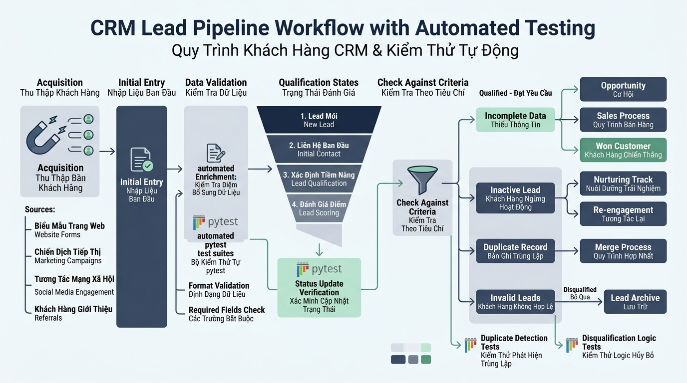

## 
[Sáng tạo] Thiết kế Hệ thống Quản lý và Kiểm thử Vòng đời Lead trong CRM

### **1. Mục tiêu**
*   **Vận dụng tư duy thiết kế hệ thống:** Tự định nghĩa cấu trúc dữ liệu và quy trình quản lý khách hàng tiềm năng (Lead Lifecycle) trong phân hệ CRM.
*   **Kỹ thuật xử lý ngoại lệ chuyên sâu:** Xây dựng hệ thống ngoại lệ tùy chỉnh (Custom Exceptions) kế thừa từ `Exception`, áp dụng triệt để khối lệnh `try-except-else-finally` để kiểm soát luồng thực thi và ghi nhận lịch sử xử lý.
*   **Quản lý trạng thái và Audit Trail:** Triển khai cơ chế xóa mềm (Soft Delete) kết hợp tính năng khôi phục (Restore) dữ liệu, đảm bảo không mất mát lịch sử tương tác nghiệp vụ.
*   **Kiểm thử tự động với Pytest 8.3:** Thiết kế bộ kiểm thử tự động toàn diện sử dụng `pytest`, kiểm tra các kịch bản thành công và ngoại lệ bằng `pytest.raises`.

### **2. Bối cảnh & Vấn đề**
Trong phân hệ CRM của doanh nghiệp, dữ liệu khách hàng tiềm năng (Lead) đóng vai trò sống còn đối với hiệu quả kinh doanh. Tuy nhiên, hệ thống hiện tại đang gặp nhiều bất cập nghiêm trọng:
1. **Dữ liệu rác và sai định dạng:** Thông tin Lead liên lạc (Email, Số điện thoại) không được xác thực đúng quy chuẩn ngay tại điểm tiếp nhận, gây thất thoát chi phí tiếp thị.
2. **Chuyển đổi trạng thái vi phạm quy trình:** Các nhân viên tư vấn có thể nhảy bước tùy tiện (ví dụ: chuyển từ trạng thái `Mới tiếp nhận` thẳng sang `Đã chốt hợp đồng` mà bỏ qua bước `Tư vấn / Đánh giá`), làm sai lệch báo cáo phễu bán hàng.
3. **Mất vết dữ liệu do xóa cứng (Hard Delete):** Việc xóa trực tiếp bản ghi khỏi cơ sở dữ liệu làm mất lịch sử phục vụ việc kiểm toán (Audit Trail) và không thể khôi phục khi thao tác nhầm.
4. **Thiếu hệ thống kiểm thử tự động:** Không có bộ test suite để đảm bảo các ràng buộc nghiệp vụ và các ngoại lệ kích hoạt đúng thời điểm.

Học viên đóng vai trò là Kiến trúc sư phần mềm (Software Architect), tự chủ động thiết kế, cài đặt mô hình dữ liệu, xử lý bẫy lỗi nâng cao và viết bộ test suite bằng `pytest 8.3` cho hệ thống này.

  

### **3. Quy tắc nghiệp vụ**
1. **Ràng buộc định dạng dữ liệu (Validation Rules):**
   * Mã Lead (Lead ID) phải là chuỗi định dạng chuẩn do học viên tự quy định (không được rỗng).
   * Email và Số điện thoại phải tuân thủ định dạng chuẩn (không chứa khoảng trắng thừa, đúng cấu trúc).
   * Ngân sách dự kiến (Estimated Budget) phải là số thực hoặc số nguyên dương (không chấp nhận giá trị âm).
2. **Vòng đời chuyển trạng thái (State Machine):**
   * Các trạng thái hợp lệ của Lead gồm: `NEW` -> `CONTACTED` -> `QUALIFIED` -> `CONVERTED` (hoặc `LOST`).
   * Không cho phép chuyển trạng thái ngược chiều bất hợp lý hoặc nhảy bước vi phạm logic nghiệp vụ.
3. **Cơ chế Soft Delete và Restore:**
   * Thao tác xóa Lead không xóa khỏi bộ nhớ mà chỉ đánh dấu `is_deleted = True` và lưu thời điểm xóa.
   * Các thao tác tìm kiếm/truy vấn mặc định chỉ lấy các Lead đang hoạt động (`is_deleted = False`).
   * Cung cấp cơ chế khôi phục Lead đã xóa mềm về lại trạng thái trước đó.
4. **Kiến trúc Ngoại lệ (Exception Architecture):**
   * Xây dựng lớp ngoại lệ cơ sở `CRMException`.
   * Các lớp ngoại lệ chuyên biệt kế thừa từ `CRMException`: `LeadValidationError`, `InvalidStateTransitionError`, `LeadNotFoundError`, `DuplicateLeadError`.
   * Mọi hàm xử lý nghiệp vụ chính phải áp dụng cấu trúc `try-except-else-finally` để đảm bảo tài nguyên được giải phóng/đóng vết ghi log đầy đủ.

### **4. Yêu cầu bài toán**
Học viên tự thực hiện 4 phần nhiệm vụ sau:

*   **Phần 1 - Tự thiết kế I/O Schema & Kịch bản ngoại lệ:**
    *   Tự thiết kế cấu trúc dữ liệu bản ghi Lead (dưới dạng Class hoặc TypedDict/Dataclass trong Python 3.12).
    *   Liệt kê ít nhất 4 trường hợp lỗi biên (Edge cases) và các xung đột trạng thái nghiệp vụ sẽ bẫy trong mã nguồn.
*   **Phần 2 - Sơ đồ luồng dữ liệu (Data Flow Diagram):**
    *   Vẽ sơ đồ luồng bằng Mermaid (`mermaid graph TD` hoặc `sequenceDiagram`) mô tả toàn bộ vòng đời của Lead: Tiếp nhận -> Validate -> Chuyển trạng thái -> Xử lý ngoại lệ -> Soft Delete / Restore.
*   **Phần 3 - Triển khai Mã nguồn Python (Core Module):**
    *   Tạo file `crm_system.py` chứa toàn bộ Class ngoại lệ tùy chỉnh và Class quản lý Lead (`LeadManager`).
    *   Sử dụng Type Hints đầy đủ của Python 3.12 (`str | None`, `list[dict]`, ...).
    *   Viết mã nguồn tuân thủ chặt chẽ quy chuẩn Clean Code và PEP 8 (tên biến/hàm bằng Tiếng Anh, chú thích bằng Tiếng Việt có dấu).
*   **Phần 4 - Xây dựng Bộ Kiểm thử với Pytest 8.3 (Test Suite):**
    *   Tạo file `test_crm_system.py`.
    *   Viết tối thiểu 5 hàm kiểm thử độc lập kiểm tra các chức năng:
        1. Thêm Lead thành công và validate dữ liệu đúng.
        2. Bắt ngoại lệ `LeadValidationError` khi dữ liệu đầu vào sai định dạng (`pytest.raises`).
        3. Bắt ngoại lệ `InvalidStateTransitionError` khi chuyển trạng thái sai quy trình.
        4. Kiểm tra logic Soft Delete và tìm kiếm Lead hoạt động.
        5. Kiểm tra tính năng Restore Lead thành công.

### **5. Yêu cầu nộp bài**
Học viên cần nộp:
*   Phần phân tích/báo cáo (Schema I/O, Edge Cases, Sơ đồ Mermaid) và toàn bộ mã nguồn triển khai.
*   Đẩy mã nguồn lên GitHub theo định dạng thư mục: `[Tên Lớp]_[Môn Học]_Session14_Ex05`.
    Ví dụ: `HNKS25CNTT1_Core_Session14_Ex05`