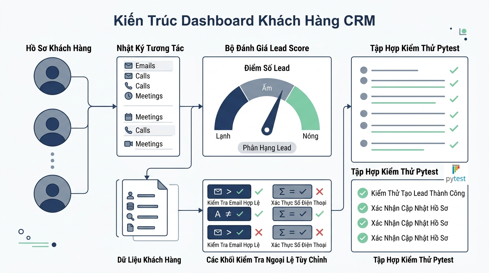

## 
[Bài tập tổng hợp] Quản lý Khách hàng và Lịch sử Tương tác CRM với Pytest

### **1. Mục tiêu**
*   **Kiến thức:** Áp dụng tổng hợp kỹ thuật kích hoạt ngoại lệ chủ động (`raise`), thiết kế Ngoại lệ tùy chỉnh (Custom Exceptions), quy trình validate dữ liệu nghiệp vụ và viết Unit Test tự động với bộ thư viện `pytest 8.3`.
*   **Kỹ năng:** Xây dựng mô hình xử lý ngoại lệ chặt chẽ cho hệ thống CRM (Customer Relationship Management), phân loại trạng thái tiềm năng của khách hàng (Lead Tiering), đồng thời viết tập hợp test case phủ toàn bộ các kịch bản thành công và ngoại lệ.
*   **Thái độ:** Rèn luyện tư duy lập trình defensive programming (phòng vệ chủ động), tuân thủ tiêu chuẩn mã nguồn clean code PEP 8 và tư duy kiểm thử tự động chuyên nghiệp.

### **2. Bối cảnh & Vấn đề**
Bộ phận Quản lý Quan hệ Khách hàng (CRM) của một công ty thương mại cần một hệ thống quản lý danh sách khách hàng tiềm năng (Leads) chạy trực tiếp trên bộ nhớ RAM. Hệ thống này có nhiệm vụ theo dõi thông tin khách hàng, ghi nhận các hoạt động tương tác (cuộc gọi, email, họp trực tiếp), cập nhật điểm tiềm năng (Lead Score) và tự động xếp hạng phân cấp khách hàng.

Để đảm bảo dữ liệu CRM không bị sai lệch do người dùng nhập dữ liệu sai định dạng hoặc thao tác với các hồ sơ không tồn tại, bộ phận kỹ thuật yêu cầu xây dựng bộ lớp quản lý tích hợp cơ chế kiểm lỗi chặt chẽ bằng Custom Exceptions và kiểm thử toàn bộ hệ thống thông qua `pytest`.

  

### **3. Quy tắc nghiệp vụ**

#### **3.1. Các ngoại lệ tùy chỉnh (Custom Exceptions)**
Hệ thống sử dụng các ngoại lệ tùy chỉnh kế thừa từ `Exception` để phản ánh chính xác lỗi nghiệp vụ:
1.  `DuplicateCustomerError`: Kích hoạt khi thêm khách hàng mới có Mã khách hàng (`customer_id`) hoặc Email (`email`) đã tồn tại.
2.  `CustomerNotFoundError`: Kích hoạt khi truy vấn, cập nhật hoặc ghi nhận tương tác cho một `customer_id` không tồn tại trong RAM.
3.  `InvalidCustomerDataError`: Kích hoạt khi dữ liệu đầu vào không hợp lệ (định dạng Email, Số điện thoại hoặc Điểm số nằm ngoài khoảng quy định).

#### **3.2. Quy tắc Kiểm chuẩn dữ liệu Khách hàng**
Khi khởi tạo hoặc thêm mới Khách hàng, các thông tin phải thỏa mãn các tiêu chí sau:
*   `customer_id`: Chuỗi ký tự không được rỗng.
*   `full_name`: Chuỗi ký tự không được rỗng.
*   `email`: Phải chứa ký tự `@` và ký tự `.` (dấu chấm) xuất hiện sau `@`.
*   `phone`: Chuỗi ký tự gồm đúng 10 chữ số và bắt đầu bằng số `0`.
*   `lead_score`: Số nguyên trong khoảng từ `0` đến `100` (mặc định là `0` khi mới tạo).

#### **3.3. Quy tắc Tương tác và Phân cấp Khách hàng**
*   **Loại tương tác hợp lệ:** Chỉ chấp nhận 4 loại tương tác sau trong chuỗi: `'CALL'`, `'EMAIL'`, `'MEETING'`, `'DEMO'`. Nếu nhập loại khác, kích hoạt ngoại lệ `ValueError`.
*   **Cập nhật Điểm tiềm năng (`lead_score`):** Mỗi tương tác sẽ cộng hoặc trừ một lượng điểm (`score_impact`). Điểm `lead_score` sau khi cập nhật không được vượt quá `100` và không được nhỏ hơn `0` (kỹ thuật Clamping/Giới hạn biên).
*   **Phân cấp Khách hàng (Customer Tier):** Trạng thái được phân loại dựa trên `lead_score`:

<table style="width: 100%; min-width: 100%; display: table; border-collapse: collapse;" width="100%" border="1">
  <thead>
    <tr style="background-color: #f2f2f2;">
      <th style="padding: 8px; text-align: left;">Khoảng điểm Lead Score</th>
      <th style="padding: 8px; text-align: left;">Phân cấp (Tier)</th>
      <th style="padding: 8px; text-align: left;">Mô tả nghiệp vụ</th>
    </tr>
  </thead>
  <tbody>
    <tr>
      <td style="padding: 8px;">Dưới 30 điểm (0 - 29)</td>
      <td style="padding: 8px;"><code>"Cold"</code></td>
      <td style="padding: 8px;">Khách hàng chưa có nhiều tương tác/tiềm năng thấp.</td>
    </tr>
    <tr>
      <td style="padding: 8px;">Từ 30 đến 69 điểm</td>
      <td style="padding: 8px;"><code>"Warm"</code></td>
      <td style="padding: 8px;">Khách hàng đang quan tâm, cần tiếp tục chăm sóc.</td>
    </tr>
    <tr>
      <td style="padding: 8px;">Từ 70 đến 100 điểm</td>
      <td style="padding: 8px;"><code>"Hot"</code></td>
      <td style="padding: 8px;">Khách hàng có khả năng chốt hợp đồng cao.</td>
    </tr>
  </tbody>
</table>

### **4. Yêu cầu bài toán**

Học viên tổ chức mã nguồn bài tập thành 2 tệp chính: `crm_service.py` (chứa logic nghiệp vụ) và `test_crm_service.py` (chứa bộ kiểm thử Pytest).

#### **Yêu cầu 1: Phát triển module `crm_service.py`**
1.  Định nghĩa 3 lớp Ngoại lệ tùy chỉnh: `DuplicateCustomerError`, `CustomerNotFoundError`, `InvalidCustomerDataError`.
2.  Xây dựng lớp `CRMManager` quản lý dữ liệu trên RAM bằng `dict` hoặc `list` với các phương thức:
    *   `add_customer(customer_id: str, full_name: str, email: str, phone: str, initial_score: int = 0) -> dict`: Thêm mới khách hàng. Thực hiện validate toàn bộ quy tắc mục 3.2. Nếu vi phạm, `raise` đúng ngoại lệ tương ứng.
    *   `record_interaction(customer_id: str, interaction_type: str, note: str, score_impact: int) -> dict`: Ghi nhận tương tác mới, điều chỉnh `lead_score` của khách hàng và lưu lại nhật ký tương tác.
    *   `get_customer_tier(customer_id: str) -> str`: Trả về phân cấp `"Cold"`, `"Warm"`, hoặc `"Hot"` của khách hàng.
    *   `get_customer_details(customer_id: str) -> dict`: Trả về toàn bộ thông tin chi tiết bao gồm thông tin cá nhân, `lead_score`, `tier` và danh sách tương tác.

#### **Yêu cầu 2: Viết bộ Kiểm thử đơn vị trong `test_crm_service.py`**
Sử dụng thư viện `pytest 8.3` để kiểm thử toàn bộ hệ thống. Viết ít nhất 6 test cases bao phủ các kịch bản sau:
1.  `test_add_customer_success`: Kiểm thử thêm khách hàng thành công với thông tin hợp lệ.
2.  `test_add_customer_duplicate_id_or_email`: Kiểm thử kích hoạt `DuplicateCustomerError` khi trùng ID hoặc trùng Email.
3.  `test_add_customer_invalid_data`: Kiểm thử kích hoạt `InvalidCustomerDataError` khi số điện thoại không đủ 10 số hoặc email không chứa dấu `@`.
4.  `test_record_interaction_success_and_score_clamping`: Kiểm thử ghi nhận tương tác thành công và kiểm tra điểm `lead_score` bị giới hạn trong khoảng `[0, 100]` khi `score_impact` vượt ngưỡng.
5.  `test_record_interaction_customer_not_found`: Kiểm thử kích hoạt `CustomerNotFoundError` khi ghi tương tác cho khách hàng không tồn tại.
6.  `test_customer_tier_calculation`: Kiểm thử phân cấp `"Cold"`, `"Warm"`, `"Hot"` tính toán chính xác sau khi điều chỉnh điểm.

### **5. Yêu cầu nộp bài**
Học viên cần nộp:
*   Phần phân tích/báo cáo và mã nguồn triển khai (`crm_service.py` và `test_crm_service.py`).
*   Đẩy mã nguồn lên GitHub theo định dạng thư mục: `[Tên Lớp]_[Môn Học]_Session14_Ex06`.
    Ví dụ: `HNKS25CNTT1_Core_Session14_Ex06`