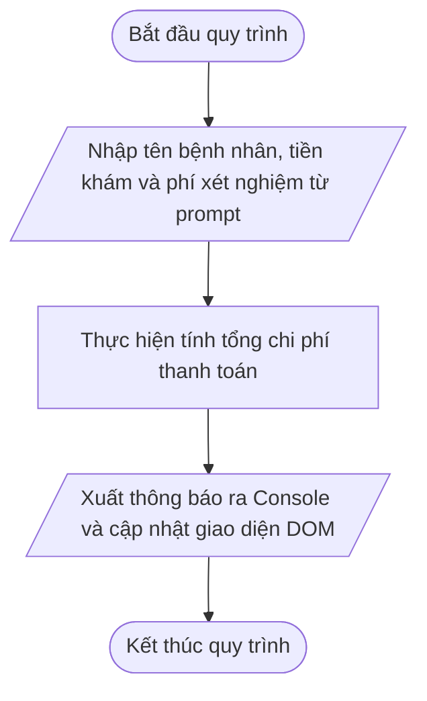

# <center>[Vận dụng cơ bản 3] Sửa lỗi tính tổng tiền khám bệnh và xuất phiếu thông báo</center>

### **1. Mục tiêu**
*   **Phân tích & Phát hiện:** Nhận biết và giải thích nguyên nhân gây ra lỗi logic cộng chuỗi thay vì cộng số học khi nhận dữ liệu từ phương thức `prompt()`.
*   **Chuyển đổi kiểu dữ liệu:** Áp dụng thành thạo hàm `Number()` để chuyển đổi dữ liệu đầu vào dạng chuỗi thành kiểu số nguyên/số thực trước khi thực hiện tính toán.
*   **Quy chuẩn ES6 & Chuỗi Template Literals:** Tối ưu mã nguồn cũ bằng cách thay thế các khai báo `var` thành `const`/`let`, áp dụng quy tắc đặt tên `camelCase` và đóng gói thông báo kết quả bằng Template Literals.
*   **Tương tác DOM & Console:** Hiển thị chính xác thông tin phiếu thanh toán chi phí khám bệnh ra Console trình duyệt và giao diện HTML.

### **2. Bối cảnh & Vấn đề**
Tại phòng khám đa khoa Rikkei Care (thuộc Hệ thống Đặt lịch Khám bệnh Phòng khám Tự động `CLINIC_APPOINTMENT`), bộ phận tiếp nhận bệnh nhân sử dụng một trang web đơn giản để nhập thông tin đăng ký khám và tính toán tổng chi phí ban đầu. Chi phí thanh toán bao gồm hai khoản tiền: **Tiền khám chuyên khoa** và **Phí xét nghiệm sơ bộ**.

Hiện tại, nhân viên lễ tân liên tục phản ánh sự cố hệ thống: Khi nhập tiền khám chuyên khoa là `200000` VNĐ và phí xét nghiệm sơ bộ là `50000` VNĐ, tổng tiền thanh toán hiển thị trên phiếu lại lên tới `20000050000` VNĐ. Sự cố này khiến khách hàng hoang mang và phàn nàn về tính chính xác của phần mềm phòng khám.



# **3. Mã nguồn hiện tại**
Dưới đây là tập tin mã nguồn đang vận hành gặp lỗi tại phòng khám:

*Tệp index.html:*

```html
<!DOCTYPE html>
<html lang="vi">
<head>
    <meta charset="UTF-8">
    <meta name="viewport" content="width=device-width, initial-scale=1.0">
    <title>Phòng khám Rikkei Care - Đăng ký khám</title>
</head>
<body>
    <main>
        <section>
            <h1>Hệ thống Đặt lịch Khám bệnh Rikkei Care</h1>
            <p id="appointment-summary">Đang xử lý thông tin phiếu khám...</p>
        </section>
    </main>

    <!-- Thẻ script đặt ở cuối phần body -->
    <script src="app.js"></script>
</body>
</html>
```

*Tệp app.js:*

```javascript
// Nhập thông tin bệnh nhân và chi phí từ bàn phím
var Patient_Name = prompt("Nhập tên bệnh nhân:");
var consultationFee = prompt("Nhập tiền khám chuyên khoa (VNĐ):");
var testingFee = prompt("Nhập phí xét nghiệm ban đầu (VNĐ):");

// Tính tổng chi phí thanh toán
var totalFee = consultationFee + testingFee;

// Đóng gói phiếu thông báo kết quả
var summaryMessage = "Bệnh nhân: " + Patient_Name + " | Tiền khám: " + consultationFee + " VNĐ | Phí xét nghiệm: " + testingFee + " VNĐ | Tổng chi phí thanh toán: " + totalFee + " VNĐ";

// Hiển thị ra Console và cập nhật giao diện DOM
console.log(summaryMessage);
document.getElementById("appointment-summary").textContent = summaryMessage;
```

# **4. Yêu cầu đầu ra**

#### **Phần 1: Phân tích & Báo cáo Test Case (Tracing & Bug Discovery)**
Học viên tiến hành thực thi thử mã nguồn trên trình duyệt, phân tích luồng dữ liệu và hoàn thành bảng báo cáo Test Case theo mẫu dưới đây.
*(Lưu ý: Dòng số 1 đã được điền mẫu để hướng dẫn, học viên bắt buộc phân tích và điền tiếp thông tin chi tiết cho Dòng số 2 và Dòng số 3).*

<table style="width: 100%; min-width: 100%; display: table; border-collapse: collapse;" width="100%" border="1" cellpadding="8">
  <thead>
    <tr style="background-color: #f2f2f2;">
      <th>STT</th>
      <th>Dữ liệu đầu vào (Input)</th>
      <th>Kết quả thực tế bị lỗi (Buggy Output)</th>
      <th>Kết quả mong đợi (Expected Output)</th>
      <th>Dòng code gây lỗi (Failing Line)</th>
      <th>Giải thích nguyên nhân (Logic Note)</th>
    </tr>
  </thead>
  <tbody>
    <tr>
      <td>1</td>
      <td>
        Patient_Name = "Nguyễn Văn A"<br>
        consultationFee = "200000"<br>
        testingFee = "50000"
      </td>
      <td>Bệnh nhân: Nguyễn Văn A | Tiền khám: 200000 VNĐ | Phí xét nghiệm: 50000 VNĐ | Tổng chi phí thanh toán: 20000050000 VNĐ</td>
      <td>Bệnh nhân: Nguyễn Văn A | Tiền khám: 200000 VNĐ | Phí xét nghiệm: 50000 VNĐ | Tổng chi phí thanh toán: 250000 VNĐ</td>
      <td>Dòng 7: <code>var totalFee = consultationFee + testingFee;</code></td>
      <td>Hàm <code>prompt()</code> trả về kiểu dữ liệu String. Toán tử <code>+</code> thực hiện nối chuỗi thay vì cộng số học do chưa ép kiểu bằng <code>Number()</code>.</td>
    </tr>
    <tr>
      <td>2</td>
      <td>
        Patient_Name = "Trần Thị B"<br>
        consultationFee = "150000"<br>
        testingFee = "100000"
      </td>
      <td>...</td>
      <td>...</td>
      <td>...</td>
      <td>...</td>
    </tr>
    <tr>
      <td>3</td>
      <td>
        Patient_Name = "Lê Văn C"<br>
        consultationFee = "300000"<br>
        testingFee = "0"
      </td>
      <td>...</td>
      <td>...</td>
      <td>...</td>
      <td>...</td>
    </tr>
  </tbody>
</table>

#### **Phần 2: Sửa mã nguồn nghiệp vụ (Source Code Correction)**
Viết lại toàn bộ tệp `app.js` đáp ứng chính xác các quy chuẩn sau:
1.  **Chuyển đổi kiểu dữ liệu:** Sử dụng hàm `Number()` để chuyển đổi `consultationFee` và `testingFee` thành kiểu dữ liệu số ngay khi nhận từ `prompt()`.
2.  **Chuẩn hóa biến ES6:** Thay thế toàn bộ từ khóa `var` bằng `const` hoặc `let` phù hợp với mục đích sử dụng biến.
3.  **Quy tắc đặt tên:** Sửa đổi tên biến `Patient_Name` thành `patientName` tuân thủ quy chuẩn `camelCase`.
4.  **Template Literals:** Sử dụng chuỗi nội suy Template Literals `` `...${}...` `` để tạo thông báo thay cho việc nối chuỗi bằng toán tử `+`.

### **5. Yêu cầu nộp bài**
Học viên cần nộp:
*   Phần phân tích/báo cáo và mã nguồn triển khai.
*   Đẩy mã nguồn lên GitHub theo định dạng thư mục: `[Tên Lớp]_[Môn Học]_Session02_Ex3`.
    Ví dụ: `HNKS25CNTT1_Core_Session02_Ex3`
