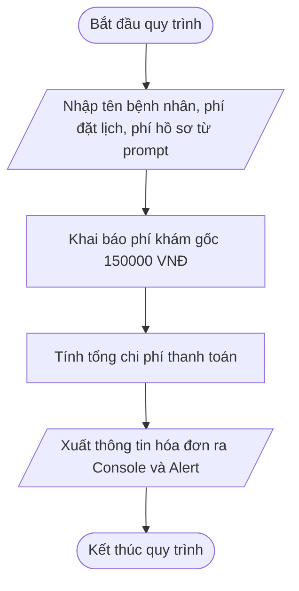

# <center>[Vận dụng cơ bản 5] Sửa lỗi tính tổng chi phí dịch vụ đặt lịch khám bệnh</center>

### **1. Mục tiêu**
*   Phát hiện và sửa lỗi ghép chuỗi ngầm định do không ép kiểu dữ liệu từ hàm `prompt()` trong JavaScript (ES6+).
*   Sử dụng thành thạo `Number()` để chuyển đổi dữ liệu dạng chuỗi sang kiểu số trước khi thực hiện các phép toán số học.
*   Quản lý biến số chuẩn ES6 (`const`, `let`) và sử dụng chuỗi Template Literals để xuất thông tin hóa đơn thanh toán trên Console và Alert.

### **2. Bối cảnh & Vấn đề**
Trong Hệ thống Đặt lịch Khám bệnh Phòng khám Tự động (CLINIC_APPOINTMENT), module tính phí dịch vụ có nhiệm vụ xác định tổng chi phí thanh toán ban đầu cho bệnh nhân khi lấy số thứ tự. Mọi lượt khám đều có phí khám gốc cố định là **150,000 VNĐ**. Bệnh nhân hoặc lễ tân sẽ nhập thêm phí dịch vụ chọn khung giờ khám theo yêu cầu và phí phụ thu tạo hồ sơ bệnh án điện tử từ giao diện.

Tuy nhiên, bộ phận tiếp đón bệnh nhân phản ánh rằng khi nhân viên nhập phí đặt lịch theo giờ là `30000` VNĐ và phí tạo hồ sơ là `20000` VNĐ, tổng tiền thanh toán hiển thị trên màn hình xác nhận bị tính sai thành một con số khổng lồ bất thường: `1500003000020000 VNĐ` thay vì `200000 VNĐ`. Sự cố này khiến hệ thống xuất hóa đơn sai giá trị và không thể tiến hành thu phí.

### **3. Mã nguồn hiện tại**

Sơ đồ luồng xử lý tính chi phí đặt lịch khám bệnh:



Mã nguồn HTML (`index.html`):

```html
<!DOCTYPE html>
<html lang="vi">
<head>
    <meta charset="UTF-8">
    <meta name="viewport" content="width=device-width, initial-scale=1.0">
    <title>Hệ thống Đặt lịch Khám bệnh Clinic</title>
</head>
<body>
    <h1>Xác nhận Hóa đơn Đặt lịch Khám</h1>

    <!-- Liên kết tệp JavaScript xử lý logic tính phí -->
    <script src="appointment.js"></script>
</body>
</html>
```

Mã nguồn JavaScript (`appointment.js`):

```javascript
// Hệ thống Đặt lịch Khám bệnh Phòng khám Tự động (CLINIC_APPOINTMENT)
// Module: Tính tổng chi phí khám bệnh ban đầu

// Bước 1: Nhận thông tin từ người dùng qua prompt
const patientName = prompt("Nhập tên bệnh nhân:");
const bookingFeeInput = prompt("Nhập phí dịch vụ đặt lịch theo giờ (VNĐ):");
const recordFeeInput = prompt("Nhập phí tạo hồ sơ bệnh án điện tử (VNĐ):");

// Phí khám gốc cố định tại phòng khám
const baseExamFee = 150000;

// Bước 2: Tính tổng tiền thanh toán cho lượt khám
const totalPayment = baseExamFee + bookingFeeInput + recordFeeInput;

// Bước 3: Đóng gói thông tin hóa đơn bằng Template Literals
const invoiceSummary = `Bệnh nhân: ${patientName} | Phí khám gốc: ${baseExamFee} VNĐ | Phí đặt lịch: ${bookingFeeInput} VNĐ | Phí hồ sơ: ${recordFeeInput} VNĐ | Tổng thanh toán: ${totalPayment} VNĐ`;

// Bước 4: Xuất thông báo
console.log(invoiceSummary);
alert(invoiceSummary);
```

# **4. Yêu cầu bài toán**

#### **Phần 1: Truy vết mã nguồn & Hoàn thiện Báo cáo Test Case (Bảng kiểm thử)**
Học viên tiến hành chạy thử chương trình, phân tích dòng mã gây lỗi và điền tiếp thông tin còn thiếu vào các dòng `...` trong bảng Test Case dưới đây:

<table style="width: 100%; min-width: 100%; display: table; border-collapse: collapse;" width="100%" border="1">
    <thead>
        <tr style="background-color: #f2f2f2;">
            <th style="padding: 8px; border: 1px solid #dddddd; text-align: center;">STT</th>
            <th style="padding: 8px; border: 1px solid #dddddd; text-align: center;">Dữ liệu đầu vào (Input)</th>
            <th style="padding: 8px; border: 1px solid #dddddd; text-align: center;">Kết quả thực tế bị lỗi (Buggy Output)</th>
            <th style="padding: 8px; border: 1px solid #dddddd; text-align: center;">Kết quả mong đợi (Expected Output)</th>
            <th style="padding: 8px; border: 1px solid #dddddd; text-align: center;">Dòng code gây lỗi (Failing Line)</th>
            <th style="padding: 8px; border: 1px solid #dddddd; text-align: center;">Nguyên nhân & Giải thích (Logic Note)</th>
        </tr>
    </thead>
    <tbody>
        <tr>
            <td style="padding: 8px; border: 1px solid #dddddd; text-align: center;">1</td>
            <td style="padding: 8px; border: 1px solid #dddddd;">patientName = "Nguyễn Văn A"<br>bookingFeeInput = "30000"<br>recordFeeInput = "20000"</td>
            <td style="padding: 8px; border: 1px solid #dddddd;">"Bệnh nhân: Nguyễn Văn A | Phí khám gốc: 150000 VNĐ | Phí đặt lịch: 30000 VNĐ | Phí hồ sơ: 20000 VNĐ | Tổng thanh toán: 1500003000020000 VNĐ"</td>
            <td style="padding: 8px; border: 1px solid #dddddd;">"Bệnh nhân: Nguyễn Văn A | Phí khám gốc: 150000 VNĐ | Phí đặt lịch: 30000 VNĐ | Phí hồ sơ: 20000 VNĐ | Tổng thanh toán: 200000 VNĐ"</td>
            <td style="padding: 8px; border: 1px solid #dddddd; text-align: center;">Dòng 12 trong appointment.js</td>
            <td style="padding: 8px; border: 1px solid #dddddd;">Hàm prompt() trả về kiểu String. Phép cộng giữa Number và String thực hiện ghép chuỗi thay vì cộng số.</td>
        </tr>
        <tr>
            <td style="padding: 8px; border: 1px solid #dddddd; text-align: center;">2</td>
            <td style="padding: 8px; border: 1px solid #dddddd;">patientName = "Trần Thị B"<br>bookingFeeInput = "50000"<br>recordFeeInput = "0"</td>
            <td style="padding: 8px; border: 1px solid #dddddd;">...</td>
            <td style="padding: 8px; border: 1px solid #dddddd;">...</td>
            <td style="padding: 8px; border: 1px solid #dddddd; text-align: center;">...</td>
            <td style="padding: 8px; border: 1px solid #dddddd;">...</td>
        </tr>
        <tr>
            <td style="padding: 8px; border: 1px solid #dddddd; text-align: center;">3</td>
            <td style="padding: 8px; border: 1px solid #dddddd;">patientName = "Lê Văn C"<br>bookingFeeInput = "0"<br>recordFeeInput = "15000"</td>
            <td style="padding: 8px; border: 1px solid #dddddd;">...</td>
            <td style="padding: 8px; border: 1px solid #dddddd;">...</td>
            <td style="padding: 8px; border: 1px solid #dddddd; text-align: center;">...</td>
            <td style="padding: 8px; border: 1px solid #dddddd;">...</td>
        </tr>
    </tbody>
</table>

#### **Phần 2: Sửa mã nguồn nghiệp vụ**
*   Tạo bản sao sửa lỗi cho tệp `appointment.js`.
*   Thực hiện ép kiểu dữ liệu từ `prompt()` sang kiểu số (`Number()`) một cách minh bạch trước khi thực hiện phép tính tổng.
*   Tuân thủ nghiêm ngặt chuẩn khai báo biến ES6 (`const`, `let`), quy tắc đặt tên `camelCase` và xuất dữ liệu thông qua chuỗi `Template Literals`.

### **5. Yêu cầu nộp bài**
Học viên cần nộp:
*   Phần phân tích/báo cáo và mã nguồn triển khai.
*   Đẩy mã nguồn lên GitHub theo định dạng thư mục: [Tên Lớp]_[Môn Học]_Session02_Ex5.
    Ví dụ: HNKS25CNTT1_Core_Session02_Ex5
