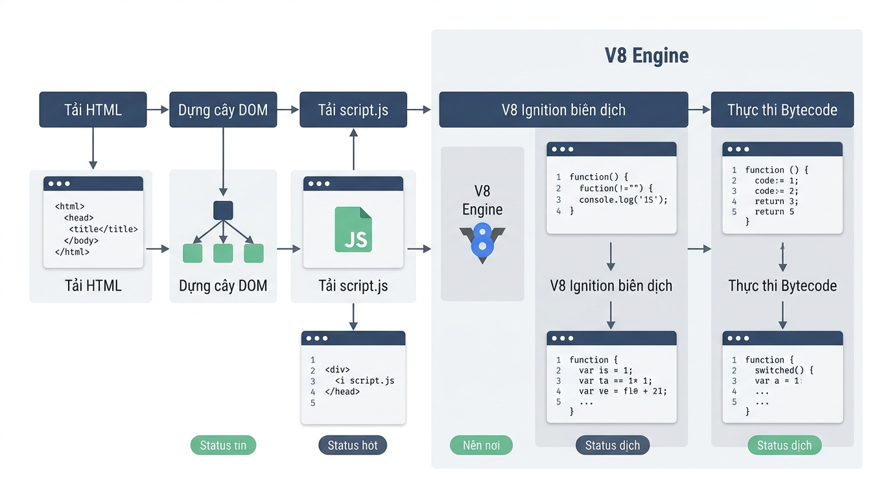

# Tổng quan ngôn ngữ JavaScript, Trình duyệt Console và Biến số ES6

## Lesson 01 — Tổng quan JavaScript và Cơ chế V8 Engine
### Khái niệm & Vai trò
- Định nghĩa: Ngôn ngữ kịch bản chạy trên trình duyệt và môi trường máy chủ.
- Vai trò V8 Engine: Biên dịch mã JavaScript sang Bytecode và Mã máy để thực thi.
- Mục tiêu: Tạo tính tương tác động và xử lý logic nghiệp vụ phía client.
### Cú pháp & Giải nghĩa
- Cấu trúc liên kết file mã nguồn bên ngoài:
  ```html
  <!-- Tải file script độc lập trước thẻ đóng body -->
  <script src="script.js"></script>
  ```
- Các bước trong luồng xử lý của V8 Engine:
  - HTML Parser: Dựng cấu trúc cây DOM từ tài liệu HTML.
  - Script Loader: Tải file JavaScript vào bộ nhớ RAM trình duyệt.
  - Ignition Compiler: Phân tích cú pháp và chuyển đổi sang Bytecode.
- 
### Ví dụ thực hành
- Kịch bản áp dụng: Tách biệt logic JavaScript khỏi giao diện HTML.
  ```html
  <!DOCTYPE html>
  <html lang="vi">
  <head>
    <meta charset="UTF-8">
    <title>Cửa hàng Shopeetech</title>
  </head>
  <body>
    <h1>Danh sách sản phẩm</h1>
    <script src="script.js"></script>
  </body>
  </html>
  ```
- Giải thích ví dụ: Đặt thẻ script ở cuối body giúp tối ưu tốc độ hiển thị giao diện.
### Lưu ý triển khai
- **Trộn lẫn mã inline**: Không nhúng biểu thức JS trực tiếp vào thuộc tính HTML như onclick.
- **Tái sử dụng Bytecode**: Tách file script riêng giúp V8 Engine lưu bộ nhớ đệm hiệu quả.
- **Định dạng file**: Sử dụng chữ thường và dấu gạch ngang cho tên file script.

## Lesson 02 — Cài đặt Môi trường VS Code / Cursor và Node.js Runtime
### Khái niệm & Vai trò
- Định nghĩa: Môi trường phát triển tích hợp (IDE) và môi trường thực thi Node.js.
- Vai trò: Hỗ trợ viết mã thông minh, kiểm tra cú pháp và khởi chạy máy chủ thử nghiệm.
- Công cụ chính: IDE Cursor/VS Code, Node.js Runtime, Extension Live Server.
### Cú pháp & Giải nghĩa
- Thao tác kiểm tra phiên bản trên Terminal:
  ```bash
  # Kiểm tra phiên bản Node.js đã cài đặt
  node -v
  ```
- Thành phần môi trường:
  - CLI / Terminal: Giao diện dòng lệnh thực thi câu lệnh hệ thống.
  - Live Server: Tạo máy chủ HTTP cục bộ để tự động làm mới trang web.
### Ví dụ thực hành
- Kịch bản áp dụng: Kết nối script và thao tác thay đổi giao diện DOM đơn giản.
  ```javascript
  // Mã nguồn thực thi trong file app.js
  const statusHeading = document.getElementById("app-title");
  statusHeading.textContent = "Xác nhận: Môi trường lập trình hoạt động thành công!";
  ```
- Giải thích ví dụ: Truy cập phần tử HTML qua ID và cập nhật nội dung văn bản.
### Lưu ý triển khai
- **Mở file trực tiếp**: Tránh dùng giao thức file:/// vì làm hạn chế một số tính năng web.
- **Thứ tự tải script**: Tránh đặt thẻ script ở phần head khi chưa sử dụng thuộc tính bổ trợ.
- **Phiên bản Node.js**: Sử dụng phiên bản LTS để đảm bảo tính ổn định của môi trường.

## Lesson 03 — Biến số ES6 (let, const, var) và Naming Convention
### Khái niệm & Vai trò
- Định nghĩa: Các từ khóa khai báo vùng nhớ lưu trữ dữ liệu theo chuẩn ES6.
- Vai trò: Quản lý phạm vi truy cập biến và bảo vệ tính đóng đóng của dữ liệu.
- Quy chuẩn đặt tên: Áp dụng quy tắc camelCase cho tất cả các tên biến.
### Cú pháp & Giải nghĩa
- Cú pháp khai báo biến chuẩn ES6:
  ```javascript
  // Khai báo hằng số không thể thay đổi giá trị
  const customerId = "CUST-89012";
  // Khai báo biến số có thể cập nhật giá trị
  let accountBalance = 1500000;
  ```
- Giải thích thành phần:
  - const: Dùng cho giá trị cố định, bắt buộc khởi tạo ngay khi khai báo.
  - let: Dùng cho giá trị có thay đổi trong tiến trình xử lý logic.
  - var: Cú pháp cũ phạm vi function scope, không khuyên dùng trong ES6+.
### Ví dụ thực hành
- Kịch bản áp dụng: Quản lý thông tin tài khoản và cập nhật số dư khách hàng.
  ```javascript
  const customerName = "Nguyễn Văn A";
  const baseTaxRate = 0.1;
  let currentBalance = 1500000;
  let isAccountActive = true;

  // Cập nhật số dư sau giao dịch
  currentBalance = 1200000;
  ```
- Giải thích ví dụ: Dùng const lưu thông tin cố định, dùng let lưu số dư biến động.
### Lưu ý triển khai
- **Gán lại hằng số**: Gán lại giá trị cho const sẽ phát sinh lỗi TypeError.
- **Khai báo trùng tên**: Cấm dùng var vì cho phép khai báo lại gây ghi đè dữ liệu ngầm.
- **Quy tắc đặt tên**: Không bắt đầu bằng chữ số, không dùng PascalCase hoặc snake_case.

## Lesson 04 — Nhập xuất dữ liệu Console và Chuỗi Template Literals
### Khái niệm & Vai trò
- Định nghĩa: Phương thức nhận dữ liệu, hiển thị kết quả và định dạng chuỗi hiện đại.
- Vai trò: Tương tác với người dùng, kiểm tra lỗi và nội suy biến vào chuỗi dễ dàng.
- Công cụ: prompt(), console.log(), alert() và cú pháp Template Literals.
### Cú pháp & Giải nghĩa
- Cú pháp ép kiểu và nội suy chuỗi:
  ```javascript
  // Ép kiểu đầu vào từ String sang Number
  const itemPrice = Number(prompt("Nhập đơn giá:"));
  // Định dạng chuỗi bằng ký tự backticks
  const message = `Đơn giá sản phẩm: ${itemPrice} VNĐ`;
  ```
- Giải thích thành phần:
  - Number(): Chuyển đổi dữ liệu dạng chuỗi sang dữ liệu dạng số.
  - `${expression}`: Cú pháp nhúng trực tiếp biểu thức hoặc biến vào chuỗi.
### Ví dụ thực hành
- Kịch bản áp dụng: Tính tổng tiền hóa đơn bao gồm đơn giá và phí giao hàng.
  ```javascript
  const customerName = prompt("Nhập tên khách hàng:");
  const productPrice = Number(prompt("Nhập đơn giá sản phẩm:"));
  const shippingFee = Number(prompt("Nhập phí giao hàng:"));

  const totalPayment = productPrice + shippingFee;
  const invoiceSummary = `Khách hàng: ${customerName} | Tổng thanh toán: ${totalPayment} VNĐ`;

  console.log(invoiceSummary);
  ```
- Giải thích ví dụ: Dữ liệu nhập vào được ép kiểu số trước khi thực hiện phép tính cộng.
### Lưu ý triển khai
- **Lỗi cộng chuỗi**: Nếu không ép kiểu Number(), toán tử + sẽ thực hiện nối chuỗi.
- **Ký tự bao quanh**: Template Literals bắt buộc dùng dấu backticks, không dùng dấu nháy đơn.
- **Kiểm tra dữ liệu**: Luôn kiểm tra kết quả ép kiểu để tránh giá trị NaN ngoài ý muốn.

## Liên kết hệ thống
- Mối quan hệ logic: Môi trường V8 & Live Server (Lesson 01, 02) cung cấp hạ tầng thực thi; Biến ES6 (Lesson 03) quản lý bộ nhớ; Nhập xuất dữ liệu (Lesson 04) xử lý luồng thông tin.
- Luồng dữ liệu xuyên suốt: Dữ liệu nhập từ prompt() -> Ép kiểu Number() -> Lưu vào biến let/const -> Tính toán logic -> Định dạng bằng Template Literals -> Xuất ra console.log().
- Ứng dụng tổng hợp: Xây dựng ứng dụng tính toán hóa đơn bán hàng trực tuyến hoàn chỉnh, chuẩn hóa cú pháp ES6 và chạy mượt mà trên môi trường trình duyệt.