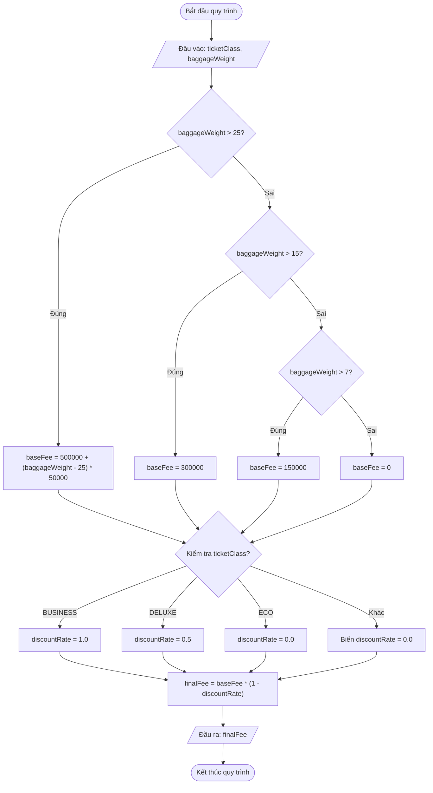

# <center>[Vận dụng cơ bản 3] Sửa lỗi tính phí hành lý ký gửi khi Check-in máy bay</center>

### **1. Mục tiêu**
*   **Kiến thức:** Hiểu rõ cơ chế hoạt động của cấu trúc điều kiện `if...else if...else`, hiện tượng trôi lệnh (fall-through) khi thiếu từ khóa `break` trong cấu trúc rẽ nhánh `switch-case`, và quy tắc sắp xếp thứ tự logic kiểm tra điều kiện.
*   **Kỹ năng:** Thực hành truy vết mã nguồn (Code Tracing), phát hiện các lỗi logic tiềm ẩn (Subtle Logic Bugs), lập bảng báo cáo Test Case kiểm thử và tiến hành sửa lỗi (Refactoring/Debugging) trên nền tảng JavaScript ES6+.
*   **Thái độ:** Tỉ mỉ kiểm tra logic nghiệp vụ thực tế, rèn luyện tư duy lập trình sạch (Clean Code) và tuân thủ quy chuẩn phòng tránh lỗi trong hệ thống giao dịch trực tuyến.

---

### **2. Bối cảnh & Vấn đề**
Trong phân hệ Check-in trực tuyến của hệ thống bán vé máy bay, tính năng tự động tính phí hành lý ký gửi quá cước được triển khai dựa trên hai yếu tố: trọng lượng hành lý ký gửi và hạng vé của hành khách.

**Quy tắc nghiệp vụ chuẩn của hãng hàng không:**
1.  **Mức hành lý xách tay miễn phí:** Tất cả hành khách được mang tối đa **7 kg** hành lý xách tay (không tính phí ký gửi).
2.  **Mức phí hành lý ký gửi cơ bản (`baseFee`) tính theo trọng lượng:**
    *   Trọng lượng từ trên 7 kg đến 15 kg: Phí cố định là **150.000 VNĐ**.
    *   Trọng lượng từ trên 15 kg đến 25 kg: Phí cố định là **300.000 VNĐ**.
    *   Trọng lượng trên 25 kg: Phí cơ sở là **500.000 VNĐ** cộng thêm **50.000 VNĐ** cho mỗi kg vượt quá 25 kg (Số kg vượt quá = `baggageWeight - 25`).
3.  **Chính sách ưu đãi giảm phí theo Hạng vé (`ticketClass`):**
    *   Hạng vé **"BUSINESS"**: Được miễn phí 100% phí hành lý (Tỷ lệ giảm giá `discountRate = 1.0`, phí phải trả = 0 VNĐ).
    *   Hạng vé **"DELUXE"**: Được giảm 50% phí hành lý (Tỷ lệ giảm giá `discountRate = 0.5`, phí phải trả = `baseFee * 0.5`).
    *   Hạng vé **"ECO"**: Không được giảm giá (Tỷ lệ giảm giá `discountRate = 0.0`, phí phải trả = `baseFee`).

**Sự cố ghi nhận từ vận hành:**
Bộ phận CSKH nhận được nhiều khiếu nại từ hành khách mua vé hạng `DELUXE` có khối lượng hành lý 20 kg. Hệ thống lại bắt họ thanh toán 100% mức phí của hạng `ECO`. Đồng thời, một hành khách có hành lý 30 kg phản ánh rằng số tiền bị tính cước thấp hơn rất nhiều so với quy định niêm yết trên website.---

### **3. Mã nguồn hiện tại**
Dưới đây là đoạn mã nguồn JavaScript đang được thực thi trên hệ thống thử nghiệm nhưng có chứa lỗi logic khiến cước phí bị tính sai:

```javascript
// Hệ thống tính phí hành lý check-in tự động Vietjet / Vietnam Airlines
const ticketClass = "DELUXE"; // Hạng vé: ECO, DELUXE, BUSINESS
const baggageWeight = 20;     // Khối lượng hành lý ký gửi (kg)

let baseFee = 0;
let discountRate = 0; // Tỷ lệ giảm giá (0 = 0%, 0.5 = 50%, 1.0 = 100%)

// Khối 1: Tính phí cơ bản theo trọng lượng hành lý
if (baggageWeight > 7) {
  baseFee = 150000;
} else if (baggageWeight > 15) {
  baseFee = 300000;
} else if (baggageWeight > 25) {
  const extraKg = baggageWeight - 25;
  baseFee = 500000 + (extraKg * 50000);
} else {
  baseFee = 0;
}

// Khối 2: Áp dụng ưu đãi theo hạng vé
switch (ticketClass) {
  case "BUSINESS":
    discountRate = 1.0;
    break;
  case "DELUXE":
    discountRate = 0.5;
    // Xử lý ưu đãi hạng Deluxe
  case "ECO":
    discountRate = 0.0;
    break;
  default:
    console.log("Hạng vé không hợp lệ.");
    break;
}

// Khối 3: Tính phí hành lý thực tế phải trả
const finalFee = baseFee * (1 - discountRate);

console.log("Hạng vé:", ticketClass);
console.log("Trọng lượng hành lý:", baggageWeight, "kg");
console.log("Phí hành lý cơ bản:", baseFee, "VNĐ");
console.log("Phí hành lý thực tế phải trả:", finalFee, "VNĐ");
```

---

### **4. Yêu cầu bài toán**

#### **Phần 1: Báo cáo phân tích và hoàn thiện Bảng Test Case (Code Tracing)**
Học viên tiến hành chạy thử và truy vết mã nguồn trên, phát hiện tất cả các vị trí dòng code gây ra lỗi và hoàn thiện bảng Test Case sau vào báo cáo nộp bài.

<table style="width: 100%; min-width: 100%; display: table; border-collapse: collapse;" width="100%" border="1" cellpadding="8">
  <thead>
    <tr style="background-color: #f2f2f2;">
      <th style="text-align: center; width: 5%;">STT</th>
      <th style="text-align: left; width: 22%;">Input (ticketClass, baggageWeight)</th>
      <th style="text-align: left; width: 18%;">Buggy Output (Kết quả mã lỗi)</th>
      <th style="text-align: left; width: 18%;">Expected Output (Kết quả đúng)</th>
      <th style="text-align: left; width: 15%;">Dòng code gây lỗi</th>
      <th style="text-align: left; width: 22%;">Giải thích nguyên nhân logic</th>
    </tr>
  </thead>
  <tbody>
    <tr>
      <td style="text-align: center;">1</td>
      <td>ticketClass = "DELUXE"<br>baggageWeight = 20</td>
      <td>baseFee = 150000<br>finalFee = 150000</td>
      <td>baseFee = 300000<br>finalFee = 150000</td>
      <td>Dòng 9 và Dòng 23</td>
      <td>Điều kiện `> 7` đặt trước `> 15` làm 20kg rơi vào nhánh 150.000 VNĐ. Đồng thời `case "DELUXE"` thiếu `break` bị trôi lệnh (fall-through) xuống `case "ECO"` làm `discountRate` bị đè thành 0.</td>
    </tr>
    <tr>
      <td style="text-align: center;">2</td>
      <td>ticketClass = "ECO"<br>baggageWeight = 30</td>
      <td>...</td>
      <td>...</td>
      <td>...</td>
      <td>...</td>
    </tr>
    <tr>
      <td style="text-align: center;">3</td>
      <td>ticketClass = "DELUXE"<br>baggageWeight = 12</td>
      <td>...</td>
      <td>...</td>
      <td>...</td>
      <td>...</td>
    </tr>
  </tbody>
</table>

#### **Phần 2: Sơ đồ luồng xử lý (Mermaid Flowchart)**
Dưới đây là sơ đồ luồng mô tả thuật toán chính xác sau khi đã được tối ưu:



# **Phần 3: Sửa lỗi mã nguồn (Refactoring Code)**
*   Viết lại toàn bộ đoạn mã nguồn JavaScript để tính toán chính xác `baseFee` và `finalFee` theo đúng quy tắc nghiệp vụ.
*   Bổ sung kiểm tra dữ liệu đầu vào (Validation): Nếu `baggageWeight < 0` hoặc không phải số, in thông báo lỗi hợp lệ thay vì tính toán sai.

---

### **5. Yêu cầu nộp bài**
Học viên cần nộp:
*   Phần phân tích/báo cáo và mã nguồn triển khai.
*   Đẩy mã nguồn lên GitHub theo định dạng thư mục: `[Tên Lớp]_[Môn Học]_SessionSession 06_Ex3`.
    Ví dụ: `HNKS25CNTT1_Core_Session_Session 06_Ex3`
