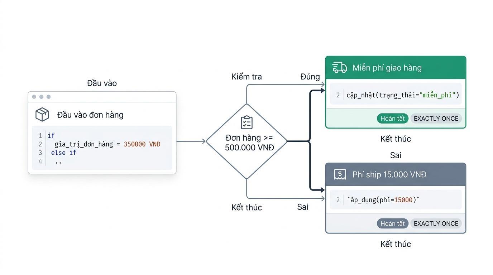

# Cấu trúc Điều kiện và Rẽ nhánh Quyết định

## Lesson 01 — Câu lệnh Điều kiện if và Cấu trúc if-else
### Khái niệm & Vai trò
- Định nghĩa ngắn gọn: Cấu trúc điều khiển luồng thực thi theo điều kiện đúng hoặc sai.
- Vai trò: Rẽ nhánh chương trình, xử lý các kịch bản nghiệp vụ khác nhau.
### Cú pháp & Giải nghĩa
- Khai báo cú pháp chuẩn:
  ```javascript
  if (condition1) {
    // Khối lệnh 1
  } else if (condition2) {
    // Khối lệnh 2
  } else {
    // Khối lệnh mặc định
  }
  ```
- Giải thích thành phần:
  - `condition`: Biểu thức logic trả về giá trị `true` hoặc `false`.
  - `else if`: Kiểm tra điều kiện bổ sung khi các điều kiện trước sai.
  - `else`: Khối mã chạy mặc định khi tất cả điều kiện đều sai.
### Ví dụ thực hành
- Kịch bản áp dụng: Tính phí giao hàng tự động theo tổng giá trị đơn hàng.
  ```javascript
  const orderTotal = 350000;
  let shippingFee = 0;

  if (orderTotal >= 500000) {
    shippingFee = 0;
  } else if (orderTotal >= 200000) {
    shippingFee = 15000;
  } else {
    shippingFee = 30000;
  }

  console.log("Phí giao hàng:", shippingFee);
  ```
- Giải thích ví dụ: Đánh giá điều kiện từ cao xuống thấp để gán phí phù hợp.
- Minh họa luồng quyết định:
  - 
### Lưu ý triển khai
- **Thiếu khối ngoặc nhọn**: Dễ làm lệnh phía sau nằm ngoài phạm vi điều kiện.
- **Sai thứ tự logic**: Đặt điều kiện tổng quát trước làm bỏ qua điều kiện chi tiết.
- **Lưu ý định dạng**: Sử dụng thụt lề 2 khoảng trắng chuẩn ES6 và bắt buộc dùng `{}`.

## Lesson 02 — Câu lệnh Rẽ nhánh Nhiều Trường hợp switch-case
### Khái niệm & Vai trò
- Định nghĩa ngắn gọn: Cấu trúc rẽ nhánh dựa trên so sánh giá trị bằng nghiêm ngặt.
- Vai trò: Thay thế chuỗi `if-else` dài khi kiểm tra một biến với nhiều giá trị.
### Cú pháp & Giải nghĩa
- Khai báo cú pháp chuẩn:
  ```javascript
  switch (expression) {
    case value1:
      // Khối lệnh 1
      break;
    default:
      // Khối lệnh mặc định
      break;
  }
  ```
- Giải thích thành phần:
  - `expression`: Biểu thức hoặc biến cần so sánh giá trị.
  - `case value`: Giá trị so sánh trùng khớp theo kiểu và dữ liệu.
  - `break`: Từ khóa dừng và thoát khỏi cấu trúc `switch`.
  - `default`: Khối mã thực thi khi không trùng khớp với bất kỳ `case` nào.
### Ví dụ thực hành
- Kịch bản áp dụng: Phân loại nhãn hiển thị theo mã trạng thái đơn hàng.
  ```javascript
  const orderStatusCode = 3;
  let statusText = "";

  switch (orderStatusCode) {
    case 1:
      statusText = "Mới tạo";
      break;
    case 3:
      statusText = "Đang giao";
      break;
    default:
      statusText = "Không xác định";
      break;
  }

  console.log("Trạng thái:", statusText);
  ```
- Giải thích ví dụ: Kiểm tra `orderStatusCode === 3` để gán chuỗi "Đang giao".
### Lưu ý triển khai
- **Lỗi trôi lệnh**: Quên từ khóa `break` khiến chương trình thực thi liên tiếp các case sau.
- **So sánh nghiêm ngặt**: `switch-case` dùng phép so sánh `===` nên chuỗi `"1"` khác số `1`.
- **Lưu ý định dạng**: Lùi lề các nhánh `case` bên trong `switch` và luôn thêm `default`.

## Lesson 03 — Biểu thức Điều kiện Ba ngôi Ternary Operator
### Khái niệm & Vai trò
- Định nghĩa ngắn gọn: Cú pháp rút gọn của `if-else` dùng để trả về giá trị biểu thức.
- Vai trò: Gán trực tiếp giá trị cho biến dựa trên điều kiện chỉ với một dòng.
### Cú pháp & Giải nghĩa
- Khai báo cú pháp chuẩn:
  ```javascript
  const result = condition ? valueIfTrue : valueIfFalse;
  ```
- Giải thích thành phần:
  - `condition`: Biểu thức logic đánh giá đúng hoặc sai.
  - `?`: Toán tử phân tách giữa điều kiện và giá trị khi đúng.
  - `valueIfTrue`: Giá trị trả về nếu điều kiện là `true`.
  - `valueIfFalse`: Giá trị trả về nếu điều kiện là `false`.
### Ví dụ thực hành
- Kịch bản áp dụng: Gán phí giao hàng và nhãn thành viên nhanh trên 1 dòng lệnh.
  ```javascript
  const totalAmount = 650000;
  const isVipUser = true;

  const shippingFee = totalAmount >= 500000 ? 0 : 30000;
  const userBadge = isVipUser ? "Khách VIP" : "Khách Thường";

  console.log("Phí giao hàng:", shippingFee);
  console.log("Nhãn tài khoản:", userBadge);
  ```
- Giải thích ví dụ: Đánh giá biểu thức điều kiện và gán trực tiếp vào hằng số `const`.
### Lưu ý triển khai
- **Lồng ghép phức tạp**: Tránh lồng nhiều toán tử ba ngôi làm giảm khả năng đọc mã.
- **Thực thi lệnh phức tạp**: Không dùng toán tử ba ngôi thay thế khối lệnh thực thi đa dòng.
- **Lưu ý định dạng**: Viết ngắn gọn trên 1 dòng hoặc ngắt dòng rõ ràng tại `?` và `:`.

## Liên kết hệ thống
- Mối quan hệ logic: `if-else` là nền tảng điều khiển tổng quát, `switch-case` tối ưu cho tập danh sách giá trị cố định, toán tử ba ngôi tối ưu gán biểu thức đơn giản.
- Luồng dữ liệu xuyên suốt: Dữ liệu đầu vào (`orderTotal`, `orderStatusCode`) -> Đánh giá điều kiện logic -> Gán kết quả xử lý (`shippingFee`, `statusText`) -> Xuất giao diện / Console log.
- Ứng dụng tổng hợp: Kết hợp `switch-case` để phân loại trạng thái hệ thống, `if-else` để tính toán hạn mức logic phức tạp, và toán tử ba ngôi để render nhanh nhãn hiển thị trong DOM.