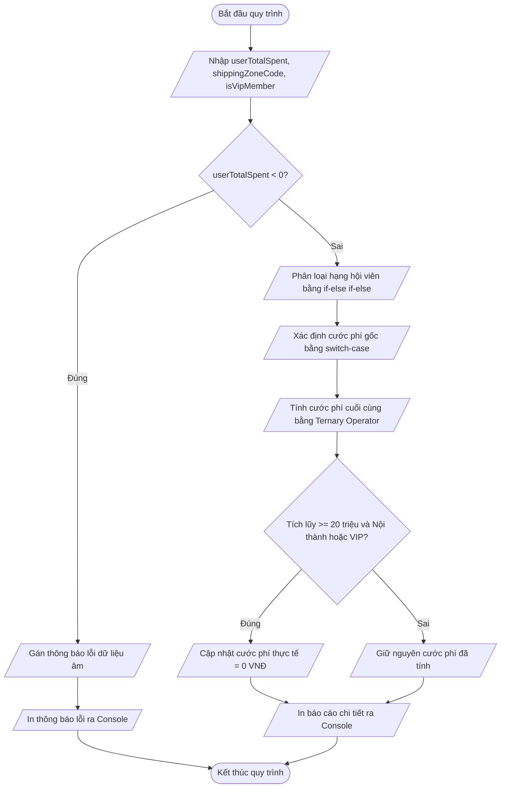

# <center>Xây dựng Module Logic Phân loại Hội viên và Tính Phí Vận chuyển Đơn hàng E-commerce</center>

### **1. Mục tiêu**
- **Củng cố cú pháp điều kiện:** Sử dụng thành thạo cấu trúc rẽ nhánh `if-else if-else` để phân loại cấp bậc người dùng dựa trên tổng hạn mức chi tiêu.
- **Rẽ nhánh nhiều trường hợp:** Áp dụng câu lệnh `switch-case` có từ khóa `break` và nhánh mặc định `default` để tra cứu bảng giá cước vận chuyển theo khu vực.
- **Tối ưu hóa mã nguồn với toán tử 3 ngôi:** Sử dụng toán tử ba ngôi (`condition ? expr1 : expr2`) để tính toán tỷ lệ ưu đãi vận chuyển cho thành viên ưu tiên.
- **Thao tác dữ liệu cơ bản:** Kết hợp các toán tử so sánh nghiêm ngặt (`===`, `!==`), toán tử logic (`&&`, `||`, `!`) và chuỗi Template Literals để xuất kết quả kiểm tra ra giao diện Console.

---

### **2. Bối cảnh & Vấn đề**
Trong phân hệ xử lý thanh toán của hệ thống thương mại điện tử, việc tự động hóa quá trình xác định thứ hạng khách hàng và cước phí vận chuyển đóng vai trò then chốt. Hệ thống cần nhận các tham số đầu vào nguyên thủy của đơn hàng, kiểm tra tính hợp lệ của dữ liệu, sau đó tính toán hạng hội viên, áp dụng cước phí giao hàng theo từng vùng miền và thực hiện giảm trừ phí theo chính sách ưu tiên.

Sơ đồ dòng dữ liệu và logic xử lý của hệ thống được mô tả như sau:



---

### **3. Yêu cầu bài toán**

Hãy viết mã nguồn JavaScript trong file `script.js` để thực hiện toàn bộ logic kiểm tra và tính toán cước phí cho đơn hàng.

#### **3.1. Các biến dữ liệu đầu vào (Input Primitives)**
Khai báo các biến bằng từ khóa `let` hoặc `const` với các giá trị thử nghiệm ban đầu:
- `userTotalSpent` *(number)*: Tổng số tiền tích lũy chi tiêu của khách hàng (đơn vị: VNĐ).
- `shippingZoneCode` *(string)*: Mã khu vực giao hàng (nhận một trong các giá trị chuỗi: `'INNER'`, `'OUTER'`, `'REMOTE'`).
- `isVipMember` *(boolean)*: Trạng thái thẻ VIP của người dùng (`true` hoặc `false`).

#### **3.2. Thông số quy đổi nghiệp vụ**
Dữ liệu quy đổi thứ hạng, cước phí gốc và chính sách ưu đãi được quy định theo bảng sau:

<table border="1" style="width: 100%; border-collapse: collapse;">
  <thead>
    <tr style="background-color: #f2f2f2;">
      <th style="padding: 8px; text-align: left;">Hạng mục</th>
      <th style="padding: 8px; text-align: left;">Điều kiện / Mã định danh</th>
      <th style="padding: 8px; text-align: left;">Giá trị quy đổi / Xử lý</th>
    </tr>
  </thead>
  <tbody>
    <tr>
      <td style="padding: 8px;" rowspan="3"><b>Cấp bậc Hội viên</b><br>(dùng if-else)</td>
      <td style="padding: 8px;"><code>userTotalSpent < 5,000,000</code></td>
      <td style="padding: 8px;">Hạng: <b>"ĐỒNG"</b> | Giảm giá đơn: 0%</td>
    </tr>
    <tr>
      <td style="padding: 8px;"><code>5,000,000 <= userTotalSpent < 20,000,000</code></td>
      <td style="padding: 8px;">Hạng: <b>"BẠC"</b> | Giảm giá đơn: 5%</td>
    </tr>
    <tr>
      <td style="padding: 8px;"><code>userTotalSpent >= 20,000,000</code></td>
      <td style="padding: 8px;">Hạng: <b>"VÀNG"</b> | Giảm giá đơn: 10%</td>
    </tr>
    <tr>
      <td style="padding: 8px;" rowspan="4"><b>Cước phí Vận chuyển Gốc</b><br>(dùng switch-case)</td>
      <td style="padding: 8px;"><code>'INNER'</code> (Nội thành)</td>
      <td style="padding: 8px;">Cước phí gốc: 20,000 VNĐ</td>
    </tr>
    <tr>
      <td style="padding: 8px;"><code>'OUTER'</code> (Ngoại thành)</td>
      <td style="padding: 8px;">Cước phí gốc: 40,000 VNĐ</td>
    </tr>
    <tr>
      <td style="padding: 8px;"><code>'REMOTE'</code> (Vùng sâu / Vùng xa)</td>
      <td style="padding: 8px;">Cước phí gốc: 80,000 VNĐ</td>
    </tr>
    <tr>
      <td style="padding: 8px;">Mã vùng khác (Mặc định)</td>
      <td style="padding: 8px;">Cước phí gốc: 50,000 VNĐ</td>
    </tr>
  </tbody>
</table>

---

### **4. Quy tắc xử lý**

Yêu cầu 1: Kiểm tra tính hợp lệ của dữ liệu đầu vào. Nếu `userTotalSpent < 0`, lập tức in ra thông báo lỗi và dừng toàn bộ xử lý phía sau:
`=== LỖI DỮ LIỆU ĐẦU VÀO ===`
`Tổng tiền chi tiêu không được là số âm. Vui lòng kiểm tra lại!`

Yêu cầu 2: Sử dụng cấu trúc `if-else if-else` để xác định Tên hạng hội viên (`customerRank`) và Tỷ lệ giảm giá đơn hàng (`discountPercent`).

Yêu cầu 3: Sử dụng cấu trúc `switch-case` để tra cứu Phí giao hàng gốc (`baseShippingFee`) theo `shippingZoneCode`. Phải có câu lệnh `break` ở cuối mỗi nhánh và xử lý trường hợp `default`.

Yêu cầu 4: Sử dụng toán tử ba ngôi (Ternary Operator) để tính Phí giao hàng sau ưu đãi VIP (`calculatedShippingFee`):
- Công thức: Nếu `isVipMember === true`, phí giao hàng tính toán bằng 50% cước phí gốc (`baseShippingFee * 0.5`). Ngược lại, giữ nguyên cước phí gốc (`baseShippingFee`).

Yêu cầu 5: Áp dụng điều kiện kết hợp với toán tử logic (`&&`, `||`):
- Miễn phí vận chuyển hoàn toàn (`finalShippingFee = 0`) nếu khách hàng đạt hạng **"VÀNG"** (tổng chi tiêu từ 20,000,000 VNĐ trở lên) **VÀ** thuộc vùng giao hàng **"INNER"** hoặc có thẻ **VIP** (`isVipMember === true`).
- Nếu không thỏa mãn điều kiện kết hợp trên, `finalShippingFee = calculatedShippingFee`.

Yêu cầu 6: Xuất báo cáo kết quả hoàn chỉnh ra màn hình Console bằng chuỗi Template Literals.

---

### **Ví dụ minh họa Input / Output**

#### **Trường hợp 1: Đơn hàng hợp lệ - Thành viên hạng VÀNG được Miễn phí giao hàng**
**Input Variables:**

```javascript
let userTotalSpent = 25000000;
let shippingZoneCode = 'INNER';
let isVipMember = false;
```

**Console Output:**

```text
=== KẾT QUẢ XỬ LÝ ĐƠN HÀNG E-COMMERCE ===
- Tổng tiền tích lũy: 25000000 VNĐ
- Thứ hạng hội viên: VÀNG (Ưu đãi giảm 10% đơn hàng)
- Mã vùng giao hàng: INNER
- Cước phí vận chuyển gốc: 20000 VNĐ
- Quyền ưu tiên VIP: Không
- Cước phí vận chuyển thực tế: 0 VNĐ (Miễn phí vận chuyển)
=========================================
```

# **Trường hợp 2: Đơn hàng hợp lệ - Thành viên VIP được giảm 50% phí ship**
**Input Variables:**

```javascript
let userTotalSpent = 12000000;
let shippingZoneCode = 'REMOTE';
let isVipMember = true;
```

**Console Output:**

```text
=== KẾT QUẢ XỬ LÝ ĐƠN HÀNG E-COMMERCE ===
- Tổng tiền tích lũy: 12000000 VNĐ
- Thứ hạng hội viên: BẠC (Ưu đãi giảm 5% đơn hàng)
- Mã vùng giao hàng: REMOTE
- Cước phí vận chuyển gốc: 80000 VNĐ
- Quyền ưu tiên VIP: Có
- Cước phí vận chuyển thực tế: 40000 VNĐ
=========================================
```

# **Trường hợp 3: Dữ liệu không hợp lệ**
**Input Variables:**

```javascript
let userTotalSpent = -150000;
let shippingZoneCode = 'INNER';
let isVipMember = false;
```

**Console Output:**

```text
=== LỖI DỮ LIỆU ĐẦU VÀO ===
Tổng tiền chi tiêu không được là số âm. Vui lòng kiểm tra lại!
```

---

### **5. Yêu cầu nộp bài**
- Tạo file mã nguồn `script.js` trên Cursor AI IDE / VS Code.
- Chạy thử mã nguồn trên Node.js runtime hoặc Màn hình Console của Trình duyệt web với các bộ dữ liệu test khác nhau.
- Tiến hành đẩy mã nguồn lên kho lưu trữ GitHub (Repository) và nộp liên kết bài làm theo quy định.
