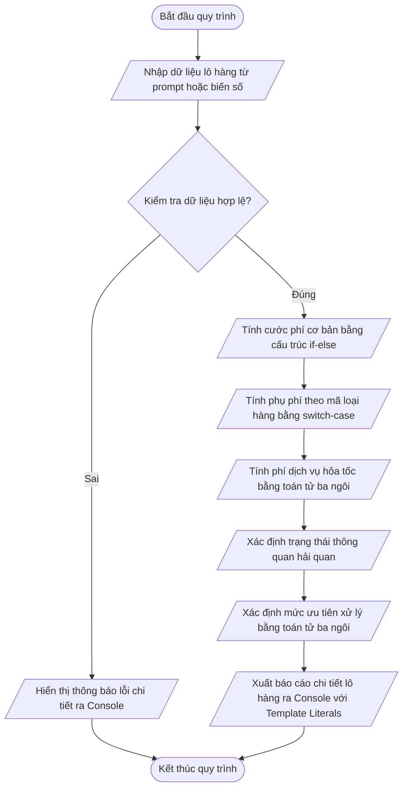

# <center>BÀI TẬP THỰC HÀNH: XÂY DỰNG LOGIC PHÂN LOẠI LÔ HÀNG VÀ KIỂM TRA ĐIỀU KIỆN THÔNG QUAN LOGISTICS</center>

### **1. Mục tiêu**
*   Vận dụng thành thạo cấu trúc rẽ nhánh `if-else` nhiều tầng và rẽ nhánh `switch-case` trong JavaScript ES6+ để xử lý logic nghiệp vụ logistics thực tế.
*   Ứng dụng toán tử ba ngôi Ternary Operator (`condition ? expression1 : expression2`) để gán giá trị điều kiện một cách tối ưu, ngắn gọn.
*   Tích hợp toán tử so sánh nghiêm ngặt (`===`, `!==`) cùng các toán tử logic (`&&`, `||`, `!`) để kiểm chuẩn dữ liệu đầu vào.
*   Luyện tập thao tác nhập xuất dữ liệu qua `prompt()`, `console.log()` và trình bày báo cáo bằng kỹ thuật chuỗi Template Literals.

---

### **2. Bối cảnh & Vấn đề**
Một công ty Logistics đa quốc gia cần phát triển module xử lý trung tâm cho hệ thống quản lý kho vận (Logistics Management Subsystem). Khi lô hàng cập cảng hoặc nhập kho trung chuyển, hệ thống phải tự động tính toán chi phí vận chuyển toàn bộ (bao gồm cước cơ bản, phụ phí hàng đặc thù, phí hỏa tốc) và xác định điều kiện thông quan hải quan trước khi phân luồng xe tải vận chuyển.

Bạn được giao nhiệm vụ viết một kịch bản lệnh (`script.js`) đóng vai trò là bộ lọc logic kiểm tra ràng buộc và phân loại chi phí cho từng lô hàng đầu vào.

#### **Sơ đồ dòng dữ liệu hệ thống (Data Flow Diagram):**



---

### **3. Yêu cầu bài toán**

Xây dựng tệp mã nguồn `script.js` tiếp nhận dữ liệu đầu vào của một lô hàng, thực hiện kiểm tra ràng buộc, tính toán các chỉ số tài chính, phân loại mức ưu tiên và xuất báo cáo kết quả chi tiết.

#### **Danh sách dữ liệu đầu vào cần khai báo:**
<table border="1" style="width: 100%; border-collapse: collapse;">
  <thead>
    <tr style="background-color: #f2f2f2;">
      <th style="padding: 8px; text-align: left;">Tên biến</th>
      <th style="padding: 8px; text-align: left;">Kiểu dữ liệu</th>
      <th style="padding: 8px; text-align: left;">Mô tả nghiệp vụ</th>
    </tr>
  </thead>
  <tbody>
    <tr>
      <td style="padding: 8px;"><code>shipmentCode</code></td>
      <td style="padding: 8px;">String</td>
      <td style="padding: 8px;">Mã định danh lô hàng (Ví dụ: "LOG-8899")</td>
    </tr>
    <tr>
      <td style="padding: 8px;"><code>weightKg</code></td>
      <td style="padding: 8px;">Number</td>
      <td style="padding: 8px;">Tổng trọng lượng của lô hàng tính theo kg (Ví dụ: 35.5)</td>
    </tr>
    <tr>
      <td style="padding: 8px;"><code>packageTypeCode</code></td>
      <td style="padding: 8px;">Number</td>
      <td style="padding: 8px;">Mã loại hàng hóa (1: Tiêu chuẩn, 2: Dễ vỡ, 3: Đông lạnh, 4: Nguy hiểm)</td>
    </tr>
    <tr>
      <td style="padding: 8px;"><code>isExpress</code></td>
      <td style="padding: 8px;">Boolean</td>
      <td style="padding: 8px;">Trạng thái vận chuyển hỏa tốc (true: Có, false: Không)</td>
    </tr>
    <tr>
      <td style="padding: 8px;"><code>hasCustomsDoc</code></td>
      <td style="padding: 8px;">Boolean</td>
      <td style="padding: 8px;">Đã có đầy đủ giấy phép thông quan hải quan (true: Có, false: Chưa)</td>
    </tr>
  </tbody>
</table>

---

### **4. Quy tắc xử lý**

#### **Yêu cầu 1: Kiểm chuẩn dữ liệu đầu vào (Validation)**
Trước khi tính toán, hệ thống phải kiểm tra xem các thông tin có hợp lệ hay không. Lô hàng bị coi là **KHÔNG HỢP LỆ** nếu vi phạm một trong các điều kiện sau:
*   `shipmentCode` bị rỗng (chuỗi rỗng `""` hoặc chỉ chứa khoảng trắng).
*   `weightKg` không phải là số (`isNaN(weightKg) === true`) hoặc có giá trị nhỏ hơn hoặc bằng 0 (`weightKg <= 0`).
*   `packageTypeCode` không nằm trong danh sách mã được phép (`packageTypeCode !== 1 && packageTypeCode !== 2 && packageTypeCode !== 3 && packageTypeCode !== 4`).

**Cảnh báo xử lý:** Nếu dữ liệu không hợp lệ, in ngay thông báo lỗi chi tiết ra console và dừng toàn bộ logic tính toán phía sau.

#### **Yêu cầu 2: Tính Cước Phí Cơ Bản (Dùng cấu trúc `if-else`)**
Tính cước phí cơ bản (`baseFee`) dựa vào khối lượng `weightKg`:
*   Khung 1 (`weightKg <= 10`): Cước cố định 150,000 VNĐ.
*   Khung 2 (`10 < weightKg <= 50`): Cước 150,000 VNĐ cho 10kg đầu, cộng thêm 12,000 VNĐ cho mỗi kg vượt quá 10kg.
    *   Công thức: `baseFee = 150000 + (weightKg - 10) * 12000`
*   Khung 3 (`weightKg > 50`): Cước cố định cho 50kg đầu là 630,000 VNĐ, cộng thêm 10,000 VNĐ cho mỗi kg vượt quá 50kg.
    *   Công thức: `baseFee = 630000 + (weightKg - 50) * 10000`

#### **Yêu cầu 3: Tính Phụ Phí Loại Hàng (Dùng cấu trúc `switch-case`)**
Tính phụ phí tính theo phần trăm của Cước Phí Cơ Bản (`surcharge`) bằng cách duyệt qua `packageTypeCode`:
*   `Case 1` (Hàng tiêu chuẩn): Phụ phí = `0` VNĐ.
*   `Case 2` (Hàng dễ vỡ): Phụ phí = `20%` cước cơ bản (`baseFee * 0.2`).
*   `Case 3` (Hàng đông lạnh): Phụ phí = `35%` cước cơ bản (`baseFee * 0.35`).
*   `Case 4` (Hàng nguy hiểm): Phụ phí = `50%` cước cơ bản (`baseFee * 0.5`).
*   `Default`: Phụ phí = `0` VNĐ.

#### **Yêu cầu 4: Tính Phí Hỏa Tốc & Đánh Giá Mức Ưu Tiên (Dùng toán tử ba ngôi Ternary)**
*   Phí hỏa tốc (`expressFee`): Nếu `isExpress === true` thì phí hỏa tốc là `100,000` VNĐ, ngược lại là `0` VNĐ.
    *   Công thức: `expressFee = isExpress ? 100000 : 0`
*   Mức ưu tiên xử lý (`priorityLevel`): Nếu `isExpress === true` hoặc `weightKg > 100` thì ghi nhận `"ƯU TIÊN CAO"`, ngược lại là `"TIÊU CHUẨN"`.
    *   Công thức: `priorityLevel = (isExpress || weightKg > 100) ? "ƯU TIÊN CAO" : "TIÊU CHUẨN"`
*   Tổng chi phí vận chuyển (`totalShippingCost`):
    *   Công thức: `totalShippingCost = baseFee + surcharge + expressFee`

#### **Yêu cầu 5: Phân Loại Trạng Thái Thông Quan Hải Quan**
Xác định chuỗi mô tả trạng thái thông quan (`customsStatus`) theo quy tắc:
*   Nếu lô hàng là Hàng nguy hiểm (`packageTypeCode === 4`) VÀ chưa có giấy phép (`hasCustomsDoc === false`) -> Trạng thái: `"TỪ CHỐI THÔNG QUAN (CẦN GIẤY PHÉP ĐẶC BIỆT)"`.
*   Nếu đã có giấy phép thông quan (`hasCustomsDoc === true`) -> Trạng thái: `"ĐỦ ĐIỀU KIỆN THÔNG QUAN"`.
*   Ngược lại -> Trạng thái: `"TẠM GIỮ (BỔ SUNG HOÀN THIỆN HỒ SƠ)"`.

#### **Ví dụ Đầu vào / Đầu ra Chi tiết**

**Trường hợp 1: Dữ liệu hợp lệ (Hàng dễ vỡ, giao hỏa tốc)**
*   **Input:**

```javascript
    const shipmentCode = "LOG-8899";
    const weightKg = 35;
    const packageTypeCode = 2; // Hàng dễ vỡ
    const isExpress = true;
    const hasCustomsDoc = true;
```

*   **Output kỳ vọng ở Console:**

```text
    ==================================================
    BÁO CÁO PHÂN LOẠI LÔ HÀNG LOGISTICS
    ==================================================
    Mã lô hàng         : LOG-8899
    Trọng lượng        : 35 kg
    Phân loại hàng hóa : Hàng dễ vỡ (Mã 2)
    Vận chuyển hỏa tốc : CÓ
    Trạng thái chứng từ: Đã hoàn tất
    --------------------------------------------------
    Cước phí cơ bản    : 450,000 VNĐ
    Phụ phí loại hàng  : 90,000 VNĐ
    Phí dịch vụ hỏa tốc: 100,000 VNĐ
    TỔNG CHI PHÍ VẬN CHUYỂN: 640,000 VNĐ
    --------------------------------------------------
    Trạng thái thông quan: ĐỦ ĐIỀU KIỆN THÔNG QUAN
    Mức ưu tiên xử lý   : ƯU TIÊN CAO
    ==================================================
```

**Trường hợp 2: Vi phạm dữ liệu (Trọng lượng không hợp lệ)**
*   **Input:**

```javascript
    const shipmentCode = "LOG-1002";
    const weightKg = -5;
    const packageTypeCode = 1;
    const isExpress = false;
    const hasCustomsDoc = false;
```

*   **Output kỳ vọng ở Console:**

```text
    [LỖI NGHIỆP VỤ] Dữ liệu đầu vào không hợp lệ: Trọng lượng lô hàng (weightKg) phải lớn hơn 0. Dừng hệ thống!
```

---

### **5. Yêu cầu nộp bài**

#### **Cấu trúc thư mục dự án:**

```text
logistics-app/
├── index.html
└── script.js
```

# **Quy trình thực hiện và nộp bài:**
1. Tạo thư mục `logistics-app` và khởi tạo mã nguồn JavaScript trên **Cursor AI IDE** / **VS Code**.
2. Nhúng file `script.js` vào tệp `index.html` và chạy trên trình duyệt (hoặc Node.js runtime).
3. Thực hiện commit bài tập lên kho chứa Git cá nhân với cú pháp commit chuẩn:
   `git commit -m "feat: complete session 07 logistics validation exercise"`
4. Đẩy mã nguồn lên repository GitHub và nộp đường dẫn URL bài tập lên hệ thống học tập.
