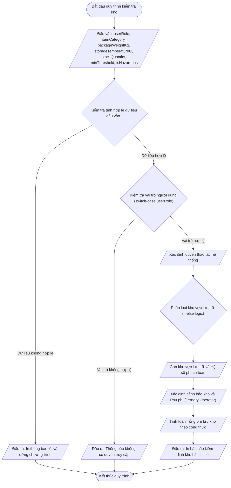

# <center>Thực Hành Lập Trình Logic Kiểm Tra Ràng Buộc Và Phân Loại Hàng Hóa Kho Bãi</center>

### **1. Mục tiêu**
- Vận dụng thành thạo cấu trúc điều kiện `if`, `else if`, `else` kết hợp toán tử logic (`&&`, `||`, `!`) để giải quyết bài toán phân loại khu vực lưu trữ phức tạp.
- Áp dụng cấu trúc rẽ nhánh nhiều trường hợp `switch-case` để phân quyền hạn người dùng và kiểm soát định tuyến truy cập hệ thống kho.
- Sử dụng toán tử ba ngôi (Ternary Operator) cho các quyết định gán giá trị ngắn gọn như cờ cảnh báo tồn kho và tính phụ phí hàng hóa.
- Thực hiện kiểm chuẩn dữ liệu đầu vào (Validation), xử lý các trường hợp ngoại lệ (giá trị âm, `NaN`, chuỗi rỗng) và định dạng chuỗi báo cáo chuyên nghiệp bằng Template Literals.

---

### **2. Bối cảnh & Vấn đề**
Một hệ thống Quản lý Kho hàng (Warehouse Management Subsystem) cho tập đoàn Logistics cần xử lý quy trình tiếp nhận lô hàng mới. Quy trình này đòi hỏi hệ thống phải kiểm tra tính đúng đắn của dữ liệu, xác minh quyền hạn nhân viên thao tác, tự động phân bổ lô hàng vào khu vực lưu trữ tối ưu dựa trên đặc tính vật lý và tính toán tổng phí xử lý kho bãi.

Hệ thống ghi nhận các thông tin đầu vào sơ cấp và yêu cầu bạn viết chương trình xử lý logic toàn bộ quy trình này.



---

### **3. Yêu cầu bài toán**
Viết mã nguồn JavaScript (chạy trong môi trường Node.js hoặc Cursor AI IDE) thực hiện đầy đủ các bước:

1. **Khai báo biến đầu vào:** Khai báo đầy đủ các biến kiểu nguyên thủy chứa thông tin kiểm định kho bãi.
2. **Kiểm chuẩn dữ liệu đầu vào (Validation):** Kiểm tra xem dữ liệu có hợp lệ hay không trước khi tính toán logic.
3. **Phân quyền người dùng (Switch-Case):** Phân loại quyền hạn của nhân viên nhập kho dựa trên `userRole`.
4. **Phân khu lưu trữ & Tính hệ số an toàn (If-Else & Logical Operators):** Xác định khu vực kho thích hợp và hệ số phí bảo quản.
5. **Đánh giá trạng thái & Tính phụ phí (Ternary Operator):** Xác định cờ cảnh báo tồn kho và phụ phí trọng tải.
6. **In báo cáo kiểm định:** Tổng hợp dữ liệu và in ra màn hình Console định dạng Template Literals chi tiết.

---

### **4. Quy tắc xử lý**

#### **Dữ liệu đầu vào**
<table border="1" style="width: 100%; border-collapse: collapse;">
  <thead>
    <tr style="background-color: #f2f2f2;">
      <th style="padding: 8px; text-align: left;">Tên biến</th>
      <th style="padding: 8px; text-align: left;">Kiểu dữ liệu</th>
      <th style="padding: 8px; text-align: left;">Mô tả</th>
    </tr>
  </thead>
  <tbody>
    <tr>
      <td style="padding: 8px;"><code>userRole</code></td>
      <td style="padding: 8px;">String</td>
      <td style="padding: 8px;">Vai trò người dùng: "WAREHOUSE_MANAGER "INVENTORY_CLERK "FORKLIFT_OPERATOR "AUDITOR"</td>
    </tr>
    <tr>
      <td style="padding: 8px;"><code>itemCategory</code></td>
      <td style="padding: 8px;">String</td>
      <td style="padding: 8px;">Phân loại mặt hàng: "CHEMICALS "PERISHABLES "ELECTRONICS "STANDARD"</td>
    </tr>
    <tr>
      <td style="padding: 8px;"><code>packageWeightKg</code></td>
      <td style="padding: 8px;">Number</td>
      <td style="padding: 8px;">Trọng lượng kiện hàng (kg)</td>
    </tr>
    <tr>
      <td style="padding: 8px;"><code>storageTemperatureC</code></td>
      <td style="padding: 8px;">Number</td>
      <td style="padding: 8px;">Nhiệt độ bảo quản yêu cầu (độ C)</td>
    </tr>
    <tr>
      <td style="padding: 8px;"><code>stockQuantity</code></td>
      <td style="padding: 8px;">Number</td>
      <td style="padding: 8px;">Số lượng hàng hiện có trong kho</td>
    </tr>
    <tr>
      <td style="padding: 8px;"><code>minThreshold</code></td>
      <td style="padding: 8px;">Number</td>
      <td style="padding: 8px;">Ngưỡng tồn kho tối thiểu an toàn</td>
    </tr>
    <tr>
      <td style="padding: 8px;"><code>isHazardous</code></td>
      <td style="padding: 8px;">Boolean</td>
      <td style="padding: 8px;">Cờ đánh dấu hàng nguy hiểm / dễ cháy nổ</td>
    </tr>
  </tbody>
</table>

#### **Yêu cầu 1: Kiểm chuẩn dữ liệu đầu vào (Validation)**
- Nếu `packageWeightKg` <= 0 hoặc là `NaN`, hoặc `stockQuantity` < 0 hoặc là `NaN`, hoặc `minThreshold` < 0 hoặc là `NaN`: In ra thông báo `[LỖI DỮ LIỆU] Thông số trọng lượng hoặc số lượng kho không hợp lệ!` và dừng chương trình.

#### **Yêu cầu 2: Phân quyền vai trò bằng `switch-case`**
<table border="1" style="width: 100%; border-collapse: collapse;">
  <thead>
    <tr style="background-color: #f2f2f2;">
      <th style="padding: 8px; text-align: left;">Giá trị userRole</th>
      <th style="padding: 8px; text-align: left;">Tên vai trò (roleTitle)</th>
      <th style="padding: 8px; text-align: left;">Quyền duyệt nhập kho (canApprove)</th>
    </tr>
  </thead>
  <tbody>
    <tr>
      <td style="padding: 8px;">"WAREHOUSE_MANAGER"</td>
      <td style="padding: 8px;">Quản lý Kho Bãi</td>
      <td style="padding: 8px;">true</td>
    </tr>
    <tr>
      <td style="padding: 8px;">"INVENTORY_CLERK"</td>
      <td style="padding: 8px;">Nhân viên Kiểm kê</td>
      <td style="padding: 8px;">true</td>
    </tr>
    <tr>
      <td style="padding: 8px;">"FORKLIFT_OPERATOR"</td>
      <td style="padding: 8px;">Nhân viên Vận hành Xe nâng</td>
      <td style="padding: 8px;">false</td>
    </tr>
    <tr>
      <td style="padding: 8px;">"AUDITOR"</td>
      <td style="padding: 8px;">Kiểm toán viên Độc lập</td>
      <td style="padding: 8px;">false</td>
    </tr>
    <tr>
      <td style="padding: 8px;">Khác (default)</td>
      <td style="padding: 8px;">Không xác định</td>
      <td style="padding: 8px;">false (Đồng thời in ra thông báo lỗi truy cập)</td>
    </tr>
  </tbody>
</table>

#### **Yêu cầu 3: Phân khu lưu trữ và Tính hệ số an toàn bằng `if-else`**
- **Khu vực Hóa chất & Cháy nổ (`ZONE_HAZMAT`):** Nếu `isHazardous === true` hoặc `itemCategory === "CHEMICALS"`. Hệ số an toàn `safetyMultiplier = 1.5`.
- **Khu vực Kho lạnh (`ZONE_COLD_STORAGE`):** Nếu không thuộc trường hợp trên, nhưng `itemCategory === "PERISHABLES"` và `storageTemperatureC < 4`. Hệ số an toàn `safetyMultiplier = 1.3`.
- **Khu vực Hàng quá khổ / Nặng (`ZONE_HEAVY_CARGO`):** Nếu không thuộc các trường hợp trên, nhưng `packageWeightKg > 100`. Hệ số an toàn `safetyMultiplier = 1.2`.
- **Khu vực Kho tiêu chuẩn (`ZONE_GENERAL_STORAGE`):** Các trường hợp còn lại. Hệ số an toàn `safetyMultiplier = 1.0`.

#### **Yêu cầu 4: Đánh giá bằng Toán tử ba ngôi (Ternary Operator)**
- **Phụ phí hàng nặng (`heavySurcharge`):** Nếu `packageWeightKg >= 50` thì tính phụ phí là `500000` VNĐ, ngược lại là `0` VNĐ.
- **Trạng thái cảnh báo tồn kho (`stockStatus`):** Nếu `stockQuantity <= minThreshold` thì gán `"CẢNH BÁO: TỒN KHO DƯỚI MỨC AN TOÀN - CẦN NHẬP BỔ SUNG"`, ngược lại gán `"TRẠNG THÁI KHO AN TOÀN"`.
- **Cờ cấp phép xử lý (`approvalTag`):** Nếu `canApprove === true` thì gán `"ĐỦ THẨM QUYỀN DUYỆT NỔI KHO"`, ngược lại gán `"CHỈ CÓ QUYỀN XEM / CHỜ QUẢN LÝ DUYỆT"`.

#### **Yêu cầu 5: Công thức tính toán chi phí**
- Phí xử lý cơ bản: `baseFee = packageWeightKg * 10000` (VNĐ)
- Tổng phí lưu kho: `totalFee = (baseFee * safetyMultiplier) + heavySurcharge` (VNĐ)

---

### **Mẫu Đầu Vào & Đầu Ra Chi Tiết**

#### **Trường hợp 1: Dữ liệu hợp lệ - Lô hàng hóa chất nguy hiểm**

```javascript
// Input
const userRole = "WAREHOUSE_MANAGER";
const itemCategory = "CHEMICALS";
const packageWeightKg = 65.5;
const storageTemperatureC = 25;
const stockQuantity = 80;
const minThreshold = 100;
const isHazardous = true;
```

```text
================ BÁO CÁO KIỂM ĐỊNH LÔ HÀNG NHẬP KHO ================
[THÔNG TIN NGƯỜI THAO TÁC]
- Vai trò: Quản lý Kho Bãi (WAREHOUSE_MANAGER)
- Cấp phép xử lý: ĐỦ THẨM QUYỀN DUYỆT NỔI KHO

[THÔNG TIN KIỂM ĐỊNH LÔ HÀNG]
- Phân loại mặt hàng: CHEMICALS
- Trọng lượng: 65.5 kg
- Nhiệt độ yêu cầu: 25 °C
- Đánh giá nguy hiểm: CÓ (Hazardous)

[PHÂN BỔ LƯU TRỮ & AN TOÀN]
- Khu vực lưu trữ ấn định: ZONE_HAZMAT
- Hệ số phí an toàn: 1.5
- Phụ phí trọng tải nặng: 500,000 VNĐ

[TÌNH TRẠNG KHO & CHI PHÍ]
- Trạng thái tồn kho: CẢNH BÁO: TỒN KHO DƯỚI MỨC AN TOÀN - CẦN NHẬP BỔ SUNG
- Phí xử lý cơ bản: 655,000 VNĐ
- TỔNG PHÍ LƯU KHO BÃI: 1,482,500 VNĐ
===================================================================
```

# **Trường hợp 2: Dữ liệu không hợp lệ - Trọng lượng âm**

```javascript
// Input
const userRole = "INVENTORY_CLERK";
const itemCategory = "STANDARD";
const packageWeightKg = -15;
const storageTemperatureC = 20;
const stockQuantity = 50;
const minThreshold = 20;
const isHazardous = false;
```

```text
[LỖI DỮ LIỆU] Thông số trọng lượng hoặc số lượng kho không hợp lệ!
Chương trình bị hủy bỏ do dữ liệu kiểm định vi phạm ràng buộc an toàn.
```

---

### **5. Yêu cầu nộp bài**
- Tạo thư mục mã nguồn và lưu tập tin chính có tên: `warehouse_logic.js`.
- Thực thi chương trình bằng lệnh `node warehouse_logic.js` trên Terminal của Cursor AI IDE để xác nhận kết quả.
- Đẩy toàn bộ mã nguồn lên kho chứa GitHub cá nhân và nộp liên kết Repository.
