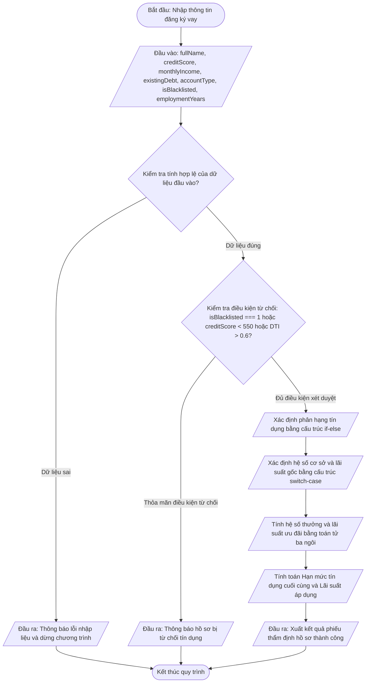

# <center>Thực Hành Lập Trình Logic Kiểm Tra Ràng Buộc Và Phân Loại Hồ Sơ Tín Dụng Tự Động Trong Hệ Thống Fintech</center>

### **1. Mục tiêu**
- Vận dụng thành thạo cấu trúc điều kiện `if`, `else if`, `else` để giải quyết các luồng kiểm định ràng buộc nghiệp vụ tài chính đa tầng.
- Áp dụng cấu trúc rẽ nhánh `switch-case` để phân loại nhóm tài khoản và xác định hệ số tín dụng cơ sở.
- Sử dụng toán tử điều kiện ba ngôi (Ternary Operator) để thực hiện tính toán ngắn gọn các mức chiết khấu lãi suất và hệ số thưởng thâm niên.
- Tích hợp các toán tử logic (`&&`, `||`, `!`) và toán tử so sánh nghiêm ngặt (`===`, `!==`) nhằm tối ưu hoá kiểm chuẩn dữ liệu đầu vào và ngăn chặn gian lận.
- Định dạng và xuất kết quả thẩm định hoàn chỉnh bằng chuỗi Template Literals trên không gian thực thi của trình duyệt / Node.js Runtime.

---

### **2. Bối cảnh & Vấn đề**
Trong phân hệ quản trị rủi ro của một nền tảng Fintech, việc thẩm định hồ sơ vay vốn tự động đòi hỏi quy trình xử lý chính xác, minh bạch và tuân thủ các quy định tài chính nghiêm ngặt. Hệ thống cần tiếp nhận các chỉ số tài chính của khách hàng, thực hiện kiểm tra tính hợp lệ của dữ liệu, phân loại nhóm nguy cơ, tính toán hạn mức phê duyệt tối đa và xác định mức lãi suất cho vay phù hợp.

Dưới đây là sơ đồ dòng dữ liệu (Data Flowchart) thể hiện toàn bộ tiến trình xử lý nghiệp vụ thẩm định hồ sơ tín dụng:



---

### **3. Yêu cầu bài toán**

Viết chương trình JavaScript Vanilla (ES6+) thực thi luồng logic kiểm tra ràng buộc và phân loại người dùng theo các thông số kỹ thuật được mô tả chi tiết dưới đây.

#### **3.1. Danh mục dữ liệu đầu vào**

<table border="1" style="width: 100%; border-collapse: collapse;">
  <thead>
    <tr style="background-color: #f2f2f2;">
      <th style="padding: 8px; text-align: left;">Tên biến (Identifier)</th>
      <th style="padding: 8px; text-align: left;">Kiểu dữ liệu</th>
      <th style="padding: 8px; text-align: left;">Mô tả chi tiết</th>
      <th style="padding: 8px; text-align: left;">Miền giá trị hợp lệ</th>
    </tr>
  </thead>
  <tbody>
    <tr>
      <td style="padding: 8px;"><code>fullName</code></td>
      <td style="padding: 8px;">String</td>
      <td style="padding: 8px;">Họ và tên khách hàng đăng ký</td>
      <td style="padding: 8px;">Chuỗi không rỗng</td>
    </tr>
    <tr>
      <td style="padding: 8px;"><code>creditScore</code></td>
      <td style="padding: 8px;">Number</td>
      <td style="padding: 8px;">Điểm tín dụng CIC của khách hàng</td>
      <td style="padding: 8px;">Từ 300 đến 850</td>
    </tr>
    <tr>
      <td style="padding: 8px;"><code>monthlyIncome</code></td>
      <td style="padding: 8px;">Number</td>
      <td style="padding: 8px;">Thu nhập bình quân hàng tháng (VNĐ)</td>
      <td style="padding: 8px;">Số thực >= 0</td>
    </tr>
    <tr>
      <td style="padding: 8px;"><code>existingDebt</code></td>
      <td style="padding: 8px;">Number</td>
      <td style="padding: 8px;">Dư nợ hiện tại tại các tổ chức tín dụng (VNĐ)</td>
      <td style="padding: 8px;">Số thực >= 0</td>
    </tr>
    <tr>
      <td style="padding: 8px;"><code>accountType</code></td>
      <td style="padding: 8px;">Number</td>
      <td style="padding: 8px;">Loại tài khoản (1: Cá nhân, 2: Dịch vụ kinh doanh, 3: Doanh nghiệp)</td>
      <td style="padding: 8px;">Nhận giá trị 1, 2 hoặc 3</td>
    </tr>
    <tr>
      <td style="padding: 8px;"><code>isBlacklisted</code></td>
      <td style="padding: 8px;">Number / Boolean</td>
      <td style="padding: 8px;">Cờ đánh dấu danh sách nợ xấu (1: Có nợ xấu, 0: Không)</td>
      <td style="padding: 8px;">Nhận giá trị 0 hoặc 1</td>
    </tr>
    <tr>
      <td style="padding: 8px;"><code>employmentYears</code></td>
      <td style="padding: 8px;">Number</td>
      <td style="padding: 8px;">Số năm làm việc liên tục / thâm niên hoạt động</td>
      <td style="padding: 8px;">Số thực >= 0</td>
    </tr>
  </tbody>
</table>

---

### **4. Quy tắc xử lý**

Chương trình phải tuân thủ nghiêm ngặt quy trình tính toán và kiểm tra logic theo 4 bước độc lập:

#### **Bước 1: Kiểm chuẩn tính hợp lệ của dữ liệu (Data Validation)**
- Yêu cầu 1: Kiểm tra xem các biến có chứa giá trị không hợp lệ (ví dụ: `isNaN`, âm đối với thu nhập/dư nợ/thâm niên, `creditScore` ngoài khoảng `[300, 850]`, hoặc `accountType` không thuộc `{1, 2, 3}`).
- Nếu phát hiện dữ liệu lỗi, thông báo ngay: `Lỗi: Dữ liệu đầu vào không hợp lệ. Vui lòng kiểm tra lại!` và kết thúc chương trình.

#### **Bước 2: Thẩm định điều kiện từ chối vay (Risk Assessment & Rejection)**
- Tính tỷ lệ nợ trên thu nhập (Debt-to-Income Ratio - DTI):
  `- Công thức DTI: DTI = existingDebt / monthlyIncome`
- Hồ sơ bị **TỪ CHỐI TÍN DỤNG** ngay lập tức nếu vi phạm một trong các điều kiện sau:
  - `isBlacklisted === 1`
  - `creditScore < 550`
  - `DTI > 0.6` (Dư nợ vượt quá 60% thu nhập hàng tháng)
- Nếu bị từ chối, xuất lý do cụ thể và dừng chương trình.

#### **Bước 3: Phân loại tín dụng và Xác định chỉ số ưu đãi**
Nguồn lực tín dụng và lãi suất được quyết định dựa trên tổ hợp phân hạng tín dụng và loại tài khoản:

- **Xác định Phân hạng Tín dụng (Credit Tier)** (Sử dụng `if - else if - else`):
  - `creditScore >= 750`: Phân hạng `"Platinum"`
  - `creditScore >= 680` và `< 750`: Phân hạng `"Gold"`
  - `creditScore >= 600` và `< 680`: Phân hạng `"Silver"`
  - `creditScore < 600`: Phân hạng `"Standard"`

- **Xác định Hệ số vay cơ sở (baseMultiplier) và Lãi suất gốc (baseRate)** (Bắt buộc dùng `switch-case` trên `accountType`):
  - `case 1` (Tài khoản Cá nhân): `baseMultiplier = 5`, `baseRate = 12.0` (%/năm)
  - `case 2` (Tài khoản Dịch vụ kinh doanh): `baseMultiplier = 8`, `baseRate = 10.5` (%/năm)
  - `case 3` (Tài khoản Doanh nghiệp): `baseMultiplier = 12`, `baseRate = 8.5` (%/năm)
  - `default`: Gán giá trị mặc định an toàn.

- **Tính Hệ số thưởng thâm niên (bonusMultiplier)** (Bắt buộc dùng toán tử ba ngôi `Ternary Operator`):
  `- Nếu employmentYears >= 3 thì bonusMultiplier = 1.25, ngược lại bonusMultiplier = 1.0`

- **Tính Mức giảm lãi suất ưu đãi (discountRate)** (Bắt buộc dùng toán tử ba ngôi `Ternary Operator` kết hợp):
  - Hạng `"Platinum"` được giảm `2.0`%/năm.
  - Hạng `"Gold"` được giảm `1.0`%/năm.
  - Hạng `"Silver"` được giảm `0.5`%/năm.
  - Hạng `"Standard"` giảm `0.0`%/năm.

#### **Bước 4: Tính toán Hạn mức tín dụng và Lãi suất thực tế**
- **Tính Hạn mức tín dụng tối đa (maxLoanLimit)**:
  `- Công thức hạn mức cơ sở: baseLimit = monthlyIncome * baseMultiplier * bonusMultiplier`
  `- Công thức hạn mức phê duyệt: maxLoanLimit = baseLimit - (existingDebt * 0.3)`
  - **Cảnh báo:** Nếu `maxLoanLimit < 0` thì gán `maxLoanLimit = 0`.

- **Tính Lãi suất thực tế (finalInterestRate)**:
  `- Công thức lãi suất: finalInterestRate = baseRate - discountRate`

---

#### **4.1. Ví dụ Minh họa Đầu vào và Đầu ra (Input/Output Examples)**

**Kịch bản 1: Hồ sơ đạt chuẩn phân hạng Platinum**
- Input:

```javascript
const fullName = "Nguyen Van A";
const creditScore = 780;
const monthlyIncome = 45000000; // 45 triệu VNĐ
const existingDebt = 5000000;    // 5 triệu VNĐ
const accountType = 1;           // Cá nhân
const isBlacklisted = 0;
const employmentYears = 4;
```

- Output trên Console:

```text
==================================================
        PHIẾU THẨM ĐỊNH HẠN MỨC TÍN DỤNG FINTECH
==================================================
Khách hàng: NGUYEN VAN A
Tình trạng hồ sơ: ĐƯỢC PHÊ DUYỆT
Phân hạng tín dụng: Platinum
Tỷ lệ DTI: 11.11%
--------------------------------------------------
Hạn mức tín dụng tối đa: 279,750,000 VNĐ
Lãi suất áp dụng: 10.00% / năm
==================================================
```

**Kịch bản 2: Hồ sơ bị từ chối do DTI cao và điểm tín dụng thấp**
- Input:

```javascript
const fullName = "Tran Van B";
const creditScore = 520;
const monthlyIncome = 20000000; // 20 triệu VNĐ
const existingDebt = 15000000;   // 15 triệu VNĐ (DTI = 75%)
const accountType = 2;
const isBlacklisted = 0;
const employmentYears = 1;
```

- Output trên Console:

```text
==================================================
        PHIẾU THẨM ĐỊNH HẠN MỨC TÍN DỤNG FINTECH
==================================================
Khách hàng: TRAN VAN B
Tình trạng hồ sơ: BỊ TỪ CHỐI
Lý do: Điểm tín dụng không đủ điều kiện (520 < 550) hoặc Tỷ lệ DTI vượt ngưỡng cho phép (75.00% > 60.00%).
==================================================
```

---

### **5. Yêu cầu nộp bài**
- Mã nguồn viết bằng JavaScript Vanilla (`script.js` hoặc chạy trực tiếp trong tệp `index.html`).
- Tạo kho lưu trữ (Repository) trên GitHub với cấu trúc chuẩn:

```text
  fintech-credit-checker/
  ├── index.html
  └── script.js
```

- Cam kết mã nguồn lên nhánh `main` với thông điệp: `feat: implement fintech credit validation logic`.
- Nộp liên kết tệp mã nguồn GitHub công khai (.js) lên hệ thống quản lý học tập.
