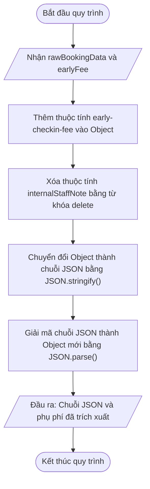

# <center>[Vận dụng cơ bản 2] Khắc phục lỗi cập nhật thông tin và đóng gói JSON đơn đặt phòng</center>

### **1. Mục tiêu**
*   **Vận dụng thao tác dữ liệu trên Object:** Thực hành thêm, sửa và xóa hoàn toàn thuộc tính của Object Literal trong JavaScript bằng cú pháp chuẩn (`delete`).
*   **Thao tác với thuộc tính động:** Đọc và ghi thuộc tính chứa ký tự đặc biệt (dấu gạch ngang) thông qua cú pháp Bracket Notation (`obj["key-name"]`).
*   **Xử lý và chuyển đổi JSON:** Sử dụng thành thạo `JSON.stringify()` để đóng gói đối tượng thành chuỗi JSON và `JSON.parse()` để giải mã chuỗi JSON thành đối tượng.
*   **Phân tích và khắc phục lỗi logic:** Trích xuất thông tin chính xác từ chuỗi dữ liệu đã giải mã thay vì truy xuất trực tiếp trên chuỗi JSON chưa được chuyển đổi.

### **2. Bối cảnh & Vấn đề**
Trong phân hệ quản lý đơn đặt phòng của ứng dụng đặt khách sạn & homestay, khi người dùng thực hiện xác nhận đặt phòng, hệ thống cần tiến hành chuẩn hóa thông tin dữ liệu trước khi gửi về bộ phận lưu trữ.

Quy trình chuẩn hóa bao gồm:
1. Thêm phụ phí check-in sớm với tên thuộc tính là `"early-checkin-fee"`.
2. Xóa bỏ trường thông tin tạm thời `internalStaffNote` (ghi chú nội bộ của nhân viên) nhằm bảo mật dữ liệu trước khi xuất bản.
3. Chuyển đổi toàn bộ thông tin đơn đặt phòng thành chuỗi chuẩn JSON.
4. Đọc lại giá trị phụ phí check-in sớm từ dữ liệu JSON đã đóng gói để hiển thị tóm tắt lên màn hình xác nhận của khách hàng.

Bộ phận vận hành hệ thống phát hiện hai sự cố phát sinh từ đoạn mã xử lý hiện tại:
*   [Báo cáo 1]: Thông tin ghi chú nội bộ `internalStaffNote` vẫn còn tồn tại trong bộ nhớ đối tượng gốc, gây lãng phí tài nguyên và có rủi ro rò rỉ dữ liệu khi thao tác trực tiếp với đối tượng trước khi chuyển đổi.
*   [Báo cáo 2]: Màn hình hiển thị tóm tắt phụ phí check-in sớm luôn trả về giá trị `undefined` thay vì số tiền thực tế.

### **3. Mã nguồn hiện tại**
Dưới đây là đoạn mã nguồn JavaScript đang được triển khai trên hệ thống:

```javascript
// Hàm xử lý và đóng gói dữ liệu đơn đặt phòng
function processBookingPayload(rawBookingData, earlyFee) {
    // Bước 1: Cập nhật phụ phí check-in sớm vào đối tượng đặt phòng
    rawBookingData["early-checkin-fee"] = earlyFee;

    // Bước 2: Dọn dẹp trường thông tin tạm thời của nhân viên
    rawBookingData.internalStaffNote = undefined;

    // Bước 3: Đóng gói đối tượng đặt phòng thành chuỗi JSON
    const jsonPayload = JSON.stringify(rawBookingData);

    // Bước 4: Trích xuất phụ phí check-in sớm từ chuỗi JSON để trả về giao diện
    const feeValue = jsonPayload["early-checkin-fee"];

    return {
        jsonPayload: jsonPayload,
        extractedFee: feeValue
    };
}

// Chạy thử nghiệm hệ thống với một đơn đặt phòng mẫu
const sampleBooking = {
    bookingId: "BK-2026-8899",
    guestName: "Nguyễn Văn An",
    roomType: "Deluxe Ocean View",
    internalStaffNote: "Khách hàng yêu cầu phòng tầng cao xa thang máy"
};

const result = processBookingPayload(sampleBooking, 300000);
console.log("Chuỗi JSON gửi lưu trữ:", result.jsonPayload);
console.log("Giá trị phụ phí hiển thị:", result.extractedFee);
```

# **4. Yêu cầu bài toán**

#### **Luồng xử lý dữ liệu chuẩn (Mermaid Flowchart)**



# **Phần 1: Báo cáo phân tích vết lỗi (Test Case Report Table)**
Học viên tiến hành đọc mã nguồn, tìm dòng code gây ra lỗi và hoàn thành bảng phân tích 3 trường hợp thử nghiệm theo mẫu dưới đây. Dòng 1 đã được điền mẫu:

<table style="width: 100%; min-width: 100%; display: table; border-collapse: collapse;" width="100%" border="1" cellPadding="6" cellSpacing="0">
  <thead>
    <tr style="background-color: #f2f2f2;">
      <th style="text-align: center;">STT</th>
      <th style="text-align: center;">Input (Dữ liệu đầu vào)</th>
      <th style="text-align: center;">Buggy Output (Đầu ra lỗi)</th>
      <th style="text-align: center;">Expected Output (Đầu ra kỳ vọng)</th>
      <th style="text-align: center;">Dòng code gây lỗi</th>
      <th style="text-align: center;">Nguyên nhân & Giải thích logic</th>
    </tr>
  </thead>
  <tbody>
    <tr>
      <td style="text-align: center;">1</td>
      <td>
        <code>rawBookingData</code> = { bookingId: "BK-101 internalStaffNote: "Cần nôi trẻ em" }<br>
        <code>earlyFee</code> = 300000
      </td>
      <td>
        <code>extractedFee</code>: <code>undefined</code><br>
        <code>internalStaffNote</code> trong Object gốc vẫn tồn tại với giá trị <code>undefined</code>
      </td>
      <td>
        <code>extractedFee</code>: 300000<br>
        Thuộc tính <code>internalStaffNote</code> bị xóa hoàn toàn khỏi Object gốc bằng từ khóa <code>delete</code>
      </td>
      <td style="text-align: center;">Dòng 6 & Dòng 12</td>
      <td>
        - Dòng 6: Gán <code>undefined</code> không loại bỏ key ra khỏi bộ nhớ của Object gốc.<br>
        - Dòng 12: Trực tiếp dùng Bracket Notation trên chuỗi JSON (String) khiến giá trị trả về bị <code>undefined</code>.
      </td>
    </tr>
    <tr>
      <td style="text-align: center;">2</td>
      <td>
        <code>rawBookingData</code> = { bookingId: "BK-102 internalStaffNote: "Khách dị ứng hải sản" }<br>
        <code>earlyFee</code> = 150000
      </td>
      <td>...</td>
      <td>...</td>
      <td style="text-align: center;">...</td>
      <td>...</td>
    </tr>
    <tr>
      <td style="text-align: center;">3</td>
      <td>
        <code>rawBookingData</code> = { bookingId: "BK-103 internalStaffNote: "Thanh toán qua thẻ" }<br>
        <code>earlyFee</code> = 0
      </td>
      <td>...</td>
      <td>...</td>
      <td style="text-align: center;">...</td>
      <td>...</td>
    </tr>
  </tbody>
</table>

#### **Phần 2: Mã nguồn đã khắc phục**
Học viên viết lại đoạn mã nguồn JavaScript chuẩn hóa, đáp ứng các tiêu chuẩn nghiệp vụ:
1. Sử dụng từ khóa `delete` để xóa triệt để thuộc tính `internalStaffNote` khỏi đối tượng.
2. Đóng gói đối tượng thành chuỗi JSON bằng `JSON.stringify()`.
3. Giải mã chuỗi JSON thành đối tượng mới bằng `JSON.parse()` trước khi trích xuất giá trị thuộc tính `"early-checkin-fee"`.
4. Bổ sung kiểm tra dữ liệu đầu vào (đảm bảo `rawBookingData` là một đối tượng hợp lệ và `earlyFee` là số không âm).

### **5. Yêu cầu nộp bài**
Học viên cần nộp:
*   Phần phân tích/báo cáo và mã nguồn triển khai.
*   Đẩy mã nguồn lên GitHub theo định dạng thư mục: [Tên Lớp]_[Môn Học]_Session12_Ex2.
    Ví dụ: HNKS25CNTT1_Core_Session12_Ex2
