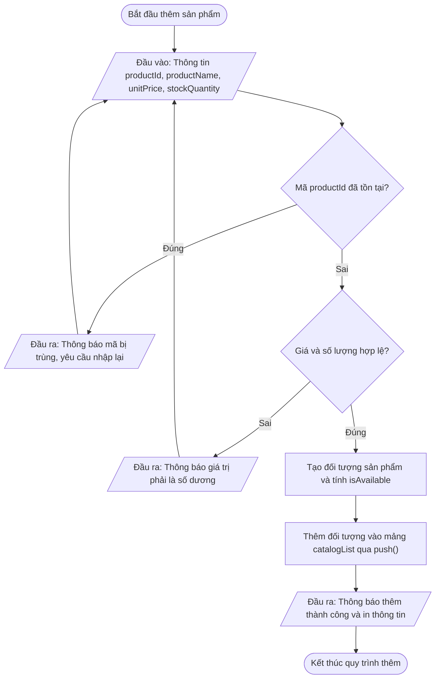
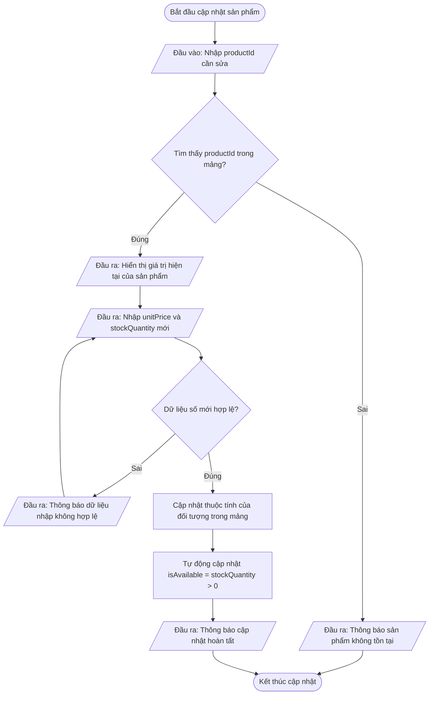
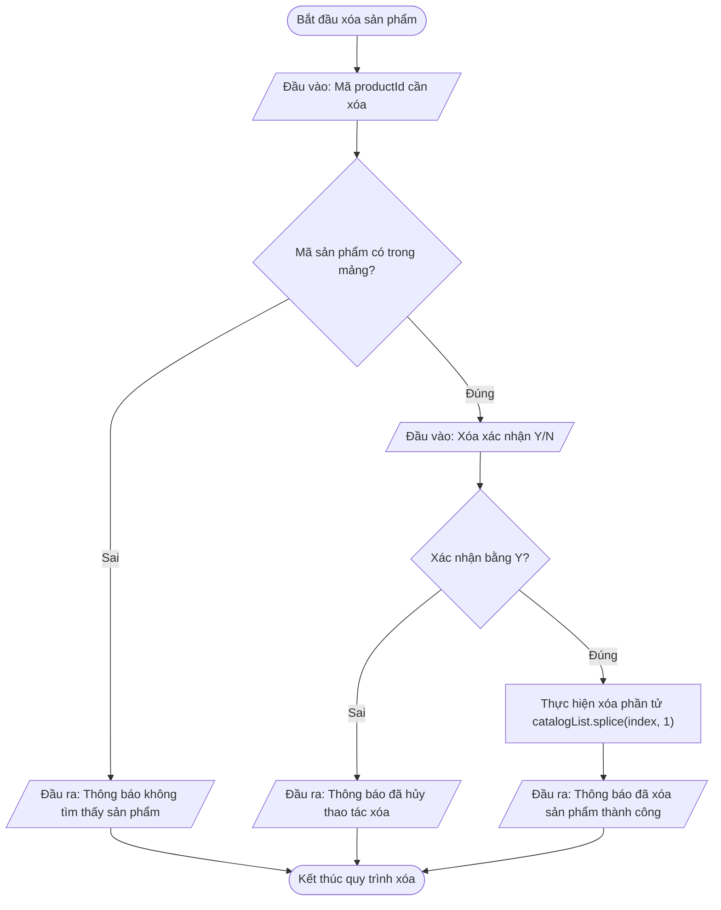
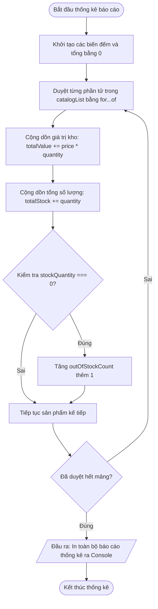

# <center>Tài liệu đặc tả Hệ thống Ứng dụng Quản lý Danh mục Bán hàng Console (Sales Catalog Management Console Application)</center>

### **1. Tổng quan hệ thống**

Hệ thống **Ứng dụng Quản lý Danh mục Bán hàng Console (Sales Catalog Management Console Application - Phần 1)** là ứng dụng quản lý dữ liệu bán hàng chạy trên môi trường dòng lệnh (Console Runtime / Terminal / Browser Console). Hệ thống được thiết kế nhằm mục đích cung cấp công cụ quản lý kho hàng và sản phẩm tinh gọn, giúp nhân viên vận hành thực hiện các thao tác thêm, sửa, xóa, tìm kiếm, lọc và thống kê danh mục sản phẩm hoàn toàn trên bộ nhớ đệm (In-Memory Array Data Store).

Phần 1 của dự án tập trung vào việc ứng dụng nền tảng lập trình JavaScript ES6+ cơ bản: quản lý biến đếm, thao tác mảng đối tượng (`Array of Objects`), duyệt mảng bằng vòng lặp (`for`, `for...of`, `while`), rẽ nhánh logic (`if-else`, `switch-case`, toán tử ba ngôi) và thực thi luồng tương tác người dùng qua menu điều khiển Console.

---

### **2. Đặc tả chức năng (Functional Requirements)**

#### **2.1. Bảng tổng hợp chức năng hệ thống**

<table style="width: 100%; min-width: 100%; display: table; border-collapse: collapse;" border="1" cellSpacing="0" cellPadding="8">
  <thead>
    <tr style="background-color: #f2f2f2; text-align: left;">
      <th style="width: 8%;">STT</th>
      <th style="width: 25%;">Tên chức năng / Mã khối xử lý</th>
      <th style="width: 42%;">Mô tả chi tiết nghiệp vụ</th>
      <th style="width: 25%;">Dữ liệu đầu vào / đầu ra</th>
    </tr>
  </thead>
  <tbody>
    <tr>
      <td>1</td>
      <td><b>Khởi tạo & Hiển thị Menu điều khiển</b><br><code>initMainMenuLoop</code></td>
      <td>Hiển thị menu tương tác Console dạng danh sách lựa chọn (1-8). Duyệt luồng nhập từ người dùng bằng vòng lặp <code>while (true)</code> và rẽ nhánh thực thi qua <code>switch-case</code>.</td>
      <td><b>Input:</b> Lựa chọn menu (String/Number)<br><b>Output:</b> Giao diện menu Console</td>
    </tr>
    <tr>
      <td>2</td>
      <td><b>Xem toàn bộ danh mục sản phẩm</b><br><code>displayCatalogList</code></td>
      <td>Duyệt qua mảng đối tượng sản phẩm <code>catalogList</code> bằng vòng lặp <code>for...of</code>. Xuất danh sách sản phẩm dạng bảng văn bản với định dạng Template Literals.</td>
      <td><b>Input:</b> Mảng <code>catalogList</code><br><b>Output:</b> Danh sách sản phẩm in ra Console</td>
    </tr>
    <tr>
      <td>3</td>
      <td><b>Thêm mới sản phẩm vào danh mục</b><br><code>addProductToCatalog</code></td>
      <td>Thu thập thông tin sản phẩm (mã, tên, danh mục, giá, số lượng), kiểm tra trùng lặp mã <code>productId</code>, ép kiểu dữ liệu số và đẩy đối tượng mới vào mảng với phương thức <code>push()</code>.</td>
      <td><b>Input:</b> <code>productId</code>, <code>productName</code>, <code>categoryName</code>, <code>unitPrice</code>, <code>stockQuantity</code><br><b>Output:</b> Sản phẩm mới trong mảng</td>
    </tr>
    <tr>
      <td>4</td>
      <td><b>Tìm kiếm sản phẩm theo mã hoặc tên</b><br><code>searchProductCatalog</code></td>
      <td>Duyệt mảng đối tượng sản phẩm, khớp chính xác <code>productId</code> hoặc tìm tương đối chuỗi <code>productName</code>. Hiển thị thông tin chi tiết nếu tìm thấy.</td>
      <td><b>Input:</b> Từ khóa tìm kiếm <code>searchKeyword</code><br><b>Output:</b> Đối tượng tìm thấy / Thông báo không thấy</td>
    </tr>
    <tr>
      <td>5</td>
      <td><b>Cập nhật thông tin sản phẩm</b><br><code>updateProductDetails</code></td>
      <td>Tìm vị trí chỉ số (index) của sản phẩm trong mảng qua <code>productId</code>. Cho phép sửa <code>unitPrice</code>, <code>stockQuantity</code> và tự động cập nhật trạng thái <code>isAvailable</code>.</td>
      <td><b>Input:</b> <code>productId</code>, giá trị mới<br><b>Output:</b> Đối tượng sản phẩm cập nhật</td>
    </tr>
    <tr>
      <td>6</td>
      <td><b>Xóa sản phẩm khỏi danh mục</b><br><code>deleteProductFromCatalog</code></td>
      <td>Xác định chỉ số sản phẩm cần xóa trong mảng <code>catalogList</code>. Thực hiện xóa phần tử khỏi mảng bằng phương thức <code>splice(index, 1)</code> sau khi người dùng xác nhận.</td>
      <td><b>Input:</b> <code>productId</code> xác nhận xóa<br><b>Output:</b> Mảng <code>catalogList</code> đã xóa phần tử</td>
    </tr>
    <tr>
      <td>7</td>
      <td><b>Lọc sản phẩm theo danh mục / giá</b><br><code>filterProductsByCriteria</code></td>
      <td>Lặp qua mảng sản phẩm, kiểm tra điều kiện rẽ nhánh <code>if</code> để lọc các sản phẩm có <code>categoryName</code> trùng khớp hoặc nằm trong khoảng giá <code>[minPrice, maxPrice]</code>.</td>
      <td><b>Input:</b> Tiêu chí lọc (Category / Price range)<br><b>Output:</b> Tập hợp sản phẩm thỏa điều kiện</td>
    </tr>
    <tr>
      <td>8</td>
      <td><b>Thống kê tổng quan danh mục</b><br><code>calculateCatalogStatistics</code></td>
      <td>Duyệt mảng để tính tổng số lượng tồn kho (sum of <code>stockQuantity</code>), tổng giá trị hàng hóa tồn kho (sum of <code>unitPrice * stockQuantity</code>), và đếm số sản phẩm đã hết hàng.</td>
      <td><b>Input:</b> Mảng <code>catalogList</code><br><b>Output:</b> Báo cáo số liệu thống kê in ra Console</td>
    </tr>
  </tbody>
</table>

---

#### **2.2. Chi tiết các luồng xử lý nghiệp vụ chính**

##### **2.2.1. Chức năng 1: Xem toàn bộ & Thêm mới sản phẩm (`addProductToCatalog`)**
- **Quy tắc nghiệp vụ:**
  1. Yêu cầu nhập <code>productId</code>. Sử dụng vòng lặp kiểm tra trùng lặp với danh sách hiện có. Nếu trùng, yêu cầu nhập lại.
  2. Yêu cầu nhập <code>productName</code> và <code>categoryName</code> (không được để trống).
  3. Yêu cầu nhập <code>unitPrice</code> (bắt buộc là số dương `> 0`) và <code>stockQuantity</code> (số nguyên `>= 0`).
  4. Thuộc tính <code>isAvailable</code> tự động tính bằng biểu thức logic: `stockQuantity > 0`.
  5. Đẩy đối tượng hoàn chỉnh vào mảng `catalogList` bằng `.push()`.

##### **Sơ đồ 2.1: Luồng nghiệp vụ Thêm sản phẩm mới**



# **Bộ kiểm thử mẫu (Mock I/O Test Case) - Chức năng Thêm mới sản phẩm:**

```text
=== KỊCH BẢN KIỂM THỬ: THÊM SẢN PHẨM THÀNH CÔNG ===
[Đầu vào (Console Inputs)]:
- productId: "PROD-004"
- productName: "Bàn phím cơ Không dây"
- categoryName: "Phụ kiện"
- unitPrice: 1250000
- stockQuantity: 15

[Kết quả kỳ vọng (Expected Console Output)]:
=> [THÀNH CÔNG] Đã thêm sản phẩm PROD-004 vào danh mục!
=> Chi tiết: Bàn phím cơ Không dây | Danh mục: Phụ kiện | Giá: 1,250,000 VNĐ | Tồn kho: 15 | Trạng thái: Đang bán

=== KỊCH BẢN XỬ LÝ LỖI (EDGE CASE): TRÙNG MÃ SẢN PHẨM ===
[Đầu vào (Console Inputs)]:
- productId: "PROD-001" (Đã tồn tại trong catalogList)

[Kết quả xử lý lỗi (Expected Error Behavior)]:
=> [LỖI DỮ LIỆU] Mã sản phẩm 'PROD-001' đã tồn tại trong hệ thống. Vui lòng thử lại với mã khác!
```

---

##### **2.2.2. Chức năng 2: Tìm kiếm và Cập nhật sản phẩm (`updateProductDetails`)**
- **Quy tắc nghiệp vụ:**
  1. Người dùng nhập <code>productId</code> cần chỉnh sửa.
  2. Duyệt mảng bằng vòng lặp `for` để tìm vị trí `index` tương ứng.
  3. Nếu không tìm thấy (`index === -1`), xuất thông báo lỗi và quay lại menu chính.
  4. Nếu tìm thấy, hiển thị thông tin hiện tại và yêu cầu nhập `unitPrice` mới cùng `stockQuantity` mới.
  5. Cập nhật trực tiếp các thuộc tính của đối tượng tại chỉ số mảng đã tìm được.

##### **Sơ đồ 2.2: Luồng nghiệp vụ Cập nhật thông tin sản phẩm**



# **Bộ kiểm thử mẫu (Mock I/O Test Case) - Chức năng Cập nhật sản phẩm:**

```text
=== KỊCH BẢN KIỂM THỬ: CẬP NHẬT THÀNH CÔNG ===
[Đầu vào (Console Inputs)]:
- productId: "PROD-002"
- unitPrice mới: 18500000
- stockQuantity mới: 0

[Kết quả kỳ vọng (Expected Console Output)]:
=> [THÀNH CÔNG] Đã cập nhật sản phẩm PROD-002!
=> Trạng thái mới: Giá: 18,500,000 VNĐ | Tồn kho: 0 | Trạng thái: Hết hàng

=== KỊCH BẢN XỬ LÝ LỖI (EDGE CASE): SỐ LƯỢNG NGUYÊN ÂM ===
[Đầu vào (Console Inputs)]:
- stockQuantity mới: -5

[Kết quả xử lý lỗi (Expected Error Behavior)]:
=> [LỖI XÁC THỰC] Số lượng tồn kho không được là số âm (-5). Thao tác cập nhật bị hủy!
```

---

##### **2.2.3. Chức năng 3: Xóa sản phẩm khỏi danh mục (`deleteProductFromCatalog`)**
- **Quy tắc nghiệp vụ:**
  1. Người dùng nhập <code>productId</code> cần xóa.
  2. Duyệt qua mảng để xác định chỉ số `targetIndex`.
  3. Nếu không tìm thấy, hiển thị thông báo lỗi.
  4. Nếu tìm thấy, thực hiện xác nhận thao tác (Y/N). Nếu chọn 'Y', gọi `catalogList.splice(targetIndex, 1)`.

##### **Sơ đồ 2.3: Luồng nghiệp vụ Xóa sản phẩm**



# **Bộ kiểm thử mẫu (Mock I/O Test Case) - Chức năng Xóa sản phẩm:**

```text
=== KỊCH BẢN KIỂM THỬ: XÓA SẢN PHẨM THÀNH CÔNG ===
[Đầu vào (Console Inputs)]:
- productId: "PROD-003"
- confirmChoice: "Y"

[Kết quả kỳ vọng (Expected Console Output)]:
=> [XÁC NHẬN] Bạn có chắc chắn muốn xóa sản phẩm PROD-003 (Chuột Máy Tính)? (Y/N): Y
=> [THÀNH CÔNG] Đã xóa thành công sản phẩm PROD-003 khỏi danh mục!

=== KỊCH BẢN XỬ LÝ LỖI (EDGE CASE): SẢN PHẨM KHÔNG TỒN TẠI ===
[Đầu vào (Console Inputs)]:
- productId: "PROD-999"

[Kết quả xử lý lỗi (Expected Error Behavior)]:
=> [LỖI TÌM KIẾM] Không tìm thấy sản phẩm có mã 'PROD-999' trong hệ thống.
```

---

##### **2.2.4. Chức năng 4: Thống kê báo cáo danh mục (`calculateCatalogStatistics`)**
- **Quy tắc nghiệp vụ:**
  1. Khởi tạo các biến tích lũy: `totalProducts = catalogList.length`, `totalInventoryValue = 0`, `totalStockCount = 0`, `outOfStockCount = 0`.
  2. Duyệt qua mảng bằng `for...of`.
  3. Với mỗi sản phẩm: cộng dồn `stockQuantity` vào `totalStockCount`; cộng `(unitPrice * stockQuantity)` vào `totalInventoryValue`.
  4. Nếu `stockQuantity === 0`, tăng `outOfStockCount` thêm 1.
  5. Xuất báo cáo tổng hợp chuẩn định dạng ra Console.

##### **Sơ đồ 2.4: Luồng nghiệp vụ Thống kê báo cáo danh mục**



# **Bộ kiểm thử mẫu (Mock I/O Test Case) - Chức năng Thống kê:**

```text
=== KỊCH BẢN KIỂM THỬ: BÁO CÁO THỐNG KÊ DANH MỤC ===
[Đầu vào (Mảng dữ liệu catalogList hiện tại)]:
- 3 sản phẩm (Laptop: 5 cái * 20 tr, Điện thoại: 0 cái * 15 tr, Phụ kiện: 10 cái * 500k)

[Kết quả kỳ vọng (Expected Console Output)]:
==================================================
        BÁO CÁO THỐNG KÊ DANH MỤC BÁN HÀNG
==================================================
- Tổng số loại sản phẩm: 3
- Tổng số lượng sản phẩm tồn kho: 15 cái
- Tổng giá trị tài sản kho hàng: 105,000,000 VNĐ
- Số lượng sản phẩm đã hết hàng: 1 sản phẩm
==================================================
```

---

### **3. Đặc tả phi chức năng (Non-Functional Requirements)**

1. **Hiệu năng & Tốc độ xử lý (Performance):**
   - Thời gian phản hồi cho mọi thao tác tìm kiếm, lọc, thống kê trên mảng dữ liệu (quy mô nhỏ hơn 1.000 sản phẩm) phải hoàn tất dưới `50ms`.
   - Vòng lặp tương tác Menu Console không được gây hiện tượng treo hoặc lặp vô tận không có điểm dừng (`infinite loop without break condition`).

2. **Giao diện dòng lệnh & Trải nghiệm người dùng (CLI Usability):**
   - Toàn bộ output trên Console phải được căn chỉnh lề rõ ràng bằng Template Literals, kẻ bảng phân cách bằng đường nét ASCII (vd: `===`, `---`).
   - Các thông báo thành công hoặc thông báo lỗi phải có tiền tố nhận biết rõ ràng như `[THÀNH CÔNG]`, `[LỖI DỮ LIỆU]`, `[CẢNH BÁO]`.

3. **Tính tin cậy & Kiểm soát dữ liệu (Reliability & Robustness):**
   - Ép kiểu an toàn bằng `Number()`, `parseInt()` hoặc `parseFloat()`. 
   - Mọi đầu vào là chuỗi số đều phải được kiểm tra qua `isNaN()` trước khi thực hiện tính toán số học.

4. **Tuân thủ chuẩn mã nguồn (Code Standard & ES6 Purity):**
   - Đặt tên biến và thuộc tính 100% bằng Tiếng Anh theo quy chuẩn `camelCase`.
   - Chỉ sử dụng các cú pháp và cấu trúc dữ liệu đã được học trong phạm vi từ Bài 01 đến Bài 13 (Biến `let`/`const`, mảng `Array`, đối tượng `Object Literal`, vòng lặp `for`/`while`, câu lệnh rẽ nhánh `if-else`/`switch-case`).

---

### **4. Đặc tả dữ liệu (Data Model / Schemas)**

#### **4.1. Mô tả chi tiết Cấu trúc dữ liệu Đối tượng Sản phẩm (`Product Object Schema`)**

Mỗi sản phẩm trong danh mục bán hàng được biểu diễn bằng một **Object Literal** trong JavaScript với các thuộc tính chuẩn hóa:

```json
{
  "productId": "PROD-001",
  "productName": "Laptop Dell XPS 13",
  "categoryName": "Máy tính xách tay",
  "unitPrice": 25500000,
  "stockQuantity": 8,
  "isAvailable": true
}
```

# **4.2. Bảng Từ điển dữ liệu (Data Dictionary)**

<table style="width: 100%; min-width: 100%; display: table; border-collapse: collapse;" border="1" cellSpacing="0" cellPadding="8">
  <thead>
    <tr style="background-color: #f2f2f2; text-align: left;">
      <th style="width: 18%;">Tên thuộc tính</th>
      <th style="width: 15%;">Kiểu dữ liệu</th>
      <th style="width: 12%;">Bắt buộc</th>
      <th style="width: 25%;">Ràng buộc dữ liệu</th>
      <th style="width: 30%;">Mô tả chi tiết</th>
    </tr>
  </thead>
  <tbody>
    <tr>
      <td><code>productId</code></td>
      <td>String</td>
      <td>Có</td>
      <td>Duy nhất (Unique), Không rỗng, định dạng chuỗi (VD: "PROD-001")</td>
      <td>Mã định danh duy nhất của sản phẩm trong hệ thống.</td>
    </tr>
    <tr>
      <td><code>productName</code></td>
      <td>String</td>
      <td>Có</td>
      <td>Chuỗi từ 2 - 100 ký tự</td>
      <td>Tên đầy đủ của sản phẩm bán hàng.</td>
    </tr>
    <tr>
      <td><code>categoryName</code></td>
      <td>String</td>
      <td>Có</td>
      <td>Chuỗi không rỗng</td>
      <td>Tên phân loại danh mục (VD: "Điện tử "Phụ kiện").</td>
    </tr>
    <tr>
      <td><code>unitPrice</code></td>
      <td>Number</td>
      <td>Có</td>
      <td>Số thực / Số nguyên <code>> 0</code></td>
      <td>Đơn giá bán niêm yết của sản phẩm (đơn vị: VNĐ).</td>
    </tr>
    <tr>
      <td><code>stockQuantity</code></td>
      <td>Number</td>
      <td>Có</td>
      <td>Số nguyên <code>>= 0</code></td>
      <td>Số lượng sản phẩm hiện còn tồn trong kho.</td>
    </tr>
    <tr>
      <td><code>isAvailable</code></td>
      <td>Boolean</td>
      <td>Tự động</td>
      <td><code>true</code> nếu <code>stockQuantity > 0</code>, ngược lại <code>false</code></td>
      <td>Trạng thái thương mại (Còn hàng / Hết hàng).</td>
    </tr>
  </tbody>
</table>

---

### **5. Quy tắc kiểm soát lỗi và Xử lý ngoại lệ (Exception Handling & Error Rules)**

Trong mô hình ứng dụng Console CLI (chưa áp dụng hàm nâng cao hay giao diện Web DOM UI), quy tắc xử lý lỗi tuân thủ cơ chế kiểm tra điều kiện chủ động (`Defensive Programming` với `if-else` và `isNaN`):

1. **Kiểm soát lỗi ép kiểu dữ liệu (Type Casting Validation):**
   - Khi nhận dữ liệu số từ `prompt()` hoặc input nhập vào, bắt buộc dùng `Number()` để chuyển đổi.
   - Kiểm tra `if (isNaN(parsedValue))` -> Xuất thông báo lỗi: `"[LỖI INPUT] Dữ liệu nhập vào phải là một chữ số hợp lệ!"` và yêu cầu nhập lại.

2. **Kiểm soát trùng lặp khóa chính (Primary Key Collision Check):**
   - Trước khi thêm đối tượng mới vào mảng `catalogList`, chạy vòng lặp kiểm tra thuộc tính `productId`.
   - Nếu tồn tại bất kỳ phần tử nào có `existingItem.productId === inputId` -> Xuất thông báo lỗi: `"[LỖI DỮ LIỆU] Mã sản phẩm đã tồn tại trong danh mục!"`.

3. **Kiểm soát khoảng giá trị số học (Value Range Validation):**
   - Đơn giá `unitPrice`: Nếu `unitPrice <= 0` -> Xuất lỗi: `"[LỖI ĐƠN GIÁ] Giá bán sản phẩm phải lớn hơn 0 VNĐ!"`.
   - Số lượng tồn `stockQuantity`: Nếu `stockQuantity < 0` hoặc không phải số nguyên (`!Number.isInteger(stockQuantity)`) -> Xuất lỗi: `"[LỖI SỐ LƯỢNG] Số lượng tồn kho phải là số nguyên không âm!"`.

4. **Phôi phục luồng điều khiển Menu Console (Loop Recovery):**
   - Bắt mọi tình huống nhập sai lựa chọn menu (vd: nhập chữ "abc" hoặc số ngoài phạm vi 1-8) trong nhánh `default` của khối `switch-case`.
   - Xuất thông báo: `"[LỖI LỰA CHỌN] Lựa chọn menu không hợp lệ. Vui lòng chọn từ 1 đến 8!"` và giữ người dùng ở lại vòng lặp menu chính.

---

### **6. Bảng tổng hợp tình huống lỗi (Edge Cases Mapping)**

<table style="width: 100%; min-width: 100%; display: table; border-collapse: collapse;" border="1" cellSpacing="0" cellPadding="8">
  <thead>
    <tr style="background-color: #f2f2f2; text-align: left;">
      <th style="width: 10%;">Mã lỗi</th>
      <th style="width: 20%;">Chức năng phát sinh</th>
      <th style="width: 25%;">Kịch bản / Nguy cơ lỗi</th>
      <th style="width: 25%;">Thông báo lỗi hiển thị Console</th>
      <th style="width: 20%;">Hành động khôi phục luồng</th>
    </tr>
  </thead>
  <tbody>
    <tr>
      <td><code>ERR_01</code></td>
      <td>Thêm mới / Sửa sản phẩm</td>
      <td>Người dùng nhập đơn giá hoặc số lượng tồn kho là chuỗi chữ (VD: "abc").</td>
      <td><code>[LỖI DỮ LIỆU] Giá trị nhập vào không phải là số hợp lệ!</code></td>
      <td>Yêu cầu nhập lại trường dữ liệu vừa nhập sai.</td>
    </tr>
    <tr>
      <td><code>ERR_02</code></td>
      <td>Thêm mới sản phẩm</td>
      <td>Mã <code>productId</code> nhập vào bị trùng với sản phẩm đã có trong mảng.</td>
      <td><code>[LỖI TRÙNG MÃ] Mã sản phẩm '[ID]' đã tồn tại trong danh mục!</code></td>
      <td>Hủy thao tác thêm, cho phép người dùng nhập lại ID mới.</td>
    </tr>
    <tr>
      <td><code>ERR_03</code></td>
      <td>Tìm kiếm / Sửa / Xóa</td>
      <td>Mã <code>productId</code> tìm kiếm không có trong dữ liệu mảng.</td>
      <td><code>[LỖI TÌM KIẾM] Không tìm thấy sản phẩm có mã '[ID]'!</code></td>
      <td>Thông báo lỗi và quay trở lại Menu điều khiển chính.</td>
    </tr>
    <tr>
      <td><code>ERR_04</code></td>
      <td>Thêm mới / Sửa sản phẩm</td>
      <td>Nhập số lượng tồn kho là số âm (VD: -10).</td>
      <td><code>[LỖI GIÁ TRỊ] Số lượng tồn kho không được nhỏ hơn 0!</code></td>
      <td>Yêu cầu nhập lại số lượng hợp lệ `>= 0`.</td>
    </tr>
    <tr>
      <td><code>ERR_05</code></td>
      <td>Lọc / Thống kê danh mục</td>
      <td>Thực hiện thao tác khi mảng <code>catalogList</code> hoàn toàn rỗng (0 phần tử).</td>
      <td><code>[CẢNH BÁO] Danh mục sản phẩm hiện đang rỗng!</code></td>
      <td>Hiển thị cảnh báo rỗng và không chạy các tính toán thống kê.</td>
    </tr>
    <tr>
      <td><code>ERR_06</code></td>
      <td>Menu chính</td>
      <td>Nhập lựa chọn menu nằm ngoài phạm vi 1-8.</td>
      <td><code>[LỖI LỰA CHỌN] Vui lòng nhập số từ 1 đến 8!</code></td>
      <td>Bỏ qua lượt nhập, tiếp tục vòng lặp <code>while</code> menu.</td>
    </tr>
  </tbody>
</table>

---

### **7. Quy trình chạy thử nghiệm Console (Console Execution & Test Scenarios)**

Để kiểm thử toàn bộ hệ thống quản lý danh mục bán hàng trên môi trường Console (Node.js Runtime hoặc Chrome Browser Console), Kỹ sư Kiểm thử / Sinh viên thực hiện theo kịch bản 5 bước tiêu chuẩn dưới đây:

#### **7.1. Kịch bản chạy thử nghiệm tích hợp từng bước (Step-by-step Execution)**

1. **Bước 1: Nạp mảng dữ liệu mẫu (Data Initialization)**
   - Khởi tạo mảng `catalogList` chứa sẵn 3 đối tượng mẫu (`PROD-001`, `PROD-002`, `PROD-003`).

2. **Bước 2: Kiểm thử hiển thị danh sách (Menu chọn 1)**
   - Chọn chức năng `1`: Lệnh chạy duyệt qua mảng và in bảng sản phẩm ra Console.
   - *Kết quả mong đợi:* Hiển thị đủ 3 sản phẩm với format căn chỉnh cột đẹp mắt.

3. **Bước 3: Kiểm thử thêm mới sản phẩm thành công và trùng mã (Menu chọn 2)**
   - Thử thêm mới mã `PROD-001` -> *Kết quả mong đợi:* Bị chặn bởi thông báo lỗi trùng mã `ERR_02`.
   - Nhập lại mã `PROD-004` với giá `500000` và số lượng `20` -> *Kết quả mong đợi:* Thêm thành công, mảng tăng lên 4 phần tử.

4. **Bước 4: Kiểm thử cập nhật và xóa sản phẩm (Menu chọn 4 & 5)**
   - Chọn sửa mã `PROD-002`: Cập nhật số lượng về `0` -> *Kết quả mong đợi:* `isAvailable` chuyển sang `false`.
   - Chọn xóa mã `PROD-003`: Xác nhận `Y` -> *Kết quả mong đợi:* Phần tử bị gạt khỏi mảng `catalogList`.

5. **Bước 5: Kiểm thử thống kê báo cáo (Menu chọn 7 & 8)**
   - Chọn thống kê tổng quan -> *Kết quả mong đợi:* In chính xác tổng giá trị tài sản tồn kho và số sản phẩm đã hết hàng.
   - Chọn thoát hệ thống (`Menu chọn 8`) -> *Kết quả mong đợi:* Thoát khỏi vòng lặp `while (true)` với thông báo tạm biệt.

---

#### **7.2. Danh mục kiểm tra hoàn tất (Verification Checklist)**

- [x] Đã định nghĩa mảng đối tượng `catalogList` với các trường dữ liệu tiếng Anh chuẩn camelCase.
- [x] Đã xây dựng vòng lặp menu điều khiển liên tục bằng `while` và `switch-case`.
- [x] 100% dữ liệu nhập dạng số được xác thực bằng `isNaN()` và kiểm tra giá trị âm.
- [x] Logic `isAvailable` được tính toán tự động dựa trên `stockQuantity > 0`.
- [x] Không vi phạm phạm vi kiến thức cấm (Tuyệt đối không dùng hàm tự định nghĩa nâng cao của Bài 14+, không dùng DOM UI, Fetch API hay HTML/CSS).
