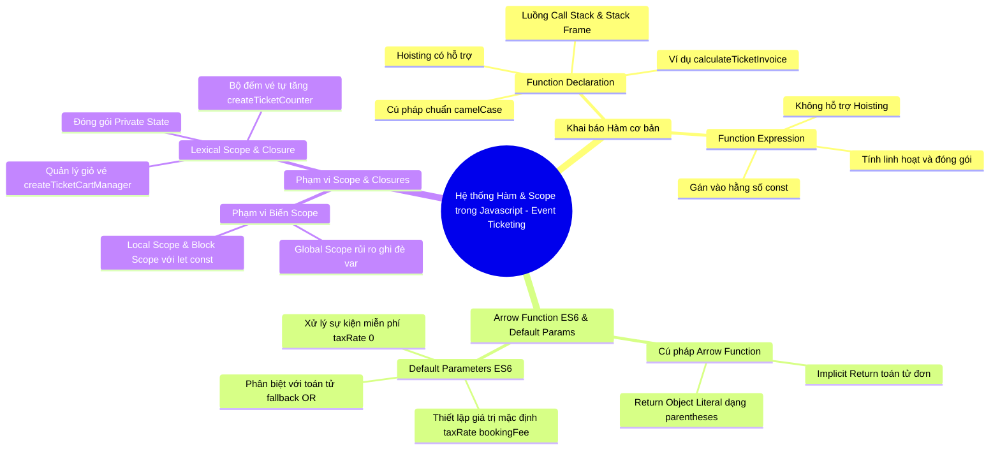

# <center>[Tổng hợp Mindmap] Hệ thống Kiến thức & Sơ đồ Tư duy (Mindmap) - Session 14: Tổ chức Hàm (Function), Tham số, Arrow Function và Phạm vi Scope</center>

### **1. Mục tiêu**
- **Hệ thống hóa tri thức**: Tổng hợp toàn bộ lý thuyết và ứng dụng thực tế của Function Declaration, Function Expression, Arrow Function, Default Parameters, Phạm vi (Scope) và Closure trong JavaScript.
- **Trực quan hóa tư duy**: Chuyển đổi toàn bộ luồng xử lý bộ nhớ (Call Stack, Lexical Scope) và quy tắc cú pháp thành Sơ đồ Tư duy (Mindmap) chuẩn hóa.
- **Gắn kết nghiệp vụ EVENT_TICKETING**: Áp dụng kiến thức tổ chức hàm vào bài toán hệ thống bán vé sự kiện trực tuyến (tính tiền vé, áp mã giảm giá, quản lý giỏ vé và đóng gói bộ đếm giữ chỗ).

---

### **2. Bối cảnh & Vấn đề**
Bạn đang đảm nhận vai trò **Software Engineer (Chuyên viên Phát triển Phần mềm)** tại nền tảng bán vé sự kiện trực tuyến **TicketHub**. Để chuẩn bị tài liệu Onboarding (đào tạo nhân sự mới) và chuẩn hóa codebase cho tính năng **Xử lý Đơn hàng & Quản lý Giỏ vé (Event Ticket Management)**, Trưởng nhóm Công nghệ (Technical Lead) giao cho bạn nhiệm vụ xây dựng bản **Sơ đồ Tư duy Hệ thống (System Mindmap)** kết hợp **Tài liệu Giải trình kỹ thuật (summary.md)**.

Sơ đồ cần khái quát đầy đủ nền tảng lý thuyết từ Session 14, minh họa bằng các đoạn mã nguồn (code snippet) chuẩn sản xuất gắn liền với nghiệp vụ bán vé sự kiện.

---

### **3. Quy tắc nghiệp vụ**
Bản sơ đồ tư duy và tài liệu tổng hợp của bạn **BẮT BUỘC** phải bao phủ và liên kết chặt chẽ các nhóm từ khóa kỹ thuật sau:

1. **Nhóm Khai báo Hàm (Function Declaration vs Function Expression)**:
   - `Function Declaration`: Hoisting, tên hàm chuẩn `camelCase` (ví dụ: `calculateTicketInvoice`), luồng thực thi trong Call Stack.
   - `Function Expression`: Hàm vô danh (Anonymous function), gán biến hằng số (`const calculateDiscount = function(...)`), cơ chế chống gọi trước khi khai báo.
   - *Luồng thực thi Call Stack*: Tạo khung lưu trữ (Stack Frame), tính toán vé + thuế + phí xuất vé, lệnh `return` và giải phóng bộ nhớ Stack.

2. **Nhóm Cú pháp ES6 & Tham số Mặc định (Arrow Function & Default Parameters)**:
   - `Arrow Function`: Cú pháp thu gọn (`=>`), trả về trực tiếp (Implicit return) cho các phép tính đơn giản, trả về Object Literal với cặp ngoặc tròn `() => ({ ticketId, quantity })`.
   - `Default Parameters`: Khai báo tham số mặc định (`taxRate = 0.05`, `bookingFee = 15000`), tránh bẫy lỗi ép kiểu của toán tử logic `||` khi phí/thế bằng `0` (sự kiện miễn thuế hoặc miễn phí giữ chỗ).

3. **Nhóm Phạm vi Biến & Closures (Scope & Encapsulation)**:
   - `Global Scope` vs `Local / Block Scope`: Tác hại của biến toàn cục `var` gây Hoisting ngoài ý muốn và phá hỏng dữ liệu giỏ vé (`totalTickets`).
   - `Lexical Scope`: Hàm con truy cập môi trường bao bọc bên ngoài.
   - `Closure`: Đóng gói dữ liệu riêng tư (Private State) bằng closure (`createTicketCounter`, `createTicketCartManager`), ngăn chặn sửa đổi trực tiếp biến từ bên ngoài.

---

### **4. Gợi ý Khung cấu trúc Sơ đồ Tư duy (Mindmap Blueprint)**

Dưới đây là cây cấu trúc logic chuẩn mà bạn có thể tham khảo để triển khai trên công cụ vẽ sơ đồ (XMind, Draw.io, Figma, v.v.):



---

### **5. Yêu cầu sản phẩm nộp**

Học viên cần hoàn thiện và đóng gói bài nộp bao gồm các thành phần sau:

1. **File Ảnh Sơ đồ tư duy**: Định dạng `.png` hoặc `.jpg` hiển thị trực quan, rõ ràng, màu sắc phân tầng nhánh hợp lý.
2. **File Thiết kế gốc**: File `.xmind`, `.drawio`, `.fig`, hoặc `.pdf` chất lượng cao.
3. **Bản tóm tắt giải trình (`summary.md`)**:
   - Viết bằng định dạng Markdown.
   - Giải thích chi tiết logic 3 nhánh chính trong Sơ đồ tư duy.
   - **Code Minh họa Nghiệp vụ Bán vé Sự kiện (EVENT_TICKETING)**: Cung cấp đầy đủ 3 ví dụ code executable (Node.js) cho 3 bài học:
     - *Ví dụ 1*: Hàm tính tổng tiền hóa đơn vé (`calculateTicketInvoice`) sử dụng Function Declaration & Expression.
     - *Ví dụ 2*: Hàm áp dụng mã giảm giá vé (`applyTicketVoucher`) và tạo đối tượng vé (`createTicketItem`) dùng Arrow Function & Default Parameters.
     - *Ví dụ 3*: Hàm tạo bộ quản lý giỏ vé sự kiện độc lập (`createTicketCartManager`) sử dụng Closure đóng gói biến private.

---

### **6. Yêu cầu nộp bài (GitHub Standard)**
- Tạo GitHub Repository công khai theo định dạng chuẩn:
  `[Tên Lớp]_[Môn Học]_Session14_Mindmap`
  *Ví dụ: `HN_KS25A_JS_Session14_Mindmap`*
- Structure Repository chuẩn:

```text
  ├── mindmap.png (hoặc mindmap.jpg)
  ├── mindmap.xmind (hoặc mindmap.drawio / mindmap.pdf)
  └── summary.md
```

- Commit message chuẩn: `feat: add session 14 mindmap and synthesis documentation`.
