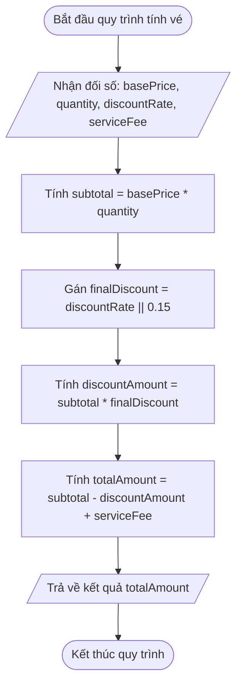

# <center>[Vận dụng cơ bản 1] Sửa lỗi tính tổng tiền đơn hàng vé concert trong hệ thống Ticketbox</center>

### **1. Mục tiêu**
*   **Kiến thức:** Củng cố cú pháp khai báo hàm (`Function Expression`, `Arrow Function ES6`), sử dụng Tham số mặc định (`Default Parameters`) đúng chuẩn và nắm rõ phạm vi biến (Scope) trong JavaScript Vanilla (ES6+).
*   **Kỹ năng:** Nhận biết và xử lý cạm bẫy logic phổ biến khi gán giá trị mặc định bằng toán tử `||` đối với dữ liệu số `0`; thực hiện truy vết mã nguồn (Code Tracing) và hoàn thiện báo cáo kiểm thử.
*   **Thái độ:** Rèn luyện tư duy cẩn trọng khi thiết kế logic tính toán tài chính, đảm bảo không gây thất thoát doanh thu trong các hệ thống giao dịch thương mại.

---

### **2. Bối cảnh & Vấn đề**
Bạn vừa tiếp nhận bàn giao một module tính toán hóa đơn vé cho ứng dụng bán vé sự kiện ca nhạc Ticketbox. Module này chịu trách nhiệm tính tổng tiền thanh toán đơn hàng cho khách hàng dựa trên giá vé gốc, số lượng vé, tỷ lệ chiết khấu (nếu có mã giảm giá hoặc chương trình Early Bird) và phí dịch vụ cố định.

Bộ phận kế toán và chăm sóc khách hàng vừa phản ánh một sự cố nghiệp vụ nghiêm trọng: Nhiều đơn hàng vé thường (vé không áp dụng mã giảm giá, tương ứng với tỷ lệ giảm giá bằng `0%`) khi thanh toán đều bị hệ thống tự động trừ đi `15%` tổng tiền. Điều này khiến ban tổ chức sự kiện bị thất thu doanh thu, trong khi các hóa đơn gửi về email của khách hàng hiển thị thông tin tiền thanh toán không nhất quán.

Dưới đây là sơ đồ luồng thực thi xử lý tính tiền đang được áp dụng trong hàm legacy của hệ thống:



---

### **3. Mã nguồn hiện tại**
Dưới đây là đoạn mã nguồn JavaScript legacy đang chạy trên hệ thống mà lập trình viên trước đây đã cài đặt:

```javascript
// Hệ thống tính toán hóa đơn vé sự kiện Ticketbox
// Khai báo hàm tính tổng tiền đơn hàng bán vé
const calculateTicketTotal = function(basePrice, quantity, discountRate, serviceFee) {
  // Gán giá trị mặc định cho số lượng vé nếu không truyền đối số
  const ticketQuantity = quantity || 1;
  
  // Gán giá trị mặc định cho tỷ lệ chiết khấu (mặc định 15% cho Early Bird nếu khuyết)
  const finalDiscount = discountRate || 0.15;
  
  // Gán phí dịch vụ cố định mặc định (30,000 VNĐ) nếu không truyền
  const finalServiceFee = serviceFee || 30000;

  // Tính tổng tiền hàng trước chiết khấu
  const subtotal = basePrice * ticketQuantity;
  
  // Tính số tiền được giảm giá
  const discountAmount = subtotal * finalDiscount;
  
  // Tính tổng tiền thanh toán cuối cùng
  const totalAmount = subtotal - discountAmount + finalServiceFee;
  
  return totalAmount;
};

// Kịch bản thực thi thử nghiệm
// Đơn hàng 1: Vé VIP mua 2 vé, có mã giảm 10% (0.1), phí dịch vụ 20,000 VNĐ
const order1 = calculateTicketTotal(1000000, 2, 0.1, 20000);
console.log('Tổng đơn hàng 1 (Vé VIP, giảm 10%):', order1);

// Đơn hàng 2: Vé Thường mua 1 vé, không có giảm giá (0%), phí dịch vụ mặc định
const order2 = calculateTicketTotal(500000, 1, 0);
console.log('Tổng đơn hàng 2 (Vé Thường, giảm 0%):', order2);

// Đơn hàng 3: Vé SV mua 3 vé, khuyết tỷ lệ giảm giá và khuyết phí dịch vụ
const order3 = calculateTicketTotal(200000, 3);
console.log('Tổng đơn hàng 3 (Vé SV, khuyết giảm giá & phí ship):', order3);
```

---

### **4. Yêu cầu bài toán**

Học viên đóng vai trò Kỹ sư Phần mềm phụ trách sửa lỗi (Hotfix) và thực hiện chính xác 2 phần nhiệm vụ sau:

#### **Phần 1: Báo cáo truy vết mã nguồn và phát hiện lỗi (Test Case Report)**
Phân tích đoạn mã nguồn trên, phát hiện vị trí gây nên lỗi sai sót tính toán và hoàn thiện bảng báo cáo kiểm thử 3 kịch bản theo mẫu dưới đây vào báo cáo nộp bài.

*Lưu ý:* Hàng 1 (STT 1) đã được điền mẫu làm ví dụ tham chiếu. Học viên cần đọc hiểu mã nguồn để tự truy vết và điền tiếp thông tin chính xác cho STT 2 và STT 3 (thay thế các dấu `...`).

<table style="width: 100%; min-width: 100%; display: table; border-collapse: collapse;" width="100%" border="1" cellPadding="8" cellSpacing="0">
  <thead>
    <tr style="background-color: #f2f2f2;">
      <th style="text-align: center; width: 5%;">STT</th>
      <th style="text-align: left; width: 25%;">Đầu vào (Input)</th>
      <th style="text-align: center; width: 15%;">Kết quả thực tế lỗi (Buggy Output)</th>
      <th style="text-align: center; width: 15%;">Kết quả mong đợi (Expected Output)</th>
      <th style="text-align: center; width: 15%;">Dòng code gây lỗi (Failing Line)</th>
      <th style="text-align: left; width: 25%;">Giải thích nguyên nhân (Logic Note)</th>
    </tr>
  </thead>
  <tbody>
    <tr>
      <td style="text-align: center;">1</td>
      <td><code>basePrice = 500000</code><br/><code>quantity = 1</code><br/><code>discountRate = 0</code><br/><code>serviceFee = khuyết</code></td>
      <td style="text-align: center;"><code>455000</code></td>
      <td style="text-align: center;"><code>530000</code></td>
      <td style="text-align: center;">Dòng 8</td>
      <td>Khi truyền <code>discountRate = 0</code>, biểu thức <code>0 || 0.15</code> coi <code>0</code> là giá trị falsy nên ép gán <code>finalDiscount = 0.15</code>, dẫn đến vé giảm 0% bị ép giảm 15%.</td>
    </tr>
    <tr>
      <td style="text-align: center;">2</td>
      <td><code>basePrice = 1000000</code><br/><code>quantity = 2</code><br/><code>discountRate = 0.1</code><br/><code>serviceFee = 20000</code></td>
      <td style="text-align: center;"><code>...</code></td>
      <td style="text-align: center;"><code>...</code></td>
      <td style="text-align: center;"><code>...</code></td>
      <td>...</td>
    </tr>
    <tr>
      <td style="text-align: center;">3</td>
      <td><code>basePrice = 200000</code><br/><code>quantity = 3</code><br/><code>discountRate = khuyết</code><br/><code>serviceFee = khuyết</code></td>
      <td style="text-align: center;"><code>...</code></td>
      <td style="text-align: center;"><code>...</code></td>
      <td style="text-align: center;"><code>...</code></td>
      <td>...</td>
    </tr>
  </tbody>
</table>

#### **Phần 2: Mã nguồn sửa lỗi (Refactoring & Bug Fixing)**
Viết lại mã nguồn xử lý tính tổng tiền bán vé thỏa mãn các yêu cầu kỹ thuật sau:
1. Re-factor hàm `calculateTicketTotal` từ cú pháp `Function Expression` cũ sang **cú pháp Arrow Function ES6**.
2. Sử dụng tính năng **Tham số mặc định (Default Parameters)** trực tiếp trong danh sách khai báo tham số của hàm ES6 (ví dụ: `discountRate = 0.15`, `serviceFee = 30000`, `quantity = 1`) thay vì dùng toán tử `||`.
3. Bổ sung kiểm tra hợp lệ dữ liệu đầu vào:
   * Nếu `basePrice <= 0` hoặc `quantity <= 0`, ném ra lỗi (`throw new Error(...)`) với thông điệp dữ liệu không hợp lệ.
   * Nếu `discountRate` nằm ngoài khoảng `0` đến `1` (ví dụ `discountRate < 0` hoặc `discountRate > 1`), ném ra lỗi thông báo tỷ lệ chiết khấu không hợp lệ.
4. Chạy lại 3 kịch bản kiểm thử trong mã nguồn và in kết quả ra Console để xác minh logic đã hoạt động chuẩn xác.

---

### **5. Yêu cầu nộp bài**
Học viên cần nộp:
*   Phần phân tích/báo cáo và mã nguồn triển khai.
*   Đẩy mã nguồn lên GitHub theo định dạng thư mục: `[Tên Lớp]_[Môn Học]_Session14_Ex1`.
    Ví dụ: `HNKS25CNTT1_Core_Session14_Ex1`
