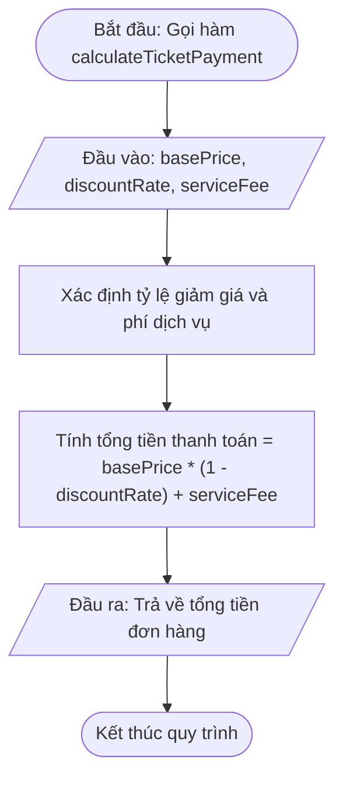

# <center>[Vận dụng cơ bản 2] Sửa Lỗi Tính Giá Vé Concert Khi Khuyết Hoặc Tùy Chỉnh Chiết Khấu Mặc Định</center>

### **1. Mục tiêu**
*   Vận dụng cú pháp Arrow Function và cơ chế Tham số mặc định (Default Parameters) trong ES6.
*   Phân tích phạm vi biến (Lexical Scope) và phân biệt cách hoạt động của Tham số mặc định ES6 với việc lạm dụng toán tử logic Falsy (`||`).
*   Thực hiện truy vết mã nguồn (Code Tracing), phát hiện vị trí câu lệnh gây lỗi logic tính tiền vé và tái cấu trúc mã nguồn theo tiêu chuẩn sản xuất cho hệ thống bán vé Ticketbox.

### **2. Bối cảnh & Vấn đề**
Hệ thống Ticketbox đang vận hành module tính tiền vé cho sự kiện âm nhạc "Sài Gòn Horizon Concert". Hàm `calculateTicketPayment` được thiết kế bằng cú pháp Arrow Function nhằm tính toán tổng số tiền thanh toán cuối cùng của khách hàng dựa trên: giá vé niêm yết (`basePrice`), tỷ lệ chiết khấu Early Bird (`discountRate`), và phí dịch vụ hệ thống (`serviceFee`).

Theo quy chuẩn nghiệp vụ:
*   Mặc định trong đợt mở bán Early Bird, vé được giảm giá 15% (`discountRate = 0.15`).
*   Mặc định phí dịch vụ hệ thống là 30,000 VNĐ (`serviceFee = 30000`).

**Vấn đề phản ánh từ thực tế:** 
Bộ phận kế toán báo cáo rằng trong đợt mở bán chính thức (vé không còn chiết khấu, tức truyền `discountRate = 0`), hệ thống vẫn tự động trừ 15% tiền vé của khách hàng. Đồng thời, đối với các đối tác tài trợ được miễn phí dịch vụ (truyền `serviceFee = 0`), hệ thống vẫn tự động cộng thêm 30,000 VNĐ vào hóa đơn.



# **3. Mã nguồn hiện tại**

Dưới đây là mã nguồn hiện tại đang chạy trên hệ thống:

```javascript
// Mã nguồn xử lý tính tổng tiền thanh toán vé concert
const calculateTicketPayment = (basePrice, discountRate, serviceFee) => {
  // Xử lý giá trị mặc định cho tỷ lệ giảm giá và phí dịch vụ
  const finalDiscount = discountRate || 0.15;
  const finalServiceFee = serviceFee || 30000;

  // Tính tổng tiền sau chiết khấu và phí dịch vụ
  const discountedPrice = basePrice * (1 - finalDiscount);
  const totalAmount = discountedPrice + finalServiceFee;

  return totalAmount;
};

// Kịch bản 1: Đặt vé đợt Early Bird (Khuyết tham số, dùng mặc định 15% giảm giá và 30,000đ phí)
const order1 = calculateTicketPayment(1500000);
console.log('Tổng tiền đơn hàng 1 (Early Bird mặc định):', order1);

// Kịch bản 2: Đặt vé mở bán chính thức (Không giảm giá, discountRate = 0)
const order2 = calculateTicketPayment(1500000, 0, 30000);
console.log('Tổng tiền đơn hàng 2 (Vé chính thức, discountRate = 0):', order2);

// Kịch bản 3: Đặt vé Ban Tổ Chức tài trợ (Không phí dịch vụ, serviceFee = 0)
const order3 = calculateTicketPayment(1500000, 0.1, 0);
console.log('Tổng tiền đơn hàng 3 (Miễn phí dịch vụ, serviceFee = 0):', order3);
```

# **4. Yêu cầu bài toán**

#### **Phần 1: Phân tích & Báo cáo Test Case (Code Tracing)**
Học viên tiến hành thực thi và truy vết mã nguồn legacy, xác định dòng lệnh gây lỗi và hoàn thiện bảng phân tích 3 trường hợp kiểm thử bên dưới. 

*Lưu ý: Dòng STT 1 đã được điền mẫu hướng dẫn. Học viên bắt buộc phải truy vết và điền thông tin chính xác vào các ô chứa ký tự `...` ở dòng STT 2 và STT 3.*

<table style="width: 100%; min-width: 100%; display: table; border-collapse: collapse;" width="100%" border="1" cellpadding="8">
  <thead>
    <tr style="background-color: #f2f2f2;">
      <th>STT</th>
      <th>Input (basePrice, discountRate, serviceFee)</th>
      <th>Buggy Output (Kết quả bị lỗi)</th>
      <th>Expected Output (Kết quả đúng)</th>
      <th>Dòng code gây lỗi (Failing Line)</th>
      <th>Giải thích nguyên nhân (Logic Note)</th>
    </tr>
  </thead>
  <tbody>
    <tr>
      <td>1</td>
      <td>basePrice = 1500000, discountRate = undefined, serviceFee = undefined</td>
      <td>1305000</td>
      <td>1305000</td>
      <td>Không có lỗi ở testcase này</td>
      <td>Do không truyền đối số, toán tử || nhận undefined và ép về giá trị mặc định 0.15 và 30000 đúng theo đợt Early Bird.</td>
    </tr>
    <tr>
      <td>2</td>
      <td>basePrice = 1500000, discountRate = 0, serviceFee = 30000</td>
      <td>...</td>
      <td>...</td>
      <td>...</td>
      <td>...</td>
    </tr>
    <tr>
      <td>3</td>
      <td>basePrice = 1500000, discountRate = 0.1, serviceFee = 0</td>
      <td>...</td>
      <td>...</td>
      <td>...</td>
      <td>...</td>
    </tr>
  </tbody>
</table>

#### **Phần 2: Tái cấu trúc và Sửa lỗi mã nguồn (Source Code Correction)**
1. Tái cấu trúc hàm `calculateTicketPayment` sử dụng **Tham số mặc định ES6 (Default Parameters)** trực tiếp trong danh sách tham số của Arrow Function thay vì kiểm tra giá trị bằng toán tử `||`.
2. Bảo đảm khi người dùng truyền giá trị `0` cho `discountRate` hoặc `serviceFee`, hàm phải nhận đúng giá trị `0` chứ không tự động đè thành giá trị mặc định.
3. Bổ sung đoạn mã kiểm tra tính hợp lệ dữ liệu đầu vào (Ví dụ: `basePrice` phải là số lớn hơn 0; `discountRate` nằm trong khoảng từ `0` đến `1`). Nếu dữ liệu không hợp lệ, ném ra lỗi hoặc thông báo lỗi phù hợp.

### **5. Yêu cầu nộp bài**
Học viên cần nộp:
*   Phần phân tích/báo cáo và mã nguồn triển khai.
*   Đẩy mã nguồn lên GitHub theo định dạng thư mục: `[Tên Lớp]_[Môn Học]_Session14_Ex2`.
    Ví dụ: `HNKS25CNTT1_Core_Session14_Ex2`
