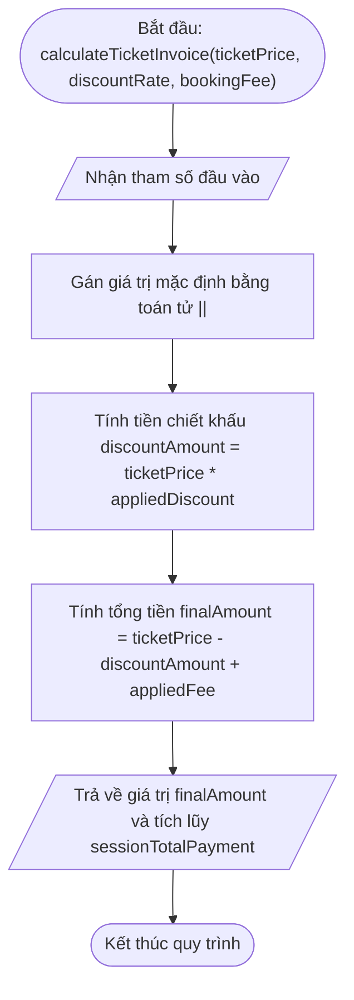

# <center>[Sửa lỗi code] Sửa lỗi gán tham số mặc định và scope tính tiền vé sự kiện</center>

### **1. Mục tiêu**
*   **Kiến thức:** Hiểu rõ cạm bẫy khi sử dụng toán tử logic `||` để gán giá trị mặc định cho tham số trong JavaScript, cơ chế Falsy Value với số `0`, cú pháp Tham số mặc định (Default Parameters) trong ES6 và quản lý phạm vi biến (Scope/Closure).
*   **Kỹ năng:** Thực hành truy vết mã nguồn (Code Tracing), lập bảng báo cáo Test Case để phát hiện lỗi logic nghiệp vụ, và tái cấu trúc hàm bằng Arrow Function chuẩn mực sản xuất.
*   **Thái độ:** Tỉ mỉ kiểm tra các trường hợp biên (edge cases) liên quan đến dữ liệu số `0` trong các bài toán tài chính và bán vé.

### **2. Bối cảnh & Vấn đề**
Hệ thống bán vé sự kiện ca nhạc Ticketbox đang vận hành module tự động tính toán tổng tiền đơn hàng vé. Hệ thống cho phép áp dụng tỉ lệ chiết khấu theo các đợt mở bán: đợt Early Bird giảm 15% (giảm 0.15), đợt VIP giảm 10% (giảm 0.1), và đợt Regular mở bán chính thức không giảm giá (tỉ lệ chiết khấu = 0).

Ban tổ chức sự kiện phản ánh rằng khách hàng mua vé lượt Regular (không có chiết khấu, `discountRate = 0`) khi thanh toán vẫn bị hệ thống tự động trừ bớt 15% tiền vé. Điều này dẫn đến thất thoát doanh thu nghiêm trọng cho nhà tổ chức. Đồng thời, bộ phận kỹ thuật báo cáo biến tổng doanh thu phiên làm việc đang bị truy cập và thay đổi trực tiếp từ bên ngoài mà không qua cơ chế đóng gói an toàn.

### **3. Mã nguồn hiện tại**
Dưới đây là luồng xử lý hiện tại của module tính tiền vé:



Mã nguồn legacy đang thực thi trong hệ thống:

```javascript
// Hệ thống bán vé sự kiện Ticketbox - Module tính tổng tiền thanh toán

// Biến toàn cục theo dõi tổng tiền tích lũy của phiên giao dịch
let sessionTotalPayment = 0;

// Hàm tính tổng giá trị đơn hàng vé sự kiện sử dụng Function Expression
const calculateTicketInvoice = function(ticketPrice, discountRate, bookingFee) {
  // Thiết lập giá trị mặc định cho tỉ lệ chiết khấu và phí đặt vé
  const appliedDiscount = discountRate || 0.15;
  const appliedFee = bookingFee || 20000;

  // Tính tiền chiết khấu
  const discountAmount = ticketPrice * appliedDiscount;
  
  // Tính tổng số tiền vé thực tế phải trả cho đơn hàng
  const finalAmount = ticketPrice - discountAmount + appliedFee;

  // Tích lũy vào doanh thu phiên làm việc
  sessionTotalPayment += finalAmount;

  return finalAmount;
};

// --- Kịch bản kiểm thử nghiệp vụ ---

// Đơn hàng 1: Khách hàng mua vé Early Bird (Khuyết tham số chiết khấu và phí)
const order1 = calculateTicketInvoice(1000000);
console.log("Đơn hàng 1 (Vé Early Bird mặc định):", order1);

// Đơn hàng 2: Khách hàng mua vé Regular (Không áp dụng chiết khấu, discountRate = 0, phí 20000)
const order2 = calculateTicketInvoice(1000000, 0, 20000);
console.log("Đơn hàng 2 (Vé Regular - Chiết khấu 0%):", order2);

// Đơn hàng 3: Khách hàng mua vé VIP đợt 2 (Giảm 10%, discountRate = 0.1, phí 15000)
const order3 = calculateTicketInvoice(2000000, 0.1, 15000);
console.log("Đơn hàng 3 (Vé VIP đợt 2):", order3);

console.log("Tổng doanh thu phiên làm việc tích lũy:", sessionTotalPayment);
```

# **4. Yêu cầu bài toán**

#### **Phần 1: Báo cáo Phân tích & Truy vết lỗi (Test Case Report Table)**
Học viên tiến hành chạy thử mã nguồn, truy vết từng dòng lệnh và hoàn thành bảng phân tích Test Case dưới đây vào báo cáo. Bảng phải chỉ rõ dòng code gây lỗi và giải thích nguyên nhân logic làm cho dữ liệu đầu ra bị sai.

<table style="width: 100%; min-width: 100%; display: table; border-collapse: collapse;" width="100%" border="1">
  <thead>
    <tr style="background-color: #f2f2f2;">
      <th style="padding: 8px; text-align: center;">STT</th>
      <th style="padding: 8px; text-align: left;">Đầu vào (Input)</th>
      <th style="padding: 8px; text-align: left;">Output Hiện Tại (Lỗi)</th>
      <th style="padding: 8px; text-align: left;">Output Kỳ Vọng (Đúng)</th>
      <th style="padding: 8px; text-align: center;">Dòng Code Gây Lỗi</th>
      <th style="padding: 8px; text-align: left;">Phân Tích Nguyên Nhân Logic</th>
    </tr>
  </thead>
  <tbody>
    <tr>
      <td style="padding: 8px; text-align: center;">1</td>
      <td style="padding: 8px;">ticketPrice = 1000000<br>discountRate = 0<br>bookingFee = 20000</td>
      <td style="padding: 8px;">870000</td>
      <td style="padding: 8px;">1020000</td>
      <td style="padding: 8px; text-align: center;">Dòng 8</td>
      <td style="padding: 8px;">Toán tử `||` coi số `0` là giá trị Falsy nên tự động lấy giá trị vế sau là `0.15`, làm cho vé Regular bị giảm 15% sai quy định.</td>
    </tr>
    <tr>
      <td style="padding: 8px; text-align: center;">2</td>
      <td style="padding: 8px;">ticketPrice = 500000<br>discountRate = 0<br>bookingFee = 0</td>
      <td style="padding: 8px;">...</td>
      <td style="padding: 8px;">...</td>
      <td style="padding: 8px; text-align: center;">...</td>
      <td style="padding: 8px;">...</td>
    </tr>
    <tr>
      <td style="padding: 8px; text-align: center;">3</td>
      <td style="padding: 8px;">ticketPrice = 2000000<br>Khuyết discountRate<br>Khuyết bookingFee</td>
      <td style="padding: 8px;">...</td>
      <td style="padding: 8px;">...</td>
      <td style="padding: 8px; text-align: center;">...</td>
      <td style="padding: 8px;">...</td>
    </tr>
  </tbody>
</table>

#### **Phần 2: Sửa lỗi & Tái cấu trúc mã nguồn**
1.  **Chuyển đổi cú pháp ES6:** Viết lại hàm `calculateTicketInvoice` bằng cú pháp Arrow Function kết hợp tính năng **ES6 Default Parameters** để thiết lập giá trị mặc định an toàn cho `discountRate = 0.15` và `bookingFee = 20000`, loại bỏ hoàn toàn việc gán mặc định bằng toán tử `||`.
2.  **Đóng gói dữ liệu (Scope/Closure):** Tái cấu trúc bộ đếm doanh thu `sessionTotalPayment` bằng cách đóng gói biến trong một hàm tạo quản lý doanh thu (`createTicketManager` hoặc tương đương) sử dụng Closure, tránh việc lạm dụng biến toàn cục (Global Scope).
3.  **Kiểm chuẩn đầu vào:** Bổ sung điều kiện kiểm tra nếu `ticketPrice` nhỏ hơn hoặc bằng 0 hoặc không phải là số hợp lệ thì ném lỗi (throw Error) với thông điệp rõ ràng.

### **5. Yêu cầu nộp bài**
Học viên cần nộp:
*   Phần phân tích/báo cáo và mã nguồn triển khai.
*   Đẩy mã nguồn lên GitHub theo định dạng thư mục: `[Tên Lớp]_[Môn Học]_Session14_Ex3`.
    Ví dụ: `HNKS25CNTT1_Core_Session14_Ex3`
