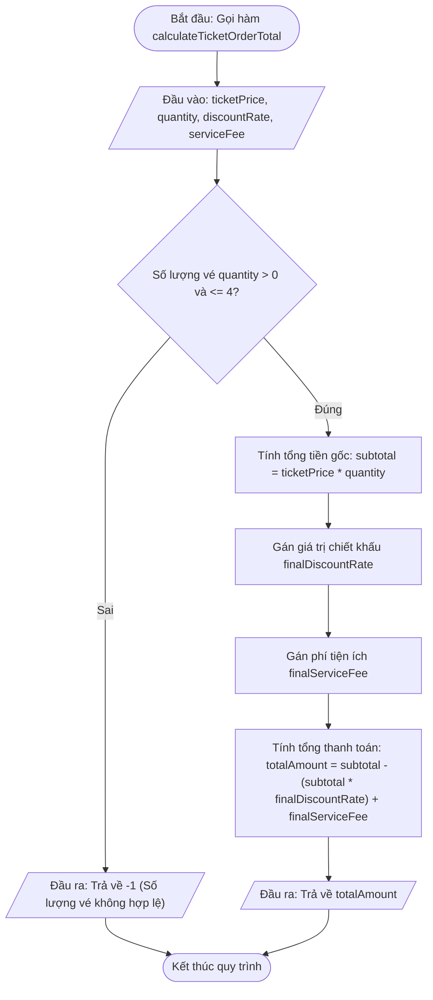

# <center>[Vận dụng cơ bản 5] Sửa lỗi tính tổng tiền vé sự kiện khi áp dụng chiết khấu mặc định và phí tiện ích</center>

### **1. Mục tiêu**
*   **Kiến thức:** Củng cố cú pháp Arrow Function (ES6), cơ chế hoạt động của tham số mặc định (Default Parameters) và phân biệt sự khác biệt giữa tham số mặc định chuẩn ES6 với việc lạm dụng toán tử `||` trong JavaScript.
*   **Kỹ năng:** Phân tích mã nguồn kế thừa (legacy code), truy vết dòng mã gây lỗi logic (code tracing), phát hiện các cạm bẫy liên quan đến giá trị falsy (như số `0`), và tái cấu trúc hàm tính toán nghiệp vụ thanh toán vé theo tiêu chuẩn sản xuất.
*   **Thực chiến:** Đảm bảo hệ thống bán vé xem ca nhạc Ticketbox tính chính xác tổng tiền hóa đơn cho khách hàng khi áp dụng các mức giảm giá Early Bird và phí tiện ích.

### **2. Bối cảnh & Vấn đề**

Trong Hệ thống Bán vé Sự kiện Ca nhạc & Hội thảo (Ticketbox), tính năng đặt vé xem Concert cho phép khách hàng mua vé theo từng khu vực (VIP, Zone A, GA) với hạn ngạch tối đa 4 vé cho 1 lần giao dịch. Hệ thống hỗ trợ chương trình ưu đãi đợt mở bán sớm (Early Bird) giảm 15% và tính thêm phí tiện ích hệ thống mặc định là 30,000 VNĐ cho mỗi đơn hàng.

Quy tắc nghiệp vụ chuẩn của hệ thống:
1. Mỗi đơn hàng chỉ cho phép đặt số lượng vé hợp lệ từ 1 đến 4 vé (`1 <= quantity <= 4`). Nếu số lượng nằm ngoài khoảng này, hàm trả về `-1` để báo lỗi giao dịch.
2. Giá vé mặc định chưa bao gồm chiết khấu và phí tiện ích.
3. Khi hết đợt Early Bird, sự kiện mở bán chính thức với mức chiết khấu truyền vào là `0%` (`discountRate = 0`).
4. Trong các chiến dịch khuyến mãi đặc biệt, ban tổ chức có thể hỗ trợ miễn phí tiện ích cho người mua, tức mức phí tiện ích truyền vào là `0 VNĐ` (`serviceFee = 0`).

Bộ phận Kế toán và Chăm sóc khách hàng vừa gửi báo cáo sự cố nghiêm trọng: Khi thời hạn Early Bird kết thúc, bộ phận vận hành truyền mức giảm giá `0%` vào hệ thống, nhưng tất cả các đơn hàng mua vé chính thức vẫn bị tự động giảm 15% tổng tiền. Ngoài ra, các đơn hàng thuộc chương trình tri ân miễn phí tiện ích (`serviceFee = 0`) vẫn bị tự động cộng thêm 30,000 VNĐ vào hóa đơn. Điều này gây thất thoát doanh thu bán vé và tạo ra trải nghiệm tiêu cực cho người dùng.



# **3. Mã nguồn hiện tại**

Dưới đây là mã nguồn xử lý tính tổng tiền hóa đơn mua vé đang chạy trên hệ thống Ticketbox:

```javascript
// Hệ thống Bán vé Sự kiện Ca nhạc & Hội thảo (Ticketbox)
// Module tính tổng tiền đơn hàng mua vé xem Concert

/**
 * Tính tổng tiền thanh toán đơn hàng mua vé
 * @param {number} ticketPrice - Giá vé niêm yết của khu vực (VNĐ)
 * @param {number} quantity - Số lượng vé đặt mua (Tối đa 4 vé/đơn)
 * @param {number} discountRate - Tỷ lệ chiết khấu (0.15 = 15%)
 * @param {number} serviceFee - Phí tiện ích hệ thống (VNĐ)
 * @returns {number} Tổng tiền thanh toán cuối cùng hoặc -1 nếu số lượng vé không hợp lệ
 */
const calculateTicketOrderTotal = (ticketPrice, quantity, discountRate, serviceFee) => {
  // Kiểm tra quy tắc nghiệp vụ: Mỗi tài khoản mua từ 1 đến tối đa 4 vé
  if (quantity <= 0 || quantity > 4) {
    return -1;
  }

  // Khởi tạo giá trị chiết khấu và phí tiện ích mặc định cho đơn hàng
  const finalDiscountRate = discountRate || 0.15;
  const finalServiceFee = serviceFee || 30000;

  const subtotal = ticketPrice * quantity;
  const discountAmount = subtotal * finalDiscountRate;
  const totalAmount = subtotal - discountAmount + finalServiceFee;

  return totalAmount;
};

// --- KỊCH BẢN KIỂM THỬ THỰC TẾ HỆ THỐNG TICKETBOX ---

// Đơn hàng 1: Khách đặt 2 vé Zone A (giá 1,200,000 VNĐ/vé) đợt Early Bird (giảm 15%), phí tiện ích mặc định 30,000 VNĐ
const order1Total = calculateTicketOrderTotal(1200000, 2, 0.15, 30000);
console.log('Tổng tiền đơn hàng 1 (Early Bird 15%):', order1Total);

// Đơn hàng 2: Đã hết hạn Early Bird, khách mua 2 vé VIP (giá 2,000,000 VNĐ/vé), mức giảm giá truyền vào là 0 (0%)
const order2Total = calculateTicketOrderTotal(2000000, 2, 0, 30000);
console.log('Tổng tiền đơn hàng 2 (Mở bán chính thức - Chiết khấu 0%):', order2Total);

// Đơn hàng 3: Đặt 1 vé GA (giá 600,000 VNĐ) trong chương trình Miễn phí tiện ích (serviceFee = 0), chiết khấu Early Bird 15%
const order3Total = calculateTicketOrderTotal(600000, 1, 0.15, 0);
console.log('Tổng tiền đơn hàng 3 (Miễn phí tiện ích):', order3Total);
```

# **4. Yêu cầu bài toán**

Học viên thực hiện bài tập theo 2 phần bắt buộc sau:

#### **Phần 1: Báo cáo Phân tích & Truy vết lỗi (Code Tracing)**
Chạy thử chương trình, phân tích dòng mã xử lý tham số và hoàn thành bảng báo cáo kiểm thử vào bài làm (mẫu dưới đây đã điền sẵn 1 trường hợp làm mẫu, học viên điền tiếp các trường hợp còn lại):

<table style="width: 100%; min-width: 100%; display: table; border-collapse: collapse;" width="100%" border="1" cellpadding="8" cellspacing="0">
  <thead>
    <tr style="background-color: #f2f2f2;">
      <th>STT</th>
      <th>Dữ liệu đầu vào (Input)</th>
      <th>Output thực tế (Buggy)</th>
      <th>Output mong đợi (Expected)</th>
      <th>Dòng code gây lỗi (Failing Line)</th>
      <th>Nguyên nhân & Phân tích logic</th>
    </tr>
  </thead>
  <tbody>
    <tr>
      <td>1</td>
      <td>ticketPrice = 2000000, quantity = 2, discountRate = 0, serviceFee = 30000</td>
      <td>3430000</td>
      <td>4030000</td>
      <td><code>const finalDiscountRate = discountRate || 0.15;</code></td>
      <td>Do sử dụng toán tử <code>||</code>, khi tham số <code>discountRate</code> nhận giá trị <code>0</code> (0%), JavaScript ép kiểu <code>0</code> thành falsy và tự động gán giá trị mặc định <code>0.15</code> (15%), làm tính sai tổng tiền.</td>
    </tr>
    <tr>
      <td>2</td>
      <td>ticketPrice = 600000, quantity = 1, discountRate = 0.15, serviceFee = 0</td>
      <td>...</td>
      <td>...</td>
      <td>...</td>
      <td>...</td>
    </tr>
    <tr>
      <td>3</td>
      <td>ticketPrice = 1200000, quantity = 5, discountRate = 0.15, serviceFee = 30000</td>
      <td>...</td>
      <td>...</td>
      <td>...</td>
      <td>...</td>
    </tr>
  </tbody>
</table>

[NOTE] Học viên cần giải thích rõ cơ chế ép kiểu dữ liệu Falsy trong JavaScript đối với toán tử `||` và lý do vì sao tham số `0` bị hiểu sai thành giá trị thiếu.

#### **Phần 2: Sửa đổi và Hoàn thiện Mã nguồn**
1. Tái cấu trúc hàm `calculateTicketOrderTotal` bằng cách áp dụng **Cú pháp Tham số Mặc định của ES6 (Default Parameters)** trực tiếp tại danh sách tham số của Arrow Function thay vì dùng toán tử `||`.
2. Giữ nguyên quy tắc kiểm tra hạn ngạch số lượng vé (từ 1 đến 4 vé).
3. Đảm bảo khi truyền `discountRate = 0` hoặc `serviceFee = 0`, hàm xử lý chính xác giá trị `0` mà không bị ghi đè bởi giá trị mặc định.

### **5. Yêu cầu nộp bài**

Học viên cần nộp:
*   Phần phân tích/báo cáo và mã nguồn triển khai.
*   Đẩy mã nguồn lên GitHub theo định dạng thư mục: `[Tên Lớp]_[Môn Học]_SessionSession 14_Ex5`.
    Ví dụ: `HNKS25CNTT1_Core_Session_Session 14_Ex5`
