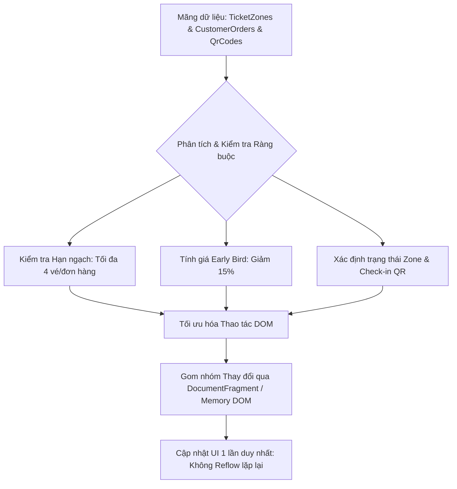

### 1. Mục tiêu bài tập
Sau khi hoàn thành bài tập này, học viên có khả năng:
- **Phân tích và phát hiện các vấn đề hiệu năng (DOM Thrashing, Reflow/Repaint)** trong đoạn mã legacy truy xuất và thao tác DOM.
- **Tái cấu trúc (Refactor)** mã nguồn truy xuất/thay đổi DOM theo tiêu chuẩn tối ưu: giảm thiểu số lần truy vấn DOM tree, loại bỏ thao tác nối chuỗi `innerHTML` trong vòng lặp bằng `DocumentFragment` hoặc thao tác DOM an toàn.
- Sử dụng thành thạo các thuộc tính và phương thức thao tác nội dung, attribute: `textContent`, `setAttribute`, `dataset`, `classList`.
- Áp dụng các quy tắc nghiệp vụ thực tế của hệ thống đặt vé hội thảo y tế vào việc tính toán dữ liệu và hiển thị trạng thái động trên giao diện DOM.

---


### 2. Bối cảnh & Mô tả bài toán
Hệ thống bán vé sự kiện trực tuyến cho **Hội thảo Y khoa Quốc tế 2025 (MedConference Ticket System)** hiện đang gặp vấn đề nghiêm trọng về hiệu năng giao diện khi số lượng khán giả và danh sách mã check-in tăng cao. 

Mã nguồn hiện tại do lập trình viên cũ để lại đang lạm dụng `innerHTML += ...` bên trong các vòng lặp, truy vấn lại các Element nhiều lần bằng `document.querySelector` một cách không cần thiết, làm trình duyệt liên tục rơi vào trạng thái Reflow/Repaint làm giật lag trang Dashboard quản lý.

Bạn được giao nhiệm vụ **phân tích mã nguồn cũ, phát hiện các điểm nghẽn hiệu năng và tái cấu trúc toàn bộ logic render dữ liệu** bằng các DOM API tối ưu thuộc Session 17 (không sử dụng Event Listener hay Fetch API).



---


### 3. Quy tắc nghiệp vụ (Business Rules)

1. **Hạn ngạch mua vé (Ticket Quota Limit):**
   - Mỗi đơn hàng (`CustomerOrder`) chỉ cho phép mua **tối đa 4 vé**.
   - Nếu `ticketQuantity > 4`: Đơn hàng bị đánh dấu là `Invalid` (Vi phạm hạn ngạch). Trên DOM, hiển thị thẻ đơn hàng với class `order-error`, hiển thị dòng thông báo: `"CẢNH BÁO: Vượt quá giới hạn 4 vé/đơn!"` và **không cộng dồn** số vé này vào tổng số vé đã bán của khu vực (`TicketZone`).

2. **Chính sách giá đợt Mở bán Sớm (Early Bird Discount):**
   - Nếu đơn hàng có thuộc tính `isEarlyBird: true`, thành tiền của đơn hàng được tính theo công thức:
     $$\text{finalPrice} = \text{basePrice} \times \text{ticketQuantity} \times 0.85$$
   - Nếu `isEarlyBird: false`, thành tiền:
     $$\text{finalPrice} = \text{basePrice} \times \text{ticketQuantity}$$

3. **Phân loại Trạng thái Khu vực Vé (TicketZone Status):**
   - Sức chứa còn lại: $\text{remainingSeats} = \text{totalCapacity} - \text{soldSeats}$.
   - Nếu $\text{remainingSeats} \le 0$: Thêm class `zone-sold-out`, gán nhãn text `"HẾT VÉ"`.
   - Nếu $0 < \text{remainingSeats} \le 10$: Thêm class `zone-warning`, gán nhãn text `"SẮP HẾT VÉ (Còn [remainingSeats] chỗ)"`.
   - Nếu $\text{remainingSeats} > 10$: Thêm class `zone-available`, gán nhãn text `"CÒN VÉ (Còn [remainingSeats] chỗ)"`.

4. **Xác thực Mã QR Check-in (Single-use QR Check-in):**
   - Mỗi mã QR chỉ có hiệu lực check-in 1 lần.
   - Mã QR có `isScanned: true` $\rightarrow$ Thêm class CSS `qr-disabled`, hiển thị text badge: `"ĐÃ CHECK-IN (HẾT HIỆU LỰC)"`.
   - Mã QR có `isScanned: false` $\rightarrow$ Thêm class CSS `qr-active`, hiển thị text badge: `"HỢP LỆ (SẴN SÀNG QUÉT)"`.

---


### 4. Yêu cầu kỹ thuật & Triển khai


#### A. Phân tích đoạn mã Legacy (Chứa lỗi hiệu năng)
Cho đoạn mã legacy chưa tối ưu dưới đây:

```javascript
// MA NGUON CHUA TOI UU (LEGACY CODE)
function renderDashboardBad(zones, orders, qrList) {
    // BUG HIỆU NĂNG: Ghi đè innerHTML trong vòng lặp liên tục
    for (var i = 0; i < zones.length; i++) {
        document.getElementById('zone-container').innerHTML += 
            '<div class="zone-card" id="zone-' + zones[i].id + '">' +
                '<h3>' + zones[i].name + '</h3>' +
                '<p class="status"></p>' +
            '</div>';
    }

    // BUG HIỆU NĂNG: Lặp lại việc tìm kiếm DOM element bên trong loop
    for (var j = 0; j < orders.length; j++) {
        var order = orders[j];
        if (order.ticketQuantity <= 4) {
            // Liên tục query DOM lại từ đầu
            var zoneEl = document.querySelector('#zone-' + order.zoneId);
            if (zoneEl) {
                // Thao tác DOM trực tiếp nhiều lần
                var currentPrice = order.isEarlyBird ? (order.price * order.ticketQuantity * 0.85) : (order.price * order.ticketQuantity);
                document.getElementById('order-list').innerHTML += 
                    '<div class="order-item">Đơn ' + order.id + ': ' + currentPrice + ' VNĐ</div>';
            }
        }
    }

    // BUG HIỆU NĂNG: Thao tác style và innerHTML không an toàn
    for (var k = 0; k < qrList.length; k++) {
        var qr = qrList[k];
        var qrContainer = document.getElementById('qr-list');
        if (qr.isScanned == true) {
            qrContainer.innerHTML += '<span style="color: red;">ĐÃ CHECK-IN: ' + qr.code + '</span><br>';
        } else {
            qrContainer.innerHTML += '<span style="color: green;">HỢP LỆ: ' + qr.code + '</span><br>';
        }
    }
}
```


#### B. Nhiệm vụ Tái cấu trúc (Refactoring Requirements)
Bạn hãy viết lại toàn bộ logic trên vào một file JavaScript mới đạt các yêu cầu:

1. **Bộ dữ liệu đầu vào mẫu (Mock Data):**
```javascript
const eventData = {
    eventName: "Hội thảo Y khoa Quốc tế 2025 - Ứng dụng AI trong Chẩn đoán Image",
    zones: [
        { id: "Z01", name: "Khu vực VIP (Chuyên gia)", basePrice: 2000000, totalCapacity: 50, soldSeats: 45 },
        { id: "Z02", name: "Khu vực Zone A (Bác sĩ/Dược sĩ)", basePrice: 1000000, totalCapacity: 100, soldSeats: 98 },
        { id: "Z03", name: "Khu vực GA (Sinh viên Y)", basePrice: 400000, totalCapacity: 200, soldSeats: 200 }
    ],
    orders: [
        { id: "ORD-101", zoneId: "Z01", ticketQuantity: 2, isEarlyBird: true },
        { id: "ORD-102", zoneId: "Z02", ticketQuantity: 5, isEarlyBird: false }, // Vi phạm hạn ngạch (>4)
        { id: "ORD-103", zoneId: "Z02", ticketQuantity: 3, isEarlyBird: true },
        { id: "ORD-104", zoneId: "Z03", ticketQuantity: 1, isEarlyBird: false }
    ],
    qrCodes: [
        { code: "QR-MED-001", orderId: "ORD-101", isScanned: true },
        { code: "QR-MED-002", orderId: "ORD-101", isScanned: false },
        { code: "QR-MED-003", orderId: "ORD-103", isScanned: false }
    ]
};
```

2. **Yêu cầu kỹ thuật bắt buộc:**
   - **Tối ưu Truy xuất DOM:** Cache toàn bộ các selector DOM chính (`#zone-container`, `#order-list`, `#qr-list`, `#event-title`) ra ngoài các vòng lặp xử lý.
   - **Sử dụng `DocumentFragment`:** Gom tất cả các phần tử node mới khởi tạo (`document.createElement`) vào trong `DocumentFragment` trước khi `append` một lần duy nhất vào DOM tree thực tế.
   - **An toàn Nội dung (XSS Prevention):** Sử dụng `textContent` thay cho `innerHTML` khi chèn các giá trị dạng văn bản (như tên hội thảo, mã đơn hàng, trạng thái).
   - **Quản lý Style & Trạng thái:** Không viết inline-style (VD: `element.style.color = ...`), phải dùng `classList.add()`, `classList.remove()`, hoặc `dataset` (VD: `element.dataset.status = "sold-out"`).
   - **Đúng quy tắc nghiệp vụ:** Áp dụng đầy đủ 4 quy tắc nghiệp vụ đã mô tả ở Mục 3.

3. **Cấu trúc Hàm Yêu cầu:**
   - `function refactorTicketSystem(data)`: Hàm chính nhận vào đối tượng dữ liệu sự kiện và thực thi toàn bộ luồng render tối ưu.
   - `function calculateOrderPrice(price, quantity, isEarlyBird)`: Hàm bổ trợ tính toán giá vé đơn hàng.
   - `function getZoneBadgeInfo(capacity, sold)`: Hàm bổ trợ xác định CSS class và Text hiển thị cho trạng thái zone.

---


### 5. Quy chuẩn nộp bài

- **Cấu trúc thư mục dự án:**
  ```text
  student-id_homework_session17/
  ├── index.html          # Khung HTML chứa các container: #event-title, #zone-container, #order-list, #qr-list
  ├── css/
  │   └── style.css       # Chứa các class CSS trạng thái: .zone-sold-out, .zone-warning, .zone-available, .order-error, .qr-disabled, .qr-active
  └── js/
      └── main.js         # Chứa mã nguồn JavaScript đã tái cấu trúc và dữ liệu mock
  ```
- **Quy định đặt tên:** Thư mục nộp bài nén dạng ZIP với tên `[HoVaTen]_[MSHV]_Session17.zip` (Ví dụ: `NguyenVanA_RK01234_Session17.zip`).
- **Phạm vi nghiêm cấm:** Không sử dụng bất kỳ thư viện ngoài (React, jQuery, Lodash...), không sử dụng `addEventListener`, không sử dụng `fetch`, không sử dụng `localStorage`. Chỉ dùng DOM API thuần covered trong Session 17.