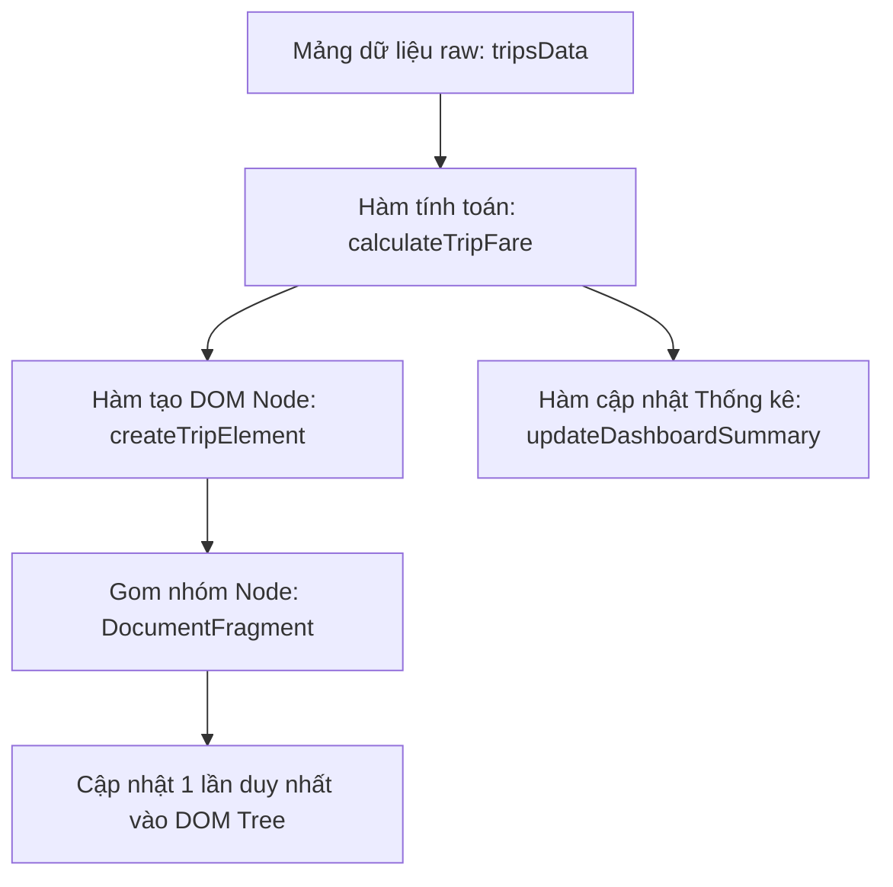

### 1. Mục tiêu bài tập
- **Phân tích & Phát hiện lỗi (Code Smell):** Nhận biết các vấn đề về hiệu năng (Layout Thrashing, truy xuất DOM lặp lại trong vòng lặp) và rủi ro bảo mật (XSS với `innerHTML`) trong đoạn mã DOM hiện tại.
- **Tái cấu trúc mã nguồn (Refactoring):** Thực hiện tách biệt hoàn toàn giữa **Logic tính toán nghiệp vụ (Business Logic)** và **Logic thao tác giao diện (DOM Manipulation)** theo mô hình mô-đun hóa.
- **Tối ưu hóa thao tác DOM:** Áp dụng kỹ thuật Caching DOM Query, `DocumentFragment` để giảm thiểu số lần Reflow/Repaint, và sử dụng `textContent`, `classList` thay vì ghi đè chuỗi HTML/style inline.
- **Áp dụng quy tắc nghiệp vụ GrabRide:** Tính toán chính xác cước phí di chuyển, phụ phí thời tiết/giờ cao điểm và cập nhật tổng quan bảng điều khiển (Dashboard).

---


### 2. Bối cảnh & Mô tả bài toán
Hệ thống điều hành chuyến đi **GrabRide** đang gặp sự cố suy giảm hiệu năng nghiêm trọng trên màn hình Giám sát Chuyến đi (Active Trips Dashboard). Mã nguồn hiện tại do lập trình viên cũ để lại bị lỗi "Spaghetti Code": truy xuất DOM liên tục bên trong vòng lặp, tính cước phí dồn chung vào chuỗi HTML, và không kiểm soát dữ liệu đầu vào.

Bạn được giao nhiệm vụ phân tích mã nguồn cũ, đưa ra báo cáo cải tiến và **tái cấu trúc toàn bộ mã nguồn JavaScript/DOM** để hệ thống chạy mượt mà, an toàn và dễ bảo trì.



---


### 3. Quy tắc nghiệp vụ (Business Rules)


#### A. Quy tắc tính giá cước chuyến đi (`TripFare`)
1. **Giá cước cơ bản (Khoảng cách $d$ km):**
   - $d \le 2$ km: Giá cố định **12.000 VNĐ**.
   - $d > 2$ km: Giá tiền = $12.000 + (d - 2) \times 4.500$ VNĐ.
2. **Hệ số phụ phí (Thời tiết xấu / Giờ cao điểm - `isSurge`):**
   - Nếu `isSurge === true`: Tổng cước = $Cước\_Cơ\_Bản \times 1.2$.
   - Nếu `isSurge === false`: Tổng cước = $Cước\_Cơ\_Bản$.
3. **Định dạng hiển thị:**
   - Số tiền phải được làm tròn tròn số nguyên và định dạng dạng tiền tệ Việt Nam (Ví dụ: `25.500 VNĐ` hoặc `25,500 VNĐ`).


#### B. Phân loại chuyến đi trên UI
- **Chuyến đi VIP / Giá cao:** Nếu tổng cước $\ge 50.000$ VNĐ, thêm lớp CSS `trip-card--vip` và hiển thị nhãn (badge) `"CHUYẾN ĐI GIÁ TRỊ CAO"`.
- **Chuyến đi Tiêu chuẩn:** Tổng cước $< 50.000$ VNĐ, thêm lớp CSS `trip-card--standard`.

---


### 4. Mã nguồn cũ cần Phân tích & Tái cấu trúc (Legacy Code)

Dưới đây là đoạn mã kém tối ưu đang chạy trên hệ thống:

```javascript
// Dữ liệu đầu vào giả lập
var trips = [
  { id: "R-001", passenger: "Nguyen Van A", distance: 1.5, isSurge: false },
  { id: "R-002", passenger: "Tran Thi B <script>alert('xss')</script>", distance: 5.0, isSurge: true },
  { id: "R-003", passenger: "Le Van C", distance: 12.0, isSurge: false },
  { id: "R-004", passenger: "Pham Minh D", distance: 8.5, isSurge: true }
];

// Mã nguồn cũ (CẦN TÁI CẤU TRÚC)
function renderTripsBad() {
  for (var i = 0; i < trips.length; i++) {
    var fare = 0;
    if (trips[i].distance <= 2) {
      fare = 12000;
    } else {
      fare = 12000 + (trips[i].distance - 2) * 4500;
    }
    if (trips[i].isSurge) {
      fare = fare * 1.2;
    }

    // TRUY XUẤT DOM LIÊN TỤC TRONG VÒNG LẶP + NGUY CƠ XSS + THAO TÁC INLINE STYLE
    document.getElementById("trip-list").innerHTML += 
      '<div class="trip-card" style="border: 1px solid #ccc; padding: 10px; margin-bottom: 10px;">' +
        '<h3>Mã chuyến: ' + trips[i].id + '</h3>' +
        '<p>Hành khách: ' + trips[i].passenger + '</p>' +
        '<p>Khoảng cách: ' + trips[i].distance + ' km</p>' +
        '<p>Cước phí: ' + fare + ' VNĐ</p>' +
      '</div>';
      
    // Lại truy xuất DOM để tính tổng dồn
    var currentTotal = parseFloat(document.getElementById("total-revenue").innerText || 0);
    document.getElementById("total-revenue").innerText = currentTotal + fare;
  }
}
renderTripsBad();
```

---


### 5. Yêu cầu kỹ thuật & Triển khai


#### Phần 1: Báo cáo Phân tích (Viết trong file `README.md`)
Chỉ ra ít nhất **4 điểm yếu nghiêm trọng** của đoạn mã cũ liên quan đến:
1. Hiệu năng DOM (DOM Access in loop, Repaint/Reflow).
2. Rủi ro bảo mật (XSS Injection với `innerHTML`).
3. Khả năng bảo trì & Vi phạm nguyên lý Single Responsibility Principle (Dồn ép tính toán nghiệp vụ với render UI).
4. Sai sót trong tính toán/định dạng (Chuyển đổi kiểu dữ liệu ép kiểu số thực `parseFloat` từ `innerText`).


#### Phần 2: Tái cấu trúc Mã nguồn (`script.js`)
Viết lại toàn bộ chương trình tuân thủ các yêu cầu kỹ thuật sau:

1. **Hàm thuần túy tính cước (Pure Business Logic):**
   - Xây dựng hàm `calculateTripFare(distance, isSurge)` trả về số tiền cước đã tính toán.
   - Thêm kiểm tra validation: Nếu `distance` không hợp lệ (nhỏ hơn hoặc bằng 0, không phải số), trả về `0`.

2. **Hàm tạo phần tử DOM an toàn (UI Builder):**
   - Xây dựng hàm `createTripCardNode(trip)` tạo ra phần tử DOM bằng `document.createElement()`.
   - Gán nội dung văn bản bằng `textContent` (Tuyệt đối không dùng `innerHTML` gán trực tiếp dữ liệu từ `passenger`).
   - Gán classCSS bằng `classList.add()` thay vì ghi đè thuộc tính `style`.

3. **Tối ưu hóa thao tác DOM (Render Pipeline):**
   - Thực hiện Caching DOM Query: Lưu trữ tham chiếu đến các thẻ container (`#trip-list`, `#total-revenue`, `#vip-count`, v.v.) ra ngoài vòng lặp.
   - Sử dụng `document.createDocumentFragment()` để gộp tất cả card chuyến đi trước khi chèn 1 lần duy nhất vào DOM.

4. **Cập nhật Bảng thống kê (Dashboard Summary):**
   - TÍnh toán tổng doanh thu và tổng số chuyến VIP từ mảng dữ liệu đã xử lý.
   - Cập nhật số liệu lên giao diện trong một hàm riêng biệt `updateDashboardSummary(totalRevenue, vipCount)`.

*Lưu ý phạm vi kiến thức:* **KHÔNG** sử dụng `addEventListener`, `fetch`, `localStorage` hay sự kiện submit form. Chương trình tự động thực thi khi file JS được nạp.

---


### 6. Quy chuẩn nộp bài

- **Cấu trúc thư mục dự án:**
  ```text
  student-id-grab-ride/
  ├── index.html
  ├── styles.css
  ├── script.js
  └── README.md
  ```

- **Mẫu HTML ban đầu (`index.html`):**
  ```html
  <!DOCTYPE html>
  <html lang="vi">
  <head>
    <meta charset="UTF-8">
    <title>GrabRide Dashboard</title>
    <link rel="stylesheet" href="styles.css">
  </head>
  <body>
    <div class="container">
      <h1>Hệ Thống Giám Sát Chuyến Đi GrabRide</h1>
      
      <div class="dashboard-summary">
        <div class="summary-card">
          <span>Tổng Doanh Thu:</span>
          <strong id="total-revenue">0 VNĐ</strong>
        </div>
        <div class="summary-card">
          <span>Chuyến VIP (>= 50k):</span>
          <strong id="vip-count">0</strong>
        </div>
      </div>

      <h2>Danh Sách Chuyến Đi Đang Hoạt Động</h2>
      <div id="trip-list"></div>
    </div>
    <script src="script.js"></script>
  </body>
  </html>
  ```