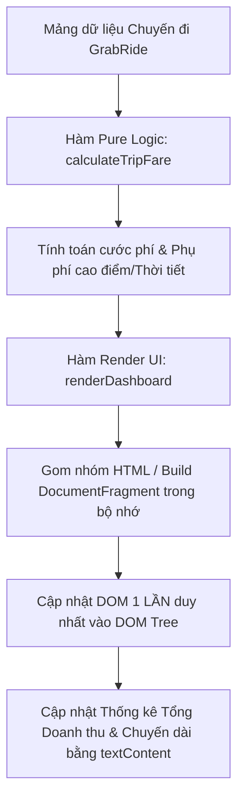

### 1. Mục tiêu bài tập
- **Phân tích & Phát hiện điểm nghẽn (Bottlenecks):** Nhận biết các thao tác thao tác DOM gây lãng phí hiệu năng (DOM Reflow/Repaint liên tục, truy xuất DOM dư thừa trong vòng lặp) và việc trộn lẫn logic nghiệp vụ với hiển thị.
- **Tái cấu trúc mã nguồn (Refactoring):** Áp dụng nguyên lý tách biệt trách nhiệm (Separation of Concerns) – tách riêng hàm xử lý logic nghiệp vụ tính cước phí dịch vụ **GrabRide** và hàm thao tác với giao diện DOM.
- **Tối ưu hóa thao tác DOM API:** Sử dụng kỹ thuật caching DOM element references, thao tác cập nhật DOM theo lô (Batching DOM Updates) thông qua chuỗi tích lũy hoặc `DocumentFragment`, và sử dụng `textContent` thay cho `innerHTML` đúng ngữ cảnh.
- **Xử lý dữ liệu biên:** Đảm bảo hệ thống tính toán chính xác với khoảng cách lẻ (số thực), dữ liệu đầu vào không hợp lệ (khoảng cách $\le 0$).

---


### 2. Bối cảnh & Mô tả bài toán
Bạn là Chuyên viên Phát triển Phần mềm tại **GrabRide**. Đội ngũ vận hành vừa nhận lại một mô hình trang Dashboard giám sát danh sách chuyến đi của tài xế trong ca làm việc. Trang này hiển thị danh sách chi tiết từng chuyến đi, tính toán tổng doanh thu và thống kê các chuyến đi đường dài.

Tuy nhiên, đoạn mã nguồn hiện tại của dự án legacy (mã nguồn cũ) đang gặp vấn đề nghiêm trọng về hiệu năng: giao diện bị giật lag khi danh sách chuyến đi lớn, code rối rắm, và logic tính cước phí bị lồng trực tiếp bên trong các câu lệnh truy xuất DOM.

Nhiệm vụ của bạn là **phân tích lỗi, chỉ ra điểm nghẽn** và **tái cấu trúc lại toàn bộ mã nguồn JavaScript**, đảm bảo vừa tuân thủ đúng quy tắc tính cước của GrabRide, vừa tối ưu hiệu năng thao tác DOM Tree.


#### Luồng xử lý dữ liệu và thao tác DOM tối ưu:


---


### 3. Quy tắc nghiệp vụ (Business Rules)


#### A. Quy tắc tính cước phí chuyến đi (Trip Fare Calculation)
1. **Giá cước cơ sở (Base Fare):**
   - Khoảng cách $d \le 2\text{ km}$: Tính giá cố định **12.000 VNĐ**.
   - Khoảng cách $d > 2\text{ km}$: 2 km đầu giá 12.000 VNĐ, từ km thứ 3 trở đi tính **4.500 VNĐ/km**.
     $$\text{BaseFare} = 12.000 + (d - 2) \times 4.500$$
2. **Hệ số nhân phụ phí (Surge Pricing Factor):**
   - Nếu điều kiện thời tiết xấu hoặc giờ cao điểm (`isSurge = true`): Áp dụng hệ số nhân **1.2x** trên tổng cước cơ sở.
   - Thành tiền cuối cùng = $\text{Math.round}(\text{BaseFare} \times 1.2)$.
   - Nếu `isSurge = false`: Thành tiền cuối cùng = $\text{BaseFare}$.
3. **Kiểm tra hợp lệ:** Nếu khoảng cách $d \le 0$ hoặc không phải là số hợp lệ (`isNaN`), cước phí trả về là `0 VNĐ` và đánh dấu trạng thái chuyến đi là không hợp lệ.


#### B. Quy tắc phân loại & Hiển thị trên DOM
- **Chuyến đi đường dài (Long Trip):** Các chuyến đi có khoảng cách $d \ge 10\text{ km}$.
- **Định dạng tiền tệ:** Cước phí hiển thị trên DOM phải được định dạng theo chuẩn Việt Nam (Ví dụ: `25.500 VNĐ`).

---


### 4. Yêu cầu kỹ thuật & Triển khai


#### A. Phân tích mã nguồn cũ (Legacy Code)
Dưới đây là đoạn mã legacy không tối ưu mà bạn nhận được:

```javascript
// === MÃ NGUỒN CŨ (LEGACY CODE) - CẦN PHÂN TÍCH VÀ TÁI CẤU TRÚC ===
const tripsData = [
  { id: "TRIP01", distance: 1.5, isSurge: false },
  { id: "TRIP02", distance: 5.0, isSurge: true },
  { id: "TRIP03", distance: 12.0, isSurge: false },
  { id: "TRIP04", distance: -2, isSurge: false }, // Dữ liệu lỗi
  { id: "TRIP05", distance: 8.5, isSurge: true }
];

function displayTripsBadly(data) {
  // Lỗi: Trộn lẫn DOM query và logic tính toán trong vòng lặp
  for (let i = 0; i < data.length; i++) {
    let fare = 0;
    if (data[i].distance <= 2 && data[i].distance > 0) {
      fare = 12000;
    } else if (data[i].distance > 2) {
      fare = 12000 + (data[i].distance - 2) * 4500;
    }
    if (data[i].isSurge) {
      fare = fare * 1.2;
    }

    // Lỗi nghiêm trọng: Query DOM nhiều lần & gán innerHTML += trực tiếp trong lặp
    document.getElementById("trip-list").innerHTML += 
      "<div class='trip-card'>" +
        "<h3>Chuyến: " + data[i].id + "</h3>" +
        "<p>Quãng đường: " + data[i].distance + " km</p>" +
        "<p>Cước phí: " + fare + " VNĐ</p>" +
      "</div>";

    // Lỗi: Query DOM liên tục để tính tổng
    let currentTotal = Number(document.getElementById("total-revenue").innerText || 0);
    document.getElementById("total-revenue").innerText = currentTotal + fare;
  }
}
```


#### B. Yêu cầu Tái cấu trúc & Viết mới (Refactored Requirements)

1. **Phần 1: Viết Comment Phân tích Lỗi (Đặt ở đầu file `main.js`)**
   - Chỉ ra ít nhất **4 điểm yếu/lỗi hiệu năng** trong mã nguồn cũ liên quan đến DOM API và logic nghiệp vụ.

2. **Phần 2: Xây dựng hàm Pure Logic `calculateTripFare(distance, isSurge)`**
   - Nhận vào: `distance` (number), `isSurge` (boolean).
   - Trả về: Một object chứa `{ baseFare, finalFare, isValid, isLongTrip }`.
   - Đảm bảo tính đúng theo Quy tắc nghiệp vụ (Mục 3).

3. **Phần 3: Xây dựng hàm Render UI tối ưu `renderTripDashboard(trips)`**
   - **DOM Caching:** Lấy ra các phần tử DOM (`#trip-list`, `#total-revenue`, `#long-trip-count`, `#system-status`) duy nhất **1 lần** trước khi xử lý dữ liệu.
   - **Batching DOM Updates:** Tạo một chuỗi tích lũy HTML (hoặc dùng `DocumentFragment`) để tạo toàn bộ markup của danh sách chuyến đi trong bộ nhớ, sau đó chỉ gán vào `#trip-list` **1 lần duy nhất** sau khi kết thúc vòng lặp.
   - **Sử dụng `textContent` đúng cách:** Đối với các thẻ chỉ hiển thị con số/thông báo thuần text (như tổng tiền `#total-revenue`, tổng số chuyến dài `#long-trip-count`), bắt buộc dùng `.textContent`.
   - **Thao tác Class/Attribute:**
     - Nếu chuyến đi có phụ phí (`isSurge = true`), thêm class CSS `.surge-active` vào thẻ card chuyến đi đó bằng `classList`.
     - Nếu dữ liệu chuyến đi không hợp lệ (`isValid = false`), thêm class `.trip-invalid` và hiển thị cảnh báo: *"Dữ liệu khoảng cách không hợp lệ"*.

---


### 5. Quy chuẩn nộp bài
- **Cấu trúc thư mục dự án:**
  ```text
  WEB_HW12_NGUYENVANA/
  ├── index.html
  ├── style.css
  └── main.js
  ```
- **Cấu trúc HTML mẫu chuẩn bị sẵn (`index.html`):**
  ```html
  <!DOCTYPE html>
  <html lang="vi">
  <head>
    <meta charset="UTF-8">
    <title>GrabRide Dashboard - Monitoring</title>
    <link rel="stylesheet" href="style.css">
  </head>
  <body>
    <div class="dashboard-container">
      <h1>Hệ Thống Quản Lý Chuyến Đi GrabRide</h1>
      
      <div class="stats-board">
        <p>Tổng doanh thu: <span id="total-revenue">0</span> VNĐ</p>
        <p>Số chuyến đường dài (>= 10km): <span id="long-trip-count">0</span></p>
        <p>Trạng thái hệ thống: <span id="system-status">Đang tải...</span></p>
      </div>

      <div id="trip-list" class="trip-grid">
        <!-- Nội dung chuyến đi sẽ được chèn qua DOM API -->
      </div>
    </div>
    <script src="main.js"></script>
  </body>
  </html>
  ```