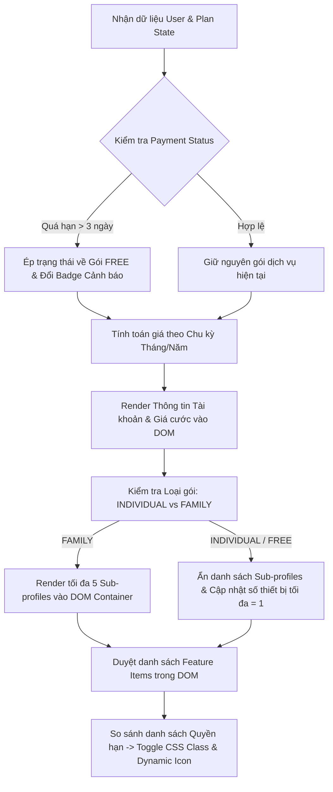

### 1. Mục tiêu bài tập
Sau khi hoàn thành bài tập này, học viên có thể:
- **Tối ưu hóa thao tác DOM**: Sử dụng thành thạo các phương thức truy xuất DOM (`getElementById`, `querySelector`, `querySelectorAll`, `children`, `closest`) để tương tác chính xác với các phần tử giao diện.
- **Biến đổi nội dung & Thuộc tính động**: Cập nhật văn bản (`textContent`), cấu trúc HTML (`innerHTML`), thay đổi class (`classList.add/remove/toggle`), và các thuộc tính dữ liệu (`setAttribute`, `dataset`, `disabled`).
- **Thiết kế Kiến trúc Mini Module**: Tổ chức mã nguồn JavaScript theo mô hình module logic (state-driven UI rendering) để xử lý việc render giao diện dựa trên dữ liệu cấu hình đầu vào.
- **Áp dụng Quy tắc Nghiệp vụ SaaS (Software-as-a-Service)**: Lập trình logic quản lý gói đăng ký dịch vụ, phân quyền tính năng (Feature Gate), tính toán chiết khấu chu kỳ thanh toán và xử lý hạ cấp gói khi quá hạn thanh toán.
- **Đảm bảo An toàn dữ liệu DOM**: Phòng tránh các lỗi tiềm ẩn như truy xuất phần tử `null`/`undefined` và ngăn chặn nguy cơ tấn công XSS (Cross-Site Scripting) khi chèn dữ liệu người dùng vào DOM.

---


### 2. Bối cảnh & Mô tả bài toán
Bạn là một Kỹ sư Phần mềm tại doanh nghiệp đang phát triển nền tảng phát nội dung số SaaS (tương tự Netflix/Canva). Hệ thống chuẩn bị ra mắt giao diện **Dashboard Quản lý Gói Dịch vụ & Phân quyền Tài khoản** (SaaS Subscription Manager & Feature Gate Visualizer).

Backend đã chuẩn bị sẵn khung trang HTML tĩnh (Skeleton Layout). Nhiệm vụ của bạn là thiết kế một **Mini Module JavaScript (Client-side Rendering Engine)** có khả năng nhận dữ liệu người dùng (`userData`) cùng gói dịch vụ (`planData`), truy xuất đến các phần tử DOM tương ứng và thực hiện cập nhật toàn bộ giao diện màn hình theo thời gian thực (được kích hoạt thông qua việc gọi hàm hệ thống).


#### Sơ đồ luồng xử lý dữ liệu và biến đổi DOM:



---


### 3. Quy tắc nghiệp vụ (Business Rules)


#### A. Quy tắc Chu kỳ Thanh toán & Định giá (Billing Cycle & Pricing)
1. **Chu kỳ Tháng (`MONTHLY`)**:
   - Hiển thị mức giá gốc niêm yết theo tháng.
   - Định dạng hiển thị tiền tệ: `[Số tiền] VNĐ/tháng` (Ví dụ: `260,000 VNĐ/tháng`).
2. **Chu kỳ Năm (`ANNUALLY`)**:
   - Áp dụng chương trình chiết khấu **20%** trên tổng giá trị 12 tháng.
   - Công thức tính tổng tiền năm: $\text{Giá năm} = (\text{Giá tháng} \times 12) \times 0.8$.
   - Cập nhật DOM: Hiển thị giá đã giảm, kèm theo thẻ badge `<span class="discount-tag">Tiết kiệm 20%</span>` và hiển thị mức giá gốc gạch ngang (`<del>[Giá gốc 12 tháng] VNĐ</del>`).


#### B. Quy tắc Giới hạn Thiết bị & Tài khoản phụ (Family Sub-Accounts)
1. **Gói Miễn phí (`FREE`) & Gói Cá nhân (`INDIVIDUAL`)**:
   - Giới hạn thiết bị xem đồng thời: **Tối đa 1 thiết bị**.
   - Không hỗ trợ tài khoản phụ (Sub-profiles). Ẩn hoặc xóa nội dung container chứa danh sách sub-profiles trong DOM.
2. **Gói Gia đình (`FAMILY`)**:
   - Giới hạn thiết bị xem đồng thời: **Tối đa 5 thiết bị**.
   - Hỗ trợ tối đa **5 tài khoản phụ**.
   - **Ràng buộc an toàn dữ liệu**: Nếu dữ liệu đầu vào chứa nhiều hơn 5 tài khoản phụ, module chỉ được phép render **5 tài khoản đầu tiên** lên DOM và phải ghi một cảnh báo (`console.warn`) ra log hệ thống.


#### C. Quy tắc Xử lý Quá hạn Thanh toán (Failed Payment Logic)
- Nếu thuộc tính `user.paymentStatus === 'FAILED_OVER_3_DAYS'`:
  - Tự động cưỡng chế chuyển gói dịch vụ của người dùng về `FREE` trên giao diện.
  - Cập nhật thẻ trạng thái thanh toán (`#payment-status-badge`) sang class `.badge-danger` với nội dung text: `"Tạm khóa do nợ cước quá 3 ngày"`.
  - Tắt toàn bộ các tính năng trả phí trên UI.


#### D. Quy tắc Kiểm soát Phân quyền (Feature Access Gate)
- Danh sách tất cả tính năng được khai báo sẵn trong DOM HTML gốc dưới dạng các phần tử có class `.feature-item` chứa thuộc tính `data-feature-key="..."`.
- So sánh thuộc tính `data-feature-key` của từng element với mảng tính năng được phép (`plan.allowedFeatures`):
  - **Nếu được phép**: Thêm class `.feature-active`, loại bỏ class `.feature-disabled`, đổi icon trạng thái (`.feature-icon`) thành `️` và text trạng thái (`.feature-status`) thành `"Đã kích hoạt"`.
  - **Nếu KHÔNG được phép**: Thêm class `.feature-disabled`, loại bỏ class `.feature-active`, đổi icon trạng thái (`.feature-icon`) thành `` và text trạng thái (`.feature-status`) thành `"Không khả dụng"`.

---


### 4. Yêu cầu kỹ thuật & Triển khai


#### A. Cấu trúc Khung HTML Tĩnh (Cho trước - Không sửa đổi trực tiếp file HTML)
Sinh viên căn cứ vào các ID và Selector trong đoạn HTML mẫu sau để thực hiện truy xuất DOM:

```html
<!-- Mẫu khung HTML cho trước -->
<div id="subscription-dashboard">
  <!-- Thẻ thông tin tài khoản -->
  <div class="user-card">
    <h2 id="user-display-name">--</h2>
    <span id="user-email">--</span>
    <div id="payment-status-badge" class="badge">--</div>
  </div>

  <!-- Thẻ thông tin gói dịch vụ -->
  <div class="plan-card">
    <h3 id="plan-title">--</h3>
    <div id="plan-price-container">
      <span id="plan-price-amount">--</span>
      <span id="plan-billing-cycle">--</span>
    </div>
    <p id="device-limit-info">--</p>
  </div>

  <!-- Khung tài khoản gia đình (Chỉ hiển thị khi dùng gói FAMILY) -->
  <div id="family-profiles-wrapper" class="hidden">
    <h4>Tài khoản gia đình thành viên (<span id="profile-count">0</span>/5)</h4>
    <ul id="family-profiles-list"></ul>
  </div>

  <!-- Danh sách tính năng hệ thống -->
  <div id="feature-matrix">
    <div class="feature-item" data-feature-key="STREAM_HD">
      <span class="feature-name">Phát video chất lượng HD</span>
      <span class="feature-icon">--</span>
      <span class="feature-status">--</span>
    </div>
    <div class="feature-item" data-feature-key="STREAM_4K">
      <span class="feature-name">Phát video chất lượng 4K Ultra HD</span>
      <span class="feature-icon">--</span>
      <span class="feature-status">--</span>
    </div>
    <div class="feature-item" data-feature-key="OFFLINE_DOWNLOAD">
      <span class="feature-name">Tải xuống xem ngoại tuyến</span>
      <span class="feature-icon">--</span>
      <span class="feature-status">--</span>
    </div>
    <div class="feature-item" data-feature-key="MULTI_DEVICE">
      <span class="feature-name">Phát đồng thời nhiều thiết bị</span>
      <span class="feature-icon">--</span>
      <span class="feature-status">--</span>
    </div>
  </div>
</div>
```


#### B. Phạm vi Kỹ thuật BẮT BUỘC & CẤM
- **ĐƯỢC PHÉP**: Sử dụng các phương thức DOM API thuộc Session 17 (`document.getElementById`, `querySelector`, `querySelectorAll`, `textContent`, `innerHTML`, `setAttribute`, `getAttribute`, `classList.add`, `classList.remove`, `classList.toggle`, `style.display`).
- **Nghiêm cấm tuyệt đối**:
  - Không sử dụng Event Listeners (`addEventListener`, `onclick`, `onchange`,...).
  - Không sử dụng Form submission (`onsubmit`).
  - Không sử dụng `fetch` / `axios` / `XMLHttpRequest`.
  - Không sử dụng `localStorage` / `sessionStorage` / `indexedDB`.
  - Không sửa đổi file HTML gốc; mọi thao tác biến đổi giao diện phải được thực thi bằng JavaScript.


#### C. Thiết kế JavaScript Module (`SaaSSubscriptionManager`)
Viết một Object hoặc Class tên là `SaaSSubscriptionManager` chứa các phương thức xử lý độc lập:

1. `init(userObject, planObject, billingCycle)`: Hàm khởi chạy chính nhận dữ liệu đầu vào và gọi các hàm render con.
2. `renderAccountInfo(user, effectivePlan)`: Cập nhật tên người dùng, email, badge trạng thái tài khoản. Dùng `textContent` để cập nhật tên/email nhằm chống đòn tấn công XSS.
3. `renderPricing(plan, billingCycle)`: Tính toán và render thông tin giá cước, thẻ tiết kiệm (nếu là chu kỳ năm).
4. `renderFamilySection(effectivePlan, profiles)`: Kiểm tra loại gói dịch vụ, ẩn/hiện container gia đình, render thẻ `<li>` chứa avatar và tên sub-profile (tối đa 5).
5. `applyFeatureGates(effectivePlan)`: Duyệt qua tất cả `.feature-item` trên DOM để toggle class và cập nhật icon/status.


#### D. Dữ liệu Mẫu (Mock Data để test thử module)
```javascript
const mockUser = {
  id: "USR-8892",
  displayName: "Nguyen Van A <script>alert('xss')</script>", // Test XSS safety
  email: "nguyenvana@example.com",
  paymentStatus: "PAID", // Hoặc "FAILED_OVER_3_DAYS"
  subProfiles: ["Vợ A", "Con Cả", "Con Thứ", "Bà Nội", "Ông Ngoại", "Chú 6"] // 6 profiles -> Phải cắt còn 5
};

const mockPlans = {
  FREE: {
    code: "FREE",
    name: "Gói Miễn Phí",
    monthlyPrice: 0,
    maxDevices: 1,
    allowedFeatures: ["STREAM_HD"]
  },
  INDIVIDUAL: {
    code: "INDIVIDUAL",
    name: "Gói Cá Nhân Premium",
    monthlyPrice: 180000,
    maxDevices: 1,
    allowedFeatures: ["STREAM_HD", "STREAM_4K", "OFFLINE_DOWNLOAD"]
  },
  FAMILY: {
    code: "FAMILY",
    name: "Gói Gia Đình Premium",
    monthlyPrice: 260000,
    maxDevices: 5,
    allowedFeatures: ["STREAM_HD", "STREAM_4K", "OFFLINE_DOWNLOAD", "MULTI_DEVICE"]
  }
};
```

---


### 5. Quy chuẩn nộp bài


#### Cấu trúc thư mục dự án:
```text
student-id_homework-13/
├── index.html          # File HTML gốc (giữ nguyên khung layout cho trước)
├── css/
│   └── style.css       # Các style cơ bản (.hidden, .badge-danger, .feature-disabled,...)
└── js/
    └── main.js         # File chứa module SaaSSubscriptionManager và lời gọi hàm kiểm thử
```


#### Quy định về mã nguồn trong `main.js`:
- Khai báo đầy đủ strict mode (`"use strict";`).
- Viết comment định rõ chức năng từng hàm bằng định dạng JSDoc ngắn gọn.
- Ở cuối file `main.js`, thực hiện gọi trực tiếp hàm kiểm thử để chứng minh module hoạt động ngay khi file script tải xong:
  ```javascript
  // Chạy kiểm thử hệ thống với dữ liệu mẫu
  SaaSSubscriptionManager.init(mockUser, mockPlans.FAMILY, "ANNUALLY");
  ```