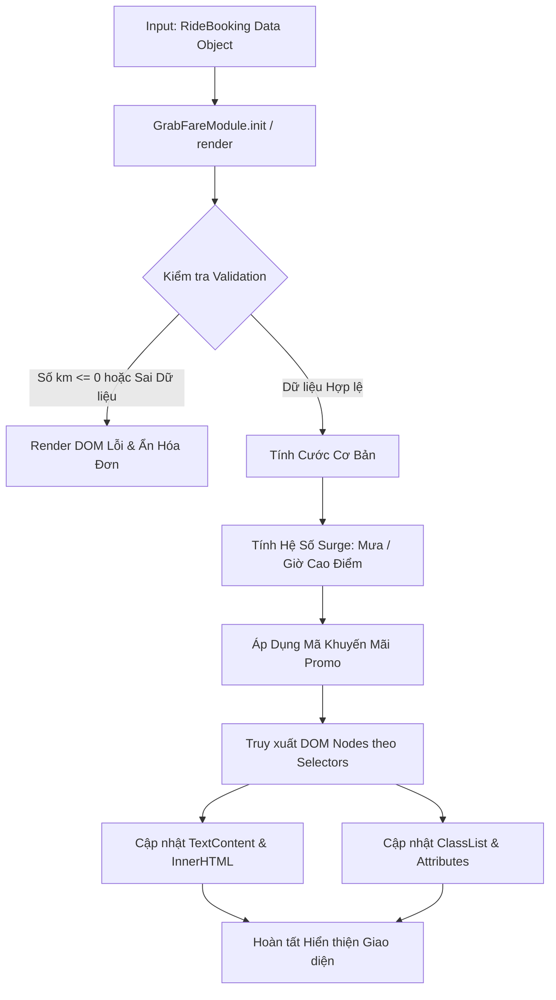

### 1. Mục tiêu bài tập
Sau khi hoàn thành bài tập này, học viên có khả năng:
- **Tư duy Kiến trúc & Thiết kế Mini Module**: Đóng gói toàn bộ logic tính toán và hiển thị thông tin chuyến đi vào một module JavaScript độc lập (`GrabFareModule`), áp dụng tư duy lập trình hướng đối tượng hoặc pattern phù hợp.
- **Truy xuất DOM nâng cao**: Thành thạo việc tìm kiếm và thao tác các DOM Nodes (`document.getElementById`, `querySelector`, `querySelectorAll`).
- **Thay đổi Nội dung & Thuộc tính**: Thao tác linh hoạt `textContent`, `innerHTML`, `setAttribute`, `src`, `classList` (`add`, `remove`, `toggle`) để cập nhật giao diện thời gian thực từ dữ liệu đối tượng.
- **Áp dụng Nghiệp vụ Thực tế**: Triển khai chính xác thuật toán tính toán cước phí GrabRide theo khoảng cách, hệ số thời tiết/giờ cao điểm và mã giảm giá.

---


### 2. Bối cảnh & Mô tả bài toán
Hệ thống gọi xe công nghệ **GrabRide** đang phát triển tính năng màn hình tóm tắt thông tin chuyến đi và chi tiết hóa đơn (Trip Receipts) cho hành khách sau khi chuyến đi hoàn tất. 

Bạn đóng vai trò là Frontend Developer đảm nhận xây dựng **Mini Module `GrabFareModule`**. Module này nhận vào một đối tượng chứa toàn bộ dữ liệu chuyến đi (`RideBooking`), xử lý tính toán các chi phí theo quy tắc nghiệp vụ, sau đó tự động truy xuất các thẻ DOM tương ứng trên trang HTML để render (hiển thị) thông tin tài xế, hành trình, chi tiết cước phí và áp dụng các trạng thái giao diện (CSS Status Badges).


#### Sơ đồ Luồng Xử lý của Module (Mermaid Workflow)



---


### 3. Quy tắc nghiệp vụ (Business Rules)


#### A. Công thức tính Giá cước Cơ bản ($BaseFare$) dựa trên Khoảng cách ($d$ km)
- **Kiểm tra hợp lệ**: Nếu $d \le 0$ hoặc không phải là số, coi như dữ liệu lỗi.
- **2 km đầu tiên**: Giá cố định là `12.000 VNĐ`.
- **Từ km thứ 3 trở đi**: Tính thêm `4.500 VNĐ/km` cho toàn bộ quãng đường vượt quá 2 km.
  $$\text{Ví dụ: } d = 5.5\text{ km} \rightarrow BaseFare = 12.000 + (5.5 - 2) \times 4.500 = 12.000 + 15.750 = 27.750\text{ VNĐ.}$$


#### B. Phụ phí & Hệ số Nhân Cước (Surge Pricing Multiplier)
- **Điều kiện thời tiết (Trời mưa - `isRain: true`)**: Áp dụng hệ số nhân `1.2x`.
- **Điều kiện giờ cao điểm (`isPeakHour: true`)**: Áp dụng hệ số nhân `1.2x`.
- **Lưu ý cộng dồn hệ số**: Nếu vừa trời mưa VỪA là giờ cao điểm, hệ số nhân tổng hợp $SurgeMultiplier = 1.2 \times 1.2 = 1.44$. Nếu không có điều kiện nào, $SurgeMultiplier = 1.0$.
  $$\text{Cước sau Surge} = BaseFare \times SurgeMultiplier$$


#### C. Mã Giảm giá (Promo Discount)
Hệ thống hỗ trợ 2 mã giảm giá cố định (chuyển về chữ hoa khi kiểm tra):
- Mã `"GRAB20"`: Giảm **20%** trên cước phí sau khi đã nhân hệ số Surge.
- Mã `"GRABNEW"`: Giảm trực tiếp **10.000 VNĐ**.
- Mã khác hoặc rỗng (`""`): Giảm **0 VNĐ**.
- *Lưu ý*: Tổng tiền thanh toán cuối cùng ($FinalFare$) sau khi trừ discount không được nhỏ hơn `0 VNĐ`.


#### D. Định dạng Tiền tệ
Mọi số tiền hiển thị ra DOM phải được định dạng theo chuẩn tiền tệ Việt Nam (Ví dụ: `27500` $\rightarrow$ `"27.500 VNĐ"` hoặc `"27,500 VNĐ"`).

---


### 4. Yêu cầu kỹ thuật & Triển khai


#### A. Cấu trúc Mã nguồn & Dữ liệu Mẫu (Data Model)
Học viên khai báo dữ liệu chuyến đi mẫu (`bookingData`) trong file `main.js`:

```javascript
const currentBooking = {
    bookingId: "GRB-2024-88921",
    passengerName: "Nguyễn Văn A",
    driver: {
        name: "Trần Văn Bắc",
        avatar: "https://via.placeholder.com/150",
        rating: 4.9,
        vehiclePlate: "29A-123.45",
        vehicleType: "GrabBike Premium"
    },
    distanceKm: 5.5,
    isRain: true,
    isPeakHour: true,
    promoCode: "GRAB20"
};
```


#### B. Thiết kế Mini Module `GrabFareModule`
Xây dựng một đối tượng/module `GrabFareModule` bao gồm các hàm phương thức chính:
1. `calculateFare(booking)`: Nhận vào `booking`, thực hiện toàn bộ logic nghiệp vụ (Mục 3) và trả về một đối tượng kết quả chứa các con số chi tiết (`baseFare`, `surgeMultiplier`, `surgeFare`, `discount`, `finalFare`, `isValid`).
2. `formatCurrency(amount)`: Hàm bổ trợ định dạng số thành chuỗi hiển thị tiền tệ VNĐ.
3. `render(booking)`: Hàm chính phụ trách thao tác DOM:
   - Nếu `booking` không hợp lệ ($distanceKm \le 0$): Thêm class `d-none` ẩn khung hóa đơn (`#receipt-card`), xóa class `d-none` hiển thị thẻ báo lỗi (`#error-card`) với nội dung lỗi phù hợp.
   - Nếu `booking` hợp lệ: Ẩn thẻ lỗi `#error-card`, hiển thị `#receipt-card`.
   - **Truy xuất và Thay đổi Nội dung DOM**:
     - Cập nhật Mã chuyến đi `#booking-id` và Tên hành khách `#passenger-name`.
     - Cập nhật thông tin tài xế: `#driver-name`, `#driver-plate`, `#driver-rating`, và gán thuộc tính `src`, `alt` cho thẻ `#driver-avatar` dùng `setAttribute`.
     - Cập nhật Số km di chuyển `#trip-distance` (Ví dụ: `"5.5 km"`).
     - Cập nhật Cước phí cơ bản `#base-fare`.
     - Cập nhật Thẻ phụ phí `#surge-badge`:
       - Nếu có surge ($SurgeMultiplier > 1.0$): Thêm class `bg-warning`, cập nhật `textContent` hiển thị hệ số (VD: `"Phụ phí cao điểm/mưa (x1.44)"`).
       - Nếu không có surge: Thêm class `bg-secondary`, hiển thị `"Giá thường (x1.0)"`.
     - Cập nhật Mã giảm giá & Số tiền giảm `#promo-info` (Ví dụ: `"GRAB20 (-5.500 VNĐ)"` hoặc `"Không áp dụng"`).
     - Cập nhật Tổng tiền cuối cùng `#total-fare` bằng `innerHTML` với thẻ `<span>` tô đậm màu xanh thương hiệu Grab.


#### C. Phạm vi CẤM (Forbidden Scope)
-  **KHÔNG** sử dụng Event Listeners (`addEventListener`, `onclick`, `onchange`, ...).
-  **KHÔNG** sử dụng Form Submit.
-  **KHÔNG** sử dụng `fetch`, `axios` hoặc `localStorage`.
-  Việc chạy Module để render giao diện được kích hoạt bằng cách gọi trực tiếp hàm `GrabFareModule.render(currentBooking)` ở cuối file `main.js`.

---


### 5. Quy chuẩn nộp bài


#### A. Cấu trúc thư mục dự án
```text
exercise-13-grab-ride/
├── index.html
├── css/
│   └── style.css
└── js/
    └── main.js
```


#### B. Quy định mã nguồn
- Thẻ HTML phải chuẩn bị sẵn khung giao diện bao gồm các Element có `id` trùng khớp với mô tả trong bài tập.
- Mã JavaScript phải tuân thủ chuẩn ES6+, trình bày sạch sẻ, có comment đầy đủ giải thích các bước tính toán nghiệp vụ và thao tác DOM API.