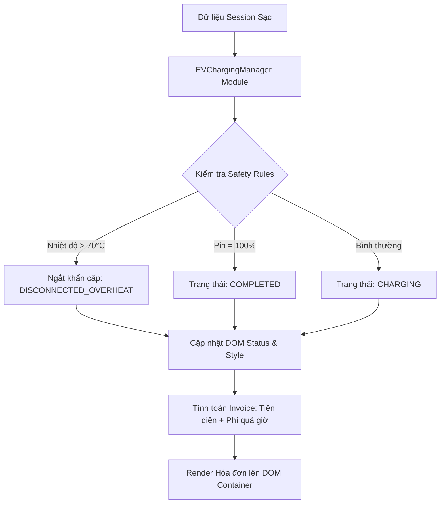

### 1. Mục tiêu bài tập
- **Thiết kế Kiến trúc Mini-Module JavaScript**: Áp dụng mô hình đóng gói (Module Pattern / Class Namespace) để quản lý toàn bộ logic tương tác và cập nhật giao diện người dùng (UI) cho hệ thống quản lý trạm sạc.
- **Thao tác DOM API Nâng cao**: Thực hành truy xuất phần tử DOM (`querySelector`, `querySelectorAll`, `getElementById`), khởi tạo phần tử động (`createElement`, `appendChild`), và cập nhật nội dung/thuộc tính (`textContent`, `innerHTML`, `setAttribute`, `classList`).
- **Xử lý Logic Nghiệp vụ FinTech**: Xây dựng thuật toán tính toán chi phí sạc xe điện, tính phí phạt đỗ xe quá giờ, kiểm soát giới hạn an toàn nhiệt độ/dung lượng pin và phản ánh tức thì trạng thái lên giao diện trực quan.

---


### 2. Bối cảnh & Mô tả bài toán
Tập đoàn VinFast triển khai hệ thống quản lý trạm sạc xe điện thông minh **EV_CHARGING_STATION**. Tại mỗi trạm sạc, màn hình giám sát trung tâm (Dashboard) cần cập nhật liên tục thông tin của từng cổng sạc (`ChargingPort`), phiên sạc hiện tại (`VehicleSession`), chỉ số điện năng tiêu thụ (`KwhMeter`), và xuất hóa đơn thanh toán (`ChargingInvoice`).

Bạn được giao nhiệm vụ xây dựng **Mini-Module `EVChargingManager`** bằng JavaScript thuần. Module này nhận dữ liệu giám sát và trực tiếp thao tác lên cây DOM để render danh sách cổng sạc, thay đổi màu sắc/nội dung hiển thị theo trạng thái thực tế, và tự động tạo hóa đơn thanh toán khi kết thúc phiên sạc.



---


### 3. Quy tắc nghiệp vụ (Business Rules)


#### A. Đơn giá sạc & Loại cổng sạc (`ChargingPort`)
- **Sạc thường (`STANDARD`)**: `3.850` VNĐ / kWh.
- **Sạc siêu nhanh (`SUPER_FAST`)**: `4.500` VNĐ / kWh.


#### B. Quy tắc tính phí phạt đỗ xe sau sạc (`Overstay Penalty`)
- Phí đỗ xe chỉ áp dụng khi pin đã đạt **100%** nhưng xe vẫn chiếm dụng cổng sạc.
- **Thời gian miễn phí**: `30 phút` đầu tiên kể từ khi pin đạt 100%.
- **Từ phút thứ 31 trở đi**: Tính phí phạt **`1.000` VNĐ / phút**.
- Công thức: `Phí phạt = max(0, Thời gian đỗ - 30) * 1.000` VNĐ.


#### C. Quy tắc An toàn Trạm sạc (`Safety Rules`)
1. **Quá nhiệt (`Nhiệt độ > 70°C`)**:
   - Tự động ngắt sạc khẩn cấp.
   - Trạng thái cổng sạc đổi thành: `"CẢNH BÁO QUÁ NHIỆT"`.
   - CSS Badge đổi sang màu đỏ nguy hiểm (`bg-danger` / `border-danger`).
2. **Đầy pin (`Pin = 100%`)**:
   - Ngắt sạc hoàn tất.
   - Trạng thái cổng sạc đổi thành: `"HOÀN THÀNH"`.
   - CSS Badge đổi sang màu xanh thành công (`bg-success`).
3. **Đang sạc (`Pin < 100%` và `Nhiệt độ <= 70°C`)**:
   - Trạng thái cổng sạc đổi thành: `"ĐANG SẠC"`.
   - CSS Badge đổi sang màu xanh dương hoạt động (`bg-primary`).


#### D. Công thức tính Hóa đơn Thanh toán (`ChargingInvoice`)
- `Tiền điện = Điện năng tiêu thụ (kWh) * Đơn giá theo loại cổng`
- `Phí quá giờ = Công thức ở mục B`
- `Tổng tiền thanh toán = Tiền điện + Phí quá giờ`
- **Định dạng tiền tệ**: Tất cả số tiền hiển thị trên DOM phải được định dạng theo chuẩn Việt Nam Đồng (Ví dụ: `195.000 VNĐ`).

---


### 4. Yêu cầu kỹ thuật & Triển khai

> **LƯU Ý ĐẶC BIỆT**: Bài tập này nằm ở **Session 17**. Tuyệt đối **KHÔNG** sử dụng:
> - Event Listeners (`addEventListener`, `onclick` HTML attributes).
> - Form submission events.
> - `fetch API` / `axios` / `LocalStorage`.
> 
> Việc cập nhật DOM sẽ được thực thi thông qua các phương thức của Module `EVChargingManager` được gọi trực tiếp bằng mã lệnh JavaScript.


#### A. Cấu trúc DOM mẫu giả định (`index.html`)
Mã HTML ban đầu cần có các container để chứa dữ liệu:
```html
<div class="container">
  <h1>HỆ THỐNG QUẢN LÝ TRẠM SẠC VINFAST EV</h1>
  
  <!-- Container chứa danh sách thẻ cổng sạc -->
  <div id="charging-ports-container" class="ports-grid"></div>

  <!-- Container chứa hóa đơn thanh toán -->
  <div id="invoices-container" class="invoices-list"></div>
</div>
```


#### B. Thiết kế Mini-Module `EVChargingManager`
Sinh viên khởi tạo một Object/Class đóng gói các phương thức xử lý DOM sau:

1. **`EVChargingManager.init(portsData)`**:
   - Nhận mảng danh sách các cổng sạc ban đầu.
   - Xóa trắng `charging-ports-container`.
   - Duyệt mảng và gọi hàm `renderPortCard` để chèn HTML cổng sạc vào DOM.

2. **`EVChargingManager.renderPortCard(port)`**:
   - Khởi tạo phần tử `div` làm thẻ hiển thị thông tin cổng sạc (`port-card`).
   - Kiểm tra các quy tắc an toàn (Nhiệt độ & Pin) để xác định trạng thái UI (thêm class CSS tương ứng).
   - Đổ nội dung HTML bao gồm: Mã cổng, Loại cổng, % Pin, Nhiệt độ (°C), Điện năng đã sạc (kWh), và Trạng thái.
   - Sử dụng `appendChild` để thêm card vào `#charging-ports-container`.

3. **`EVChargingManager.updatePortSession(portId, updatedData)`**:
   - Tìm kiếm phần tử DOM của cổng sạc dựa trên `data-port-id` hoặc `id`.
   - Cập nhật các giá trị `textContent` của % Pin, Nhiệt độ, kWh.
   - Đánh giá lại các Quy tắc An toàn (Safety Rules) và cập nhật class/màu sắc trạng thái (`classList.remove`, `classList.add`).

4. **`EVChargingManager.generateInvoiceDOM(portData)`**:
   - Tính toán `Tiền điện`, `Phí quá giờ`, và `Tổng tiền`.
   - Sử dụng `document.createElement` để tạo block HTML hiển thị Hóa đơn thanh toán (`ChargingInvoice`).
   - Gắn thuộc tính `data-invoice-id` cho hóa đơn.
   - Chèn hóa đơn vào `#invoices-container`.


#### C. Dữ liệu thử nghiệm (Test Dataset)
Hãy thực thi kiểm thử module của bạn với tập dữ liệu mẫu sau trong `main.js`:

```javascript
const initialPorts = [
  {
    portId: "PORT_01",
    type: "STANDARD",
    batteryPct: 65,
    temperature: 42,
    currentKwh: 14.5,
    overstayMins: 0
  },
  {
    portId: "PORT_02",
    type: "SUPER_FAST",
    batteryPct: 100,
    temperature: 48,
    currentKwh: 45.0,
    overstayMins: 45 // Đỗ quá 45 phút (vượt 15 phút so với định mức 30 phút)
  },
  {
    portId: "PORT_03",
    type: "SUPER_FAST",
    batteryPct: 82,
    temperature: 73, // Vượt quá 70°C -> Quá nhiệt
    currentKwh: 30.0,
    overstayMins: 0
  }
];

// Khởi chạy Module
EVChargingManager.init(initialPorts);

// Giả lập cập nhật dữ liệu DOM sau khi sạc thêm
EVChargingManager.updatePortSession("PORT_01", {
  batteryPct: 100,
  temperature: 45,
  currentKwh: 22.0,
  overstayMins: 35
});

// Giả lập xuất hóa đơn cho PORT_02 và PORT_01
EVChargingManager.generateInvoiceDOM(initialPorts[1]);
```

---


### 5. Quy chuẩn nộp bài


#### A. Cấu trúc thư mục project
```text
HW14_EV_CHARGING_STATION/
├── index.html
├── style.css
└── main.js
```


#### B. Quy định mã nguồn
- Mã nguồn JavaScript tuân thủ tiêu chuẩn ES6+, viết mã sạch (Clean Code), có comment giải thích rõ ràng các hàm xử lý DOM.
- Tách biệt rõ phần tính toán nghiệp vụ (Business Logic) và phần thao tác cập nhật giao diện (DOM Manipulation).