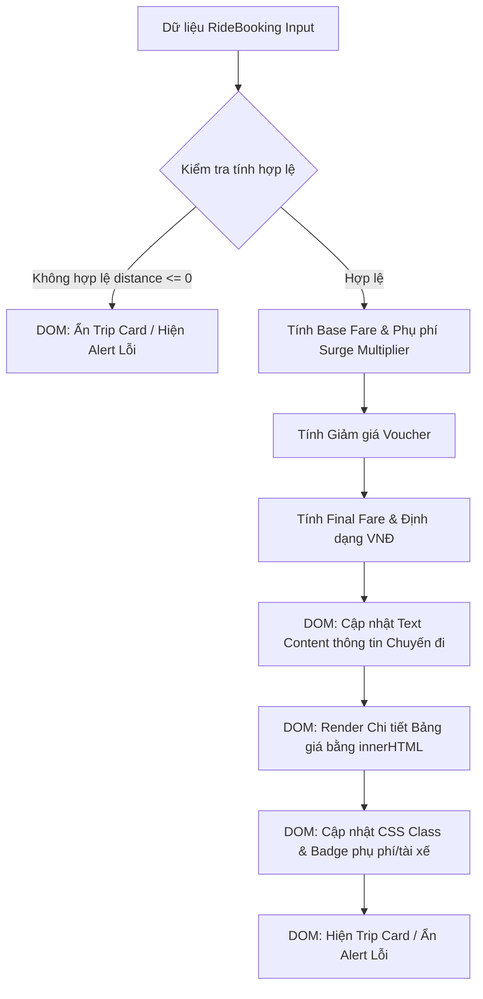

### 1. Mục tiêu bài tập
- **Ứng dụng DOM Manipulation nâng cao**: Thành thạo việc truy xuất (`getElementById`, `querySelector`, `querySelectorAll`), đọc/ghi thuộc tính DOM (`textContent`, `innerHTML`, `setAttribute`, `style`, `classList`) để hiển thị dữ liệu động lên giao diện Web.
- **Tư duy thiết kế Mini Module UI/UX**: Xây dựng module hiển thị thông tin chuyến đi công nghệ (GrabRide Dashboard Card) theo định dạng dữ liệu đầu vào động mà không phụ thuộc vào bắt sự kiện người dùng (không dùng Event Listener / Form submit).
- **Áp dụng Business Rules ngành Booking/Ride-Hailing**: Tính toán chính xác giá cước di chuyển, hệ số thời tiết/giờ cao điểm, chiết khấu mã giảm giá và render chính xác trạng thái lên giao diện.
- **Xử lý trạng thái giao diện & Ngoại lệ**: Chuyển đổi linh hoạt giữa màn hình thông tin hợp lệ và màn hình thông báo lỗi/chờ (fallback UI).


### 2. Bối cảnh & Mô tả bài toán
Trong hệ thống đặt xe công nghệ **GrabRide**, sau khi hệ thống backend xử lý dữ liệu chuyến đi, thông tin booking sẽ được chuyển cho Mini Module giao diện người dùng (Frontend DOM Renderer) để hiển thị thẻ tóm tắt chuyến đi (Ride Summary Dashboard).

Bạn được giao nhiệm vụ viết một Mini Module JavaScript thuần (`grabRideRenderer.js`) nhận vào một đối tượng thông tin chuyến đi `RideBooking` và thực thi cập nhật toàn bộ cấu trúc giao diện HTML sẵn có mà không được sử dụng các sự kiện người dùng (`addEventListener`, `onsubmit`,...) hay lưu trữ local storage. Module này có trách nhiệm tính toán giá trị cuối cùng và thao tác trực tiếp trên DOM Tree để render kết quả trực quan cho hành khách.


#### Luồng xử lý dữ liệu & Cập nhật DOM:



---


### 3. Quy tắc nghiệp vụ (Business Rules)


#### A. Công thức tính cước phí chuyến đi (Trip Fare Calculation):
1. **Giá cước cơ bản (Base Fare)** theo quãng đường ($d$ tính bằng km):
   - $d \le 2$ km: Giá cố định **12.000 VNĐ**.
   - $d > 2$ km: Giá = $12.000 + (d - 2) \times 4.500$ VNĐ.
2. **Hệ số phụ phí (Surge Multiplier)**:
   - Hệ số ban đầu: $M = 1.0$.
   - Nếu là giờ cao điểm (`isPeakHour = true`): $M = M \times 1.2$.
   - Nếu trời mưa (`isRainy = true`): $M = M \times 1.2$.
   - Tổng cước sau phụ phí: $\text{Fare}_{\text{surge}} = \text{Math.round}(\text{Base Fare} \times M)$.
3. **Mã giảm giá (Promo Voucher)**:
   - Mã `"GRABXANH"`: Giảm trực tiếp **10.000 VNĐ**.
   - Mã `"TEACHERCHILL"`: Giảm **20%** trên tổng cước sau phụ phí (Tối đa giảm **15.000 VNĐ**).
   - Các mã khác hoặc không nhập: Giảm **0 VNĐ**.
4. **Cước phí thanh toán cuối cùng (Final Fare)**:
   - $\text{Final Fare} = \text{Math.max}(0, \text{Fare}_{\text{surge}} - \text{Discount})$.


#### B. Quy tắc hiển thị UI/DOM:
1. **Kiểm tra dữ liệu đầu vào (Validation & Fallback UI)**:
   - Nếu Quãng đường `distance` $\le 0$ hoặc không phải là số:
     - Element `#error-banner` được đổi hiển thị `display: block` và chứa text lỗi: `"Lỗi: Quãng đường di chuyển không hợp lệ!"`.
     - Element `#trip-card` được đổi hiển thị `display: none`.
   - Nếu dữ liệu hợp lệ: `#error-banner` nhận `display: none` và `#trip-card` nhận `display: block`.
2. **Hiển thị thông tin tài xế & hành khách**:
   - Element `#passenger-name-val`: Cập nhật tên hành khách.
   - Element `#driver-info-val`:
     - Nếu có tên tài xế (vd: `"Nguyễn Văn A"`): Cập nhật tên tài xế và xóa class `text-warning`, thêm class `text-success`.
     - Nếu `driverName` là `null` hoặc chuỗi rỗng: Cập nhật text `"Đang tìm tài xế..."`, xóa class `text-success`, thêm class `text-warning`.
3. **Hiển thị Surge Badge (Hệ số tăng giá)**:
   - Element `#surge-badge`:
     - Nếu $M > 1.0$: Hiển thị text `"Phụ phí cao điểm/thời tiết (x" + M.toFixed(2) + ")"` và thêm class `badge-danger`.
     - Nếu $M = 1.0$: Hiển thị text `"Giá tiêu chuẩn"` và thêm class `badge-info`.
4. **Chi tiết chi phí (Itemized Breakdown List)**:
   - Render danh sách `<li>` vào trong Element `#breakdown-list` bằng `innerHTML`:
     - `<li>Cước cơ bản (X.X km): YYY VNĐ</li>`
     - `<li>Tăng giá thời tiết/giờ cao điểm: +YYY VNĐ</li>`
     - `<li>Giảm giá voucher (Mã): -YYY VNĐ</li>`
   - *Lưu ý: Tất cả số tiền cần được định dạng chuẩn Việt Nam Đồng (Ví dụ: `25.500 VNĐ`).*

---


### 4. Yêu cầu kỹ thuật & Triển khai


#### A. Cấu trúc file HTML chuẩn bị sẵn (`index.html`):
```html
<!DOCTYPE html>
<html lang="vi">
<head>
  <meta charset="UTF-8">
  <title>GrabRide Booking Dashboard</title>
  <style>
    .hidden { display: none; }
    .badge-danger { background-color: #dc3545; color: white; padding: 4px 8px; border-radius: 4px; }
    .badge-info { background-color: #17a2b8; color: white; padding: 4px 8px; border-radius: 4px; }
    .text-success { color: #28a745; font-weight: bold; }
    .text-warning { color: #ffc107; font-weight: bold; }
    .error-box { background-color: #f8d7da; color: #721c24; padding: 15px; border-radius: 4px; }
    .card { border: 1px solid #ccc; padding: 20px; border-radius: 8px; width: 400px; }
  </style>
</head>
<body>
  <h2>Hệ Thống Quản Lý Chuyến Đi GrabRide</h2>

  <!-- Error Alert Container -->
  <div id="error-banner" class="error-box" style="display: none;"></div>

  <!-- Trip Summary Dashboard Card -->
  <div id="trip-card" class="card" style="display: none;">
    <h3 id="booking-id-val">Mã chuyến: -</h3>
    <p>Hành khách: <span id="passenger-name-val"></span></p>
    <p>Tài xế: <span id="driver-info-val"></span></p>
    <p>Quãng đường: <span id="distance-val"></span> km</p>
    <p>Trạng thái cước: <span id="surge-badge"></span></p>
    
    <h4>Chi tiết giá cước:</h4>
    <ul id="breakdown-list"></ul>

    <h3>Tổng thanh toán: <span id="final-fare-val" style="color: #00b14f;"></span></h3>
  </div>

  <script src="./grabRideRenderer.js"></script>
</body>
</html>
```


#### B. Nhiệm vụ của học viên trong file `grabRideRenderer.js`:
Viết hàm `renderGrabRideDashboard(bookingData)` và các hàm bổ trợ (helper functions) theo đúng thiết kế dưới đây:

```javascript
/**
 * Module render bảng điều khiển chuyến đi GrabRide
 * @param {Object} bookingData - Đối tượng thông tin booking từ backend
 */
function renderGrabRideDashboard(bookingData) {
  // 1. DOM Element Retrieval (Truy xuất các phần tử DOM)
  // 2. Validate input logic -> Cập nhật hiển thị #error-banner hoặc #trip-card
  // 3. Tính toán các thông số cước phí (Base fare, surge multiplier, discount, final fare)
  // 4. Cập nhật Text Content & Attributes (passenger, driver, distance, final fare)
  // 5. Cập nhật Style & Class List (surge badge status, driver status color)
  // 6. Cập nhật innerHTML cho danh sách #breakdown-list
}

// FORMAT CURRENCY UTILITY
function formatVND(amount) {
  return new Intl.NumberFormat('vi-VN').format(amount) + ' VNĐ';
}

// TEST CASES SIMULATION (Gọi trực tiếp hàm render để kiểm thử giao diện)
const mockBookingSuccess = {
  bookingId: "GRB-88992",
  passengerName: "Trần Thị Ánh",
  driverName: "Lê Văn Tùng",
  distanceKm: 5.5,
  isRainy: true,
  isPeakHour: false,
  promoCode: "TEACHERCHILL"
};

// Chạy test hiển thị thành công:
renderGrabRideDashboard(mockBookingSuccess);
```


#### C. Ràng buộc kỹ thuật nghiêm ngặt:
- **TỔNG CẤM**: Không được sử dụng `addEventListener`, `onclick`, `onsubmit`, `fetch`, `XMLHttpRequest`, `localStorage`, `sessionStorage`.
- Chỉ thao tác DOM thông qua các phương thức được học trong Session 17: `getElementById`, `querySelector`, `querySelectorAll`, `textContent`, `innerText`, `innerHTML`, `setAttribute`, `removeAttribute`, `style`, `classList` (`add`, `remove`, `replace`).
- Phải format tiền tệ rõ ràng theo định dạng `X.XXX VNĐ`.

---


### 5. Quy chuẩn nộp bài
- **Cấu trúc thư mục**:
  ```text
  student-id_homework_14/
  ├── index.html
  └── grabRideRenderer.js
  ```
- **Quy định đặt tên file**:
  - Mã bài tập: `HW14_GRABRIDE_DOM`.
  - Đóng gói thư mục dưới dạng `.zip` và nộp lên hệ thống LMS theo đúng thời hạn.
  - Code phải được format sạch sẻ (Prettier), có comment giải thích các bước truy xuất và thao tác DOM.