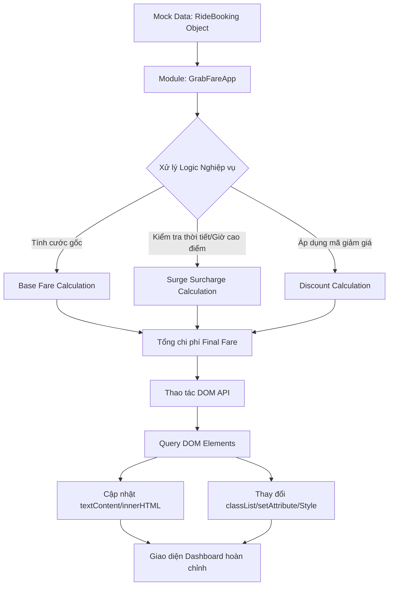

### 1. Mục tiêu bài tập
- **Truy xuất và thao tác DOM Tree:** Thành thạo các phương thức tìm kiếm và bóc tách Element (`getElementById`, `querySelector`, `querySelectorAll`).
- **Thay đổi nội dung & Thuộc tính:** Sử dụng linh hoạt `textContent`, `innerHTML`, `setAttribute`, `classList` (add, remove, toggle) và thay đổi Inline Style để cập nhật giao diện realtime.
- **Thiết kế Mini Module:** Tổ chức mã nguồn JS theo kiến trúc Module (Namespace Object / Clean Code), tách biệt rõ ràng giữa phần xử lý logic tính toán cước phí và phần hiển thị dữ liệu ra DOM.
- **Tư duy lập trình sản thực tế:** Áp dụng các quy tắc nghiệp vụ thực tế của ứng dụng gọi xe công nghệ (GrabRide) trong việc hiển thị hóa đơn, phụ phí thời tiết và thông tin tài xế.

---


### 2. Bối cảnh & Mô tả bài toán
Bạn là một Kỹ sư Phần mềm tại **GrabRide**. Đội ngũ UI/UX vừa bàn giao giao diện HTML/CSS mẫu cho màn hình **"Tóm tắt Hóa đơn & Thông tin Tài xế"** trên Web Dashboard. 

Nhiệm vụ của bạn là xây dựng một **Mini Module JavaScript** để tiếp nhận dữ liệu chuyến đi (mock data), thực hiện tính toán cước phí theo đúng quy tắc nghiệp vụ, sau đó **truy xuất và cập nhật trực tiếp toàn bộ thông tin lên giao diện DOM** mà chưa cần dùng đến sự kiện (Event Listeners).



---


### 3. Quy tắc nghiệp vụ (Business Rules)


#### A. Công thức tính cước phí (TripFare)
1. **Giá cước cơ bản (Base Fare):**
   - 2 km đầu tiên: Tính giá cố định **12.000 VNĐ**.
   - Từ km thứ 3 trở đi: Tính **4.500 VNĐ / km** cho khoảng cách vượt quá 2 km.
   - *Ví dụ:* Khoảng cách 5 km $\rightarrow$ 2 km đầu (12.000) + 3 km sau ($3 \times 4.500 = 13.500$) = **25.500 VNĐ**.

2. **Phụ phí thời tiết / Giờ cao điểm (Surge Surcharge):**
   - Nếu `isPeakHour` hoặc `isRaining` bằng `true`: Tự động áp dụng hệ số nhân **1.2x** trên tổng giá cước cơ bản.
   - Số tiền phụ phí = $\text{Giá cước cơ bản} \times 0.2$.

3. **Mã khuyến mãi (Discount Code):**
   - Mã `GRABNEW`: Giảm 20% trên tổng tiền (Cước cơ bản + Phụ phí), giảm tối đa **15.000 VNĐ**.
   - Mã `XEMAY10`: Giảm trực tiếp **10.000 VNĐ**.
   - Mã không hợp lệ hoặc không có: Giảm **0 VNĐ**.

4. **Tổng tiền thanh toán cuối cùng (Final Fare):**
   $$\text{Final Fare} = \max(0, \text{Base Fare} + \text{Surcharge} - \text{Discount})$$


#### B. Định dạng và Hiển thị
- Toàn bộ giá tiền hiển thị ra màn hình phải được định dạng theo chuẩn tiền tệ Việt Nam (Ví dụ: `25.500 VNĐ`).
- Trạng thái chuyến đi (`status`) quy định màu sắc và nội dung Badge:
  - `"COMPLETED"`: Thêm class `badge-success`, chữ hiển thị **"Hoàn thành"**.
  - `"IN_PROGRESS"`: Thêm class `badge-warning`, chữ hiển thị **"Đang di chuyển"**.
  - `"CANCELLED"`: Thêm class `badge-danger`, chữ hiển thị **"Đã hủy"**.

---


### 4. Yêu cầu kỹ thuật & Triển khai


#### A. Mã nguồn HTML Mẫu (`index.html`)
Học viên tạo file `index.html` với cấu trúc ID và Class cố định như sau:

```html
<!DOCTYPE html>
<html lang="vi">
<head>
    <meta charset="UTF-8">
    <title>GrabRide - Summary Dashboard</title>
    <link rel="stylesheet" href="style.css">
</head>
<body>
    <div id="booking-card" class="card">
        <!-- Header status -->
        <div class="card-header">
            <h2>Mã chuyến đi: <span id="booking-id">#---</span></h2>
            <span id="booking-status-badge" class="badge">Đang tải...</span>
        </div>

        <!-- Driver Info -->
        <div class="driver-section">
            
            <div>
                <h3 id="driver-name">Tên tài xế</h3>
                <p>Biển số: <span id="driver-plate">---</span></p>
                <p>Đánh giá: <span id="driver-rating">0.0</span> </p>
            </div>
        </div>

        <!-- Trip Details -->
        <div class="trip-details">
            <p>Khách hàng: <strong id="passenger-name">---</strong></p>
            <p>Khoảng cách: <span id="distance-val">0</span> km</p>
            <p>Trạng thái thời tiết: <span id="weather-info">---</span></p>
        </div>

        <!-- Fare Breakdown -->
        <div id="fare-container" class="fare-breakdown">
            <div class="fare-row"><span>Cước cơ bản:</span> <span id="base-fare">0 VNĐ</span></div>
            <div class="fare-row"><span>Phụ phí cao điểm/mưa:</span> <span id="surcharge-fare">0 VNĐ</span></div>
            <div class="fare-row"><span>Giảm giá (<span id="promo-code-applied">KTM</span>):</span> <span id="discount-fare">-0 VNĐ</span></div>
            <hr>
            <div class="fare-row total"><span>TỔNG THANH TOÁN:</span> <strong id="total-fare">0 VNĐ</strong></div>
        </div>

        <!-- Alert Notification area -->
        <div id="alert-box" class="alert hidden"></div>
    </div>

    <script src="main.js"></script>
</body>
</html>
```


#### B. Thiết kế Mini Module JavaScript (`main.js`)
Bạn cần tổ chức code theo đối tượng `GrabFareApp` bao gồm các phương thức bắt buộc sau:

1. `calculateFare(distance, isPeakOrRain, promoCode)`: Hàm thuần logic (Pure function) nhận vào khoảng cách (km), trạng thái thời tiết/giờ cao điểm (boolean), mã giảm giá (string). Trả về object chứa `{ baseFare, surcharge, discount, totalFare }`.
2. `renderDriverInfo(driverData)`: Truy xuất DOM và cập nhật thông tin tài xế (`#driver-name`, `#driver-plate`, `#driver-rating`, thuộc tính `src` của `#driver-avatar`).
3. `renderFareDetails(fareDetails, promoCode)`: Cập nhật các số tiền tương ứng vào các thẻ HTML (`#base-fare`, `#surcharge-fare`, `#discount-fare`, `#promo-code-applied`, `#total-fare`).
4. `renderStatusBadge(status)`: Thay đổi class và textContent cho `#booking-status-badge`.
5. `renderErrorMessage(message)`: Nếu khoảng cách $\le 0$, kích hoạt phần tử `#alert-box` (xóa class `hidden`, thêm class `alert-danger`, gán `textContent`), đồng thời ẩn bảng tính tiền `#fare-container` bằng thuộc tính `style.display = "none"`.
6. `init(bookingData)`: Hàm điều khiển chính (Controller) nhận dữ liệu chuyến đi, gọi các hàm render để hoàn tất hiển thị giao diện.


#### C. Dữ liệu thử nghiệm (Mock Data)
Thêm đoạn code mock data và lời gọi hàm khởi chạy ở cuối file `main.js`:

```javascript
// Mock Data đầu vào
const mockBookingData = {
    bookingId: "GRB-89234-VN",
    status: "COMPLETED", // "COMPLETED" | "IN_PROGRESS" | "CANCELLED"
    passengerName: "Nguyen Van A",
    distance: 7.5, // Số km (Thử nghiệm các trường hợp: 1.5, 7.5, 0, -3)
    isPeakOrRain: true,
    promoCode: "GRABNEW",
    driver: {
        name: "Trần Văn Tài",
        licensePlate: "29A-888.99",
        rating: 4.9,
        avatarUrl: "https://via.placeholder.com/80"
    }
};

// Khởi chạy Mini Module
GrabFareApp.init(mockBookingData);
```


#### D. Ràng buộc kỹ thuật nghiêm ngặt (Forbidden Scope)
- **TUYỆT ĐỐI KHÔNG** sử dụng Event Listener (`addEventListener`, `onclick`, `onsubmit`, v.v.).
- **TUYỆT ĐỐI KHÔNG** sử dụng `Fetch API`, `XMLHttpRequest` hay `LocalStorage`.
- Bắt buộc dùng đúng các phương thức DOM: `getElementById`, `querySelector`, `textContent`, `innerHTML`, `setAttribute`, `classList.add`, `classList.remove`, `style`.

---


### 5. Quy chuẩn nộp bài
- **Cấu trúc thư mục:**
  ```text
  [Họ_Và_Tên]_HW15/
  ├── index.html
  ├── style.css
  └── main.js
  ```
- File `main.js` cần được comment giải thích rõ từng phương thức và luồng xử lý DOM.
- Tên các thuộc tính/hàm phải tuân thủ đúng yêu cầu đề bài.