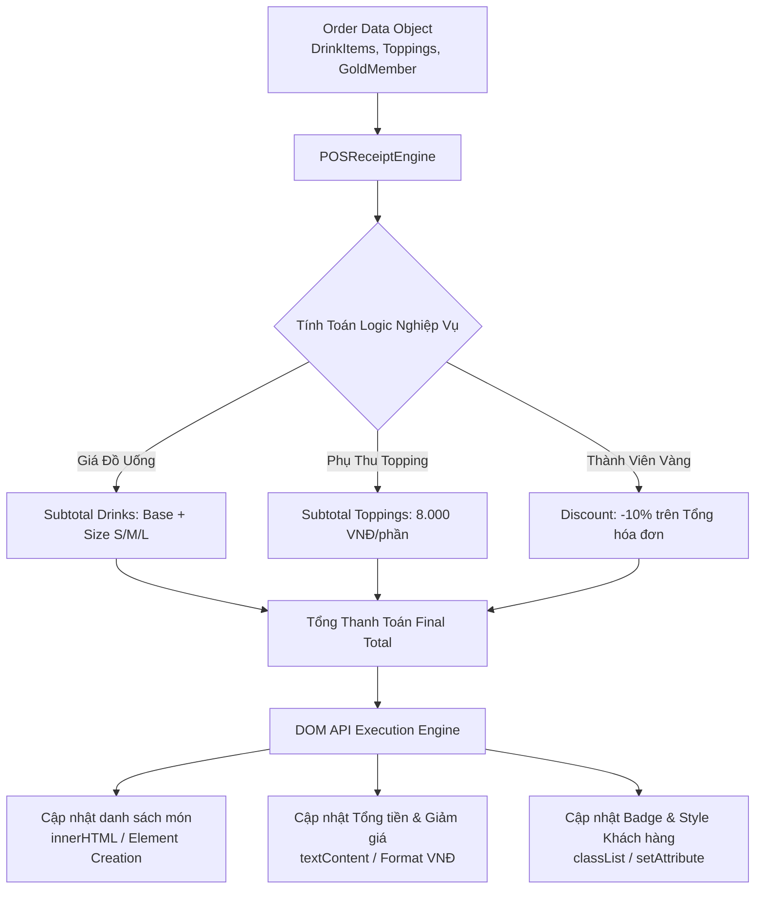

### 1. Mục tiêu bài tập
- **Tư duy kiến trúc Module DOM**: Thiết kế và tổ chức một mini JavaScript rendering engine độc lập để quản lý UI hiển thị hóa đơn thanh toán cho hệ thống POS (Point of Sale).
- **Thành thạo DOM Selection & Querying**: Áp dụng thành thạo các phương thức truy xuất phần tử DOM (`document.getElementById`, `document.querySelector`, `document.querySelectorAll`) với hiệu năng tối ưu.
- **Thao tác Nội dung & Thuộc tính DOM**: Thực hành việc cập nhật động dữ liệu lên màn hình thông qua `textContent`, `innerHTML`, `setAttribute`, `removeAttribute` và thao tác với `classList` (`add`, `remove`, `toggle`).
- **Xử lý Logic Nghiệp vụ & Format Dữ liệu**: Tính toán chuẩn xác các quy tắc nghiệp vụ ngành F&B/Retail và định dạng hiển thị tiền tệ (VND) trực tiếp trên cây DOM.

---


### 2. Bối cảnh & Mô tả bài toán
Chuỗi thương hiệu Cà phê & Trà sữa **Highlands POS** đang nâng cấp giao diện hiển thị màn hình phụ cho khách hàng (Customer-Facing Display - CFD) tại quầy thanh toán. Mỗi khi thu ngân thao tác chọn món trên POS, hệ thống sẽ đẩy một đối tượng dữ liệu order (Order Data Object) vào giao diện rendering engine.

Nhiệm vụ của bạn là xây dựng **Mini Module `POSReceiptEngine`** bằng JavaScript thuần. Module này có nhiệm vụ nhận dữ liệu đầu vào, tính toán các quy định chiết khấu/phụ thu, sau đó tiến hành truy xuất và cập nhật toàn bộ thông tin lên giao diện DOM Tree của hóa đơn một cách chính xác, minh bạch và chuyên nghiệp.



---


### 3. Quy tắc nghiệp vụ (Business Rules)
1. **Quy tắc Tính giá Kích thước Đồ uống (DrinkItem Size Extra Fee)**:
   - Kích thước **Size S**: Không tăng giá (+0 VNĐ).
   - Kích thước **Size M**: Tăng thêm **6.000 VNĐ** vào giá cơ bản của món.
   - Kích thước **Size L**: Tăng thêm **10.000 VNĐ** vào giá cơ bản của món.
   - *Công thức món:* `Giá 1 ly = (Giá_Gốc + Phụ_Thu_Size) * Số_Lượng`

2. **Quy tắc Phụ thu Topping (Topping Extra Fee)**:
   - Mỗi topping đi kèm có đơn giá cố định **8.000 VNĐ / phần**.
   - *Công thức Topping:* `Tổng tiền Topping = Số_Lượng_Topping * 8.000 VNĐ`

3. **Quy tắc Giảm giá Thành viên (Membership Discount)**:
   - Nếu `isGoldMember === true` (Thành viên Vàng): Giảm **10%** trên tổng giá trị đơn hàng (bao gồm đồ uống + topping).
   - *Công thức:*
     - `Tạm tính = Tổng tiền Đồ uống + Tổng tiền Topping`
     - `Tiền giảm giá = Tạm tính * 0.10` (nếu là Gold Member)
     - `Tổng thanh toán = Tạm tính - Tiền giảm giá`

4. **Quy tắc Định dạng & Hiển thị DOM**:
   - Mọi số tiền hiển thị ra DOM phải được định dạng chuẩn Việt Nam Đồng (Ví dụ: `59.000 VNĐ` hoặc `59,000 đ`).
   - Nếu khách hàng là **Thành viên Vàng**, phần tử HTML `#member-badge` phải gắn class `badge-gold`, xóa class `badge-standard`, và nội dung hiển thị: `"Thành Viên Vàng (-10%)"`.
   - Nếu **không phải Thành viên Vàng**, `#member-badge` gắn class `badge-standard`, xóa class `badge-gold`, nội dung: `"Khách Hàng Thường"`.

---


### 4. Yêu cầu kỹ thuật & Triển khai


#### 4.1. Cấu trúc DOM HTML Mẫu (`index.html`)
Bạn cần tạo file `index.html` với giao diện khung hóa đơn như sau:
```html
<div id="pos-receipt-app">
  <!-- Thẻ thông tin khách hàng -->
  <div class="customer-info">
    <span>Khách hàng: <strong id="customer-name">---</strong></span>
    <span id="member-badge" class="badge">---</span>
  </div>

  <!-- Danh sách đồ uống -->
  <ul id="drink-list" class="receipt-list"></ul>

  <!-- Danh sách topping -->
  <ul id="topping-list" class="receipt-list"></ul>

  <!-- Bảng tính tiền -->
  <div id="receipt-summary">
    <p>Tạm tính đồ uống: <span id="drinks-subtotal">0 VNĐ</span></p>
    <p>Tạm tính topping: <span id="toppings-subtotal">0 VNĐ</span></p>
    <p>Giảm giá thành viên: <span id="discount-amount">0 VNĐ</span></p>
    <hr />
    <h3>TỔNG THÁNH TOÁN: <span id="final-total">0 VNĐ</span></h3>
  </div>

  <!-- Thông báo trạng thái đơn hàng -->
  <div id="receipt-status" data-status="pending">Trạng thái: Chờ xử lý</div>
</div>
```


#### 4.2. Khai báo Đối tượng Dữ liệu Mẫu (Order Data)
```javascript
const sampleOrderData = {
  orderId: "HD-HIGHLANDS-9982",
  customerName: "Nguyễn Văn A",
  isGoldMember: true,
  drinks: [
    { id: "D1", name: "Trà Pốt Vải", size: "M", basePrice: 45000, quantity: 2 },
    { id: "D2", name: "Phin Sữa Đá", size: "L", basePrice: 35000, quantity: 1 }
  ],
  toppings: [
    { id: "T1", name: "Thạch Đào", quantity: 2 },
    { id: "T2", name: "Kem Cheese", quantity: 1 }
  ]
};
```


#### 4.3. Yêu cầu Cấu trúc Module JavaScript (`app.js`)
Xây dựng một Module Object tên là `POSReceiptEngine` chứa các phương thức xử lý DOM sau:

1. `POSReceiptEngine.formatCurrency(amount)`:
   - Nhận vào một số nguyên, trả về chuỗi tiền tệ định dạng `XX.XXX VNĐ`.

2. `POSReceiptEngine.renderDrinkList(drinks)`:
   - Truy xuất phần tử `#drink-list`.
   - Tạo các thẻ `<li>` hiển thị thông tin từng đồ uống dạng:  
     `[Tên món] (Size [Size]) x[Số lượng] - [Tổng tiền từng món] VNĐ`
   - Cập nhật danh sách vào DOM thông qua `innerHTML` hoặc thao tác node DOM.

3. `POSReceiptEngine.renderToppingList(toppings)`:
   - Truy xuất phần tử `#topping-list`.
   - Tạo các thẻ `<li>` hiển thị topping:  
     `Topping: [Tên Topping] x[Số lượng] - [Tổng tiền Topping] VNĐ`
   - Cập nhật danh sách vào DOM.

4. `POSReceiptEngine.updateCustomerBadge(customerName, isGoldMember)`:
   - Truy xuất `#customer-name` và cập nhật `textContent`.
   - Truy xuất `#member-badge`. Sử dụng `classList.add`, `classList.remove` để đổi trạng thái badge. Cập nhật `textContent` tương ứng.

5. `POSReceiptEngine.calculateAndRenderSummary(drinks, toppings, isGoldMember)`:
   - Tính toán đầy đủ: Tạm tính đồ uống, tạm tính topping, số tiền giảm giá, tổng thanh toán cuối cùng.
   - Truy xuất và dùng `textContent` cập nhật giá trị vào `#drinks-subtotal`, `#toppings-subtotal`, `#discount-amount`, `#final-total`.
   - Cập nhật thuộc tính `data-status` của `#receipt-status` thành `"rendered"` bằng `setAttribute`.

6. `POSReceiptEngine.init(orderData)`:
   - Phương thức khởi chạy chính, nhận `orderData` làm tham số và gọi lần lượt các hàm render/cập nhật ở trên để hoàn tất render giao diện.

> **CẤM SỬ DỤNG (FORBIDDEN SCOPE)**:
> - Không dùng Event Listeners (`addEventListener`, `onclick`, `onchange`).
> - Không dùng Form Submit.
> - Không dùng Fetch API hay AJAX.
> - Không dùng `localStorage` / `sessionStorage`.
> - *Mọi thao tác đều thực thi thông qua việc gọi hàm `POSReceiptEngine.init(sampleOrderData);` ngay sau khi DOM sẵn sàng.*

---


### 5. Quy chuẩn nộp bài
- **Cấu trúc thư mục dự án**:
  ```text
  student-id_pos-receipt-engine/
  ├── index.html
  ├── style.css (tùy chọn styling cho đẹp mắt)
  └── app.js
  ```
- **Quy định đặt tên**:
  - Mã bài tập: `POS_DOM_MODULE`
  - Tên file HTML: `index.html`
  - Tên file JS: `app.js`
- **Cách thức chạy bài**: File `app.js` được nhúng vào cuối file `index.html` (trước thẻ đóng `</body>`), tự động gọi `POSReceiptEngine.init(sampleOrderData)` để render giao diện ngay khi tải trang.