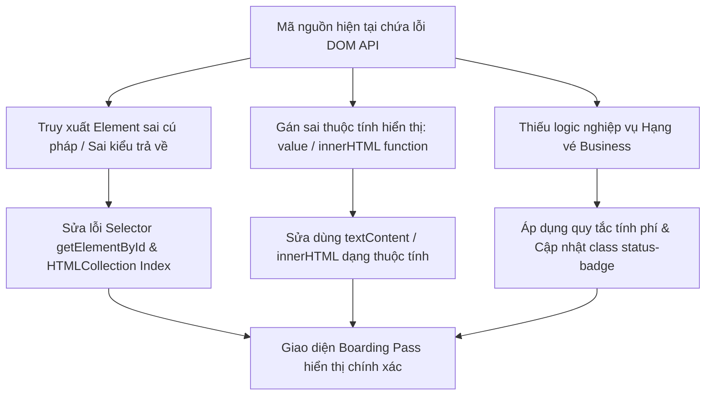

### 1. Mục tiêu bài tập
Sau khi hoàn thành bài tập debug này, học viên sẽ có khả năng:
- **Phát hiện và sửa lỗi truy xuất DOM**: Nhận biết điểm khác biệt giữa các phương thức chọn element (`getElementById`, `getElementsByClassName`, `querySelector`) và xử lý chính xác kiểu dữ liệu trả về (Element đơn lẻ vs HTMLCollection).
- **Thao tác nội dung HTML chuẩn xác**: Sử dụng đúng các thuộc tính `innerText`, `textContent`, `innerHTML` để hiển thị dữ liệu thay vì gán nhầm thuộc tính `.value` trên các thẻ không phải `input`.
- **Cập nhật thuộc tính & giao diện tĩnh**: Thao tác đúng với thuộc tính HTML (`disabled`, `removeAttribute`) và thêm/xóa CSS class thông qua `classList` thay vì gán trực tiếp vào object `style`.
- **Áp dụng nghiệp vụ Hàng không đơn giản**: Xử lý logic kiểm tra hạng vé (Business vs Eco) và tính toán phí hành lý quá cước để hiển thị chính xác trên giao diện DOM.

---


### 2. Bối cảnh & Mô tả bài toán
Bạn vừa gia nhập đội ngũ phát triển ứng dụng **Kiosk Check-in Tự Động** cho hãng hàng không. Hệ thống có nhiệm vụ hiển thị thông tin thẻ lên máy bay (Boarding Pass) của hành khách và tính toán phí hành lý ký gửi quá cước ngay trên giao diện màn hình cảm ứng.

Lập trình viên tập sự trước đó đã viết file HTML và JavaScript để hiển thị dữ liệu check-in của khách hàng. Tuy nhiên, đoạn mã JS liên tục gặp lỗi Runtime (`Uncaught TypeError: Cannot set properties of null`, `Uncaught TypeError: excessFeeElement.innerHTML is not a function`) làm cho màn hình check-in bị trắng thông tin hoặc hiển thị sai phí hành lý.

Nhiệm vụ của bạn là **tìm ra 6 lỗi sai** trong file script có sẵn, tiến hành sửa chữa (debug) và hoàn thiện các nghiệp vụ cập nhật DOM theo đúng yêu cầu.



---


### 3. Quy tắc nghiệp vụ (Business Rules)
1. **Quy định Hành lý ký gửi**:
   - Mỗi hành khách được miễn phí tối đa **7 kg** hành lý.
   - Nếu hành lý vượt quá 7 kg, số kg dư ra sẽ tính phí quá cước là **50.000 VNĐ / kg**.
2. **Đặc quyền Hạng vé Business**:
   - Nếu hành khách có hạng vé `Business`, toàn bộ hành lý ký gửi quá cước đều được **Miễn phí 100%** (Phí quá cước = `0 VNĐ`), bất kể cân nặng bao nhiêu.
   - Nếu hạng vé là `Eco`, áp dụng công thức tính phí quá cước thông thường.
3. **Cập nhật trạng thái Check-in trên DOM**:
   - Nếu Phí quá cước bằng `0 VNĐ`:
     - Nội dung thẻ `#status-badge`: `"Trạng thái: Đã xác nhận (Hợp lệ)"`.
     - Xóa lớp CSS cũ, thêm lớp CSS `badge-success` vào `#status-badge`.
     - Gỡ bỏ thuộc tính `disabled` trên nút `#btn-checkin` để cho phép khách bấm hoàn tất.
   - Nếu Phí quá cước lớn hơn `0 VNĐ`:
     - Nội dung thẻ `#status-badge`: `"Trạng thái: Chờ thanh toán quá cước"`.
     - Xóa lớp CSS cũ, thêm lớp CSS `badge-warning` vào `#status-badge`.
     - Giữ nguyên trạng thái `disabled` trên nút `#btn-checkin`.

---


### 4. Yêu cầu kỹ thuật & Triển khai


#### 4.1. Mã nguồn hiện tại bị lỗi (Cần Debug)

**File `index.html`:**
```html
<!DOCTYPE html>
<html lang="vi">
<head>
    <meta charset="UTF-8">
    <title>VietJet Airport Self Check-in</title>
    <style>
        .badge { padding: 8px 12px; border-radius: 4px; font-weight: bold; display: inline-block; }
        .badge-pending { background-color: #cccccc; color: #333333; }
        .badge-success { background-color: #28a745; color: white; }
        .badge-warning { background-color: #ffc107; color: black; }
    </style>
</head>
<body>
    <div id="boarding-pass">
        <h2>THÔNG TIN THẺ LÊN MÁY BAY</h2>
        <p>Mã PNR: <span id="pnr-code">---</span></p>
        <p>Hành khách: <span class="passenger-name">---</span></p>
        <p>Hạng vé: <span id="ticket-class">---</span></p>
        <p>Trọng lượng hành lý: <span id="baggage-weight">---</span> kg</p>
        <p>Phí quá cước: <span id="excess-fee">0</span> VNĐ</p>
        
        <div id="status-badge" class="badge badge-pending">Trạng thái: Chờ xử lý</div>
        <br><br>
        <button id="btn-checkin" disabled>Xác nhận Lấy Thẻ Boarding Pass</button>
    </div>

    <script src="./app.js"></script>
</body>
</html>
```

**File `app.js` (Chứa 6 lỗi kỹ thuật & nghiệp vụ):**
```javascript
// Dữ liệu mẫu đầu vào của hành khách
const passengerData = {
    pnr: "VJ8899",
    name: "NGUYEN VAN A",
    ticketClass: "Business", // Có thể là "Business" hoặc "Eco"
    baggageWeight: 12 // kg
};

// --- ĐOẠN CODE LỖI CẦN DEBUG ---

// Lỗi 1: Truy xuất DOM theo ID bị dư dấu #
const pnrElement = document.getElementById("#pnr-code");
pnrElement.innerText = passengerData.pnr;

// Lỗi 2: getElementsByClassName trả về HTMLCollection nhưng truy cập trực tiếp không qua chỉ số index
const passengerNameElement = document.getElementsByClassName("passenger-name");
passengerNameElement.innerText = passengerData.name;

// Lỗi 3: Thẻ <span> không có thuộc tính .value
const ticketClassElement = document.getElementById("ticket-class");
ticketClassElement.value = passengerData.ticketClass;

// Cập nhật trọng lượng hành lý (Dòng này viết đúng)
document.getElementById("baggage-weight").textContent = passengerData.baggageWeight;

// Lỗi 4: Tính toán phí quá cước chưa kiểm tra Hạng vé (Business) và gọi innerHTML như 1 hàm
const freeWeightLimit = 7;
const feePerKg = 50000;
let excessFee = (passengerData.baggageWeight - freeWeightLimit) * feePerKg;

const excessFeeElement = document.getElementById("excess-fee");
excessFeeElement.innerHTML(excessFee); // Cú pháp sai

// Lỗi 5: Gán trực tiếp tên class vào thuộc tính .style
const statusBadgeElement = document.getElementById("status-badge");
statusBadgeElement.style = "badge-success";

// Lỗi 6: Không gỡ bỏ thuộc tính disabled của button khi phí = 0
const checkinButton = document.getElementById("btn-checkin");
// Thiếu xử lý unlock nút checkin khi đủ điều kiện
```


#### 4.2. Danh sách nhiệm vụ thực hiện
1. Tạo thư mục dự án và sao chép mã nguồn lỗi ở trên.
2. Tìm và khắc phục toàn bộ 6 lỗi trong file `app.js`.
3. Kiểm tra chương trình với **2 trường hợp test (Test Cases)**:
   - **Test Case 1**: `passengerData` với `ticketClass: "Business"`, `baggageWeight: 12`. Phí hiển thị là `0 VNĐ`, badge hiển thị màu xanh lá (`badge-success`) và nút button được mở khóa (hết `disabled`).
   - **Test Case 2**: `passengerData` với `ticketClass: "Eco"`, `baggageWeight: 12`. Phí quá cước hiển thị là `250.000 VNĐ` (`(12 - 7) * 50.000`), badge hiển thị màu vàng (`badge-warning`) và nút button bị khóa (`disabled`).

> **LƯU Ý NGHIÊM CẤM**:
> - Không sử dụng `addEventListener` hoặc sự kiện (`onclick`, `onsubmit`...).
> - Không sử dụng `Fetch API`, `LocalStorage`, hay bất kỳ thư viện bên ngoài nào.
> - Chỉ thao tác trực tiếp trên DOM bằng JavaScript thuần (DOM API Session 17).

---


### 5. Quy chuẩn nộp bài
- Cấu trúc thư mục dự án:
  ```text
  logistics-airline-debug/
  ├── index.html
  └── app.js
  ```
- File `app.js` phải chứa comment giải thích chi tiết tại từng vị trí đã được sửa lỗi (Ví dụ: `// [FIX LỖI 1]: Đã bỏ dấu # trong getElementById...`).
- Nén toàn bộ thư mục thành file `.zip` đặt tên theo cú pháp: `HOVA TEN_MSHV_BAITAP2.zip`.