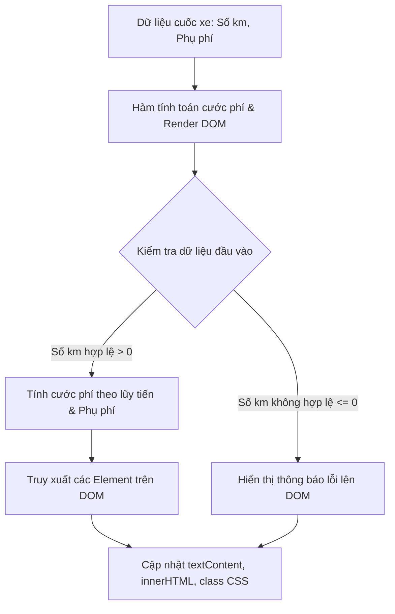

### 1. Mục tiêu bài tập
- **Truy xuất DOM Element chính xác**: Nhận biết và sửa các lỗi sai selector (ID, Class, Tag Name) khi sử dụng `document.getElementById`, `document.querySelector`.
- **Thao tác nội dung & thuộc tính**: Phân biệt và sử dụng đúng `textContent`, `innerHTML`, `classList` và style inline để hiển thị thông tin cuốc xe.
- **Rèn luyện tư duy Debug**: Phân tích log lỗi trên Web Console, phát hiện lỗi cú pháp và lỗi logic nghiệp vụ trong đoạn mã Javascript cho trước.

---


### 2. Bối cảnh & Mô tả bài toán
Bạn vừa gia nhập đội ngũ phát triển giao diện Web cho ứng dụng gọi xe **GrabRide**. Tính năng hiện tại là hiển thị hóa đơn cuốc xe (`TripFare`) trên màn hình tóm tắt của tài xế và hành khách. 

Một Lập trình viên tập sự (Junior Developer) đã viết sẵn đoạn mã HTML và JavaScript để tính cước phí và cập nhật thông tin lên DOM. Tuy nhiên, khi chạy thử nghiệm, màn hình hiển thị bị lỗi trắng thông tin, sai cước phí và không áp dụng được định dạng CSS.

Nhiệm vụ của bạn là tìm ra **5 lỗi sai** trong đoạn mã JS cho trước, tiến hành sửa lỗi (debug) để giao diện hiển thị chính xác theo đúng quy tắc nghiệp vụ của GrabRide.



---


### 3. Quy tắc nghiệp vụ (Business Rules)
Hệ thống tính cước phí cuốc xe **GrabRide** được quy định như sau:
1. **Giá cước cơ bản (Khoảng cách)**:
   - **2 km đầu tiên**: Giá cố định là `12.000 VNĐ`.
   - **Từ km thứ 3 trở đi**: Mỗi km tiếp theo tính `4.500 VNĐ/km`.
   - *Ví dụ*: Đi 5 km -> 2 km đầu (12.000) + 3 km sau (3 * 4.500 = 13.500) = `25.500 VNĐ`.
2. **Hệ số phụ phí (Giờ cao điểm / Thời tiết xấu)**:
   - Nếu `isPeakOrRain = true`, tổng cước phí sẽ nhân với hệ số `1.2` (tăng 20%).
3. **Hiển thị giao diện**:
   - Nếu `distance > 0`: Cập nhật tổng tiền vào element `#total-fare`, cập nhật trạng thái "Thành công" vào `#booking-status` và thêm class CSS `status-success`.
   - Nếu `distance <= 0` hoặc không phải số valid: Cập nhật `#total-fare` thành `0 VNĐ`, cập nhật `#booking-status` thành "Dữ liệu không hợp lệ!" và thêm class CSS `status-error`.

---


### 4. Yêu cầu kỹ thuật & Triển khai


#### 4.1. Mã nguồn hiện tại bị lỗi (Cần Debug)

**File `index.html` (Dữ liệu giao diện giữ nguyên, không sửa):**
```html
<!DOCTYPE html>
<html lang="vi">
<head>
    <meta charset="UTF-8">
    <title>GrabRide - Tóm tắt cuốc xe</title>
    <style>
        .card { border: 1px solid #ccc; padding: 16px; width: 300px; font-family: Arial; }
        .status-success { color: green; font-weight: bold; }
        .status-error { color: red; font-weight: bold; }
        .highlight { background-color: #e8f5e9; padding: 4px; border-radius: 4px; }
    </style>
</head>
<body>
    <div class="card">
        <h2>Hóa Đơn GrabRide</h2>
        <p>Khoảng cách: <span id="trip-distance">--</span> km</p>
        <p>Phụ phí cao điểm/mưa: <span id="peak-status">--</span></p>
        <p>Trạng thái: <span id="booking-status">Chờ xử lý</span></p>
        <hr>
        <h3>Tổng tiền: <span id="total-fare" class="fare-amount">0 VNĐ</span></h3>
    </div>
    <script src="app.js"></script>
</body>
</html>
```

**File `app.js` (Chứa 5 LỖI BUG cần học viên phát hiện và sửa):**
```javascript
// Data cuốc xe thử nghiệm
const bookingData = {
    distance: 5,         // 5 km
    isPeakOrRain: true   // Có phụ phí
};

function renderTripSummary(booking) {
    // BUG 1: Truy xuất sai selector DOM (Dùng getElementById nhưng truyền nhầm ký tự #)
    const distanceEl = document.getElementById("#trip-distance");
    
    // BUG 2: Sai phương thức chọn querySelector cho class fare-amount
    const fareEl = document.querySelector("fare-amount");
    
    const statusEl = document.getElementById("booking-status");
    const peakEl = document.getElementById("peak-status");

    // Kiểm tra dữ liệu đầu vào
    if (!booking || typeof booking.distance !== "number" || booking.distance <= 0) {
        statusEl.textContent = "Dữ liệu không hợp lệ!";
        // BUG 3: Cập nhật class sai thuộc tính DOM API (dùng attribute không tồn tại)
        statusEl.class = "status-error";
        fareEl.textContent = "0 VNĐ";
        return;
    }

    // Tính cước phí
    let fare = 0;
    if (booking.distance <= 2) {
        fare = 12000;
    } else {
        // BUG 4: Tính sai công thức nghiệp vụ (không trừ đi 2 km đầu đã tính 12.000đ)
        fare = 12000 + (booking.distance * 4500);
    }

    if (booking.isPeakOrRain) {
        fare = fare * 1.2;
    }

    // Cập nhật DOM
    distanceEl.textContent = booking.distance;
    peakEl.textContent = booking.isPeakOrRain ? "Có (x1.2)" : "Không";
    
    // BUG 5: Gán HTML tag bằng textContent khiến thẻ <span> bị hiển thị dưới dạng raw text
    fareEl.textContent = `<span class="highlight">${fare.toLocaleString('vi-VN')} VNĐ</span>`;
    
    statusEl.textContent = "Tính cước thành công";
    statusEl.classList.add("status-success");
}

// Chạy hàm render
renderTripSummary(bookingData);
```


#### 4.2. Yêu cầu thực hiện
1. **Tạo báo cáo Debug**: Trong file comment của `app.js` hoặc file `debug-note.txt`, chỉ rõ 5 dòng code bị lỗi, giải thích nguyên nhân gây ra lỗi và cách sửa.
2. **Sửa file `app.js`**:
   - Khắc phục triệt để 5 lỗi trên.
   - Kết quả hiển thị trên màn hình trình duyệt phải chuẩn xác:
     - Khoảng cách: `5` km.
     - Phụ phí: `Có (x1.2)`.
     - Trạng thái: `Tính cước thành công` (chữ màu xanh lá cây do class `status-success`).
     - Tổng tiền: `<span class="highlight">30.600 VNĐ</span>` (phải render đúng định dạng HTML có background xanh nhạt do thẻ span `.highlight`).

---


### 5. Quy chuẩn nộp bài
- **Cấu trúc thư mục**:
  ```text
  grab-ride-debug/
  ├── index.html
  ├── app.js
  └── debug-note.txt (hoặc viết comment ngay đầu file app.js)
  ```
- **Quy định nộp bài**: Nén thư mục `grab-ride-debug` thành file `.zip` và nộp lên hệ thống.
- **Lưu ý**: *Tuyệt đối KHÔNG sử dụng các sự kiện `addEventListener`, form submit, hay các thư viện bên ngoài*. Chỉ sử dụng các DOM API căn bản đã học ở Session 17.