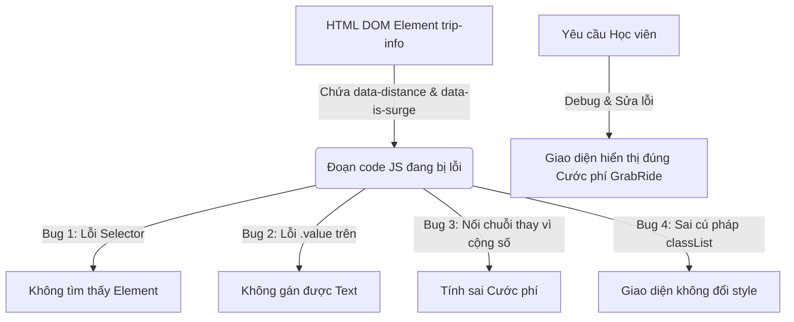

### 1. Mục tiêu bài tập
- **Truy xuất DOM Element chính xác**: Nhận diện và sửa các lỗi phổ biến khi chọn phần tử HTML bằng `document.getElementById()` và `document.querySelector()`.
- **Thao tác dữ liệu & Thuộc tính DOM**: Đọc dữ liệu từ thuộc tính tùy biến `data-*` (`getAttribute` / `dataset`) và sửa lỗi ép kiểu dữ liệu từ `String` sang `Number` trong JavaScript.
- **Thay đổi nội dung & Style phần tử**: Phân biệt và sử dụng đúng `innerText` / `textContent` thay vì `.value` trên các thẻ không phải thẻ nhập liệu (`input`), sửa lỗi gọi phương thức trên `classList`.
- **Đảm bảo tính chính xác của nghiệp vụ**: Cập nhật thông tin phiếu chuyến đi GrabRide (khoảng cách, phụ phí cao điểm, tổng cước phí) lên giao diện người dùng đúng chuẩn quy tắc tính cước.

---


### 2. Bối cảnh & Mô tả bài toán
Trong ứng dụng gọi xe **GrabRide**, sau khi chuyến đi hoàn thành, hệ thống cần hiển thị **Phiếu tóm tắt chuyến đi (Ride Fare Summary)** cho tài xế và hành khách. 

Một lập trình viên tập sự (Fresher) đã viết đoạn code HTML/JS để đọc thông tin chuyến đi từ thẻ chứa dữ liệu `trip-info`, tính toán cước phí và cập nhật thông tin lên giao diện. Tuy nhiên, khi chạy thử nghiệm, màn hình hiển thị bị lỗi hoàn toàn: cước phí hiển thị sai (hoặc hiển thị `NaN`), thẻ phụ phí không đổi màu và giao diện không cập nhật đúng thông tin.



Nhiệm vụ của bạn là kiểm tra đoạn mã bị lỗi, phát hiện các lỗi sai, giải thích nguyên nhân và viết lại mã JavaScript hoàn chỉnh để ứng dụng hiển thị đúng thông tin.

---


### 3. Quy tắc nghiệp vụ (Business Rules)
1. **Giá cước cơ bản (Base Fare)**:
   - **2 km đầu tiên**: Giá cố định **12.000 VNĐ**.
   - **Từ km thứ 3 trở đi**: Mới tính thêm **4.500 VNĐ/km** cho các km phát sinh sau 2 km đầu.
   - *Công thức tính cước cơ bản ($d$ là số km)*:
     - Nếu $d \le 2$: `cước_cơ_bản = 12000`
     - Nếu $d > 2$: `cước_cơ_bản = 12000 + (d - 2) * 4500`

2. **Phụ phí cao điểm / Thời tiết (Surge Multiplier)**:
   - Dữ liệu `data-is-surge` dạng chuỗi `"true"` hoặc `"false"`.
   - Nếu `data-is-surge` là `"true"`: Nhân hệ số **1.2x** vào cước cơ bản (`tổng_cước = cước_cơ_bản * 1.2`). Đồng thời, đổi nội dung phần tử phụ phí thành `"Có áp dụng (1.2x)"` và thêm class `active-surge`.
   - Nếu `data-is-surge` là `"false"`: Không nhân hệ số. Giữ nguyên nội dung phụ phí `"Không áp dụng"`.

3. **Định dạng hiển thị tiền tệ**:
   - Tổng cước phí sau khi tính toán phải được làm tròn nguyên (hoặc định dạng chuỗi) và nối với đơn vị `" VNĐ"` (Ví dụ: `28.200 VNĐ` hoặc `28200 VNĐ`).

---


### 4. Mã nguồn bị lỗi (Buggy Code)

Học viên nghiên cứu file `index.html` và file `app.js` chứa mã nguồn bị lỗi dưới đây:


#### File `index.html`:
```html
<!DOCTYPE html>
<html lang="vi">
<head>
  <meta charset="UTF-8">
  <title>GrabRide - Phiếu Chuyến Đi</title>
  <style>
    .card { border: 1px solid #ccc; padding: 16px; width: 320px; font-family: Arial; }
    .badge { padding: 4px 8px; background: #eee; border-radius: 4px; }
    .active-surge { background: #ff4d4f; color: white; font-weight: bold; }
  </style>
</head>
<body>
  <div id="booking-card" class="card">
    <h2>Chuyến đi #GRB-8821</h2>
    <p>Tài xế: <span id="driver-name">Nguyễn Văn A</span></p>
    
    <!-- Phần tử chứa dữ liệu ẩn của chuyến đi -->
    <div id="trip-info" data-distance="5.5" data-is-surge="true"></div>

    <p>Khoảng cách: <span id="distance-display">0</span> km</p>
    <p>Phụ phí cao điểm: <span id="surge-badge" class="badge">Không áp dụng</span></p>
    <p>Tổng cước phí: <strong id="total-fare">0 VNĐ</strong></p>
  </div>

  <script src="app.js"></script>
</body>
</html>
```


#### File `app.js` (Chứa 4-5 lỗi cần debug):
```javascript
// =================================================================
// ĐOẠN CODE BỊ LỖI DO LAP TRINH VIEN TAP SU VIET
// =================================================================

// Bug 1: Thao tác truy xuất DOM sai cú pháp ID
const distanceDisplay = document.getElementById("#distance-display");

// Đọc dữ liệu từ data attribute
const tripInfoEl = document.getElementById("trip-info");
const rawDistance = tripInfoEl.getAttribute("data-distance"); // "5.5"
const isSurge = tripInfoEl.getAttribute("data-is-surge");    // "true"

// Bug 2: Sử dụng thuộc tính sai đối với thẻ <span>
distanceDisplay.value = rawDistance;

// Tính cước phí cơ bản
let baseFare = 0;
// Bug 3: Phép toán sai do không ép kiểu rawDistance từ String sang Number
if (rawDistance <= 2) {
    baseFare = 12000;
} else {
    // Phép tính có thể bị lỗi logic hoặc sai số do string coercion
    baseFare = 12000 + (rawDistance - 2) * 4500;
}

let totalFare = baseFare;

// Bug 4: So sánh sai kiểu dữ liệu của isSurge (String vs Boolean)
if (isSurge === true) {
    totalFare = baseFare * 1.2;
    
    const surgeBadgeEl = document.getElementById("surge-badge");
    surgeBadgeEl.innerText = "Có áp dụng (1.2x)";
    
    // Bug 5: Sử dụng sai cú pháp của phương thức classList.add
    surgeBadgeEl.classList.add = "active-surge";
}

// Cập nhật tổng tiền lên giao diện
const totalFareEl = document.getElementById("total-fare");
totalFareEl.innerText = totalFare + " VNĐ";
```

---


### 5. Yêu cầu kỹ thuật & Triển khai

Học viên cần thực hiện 2 phần trong bài nộp:


#### Phần 1: Báo cáo Debug (Ghi trong file `DEBUG_LOG.md` hoặc comment đầu file JS)
Lập bảng danh sách các lỗi đã phát hiện theo mẫu:
| STT | Vị trí (Dòng/Tên biến) | Nguyên nhân gây lỗi | Cách khắc phục |
| :--- | :--- | :--- | :--- |
| 1 | `document.getElementById("#distance-display")` | Truyền nhầm ký tự `#` vào `getElementById` làm kết quả trả về `null` | Xóa dấu `#`, chỉ truyền `"distance-display"` |
| ... | ... | ... | ... |


#### Phần 2: Mã nguồn hoàn chỉnh (`app.js`)
- Sửa lại toàn bộ các lỗi đã liệt kê.
- Ép kiểu `rawDistance` sang kiểu số (`Number()` hoặc `parseFloat()`).
- Đảm bảo kiểm tra phần tử tồn tại trước khi thao tác (Null check cơ bản).
- Sử dụng đúng `innerText` / `textContent` cho thẻ `<span>`.
- Đảm bảo gọi đúng phương thức `classList.add("active-surge")`.
- Định dạng tiền tệ hiển thị rõ ràng (Khuyến khích dùng `Math.round()` hoặc `toLocaleString('vi-VN')`).

---


### 6. Quy chuẩn nộp bài
- **Cấu trúc thư mục**:
  ```text
  grab-ride-debug/
  ├── index.html
  ├── app.js
  └── DEBUG_LOG.md
  ```
- **Quy định đặt tên**: Thư mục nộp bài nén dạng `.zip` với tên `[HoTen]_[MSHV]_Session17_HW3.zip`.