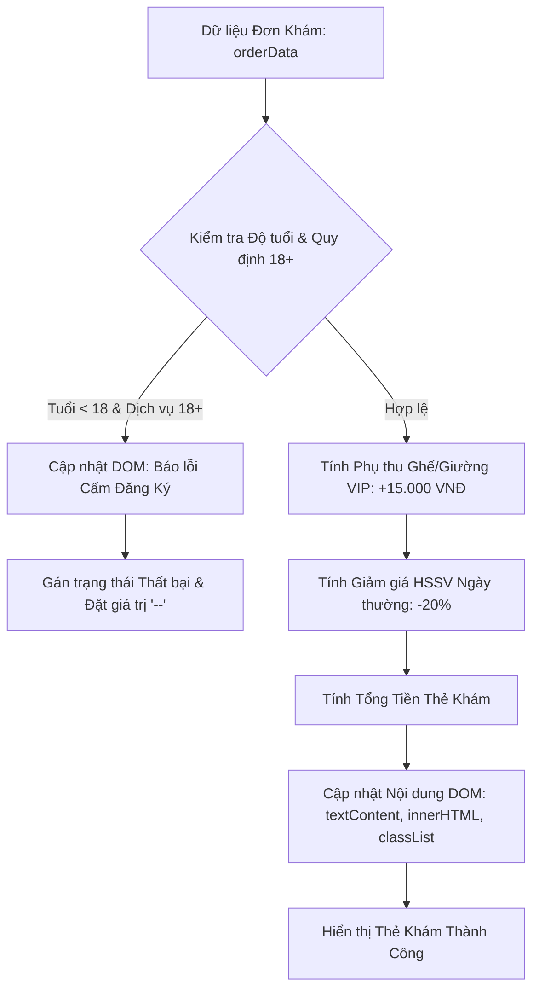

### 1. Mục tiêu bài tập
- **Truy xuất DOM Element**: Thành thạo các phương thức truy xuất phần tử DOM chuẩn (`document.getElementById`, `document.querySelector`, `document.querySelectorAll`).
- **Thay đổi nội dung và thuộc tính DOM**: Vận dụng linh hoạt `textContent`, `innerText`, `innerHTML`, `setAttribute` và điều chỉnh danh sách lớp CSS (`classList.add`, `classList.remove`, `classList.toggle`).
- **Xử lý Logic nghiệp vụ hiển thị**: Áp dụng logic tính toán giá dịch vụ y tế, phụ thu ghế chờ/giường khám VIP và ràng buộc độ tuổi 18+ để cập nhật giao diện người dùng động dựa trên dữ liệu đầu vào.

---


### 2. Bối cảnh & Mô tả bài toán
Tại Hệ thống Đặt Thẻ Khám Bệnh & Phân Loại Dịch Vụ Y Tế của Bệnh viện Quốc tế **Healthcare MedTicket**, bộ phận tiếp đón bệnh nhân cần một mô-đun giao diện hiển thị thông tin thẻ khám bệnh tự động sau khi nhập thông tin từ hệ thống quản lý.

Nhiệm vụ của bạn là viết hàm JavaScript nhận vào một đối tượng dữ liệu thẻ khám (`orderData`), xử lý logic kiểm tra độ tuổi, tính toán tiền khám và cập nhật trực tiếp nội dung/trạng thái hiển thị lên cây DOM HTML hiện có.



---


### 3. Quy tắc nghiệp vụ (Business Rules)

1. **Quy định Giá dịch vụ & Phụ thu**:
   - **Loại ghế/giường chờ khám (`seatType`)**:
     - Ghế thường (`STANDARD`): Không phụ thu (0 VNĐ).
     - Ghế/Giường VIP (`VIP`): Phụ thu cố định **15.000 VNĐ** vào giá dịch vụ cơ bản (`basePrice`).

2. **Quy định Ưu đãi Khách hàng (`patientCategory`)**:
   - Khách hàng thuộc đối tượng Học sinh / Sinh viên (`HSSV`) đăng ký vào ngày thường (`isWeekday === true`) sẽ được **giảm 20%** trên tổng giá (đã bao gồm giá cơ bản + phụ thu VIP).
   - Ngược lại (không phải `HSSV` hoặc đăng ký vào cuối tuần `isWeekday === false`): Không áp dụng giảm giá (0%).

3. **Công thức tính tổng tiền (`totalPrice`)**:
   - `Phụ_Thu_VIP = (seatType === 'VIP') ? 15000 : 0`
   - `Giá_Trước_Giảm = basePrice + Phụ_Thu_VIP`
   - `Tỷ_Lệ_Giảm = (patientCategory === 'HSSV' && isWeekday === true) ? 0.20 : 0`
   - `Tổng_Tiền = Giá_Trước_Giảm * (1 - Tỷ_Lệ_Giảm)`

4. **Ràng buộc An toàn Y tế (Quy định 18+)**:
   - Nếu dịch vụ yêu cầu độ tuổi trên 18 (`isRestricted18Plus === true`) mà bệnh nhân có tuổi nhỏ hơn 18 (`age < 18`):
     - **Từ chối xuất thẻ khám**.
     - Cập nhật thẻ trạng thái `#status-message`: Nội dung `"Bệnh nhân chưa đủ 18 tuổi không được đăng ký dịch vụ này!"`. Thêm lớp CSS `status-error`, xóa lớp `status-success`.
     - Đặt toàn bộ thông tin chi tiết trên thẻ khám (`#ticket-patient-name`, `#ticket-service-name`, `#ticket-seat-type`, `#ticket-discount`, `#ticket-total-price`) thành dấu `"--"`.

5. **Hiển thị Thẻ khám Hợp lệ**:
   - Cập nhật thẻ trạng thái `#status-message`: Nội dung `"Đăng ký thẻ khám thành công!"`. Thêm lớp CSS `status-success`, xóa lớp `status-error`.
   - Cập nhật tên bệnh nhân vào `#ticket-patient-name`.
   - Cập nhật tên dịch vụ vào `#ticket-service-name`. Nếu `isRestricted18Plus === true`, chèn thêm thẻ `<span class="badge-18"> [18+]</span>` ngay sau tên dịch vụ bằng `innerHTML`.
   - Cập nhật loại ghế vào `#ticket-seat-type`: `"Ghế VIP (+15.000 VNĐ)"` hoặc `"Ghế Thường"`.
   - Cập nhật mức giảm giá vào `#ticket-discount`: `"20%"` hoặc `"0%"`.
   - Cập nhật tổng tiền vào `#ticket-total-price` dưới dạng chuỗi định dạng tiền tệ Việt Nam (Ví dụ: `172.000 VNĐ`).

---


### 4. Yêu cầu kỹ thuật & Triển khai


#### 4.1. Cấu trúc HTML ban đầu (Mẫu template để làm việc)
```html
<div class="container">
  <h2>Hệ Thống Đăng Ký Thẻ Khám Bệnh - Healthcare</h2>
  
  <div id="status-message" class="status-box">Sẵn sàng xử lý...</div>

  <div class="ticket-card">
    <h3>Thông Tin Thẻ Khám Bệnh</h3>
    <p><strong>Bệnh nhân:</strong> <span id="ticket-patient-name">--</span></p>
    <p><strong>Dịch vụ khám:</strong> <span id="ticket-service-name">--</span></p>
    <p><strong>Hạng ghế chờ:</strong> <span id="ticket-seat-type">--</span></p>
    <p><strong>Ưu đãi giảm giá:</strong> <span id="ticket-discount">--</span></p>
    <p><strong>Tổng chi phí:</strong> <span id="ticket-total-price" class="price-text">--</span></p>
  </div>
</div>
```


#### 4.2. Yêu cầu triển khai JavaScript
Viết hàm `renderPatientTicket(orderData)` nhận tham số là một `object` có cấu trúc:

```javascript
/**
 * Struct dữ liệu đầu vào mẫu:
 * {
 *   patientName: string,      // Tên bệnh nhân
 *   age: number,              // Tuổi
 *   patientCategory: string,  // 'HSSV' | 'ADULT' | 'SENIOR'
 *   serviceName: string,      // Tên dịch vụ khám
 *   basePrice: number,        // Giá dịch vụ cơ sở (VNĐ)
 *   isRestricted18Plus: boolean, // Dịch vụ giới hạn 18+
 *   seatType: string,         // 'STANDARD' | 'VIP'
 *   isWeekday: boolean        // Đăng ký vào ngày thường
 * }
 */
function renderPatientTicket(orderData) {
  // LẮP ĐẶT LOGIC TRUY XUẤT VÀ TƯƠNG TÁC DOM TẠI ĐÂY
}
```

> **️ CẢNH BÁO PHẠM VI NGHIÊM CẤM:**
> - **KHÔNG** sử dụng Event Listener (`addEventListener`, `onclick`, ...).
> - **KHÔNG** sử dụng Form Submit.
> - **KHÔNG** sử dụng `fetch`, `axios` hoặc `localStorage`.
> - Bài tập kiểm thử bằng cách gọi trực tiếp hàm `renderPatientTicket(orderData)` với các bộ dữ liệu I/O khác nhau và kiểm tra trạng thái cây DOM.


#### 4.3. Ví dụ Kiểm thử Đầu vào / Đầu ra (I/O Test Cases)

**Test Case 1: Đăng ký thành công - Đối tượng HSSV ngày thường + Ghế VIP (Dịch vụ không giới hạn 18+)**
- **Đầu vào (`orderData`)**:
  ```javascript
  {
    patientName: "Nguyễn Văn An",
    age: 17,
    patientCategory: "HSSV",
    serviceName: "Khám Tổng Quát Nhiên Liệu Cơ Thể",
    basePrice: 200000,
    isRestricted18Plus: false,
    seatType: "VIP",
    isWeekday: true
  }
  ```
- **Kết quả DOM kỳ vọng**:
  - Element `#status-message`: text = `"Đăng ký thẻ khám thành công!"`, class = `"status-box status-success"`
  - Element `#ticket-patient-name`: text = `"Nguyễn Văn An"`
  - Element `#ticket-service-name`: text = `"Khám Tổng Quát Nhiên Liệu Cơ Thể"`
  - Element `#ticket-seat-type`: text = `"Ghế VIP (+15.000 VNĐ)"`
  - Element `#ticket-discount`: text = `"20%"`
  - Element `#ticket-total-price`: text = `"172.000 VNĐ"` *(Giải thích: (200.000 + 15.000) * 0.8 = 172.000)*

**Test Case 2: Vi phạm quy định 18+ (Từ chối xuất thẻ)**
- **Đầu vào (`orderData`)**:
  ```javascript
  {
    patientName: "Trần Thị Bích",
    age: 16,
    patientCategory: "HSSV",
    serviceName: "Khám Chuyên Khoa Sức Khỏe Sinh Sản Cung Đình",
    basePrice: 500000,
    isRestricted18Plus: true,
    seatType: "STANDARD",
    isWeekday: true
  }
  ```
- **Kết quả DOM kỳ vọng**:
  - Element `#status-message`: text = `"Bệnh nhân chưa đủ 18 tuổi không được đăng ký dịch vụ này!"`, class = `"status-box status-error"`
  - Các element `#ticket-patient-name`, `#ticket-service-name`, `#ticket-seat-type`, `#ticket-discount`, `#ticket-total-price` đều có text = `"--"`

---


### 5. Quy chuẩn nộp bài
- Cấu trúc thư mục dự án:
  ```text
  dev-homework-session17/
  ├── index.html
  ├── css/
  │   └── style.css
  └── js/
      └── main.js
  ```
- File `main.js` chứa hàm `renderPatientTicket(orderData)` và các đoạn mã thử nghiệm.
- Mã nguồn viết rõ ràng, có chú thích đầy đủ bằng tiếng Việt.