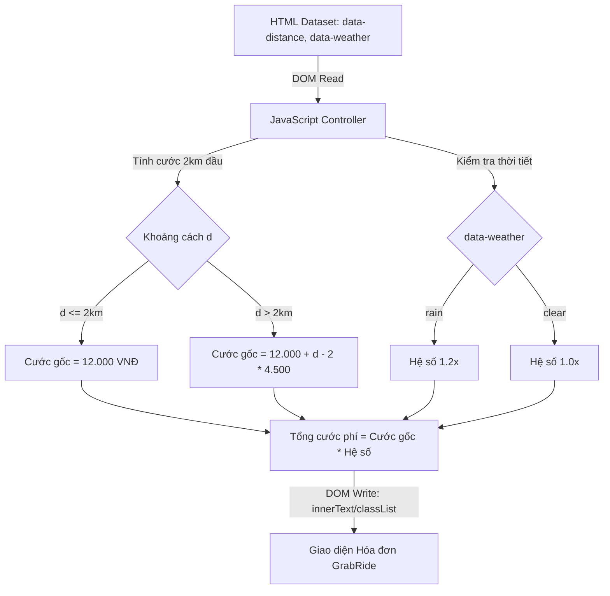

### 1. Mục tiêu bài tập
- **Thao tác DOM API cơ bản**: Sử dụng thành thạo các phương thức truy xuất phần tử DOM (`document.getElementById`, `document.querySelector`) để đọc và ghi dữ liệu.
- **Đọc dữ liệu từ thuộc tính HTML**: Khai thác thuộc tính tùy biến `data-*` (`dataset`) và thuộc tính chuẩn của phần tử HTML để thu thập input.
- **Xử lý logic nghiệp vụ di động (GrabRide)**: Áp dụng thuật toán tính toán cước phí chuyến đi theo khoảng cách và phụ phí thời tiết.
- **Thay đổi giao diện linh hoạt**: Cập nhật nội dung văn bản (`innerText`, `textContent`), cấu trúc HTML (`innerHTML`), và lớp giao diện (`classList`) của DOM dựa trên kết quả tính toán.

---


### 2. Bối cảnh & Mô tả bài toán
Hệ thống Đặt xe công nghệ **GrabRide** đang phát triển tính năng **"Xem trước Hóa đơn Chuyến đi" (Trip Fare Preview)** trên phiên bản Web Dashboard. Khi hệ thống hiển thị thông tin chuyến đi từ backend vào các thẻ HTML (dưới dạng thuộc tính `data-*`), một đoạn mã JavaScript sẽ lập tức chạy để truy xuất các chỉ số này, tính toán chi tiết cước phí di chuyển và cập nhật kết quả hiển thị lên giao diện người dùng.



---


### 3. Quy tắc nghiệp vụ (Business Rules)

1. **Tính cước phí gốc theo khoảng cách ($d$ km)**:
   - **Đầu vào hợp lệ**: $d > 0$. Nếu $d \le 0$ hoặc không phải là số hợp lệ, coi chuyến đi bị lỗi dữ liệu.
   - **2 km đầu tiên**: Mức giá cố định là **12.000 VNĐ**.
   - **Từ km thứ 3 trở đi ($d > 2$)**: Mỗi km tiếp theo tính **4.500 VNĐ/km**.
     $$\text{Cước gốc} = 12.000 + (d - 2) \times 4.500 \quad (\text{VNĐ})$$

2. **Phụ phí thời tiết (Weather Surcharge)**:
   - Nếu trạng thái thời tiết `data-weather="rain"` (Trời mưa): Áp dụng hệ số **1.2x** (tăng 20% trên tổng cước gốc).
   - Nếu trạng thái thời tiết `data-weather="clear"` (Trời tịnh): Hệ số **1.0x** (không phụ phí).

3. **Công thức Tổng tiền (Total Fare)**:
   $$\text{Tổng cước} = \text{Math.round}(\text{Cước gốc} \times \text{Hệ số thời tiết})$$

4. **Định dạng & Trạng thái hiển thị**:
   - Tiền tệ phải được định dạng theo chuẩn Việt Nam (Ví dụ: `25.500 VNĐ` hoặc `25,500 VNĐ`).
   - Nếu dữ liệu khoảng cách **hợp lệ**:
     - Thêm class `text-success` vào thẻ trạng thái `#fare-status`.
     - Cập nhật chữ `#fare-status` thành `"Hợp lệ"`.
   - Nếu dữ liệu khoảng cách **không hợp lệ** ($d \le 0$ hoặc `NaN`):
     - Hiển thị `#total-fare` là `0 VNĐ`.
     - Thêm class `text-danger` vào thẻ `#fare-status`.
     - Cập nhật chữ `#fare-status` thành `"Dữ liệu chuyến đi không hợp lệ!"`.

---


### 4. Yêu cầu kỹ thuật & Triển khai


#### 4.1. Cấu trúc HTML ban đầu (Mẫu test)
Hệ thống cung cấp sẵn khung HTML trong file `index.html`:

```html
<!DOCTYPE html>
<html lang="vi">
<head>
    <meta charset="UTF-8">
    <title>GrabRide Trip Fare Preview</title>
</head>
<body>
    <div id="booking-card">
        <h2>Thông tin chuyến đi GrabRide</h2>
        
        <!-- Thẻ chứa dữ liệu đầu vào -->
        <div id="trip-info" data-distance="5.5" data-weather="rain"></div>

        <!-- Các thẻ kết quả hiển thị -->
        <div class="summary">
            <p>Khoảng cách: <span id="display-distance">--</span> km</p>
            <p>Cước phí cơ bản: <span id="base-fare">--</span></p>
            <p>Phụ phí thời tiết: <span id="surcharge-info">--</span></p>
            <p><strong>Tổng tiền: <span id="total-fare">--</span></strong></p>
            <p>Trạng thái: <span id="fare-status">Đang xử lý...</span></p>
        </div>
    </div>
    <script src="script.js"></script>
</body>
</html>
```


#### 4.2. Yêu cầu xử lý trong `script.js`
Đoạn mã JavaScript cần thực hiện tuần tự các bước sau ngay khi trang tải xong:

1. **Truy xuất thông tin từ DOM**:
   - Lấy giá trị khoảng cách từ thuộc tính `data-distance` của thẻ `#trip-info`. Ép kiểu về số thực (`parseFloat`).
   - Lấy giá trị thời tiết từ thuộc tính `data-weather` của thẻ `#trip-info`.

2. **Cập nhật dữ liệu đầu vào lên giao diện**:
   - Gán giá trị khoảng cách vào thẻ `#display-distance` (ví dụ: `5.5`).

3. **Tính toán & Xử lý**:
   - Áp dụng đúng công thức tính `Cước gốc`, `Phụ phí`, và `Tổng cước`.
   - Xử lý các trường hợp ngoại lệ (khoảng cách âm, bằng 0, hoặc chuỗi không hợp lệ).

4. **Cập nhật kết quả ra DOM**:
   - Gán cước gốc định dạng VNĐ vào thẻ `#base-fare`.
   - Gán thông tin phụ phí vào thẻ `#surcharge-info` (Ví dụ: `"20% (Trời mưa)"` hoặc `"Không"`).
   - Gán tổng cước vào thẻ `#total-fare`.
   - Thêm/Xóa class phù hợp và gán nội dung thông báo cho thẻ `#fare-status`.

> ️ **LƯU Ý NGHIÊM CẤM**:
> - Không sử dụng Event Listeners (`addEventListener`, `onclick`, ...).
> - Không sử dụng `fetch`, `XMLHttpRequest` hay `localStorage`.
> - Code phải chạy tự động trực tiếp ngay khi file `script.js` được nạp.

---


### 5. Quy chuẩn nộp bài
- **Thư mục dự án**:
  ```text
  student_id_hw5/
  ├── index.html
  └── script.js
  ```
- **Đặt tên biến & hàm trong JS**: Sử dụng kiểu camelCase chuẩn (ví dụ: `distanceInput`, `baseFare`, `calculateTripFare`).
- **Comment code**: Giải thích rõ ràng các bước truy xuất DOM, tính toán và cập nhật lại giao diện.