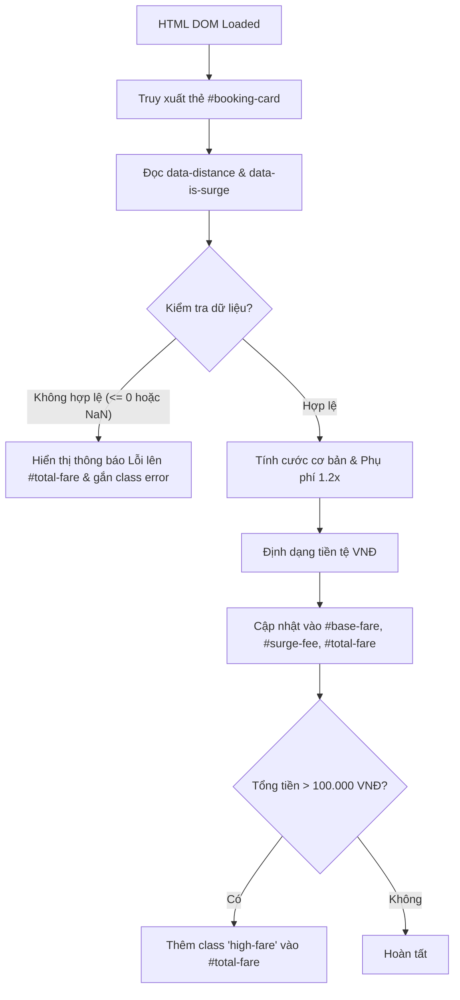

### 1. Mục tiêu bài tập
- **Truy xuất phần tử DOM**: Sử dụng thành thạo các phương thức `document.getElementById()` và `document.querySelector()` để lấy dữ liệu từ các phần tử HTML và thuộc tính dữ liệu tùy biến (`data-*`).
- **Thao tác nội dung DOM**: Cập nhật văn bản hiển thị và giao diện thông qua `innerText`, `textContent`, `style` và `classList`.
- **Áp dụng logic nghiệp vụ GrabRide**: Tính toán giá cước mở cửa, giá cước lũy tiến theo km và phụ phí cao điểm/thời tiết cho hệ thống đặt xe công nghệ.
- **Kiểm thử I/O cơ bản**: Đảm bảo luồng dữ liệu đầu vào (đọc từ DOM) và đầu ra (ghi vào DOM) đúng chính xác theo mọi trường hợp kiểm thử (test cases).

---


### 2. Bối cảnh & Mô tả bài toán
Trong hệ thống đặt xe công nghệ **GrabRide**, trước khi hành khách xác nhận chuyến đi, giao diện ứng dụng cần hiển thị thẻ **"Thông tin chi tiết cước phí" (Fare Booking Preview)**. 

Dữ liệu chuyến đi (khoảng cách di chuyển và trạng thái phụ phí thời tiết/giờ cao điểm) đã được hệ thống Render sẵn vào các thuộc tính dữ liệu HTML. Nhiệm vụ của bạn là viết mã nguồn JavaScript chạy khi trang web tải xong để tự động truy xuất các thông tin này, thực hiện tính toán cước phí chi tiết và cập nhật kết quả lên màn hình hiển thị cho hành khách.


#### Sơ đồ luồng xử lý DOM (DOM Processing Flow):


---


### 3. Quy tắc nghiệp vụ (Business Rules)


#### a. Quy tắc tính cước di chuyển (Trip Fare Rules):
1. **Giá cước cơ sở (Base Fare)**:
   - **2 km đầu tiên**: Giá cố định là **12.000 VNĐ** (dù đi dưới 2 km vẫn tính 12.000 VNĐ).
   - **Từ km thứ 3 trở đi**: Tính thêm **4.500 VNĐ/km** cho phần khoảng cách vượt quá 2 km.
   - *Công thức tính cước cơ sở*: 
     - Nếu $S \le 2$: $Cước\_Cơ\_Sở = 12.000$ VNĐ.
     - Nếu $S > 2$: $Cước\_Cơ\_Sở = 12.000 + (S - 2) \times 4.500$ VNĐ.
2. **Hệ số phụ phí (Surge Fee)**:
   - Nếu `data-is-surge="true"` (do trời mưa hoặc giờ cao điểm): Nhân hệ số **1.2x** vào Cước cơ sở.
   - Phụ phí phát sinh = $Cước\_Cơ\_Sở \times 0.2$.
   - Tổng cước phí = $Cước\_Cơ\_Sở \times 1.2$.
   - Nếu `data-is-surge="false"`: Tổng cước phí = Cước cơ sở (Phụ phí = 0 VNĐ).


#### b. Quy tắc hiển thị & Định dạng DOM:
- **Định dạng tiền tệ**: Tất cả số tiền hiển thị ra màn hình phải được làm tròn nguyên và thêm hậu tố `VNĐ` (Ví dụ: `25.500 VNĐ` hoặc `25500 VNĐ`).
- **Cảnh báo cước phí cao**: Nếu Tổng cước phí vượt quá **100.000 VNĐ**, phải tự động thêm class CSS `high-fare` vào phần tử chứa tổng tiền (`#total-fare`).
- **Xử lý dữ liệu bất hợp lệ**: Nếu khoảng cách $S \le 0$ hoặc không phải là số hợp lệ:
  - Ghi văn bản: `"Dữ liệu khoảng cách không hợp lệ"` vào phần tử `#total-fare`.
  - Thêm class CSS `error` vào phần tử `#total-fare`.
  - Cập nhật `#base-fare` và `#surge-fee` thành `"0 VNĐ"`.

---


### 4. Yêu cầu kỹ thuật & Triển khai


#### Cấu trúc HTML mẫu (`index.html`):
*(Học viên sử dụng cấu trúc HTML này để thực thi mã JS)*

```html
<!DOCTYPE html>
<html lang="vi">
<head>
    <meta charset="UTF-8">
    <title>GrabRide - Tính Cước Phí Chuyến Đi</title>
    <link rel="stylesheet" href="style.css">
</head>
<body>
    <div class="container">
        <h2>Thông Tin Chuyến Đi GrabRide</h2>
        <!-- Thẻ chứa dữ liệu đầu vào -->
        <div id="booking-card" data-distance="5" data-is-surge="true">
            <p>Khoảng cách: <span id="display-distance">5</span> km</p>
            <p>Cước cơ bản: <span id="base-fare">--</span></p>
            <p>Phụ phí (Giờ cao điểm/Mưa): <span id="surge-fee">--</span></p>
            <hr>
            <h3>Tổng tiền: <span id="total-fare">--</span></h3>
        </div>
    </div>
    <script src="script.js"></script>
</body>
</html>
```


#### Yêu cầu mã nguồn JavaScript (`script.js`):
1. **Không sử dụng Event Listeners** (`addEventListener`, `onclick`, `onsubmit`...), không sử dụng `Fetch API` hay `LocalStorage`. Code phải chạy trực tiếp ngay khi file `script.js` được nạp.
2. Truy xuất phần tử `#booking-card` để đọc 2 thuộc tính `dataset.distance` và `dataset.isSurge`.
3. Chuyển đổi dữ liệu chuỗi từ dataset sang kiểu dữ liệu số (number) và boolean tương ứng.
4. Viết logic tính toán theo đúng Quy tắc nghiệp vụ ở Mục 3.
5. Cập nhật kết quả vào các phần tử DOM:
   - `#base-fare`: Hiển thị Cước cơ sở.
   - `#surge-fee`: Hiển thị Số tiền phụ phí phát sinh.
   - `#total-fare`: Hiển thị Tổng tiền thanh toán.
6. Thay đổi style/class của `#total-fare` khi vi phạm điều kiện lỗi hoặc đạt hạn mức cước phí cao.

---


### 5. Quy chuẩn nộp bài
- **Cấu trúc thư mục nộp bài**:
  ```text
  GRAB_RIDE_SESSION17_HW6/
  ├── index.html
  ├── style.css
  └── script.js
  ```
- **Quy định đặt tên**: Các ID HTML và tên file phải chính xác 100% theo mô tả đề bài.