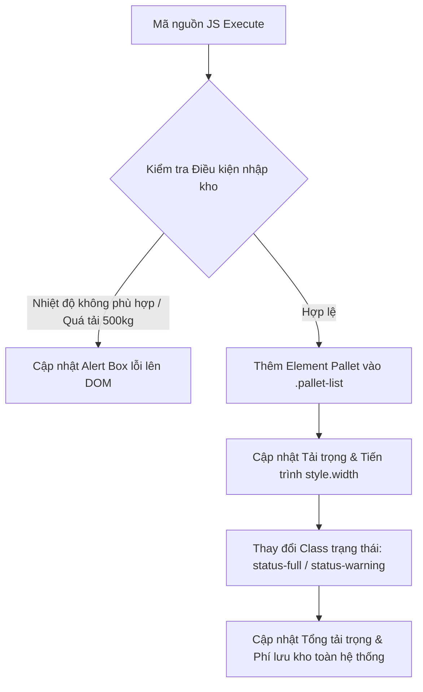

### 1. Mục tiêu bài tập
- **Thao tác DOM Tree nâng cao**: Thành thạo việc truy xuất các phần tử DOM phức tạp thông qua các phương thức `getElementById`, `querySelector`, `querySelectorAll`, `closest`, và duyệt cây DOM (`children`, `parentElement`).
- **Thay đổi nội dung & Thuộc tính DOM**: Biết cách dùng `textContent`, `innerHTML`, `setAttribute`, `getAttribute`, `dataset`, và thao tác với CSS class/style (`classList.add`, `classList.remove`, `style.width`) để cập nhật giao diện động.
- **Áp dụng Business Rules vào DOM**: Cài đặt các quy tắc logic nghiệp vụ kiểm soát tải trọng, bảo quản nhiệt độ và tự động tính toán phí lưu trữ kho logistics trực tiếp trên cấu trúc trang web.

---


### 2. Bối cảnh & Mô tả bài toán
Trung tâm logistics **Rikkei Logistics** đang triển khai màn hình điều hành kho bãi thông minh (Warehouse Operations Dashboard). Màn hình này quản lý việc phân bố các vị trí kệ kho (`WarehouseShelf`) và danh mục kiện hàng (`PalletItem`).

Bạn được giao nhiệm vụ phát triển module Javascript DOM **`warehouseManager.js`** nhằm tự động cập nhật trạng thái hiển thị của các kệ kho, kiểm định tính hợp lệ của kiện hàng khi lưu kho, và tính toán tổng chi phí lưu bãi trên giao diện theo thời gian thực.



---


### 3. Quy tắc nghiệp vụ (Business Rules)
1. **Quy tắc Tải trọng Kệ kho (Weight Capacity Rules)**:
   - Tải trọng tối đa quy định cho mỗi kệ kho là **500 kg**.
   - Nếu tổng khối lượng kiện hàng hiện tại + kiện hàng mới nhập $> 500\text{ kg}$, hệ thống **từ chối thêm** kiện hàng và hiển thị lỗi lên giao diện.
2. **Quy tắc Nhiệt độ Kho lạnh (Cold Storage Rules)**:
   - Kệ kho loại lạnh (`data-shelf-type="COLD"`) chỉ chấp nhận các kiện hàng có nhiệt độ bảo quản yêu cầu trong khoảng từ **$-18^\circ\text{C}$ đến $5^\circ\text{C}$**.
   - Kệ kho thường (`data-shelf-type="DRY"`) chấp nhận mọi kiện hàng.
3. **Quy tắc Phân loại Trạng thái Kệ kho (Visual Status Rules)**:
   - Dựa vào **tỷ lệ lấp đầy** ($\% = \frac{\text{Tổng khối lượng}}{\text{Tải trọng tối đa}} \times 100$):
     - Tỷ lệ $= 100\%$: Xóa bỏ class `status-normal`, `status-warning`, thêm class `status-full`.
     - Tỷ lệ từ $80\%$ đến $< 100\%$: Thêm class `status-warning`.
     - Tỷ lệ $< 80\%$: Thêm class `status-normal`.
4. **Quy tắc Tính phí Lưu kho (Storage Cost Calculation)**:
   - Đơn giá lưu kho kệ thường (`DRY`): **10.000 VNĐ / kg / ngày**.
   - Đơn giá lưu kho kệ lạnh (`COLD`): **25.000 VNĐ / kg / ngày**.
   - Phí lưu kho từng kệ = $\text{Khối lượng hiện tại của kệ (kg)} \times \text{Đơn giá loại kệ tương ứng}$.
   - Tổng phí lưu kho toàn hệ thống = Tổng phí lưu kho của tất cả các kệ.

---


### 4. Yêu cầu kỹ thuật & Triển khai


#### 4.1 Cấu trúc HTML Ban Đầu (`index.html`)
Sinh viên sử dụng đoạn mã HTML mẫu dưới đây để thực hiện bài tập:

```html
<!DOCTYPE html>
<html lang="vi">
<head>
  <meta charset="UTF-8">
  <title>Rikkei Logistics - Warehouse Management</title>
  <link rel="stylesheet" href="style.css">
</head>
<body>
  <header>
    <h1>HỆ THỐNG QUẢN LÝ LƯU KHO KIỆN HÀNG</h1>
    <div id="alert-box" class="alert-hidden"></div>
  </header>

  <!-- BẢNG TỔNG QUAN -->
  <section id="summary-dashboard">
    <div class="summary-card">Tải trọng kho: <span id="total-warehouse-weight">0</span> kg</div>
    <div class="summary-card">Kệ lấp đầy 100%: <span id="full-shelves-count">0</span></div>
    <div class="summary-card">Phí lưu kho tạm tính: <span id="total-storage-cost">0</span> VNĐ/ngày</div>
  </section>

  <!-- DANH SÁCH KỆ KHO -->
  <main id="warehouse-container">
    <!-- Kệ kho 1: Kho Thường -->
    <div class="shelf-card status-normal" id="shelf-101" data-shelf-type="DRY" data-max-weight="500">
      <div class="shelf-header">
        <h3>Kệ 101 - Tiêu chuẩn (DRY)</h3>
        <span class="weight-info"><span class="current-weight">150</span> / 500 kg</span>
      </div>
      <div class="progress-bar-container">
        <div class="progress-bar" style="width: 30%;"></div>
      </div>
      <div class="pallet-list">
        <div class="pallet-item" data-weight="150">Kiện Hạt Nhựa (150kg)</div>
      </div>
    </div>

    <!-- Kệ kho 2: Kho Lạnh -->
    <div class="shelf-card status-normal" id="shelf-102" data-shelf-type="COLD" data-max-weight="500">
      <div class="shelf-header">
        <h3>Kệ 102 - Kho Lạnh (COLD)</h3>
        <span class="weight-info"><span class="current-weight">300</span> / 500 kg</span>
      </div>
      <div class="progress-bar-container">
        <div class="progress-bar" style="width: 60%;"></div>
      </div>
      <div class="pallet-list">
        <div class="pallet-item" data-weight="200" data-temp="-10">Kiện Thủy Sản (200kg, -10°C)</div>
        <div class="pallet-item" data-weight="100" data-temp="2">Kiện Trái Cây (100kg, 2°C)</div>
      </div>
    </div>
  </main>

  <script src="warehouseManager.js"></script>
</body>
</html>
```


#### 4.2 Triển khai mã JavaScript (`warehouseManager.js`)
Sinh viên viết mã xử lý bằng thuần JavaScript (DOM API), **tuyệt đối không dùng Event Listener hay Form Event**, triển khai đầy đủ các hàm với yêu cầu chi tiết như sau:

1. **Hàm `validatePallet(shelfElement, palletObj)`**:
   - Tham số: `shelfElement` (DOM element của kệ kho), `palletObj` (đối tượng `{ code: string, weight: number, temp: number }`).
   - Kiểm tra nhiệt độ: Nếu `shelfElement.dataset.shelfType === "COLD"` mà `temp < -18` hoặc `temp > 5` $\rightarrow$ Trả về `{ valid: false, message: "Lỗi: Nhiệt độ kiện hàng [temp]°C không đạt chuẩn kho lạnh (-18°C đến 5°C)" }`.
   - Kiểm tra quá tải: Đọc khối lượng hiện tại từ `.current-weight` của kệ. Nếu `khối lượng hiện tại + palletObj.weight > 500` $\rightarrow$ Trả về `{ valid: false, message: "Lỗi: Tải trọng kệ bị vượt quá 500kg (Tối đa thêm: X kg)" }`.
   - Nếu hợp lệ $\rightarrow$ Trả về `{ valid: true, message: "Hợp lệ" }`.

2. **Hàm `addNewPallet(shelfId, palletObj)`**:
   - Tìm kiếm phần tử kệ kho qua `getElementById(shelfId)`. Nếu không thấy, báo lỗi lên console.
   - Gọi `validatePallet`.
   - **Trường hợp vi phạm**:
     - Lấy phần tử `#alert-box`, dùng `textContent` hiển thị câu báo lỗi, đặt `className = "alert-box alert-danger"`.
   - **Trường hợp hợp lệ**:
     - Lấy phần tử `#alert-box`, gán `textContent = "Nhập kiện hàng thành công!"` và `className = "alert-box alert-success"`.
     - Tạo 1 HTML element `div` mới cho pallet, gán class `pallet-item`, gán `dataset.weight = palletObj.weight`, thêm thông tin chi tiết bằng `textContent` hoặc `innerHTML`, sau đó `appendChild` vào danh sách `.pallet-list` của kệ đó.
     - Cập nhật số liệu hiển thị `.current-weight` của kệ đó.
     - Tính toán tỷ lệ phần trăm lấp đầy và cập nhật thuộc tính inline `style.width` cho thẻ `.progress-bar` của kệ.
     - Cập nhật lại class trạng thái (`status-normal`, `status-warning`, `status-full`) của thẻ `.shelf-card` thông qua `classList`.

3. **Hàm `updateWarehouseDashboard()`**:
   - Lấy danh sách tất cả kệ kho bằng `querySelectorAll('.shelf-card')`.
   - Duyệt qua từng kệ kho để:
     - Tính **Tổng tải trọng toàn kho**.
     - Đếm số lượng kệ bị lấp đầy **100%** tải trọng.
     - Tính toán **Tổng phí lưu kho tạm tính** dựa trên loại kệ (`DRY` / `COLD`) và khối lượng của từng kệ.
   - Cập nhật 3 giá trị trên tương ứng vào các thẻ DOM: `#total-warehouse-weight`, `#full-shelves-count`, và `#total-storage-cost`.

4. **Kịch bản kiểm thử tự động (Gọi hàm trực tiếp ở cuối file JS)**:
   ```javascript
   // Chạy khởi tạo tính toán bảng tổng quan ban đầu
   updateWarehouseDashboard();

   // Giả lập nhập kiện hàng hợp lệ vào kệ kho 101 (Kệ thường)
   addNewPallet("shelf-101", { code: "PL-003", weight: 280, temp: 25 });

   // Giả lập nhập kiện hàng sai nhiệt độ vào kệ 102 (Kệ lạnh: -25°C) -> Phải báo lỗi trên DOM Alert Box
   addNewPallet("shelf-102", { code: "PL-004", weight: 50, temp: -25 });

   // Giả lập nhập kiện hàng làm quá tải kệ 101 (Đã có 150 + 280 = 430kg, thêm 100kg -> 530kg > 500kg) -> Báo lỗi quá tải
   addNewPallet("shelf-101", { code: "PL-005", weight: 100, temp: 30 });

   // Giả lập nhập kiện hàng lấp đầy đúng 100% tải trọng kệ 102 (Đã có 300kg, thêm 200kg với temp = 0°C -> Đạt 500kg)
   addNewPallet("shelf-102", { code: "PL-006", weight: 200, temp: 0 });

   // Cập nhật lại toàn bộ Dashboard sau các thao tác
   updateWarehouseDashboard();
   ```

---


### 5. Quy chuẩn nộp bài
- **Cấu trúc thư mục bài nộp**:
  ```text
  homework-session17-logistics/
  ├── index.html
  ├── style.css
  └── warehouseManager.js
  ```
- **Quy định ràng buộc**:
  - Không được sửa đổi cấu trúc thẻ HTML cơ bản sẵn có ngoại trừ việc bổ sung class/style và các phần tử con bằng JavaScript DOM manipulation.
  - **CẤM** sử dụng `addEventListener`, các sự kiện submit form `onsubmit`, Fetch API, hay `localStorage` (Chưa thuộc phạm vi bài học).
  - Code phải được comment giải thích rõ ràng từng thao tác DOM.
  - Tên biến/hàm tuân thủ chuẩn `camelCase`.