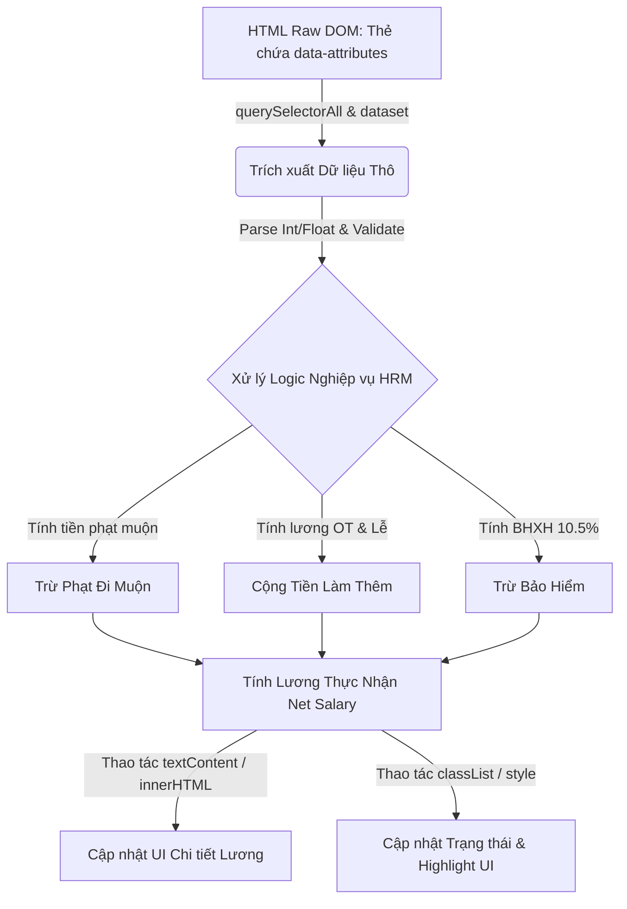

### 1. Mục tiêu bài tập
Sau khi hoàn thành bài tập này, học viên có khả năng:
- **Truy xuất DOM Tree nâng cao**: Sử dụng thuần thục các phương thức `document.querySelectorAll()`, `document.querySelector()`, và truy cập dữ liệu thông qua thuộc tính HTML5 `dataset` (`data-*`).
- **Thao tác & Biến đổi dữ liệu DOM**: Đọc dữ liệu thô từ DOM, chuyển đổi kiểu dữ liệu (String -> Number), xử lý tính toán nghiệp vụ tài chính - nhân sự (HRM FinTech).
- **Cập nhật giao diện động**: Thay đổi nội dung hiển thị bằng `textContent`, `innerHTML`, cập nhật trạng thái trực quan với `classList.add()`, `classList.remove()`, `style` mà **chưa cần dùng đến Event Listeners**.
- **Định dạng dữ liệu chuẩn FinTech**: Chuẩn hóa hiển thị tiền tệ (VND) và định dạng thời gian/con số chuyên nghiệp trên UI.

---


### 2. Bối cảnh & Mô tả bài toán
Trong các hệ thống Quản lý Nhân sự & Chấm công doanh nghiệp (HRM - HR Attendance & Payroll), khi máy chấm công đồng bộ dữ liệu về giao diện Web, hệ thống cần lập tức phân tích danh sách ca làm việc (`ShiftLog`), tính toán các khoản phạt đi muộn, tiền làm thêm giờ (OT), tiền đóng bảo hiểm bắt buộc và xuất ra Phiếu lương chi tiết (`PayrollSlip`) hiển thị trực quan cho nhân viên.

Bạn được giao nhiệm vụ xây dựng module **"Tính toán & Hiển thị Bảng lương Tự động"** cho nhân viên bằng JavaScript thuần (Vanilla JS). Module sẽ tự động quét toàn bộ bảng dữ liệu ca làm việc hiện có trên HTML, trích xuất dữ liệu từ các thuộc tính `data-*`, thực hiện tính toán các chỉ số tài chính nghiệp vụ và cập nhật toàn bộ kết quả lên thẻ Bảng lương tổng hợp.


#### Sơ đồ luồng xử lý dữ liệu DOM:


---


### 3. Quy tắc nghiệp vụ (Business Rules)

Giả định một tháng làm việc tiêu chuẩn bao gồm **22 ngày công** (tương đương **176 giờ làm việc tiêu chuẩn**).


#### A. Công thức tính đơn giá lương theo giờ:
$$\text{Đơn giá giờ} = \frac{\text{Lương cơ bản}}{176}$$


#### B. Quy tắc tính phạt đi muộn (Late Arrival Penalty):
- Hệ thống ghi nhận số phút đi muộn của từng ca làm việc (`data-late-minutes`).
- Nếu số phút đi muộn $\le 15$ phút: **Không bị phạt** (Cho phép sai số cho phép).
- Nếu số phút đi muộn $> 15$ phút: **Phạt 50.000 VNĐ** cho mỗi lần vi phạm trong ca đó.


#### C. Quy tắc tính tiền làm thêm giờ (OT Pay):
- **OT Ngày thường** (`data-ot-hours`): Đơn giá $= \text{Đơn giá giờ} \times 1.5$.
- **OT Ngày lễ/Tết** (`data-holiday-ot-hours`): Đơn giá $= \text{Đơn giá giờ} \times 3.0$.


#### D. Trừ Bảo hiểm Bắt buộc (Insurance Deduction):
- Bảo hiểm xã hội & Y tế (BHXH/BHYT/BHTN): **10.5%** tính trên Lương cơ bản.


#### E. Công thức Lương thực nhận (Net Salary):
$$\text{Lương thực nhận} = \text{Lương cơ bản} + \text{Tổng tiền OT} - \text{Tổng tiền phạt đi muộn} - \text{Tiền đóng bảo hiểm}$$


#### F. Phân loại xếp loại chuyên cần (Attendance Status Badge):
- **Xuất sắc (Badge Xanh)**: Tổng số lượt đi muộn bị phạt $= 0$.
- **Cần cải thiện (Badge Vàng)**: Tổng tiền phạt đi muộn $> 0$ và $\le 100.000$ VNĐ.
- **Vi phạm nghiêm trọng (Badge Đỏ)**: Tổng tiền phạt đi muộn $> 100.000$ VNĐ.

---


### 4. Yêu cầu kỹ thuật & Triển khai


#### A. Cấu trúc HTML mẫu (Học viên tạo file `index.html` dựa trên khung dưới đây):
```html
<!DOCTYPE html>
<html lang="vi">
<head>
    <meta charset="UTF-8">
    <title>Hệ thống Tính Lương HRM - Rikkei Education</title>
    <link rel="stylesheet" href="style.css">
</head>
<body>
    <div id="hr-app">
        <!-- Thông tin nhân viên chứa trong dataset -->
        <header id="employee-profile" 
                data-employee-id="EMP-8892" 
                data-employee-name="Nguyễn Văn An" 
                data-base-salary="20000000">
            <h2 id="emp-name-display">--</h2>
            <p>Mã NV: <span id="emp-id-display">--</span></p>
            <p>Lương cơ bản: <span id="emp-base-salary-display">--</span></p>
        </header>

        <!-- Danh sách ca làm việc thô trong tháng -->
        <section id="timesheet-section">
            <h3>Nhật ký ca làm việc (Timesheet Logs)</h3>
            <table id="shift-table">
                <thead>
                    <tr>
                        <th>Ngày</th>
                        <th>Số phút đi muộn</th>
                        <th>Số giờ OT thường</th>
                        <th>Số giờ OT Lễ/Tết</th>
                        <th>Tiền phạt ca</th>
                    </tr>
                </thead>
                <tbody id="shift-list">
                    <tr class="shift-row" data-date="2023-10-02" data-late-minutes="0" data-ot-hours="2" data-holiday-ot-hours="0"></tr>
                    <tr class="shift-row" data-date="2023-10-05" data-late-minutes="20" data-ot-hours="0" data-holiday-ot-hours="0"></tr>
                    <tr class="shift-row" data-date="2023-10-10" data-late-minutes="45" data-ot-hours="1.5" data-holiday-ot-hours="0"></tr>
                    <tr class="shift-row" data-date="2023-10-20" data-late-minutes="10" data-ot-hours="0" data-holiday-ot-hours="4"></tr>
                    <tr class="shift-row" data-date="2023-10-24" data-late-minutes="30" data-ot-hours="3" data-holiday-ot-hours="0"></tr>
                </tbody>
            </table>
        </section>

        <!-- Bảng tổng hợp lương (Payroll Summary Container) -->
        <section id="payroll-summary">
            <h3>Bảng Chi Tiết Lương Thực Nhận (Payroll Breakdown)</h3>
            <div class="summary-item">Tổng tiền OT nhận được: <span id="display-total-ot">0 VNĐ</span></div>
            <div class="summary-item">Tổng tiền phạt đi muộn: <span id="display-total-penalty">0 VNĐ</span></div>
            <div class="summary-item">Khấu trừ Bảo hiểm (10.5%): <span id="display-insurance">0 VNĐ</span></div>
            <div class="summary-item highlight">LƯƠNG THỰC NHẬN (NET): <span id="display-net-salary">0 VNĐ</span></div>
            
            <div id="status-badge" class="badge">Đang xử lý...</div>
        </section>
    </div>

    <script src="script.js"></script>
</body>
</html>
```


#### B. Yêu cầu xử lý trong file JavaScript (`script.js`):
Viết mã nguồn thực thi **ngay khi trang web được tải** để thực hiện các bước sau:

1. **Bước 1: Trích xuất & Đọc thông tin nhân viên**
   - Lấy Element `#employee-profile`. Read các thuộc tính `data-employee-name`, `data-employee-id`, `data-base-salary`.
   - Ép kiểu `data-base-salary` sang số nguyên (`parseInt`). Kiểm tra nếu không phải số hợp lệ (hoặc $<0$) thì gán mặc định là `0`.
   - Hiển thị các thông tin này lên các thẻ `#emp-name-display`, `#emp-id-display`, `#emp-base-salary-display` với định dạng tiền tệ Việt Nam (`Intl.NumberFormat('vi-VN', { style: 'currency', currency: 'VND' })`).

2. **Bước 2: Quét danh sách ca làm việc & Tính toán**
   - Sử dụng `document.querySelectorAll('.shift-row')` để lấy tất cả các hàng ca làm việc.
   - Duyệt qua từng hàng, đọc dữ liệu từ `dataset`: `date`, `lateMinutes`, `otHours`, `holidayOtHours`.
   - Cập nhật nội dung text (`textContent` hoặc `innerHTML`) cho từng hàng HTML hiển thị rõ dữ liệu ngày, phút muộn, giờ OT và số tiền phạt riêng của ca đó.
   - Tính tổng các chỉ số:
     - Tổng số tiền phạt đi muộn của toàn bộ các ca.
     - Tổng tiền OT regular và OT Holiday.
     - Tiền trừ BHXH (10.5%).
     - Lương thực nhận (Net Salary).

3. **Bước 3: Cập nhật Kết quả lên Bảng lương (DOM UI Update)**
   - Cập nhật kết quả tiền tệ vào các phần tử `#display-total-ot`, `#display-total-penalty`, `#display-insurance`, `#display-net-salary`.
   - Tất cả giá trị số tiền đều phải được định dạng chuẩn VND (Ví dụ: `1.500.000 ₫` hoặc `1.500.000 VNĐ`).

4. **Bước 4: Cập nhật Badge Trạng thái & Style trực quan**
   - Lấy element `#status-badge`.
   - Dựa vào Quy tắc E (Mục 3), gắn class CSS tương ứng cho `#status-badge`:
     - Nếu "Xuất sắc": Thêm class `badge-success`, xóa class cũ, đổi text thành `"Chuyên cần: Xuất sắc"`.
     - Nếu "Cần cải thiện": Thêm class `badge-warning`, đổi text thành `"Chuyên cần: Cần cải thiện"`.
     - Nếu "Vi phạm nghiêm trọng": Thêm class `badge-danger`, đổi text thành `"Chuyên cần: Vi phạm nghiêm trọng"`.
   - Nếu `Net Salary < 0`, tự động đổi màu chữ của thẻ `#display-net-salary` sang màu đỏ (`#d9534f`) bằng `style.color`.

---


### 5. Quy chuẩn nộp bài


#### A. Cấu trúc thư mục dự án:
```text
student_id_ho_va_ten/
│
├── index.html          # File chứa cấu trúc HTML
├── style.css           # File chứa style CSS (nếu có bổ sung)
└── script.js           # File xử lý DOM API & Logic tính lương
```


#### B. Quy định mã nguồn:
- Tên thư mục nộp bài viết liền không dấu, ví dụ: `B20DCCN001_NguyenVanA`.
- Không sử dụng thư viện bên ngoài (jQuery, React, Lodash...).
- Không sử dụng `addEventListener`, inline `onclick`, `fetch API`, hay `localStorage`.
- Đảm bảo mã nguồn chạy trực tiếp thành công khi mở `index.html` trên trình duyệt Chrome/Edge.