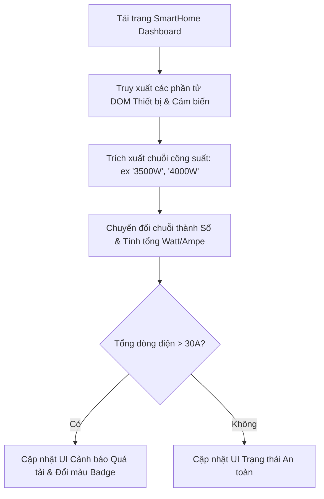

### 1. Mục tiêu bài tập
Sau khi hoàn thành bài tập này, học viên có khả năng:
- **Nhận diện và sửa lỗi (Debug)** các phương thức truy xuất DOM cơ bản (`getElementById`, `querySelector`, `querySelectorAll`).
- **Phân biệt và áp dụng đúng** các thuộc tính đọc/ghi nội dung HTML (`textContent`, `innerText`, `innerHTML`) và giá trị phần tử (`value`).
- **Thao tác chính xác** với CSS class (`classList.add`, `classList.remove`, `classList.replace`) và inline style (`element.style.property`) mà không làm hỏng giao diện hiện tại.
- **Xử lý trích xuất & chuyển đổi kiểu dữ liệu (Type Casting)** từ chuỗi nội dung DOM sang kiểu số để thực hiện tính toán nghiệp vụ chính xác.

---


### 2. Bối cảnh & Mô tả bài toán
Bạn vừa tiếp nhận lại mã nguồn giao diện Bảng điều khiển Giám sát Năng lượng Thông minh (**Smart Home Energy Monitor Dashboard**) từ một lập trình viên thử việc tại **Rikkei SmartHome**. Hệ thống này có nhiệm vụ hiển thị trạng thái thiết bị tiêu thụ điện trong gia đình, tính toán tổng công suất tiêu thụ (Watt) và phát cảnh báo quá tải tự động ngay khi tải trang.

Tuy nhiên, đoạn mã JavaScript hiện tại đang gặp nhiều lỗi kỹ thuật nghiêm trọng khiến giao diện bị vỡ, không tính toán được tổng điện năng, và chức năng cảnh báo an toàn bị vô hiệu hóa.



---


### 3. Quy tắc nghiệp vụ (Business Rules)
1. **Công thức tính toán dòng điện (Amperage)**:
   $$\text{Tổng dòng điện (A)} = \frac{\text{Tổng công suất tiêu thụ (W)}}{220\text{V}}$$
2. **Quy tắc Cảnh báo Quá tải (Overload Protection Rule)**:
   - Ngưỡng an toàn tối đa của aptomat tổng là **30A** (tương đương **6600W** ở điện áp 220V).
   - Nếu tổng công suất tiêu thụ $> 6600\text{W}$ (hoặc $> 30\text{A}$):
     - Hiển thị khối thông báo cảnh báo (`#overload-alert-box`).
     - Đặt nội dung cảnh báo dưới dạng HTML định dạng: `<strong>CẢNH BÁO:</strong> Tổng dòng điện vượt quá 30A! Nguy cơ nhảy Aptomat.`
     - Thêm class CSS `alert-danger` và loại bỏ class `hidden` khỏi phần tử cảnh báo.
3. **Quy tắc Cập nhật Trạng thái Thiết bị (Device Status Rule)**:
   - Chuyển trạng thái của Điều hòa (`#device-ac`) từ "Đang tắt" sang "Đang hoạt động".
   - Cập nhật thẻ trạng thái: Loại bỏ class `inactive`, thêm class `active` (Lưu ý: Không được ghi đè làm mất class gốc `status-badge`).

---


### 4. Yêu cầu kỹ thuật & Triển khai


#### Mã nguồn hiện tại bị lỗi (Cần Debug và Sửa đổi)

**File `index.html` (Giữ nguyên cấu trúc HTML bên dưới, không sửa file HTML):**
```html
<!DOCTYPE html>
<html lang="vi">
<head>
    <meta charset="UTF-8">
    <title>Rikkei SmartHome Monitor</title>
    <style>
        .hidden { display: none; }
        .status-badge { padding: 4px 8px; border-radius: 4px; font-weight: bold; }
        .inactive { background-color: #ccc; color: #333; }
        .active { background-color: #28a745; color: #fff; }
        .alert-danger { background-color: #dc3545; color: #fff; padding: 12px; border-radius: 4px; margin-top: 15px; }
    </style>
</head>
<body>
    <div id="smart-home-dashboard">
        <h2>Bảng Giám Sát Năng Lượng</h2>
        
        <div class="device-card" id="device-ac">
            <h3 class="device-name">Điều hòa Phòng khách</h3>
            <span class="status-badge inactive">Đang tắt</span>
            <p>Công suất: <span class="power-consumption">3500W</span></p>
        </div>

        <div class="device-card" id="device-heater">
            <h3 class="device-name">Bình nóng lạnh</h3>
            <span class="status-badge active">Đang hoạt động</span>
            <p>Công suất: <span class="power-consumption">4000W</span></p>
        </div>

        <hr>
        <div id="total-power-info">
            Tổng công suất tiêu thụ: <span id="total-watt">0</span> W
            (<span id="total-ampere">0</span> A)
        </div>

        <div id="overload-alert-box" class="hidden"></div>
    </div>

    <script src="./main.js"></script>
</body>
</html>
```

**File `main.js` (Mã nguồn LỖI do Lập trình viên cũ viết - Cần sửa lại):**
```javascript
// =========================================================================
// MÃ NGUỒN BỊ LỖI - HỌC VIÊN CẦN DEBUG VÀ SỬA LẠI CHO ĐÚNG YÊU CẦU
// =========================================================================

// LỖI 1: Truy xuất sai selector (Thiếu dấu chấm cho class selector)
var acStatus = document.querySelector("status-badge"); 

// LỖI 2: Dùng thuộc tính .value để lấy nội dung text của thẻ <span>
var acPowerText = document.querySelector("#device-ac .power-consumption").value;
var heaterPowerText = document.querySelector("#device-heater .power-consumption").innerText;

// LỖI 3: Trích xuất số không đúng (Chuỗi chứa chữ 'W') dẫn đến phép cộng chuỗi hoặc NaN
var totalPower = acPowerText + heaterPowerText; 

// Cập nhật DOM Tổng công suất W
document.getElementById("total-watt").innerHTML = totalPower;

// LỖI 4: Ghi đè thuộc tính .className trực tiếp làm mất class gốc 'status-badge'
acStatus.className = "active"; 
acStatus.innerText = "Đang hoạt động";

// LỖI 5: Gán giá trị style không hợp lệ (không có dấu ngoặc kép) và dùng sai thuộc tính ghi HTML
var alertBox = document.getElementById("overload-alert-box");
var currentAmperage = totalPower / 220;

document.getElementById("total-ampere").textContent = currentAmperage;

if (totalPower > 6600) {
    alertBox.style.display = block; // Lỗi ReferenceError: block is not defined
    // LỖI 6: Thẻ <strong> bị hiển thị dưới dạng chữ thô do dùng sai thuộc tính
    alertBox.textContent = "<strong>CẢNH BÁO:</strong> Tổng dòng điện vượt quá 30A! Nguy cơ nhảy Aptomat."; 
    alertBox.classList.add(alert-danger); // Lỗi ReferenceError: alert-danger is not defined
}
```


#### Yêu cầu nhiệm vụ:
1. Xác định toàn bộ **6 lỗi kỹ thuật** trong file `main.js`.
2. Sửa lại mã nguồn JavaScript để ứng dụng thực thi chính xác các nghiệp vụ sau:
   - Trích xuất chính xác giá trị số từ thẻ `.power-consumption` (Loại bỏ ký tự `W` và chuyển thành kiểu `number`).
   - Tính toán đúng: `totalPower` ($3500 + 4000 = 7500\text{W}$) và `currentAmperage` ($\frac{7500}{220} \approx 34.09\text{A}$, làm tròn đến 2 chữ số thập phân bằng `.toFixed(2)`).
   - Cập nhật đúng thẻ badge của `#device-ac`: Giữ lại class `status-badge`, chuyển `inactive` thành `active`, thay đổi nội dung chữ thành `"Đang hoạt động"`.
   - Vì $7500\text{W} > 6600\text{W}$, kích hoạt khối `#overload-alert-box`: Render đúng thẻ HTML `<strong>`, xóa class `hidden`, thêm class `alert-danger`.

---


### 5. Quy chuẩn nộp bài
- **Cấu trúc thư mục dự án**:
  ```text
  student-id_fullname_session17/
  ├── index.html
  └── main.js
  ```
- **Quy định comment trong code**:
  - Tại mỗi vị trí đã sửa lỗi trong `main.js`, học viên phải ghi rõ comment giải thích:
    `// FIX-BUG-[STT]: [Nguyên nhân lỗi] -> [Giải pháp đã khắc phục]`