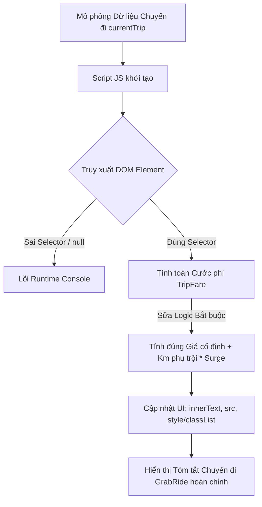

### 1. Mục tiêu bài tập
- **Nhận biết và sửa lỗi (Debug)** các sai sót phổ biến khi làm việc với DOM API: truy xuất element sai selector (`getElementById` thừa dấu `#`, `querySelector` thiếu dấu `.`, chọn sai HTMLCollection vs Element).
- **Thao tác thay đổi nội dung & thuộc tính**: Sử dụng đúng các thuộc tính/phương thức DOM cơ bản (`innerText`, `textContent`, `setAttribute`, `style`, `classList`) thay vì dùng sai thuộc tính `.value` trên các thẻ HTML không phải thẻ input.
- **Áp dụng đúng Quy tắc nghiệp vụ (Business Rules)**: Sửa các lỗi tính toán số học liên quan đến cước phí cố định, cước phụ trội theo kilomet và hệ số nhân giờ cao điểm (Surge Pricing) cho ứng dụng đặt xe công nghệ **GrabRide**.


### 2. Bối cảnh & Mô tả bài toán
Hệ thống đặt xe GrabRide đang phát triển màn hình **Tóm tắt chuyến đi (RideBooking Summary)** hiển thị thông tin tài xế, khoảng cách di chuyển, phụ phí thời tiết/giờ cao điểm và tổng tiền thanh toán cho hành khách.

Một Lập trình viên tập sự (Fresher Developer) đã chuẩn bị mã HTML và viết script JavaScript để cập nhật dữ liệu chuyến đi lên giao diện. Tuy nhiên, đoạn mã JS liên tục gặp lỗi rác ở Console (`TypeError: Cannot set property...`, `Cannot read properties of null`), đồng thời tính toán sai tiền cước của hành khách.

Nhiệm vụ của bạn là kiểm tra, phát hiện toàn bộ các lỗi trong đoạn mã nguồn bị hỏng, giải thích nguyên nhân và viết lại mã JS hoàn chỉnh để giao diện hiển thị chính xác.




### 3. Quy tắc nghiệp vụ (Business Rules)
Cước phí chuyến đi (`TripFare`) của GrabRide được tính dựa trên các quy định sau:
1. **Giá cước sàn (2 km đầu tiên)**: Mức cố định là **12.000 VNĐ** (dù khoảng cách di chuyển $< 2$ km vẫn tính tròn 12.000 VNĐ).
2. **Giá cước phụ trội (Từ km thứ 3 trở đi)**: Mỗi kilomet tiếp theo (kể cả số thập phân) tính **4.500 VNĐ/km**.
   $$\text{Cước gốc} = 12.000 + (\text{Số km} - 2) \times 4.500 \quad (\text{nếu Số km} > 2)$$
3. **Phụ phí Giờ cao điểm / Thời tiết xấu (Surge Pricing)**:
   - Nếu `isSurge = true`: Tổng tiền cước = $\text{Cước gốc} \times 1.2$ (Tăng 20%).
   - Nếu `isSurge = false`: Tổng tiền cước = $\text{Cước gốc}$.
4. **Định dạng hiển thị**:
   - Tất cả giá tiền hiển thị ra màn hình phải được làm tròn nguyên (Math.round hoặc Math.floor) và kết thúc bằng chuỗi `" VNĐ"` (Ví dụ: `27.750 VNĐ`).
   - Nếu `isSurge = true`, phần hiển thị thẻ Phụ phí (`#surge-badge`) phải có chữ `"Có áp dụng (1.2x)"` và bổ sung thêm class CSS `surge-active` (chữ màu đỏ, nền hồng nhẹ). Nếu không áp dụng, hiển thị `"Không áp dụng"` và thêm class `surge-inactive`.


### 4. Yêu cầu kỹ thuật & Triển khai


#### 4.1. Mã HTML nguồn hiện tại (`index.html`)
Giữ nguyên file HTML dưới đây, **không thay đổi cấu trúc HTML**:

```html
<!DOCTYPE html>
<html lang="vi">
<head>
  <meta charset="UTF-8">
  <title>GrabRide - Tóm tắt chuyến đi</title>
  <style>
    .card { border: 1px solid #ccc; padding: 16px; border-radius: 8px; width: 320px; font-family: sans-serif; }
    .info-group { margin-bottom: 8px; }
    .badge { padding: 4px 8px; border-radius: 4px; font-size: 12px; }
    .surge-active { background-color: #ffe6e6; color: #d93025; font-weight: bold; }
    .surge-inactive { background-color: #e8f0fe; color: #1a73e8; }
    .total { font-size: 18px; font-weight: bold; color: #00880c; border-top: 1px dashed #ccc; padding-top: 8px; }
  </style>
</head>
<body>
  <div id="booking-card" class="card">
    <h2 id="trip-title">Thông tin chuyến đi GrabRide</h2>
    
    <div class="info-group">
      <span>Tài xế:</span> 
      <strong id="driver-name">--</strong>
      
    </div>

    <div class="info-group">
      <span>Khoảng cách:</span> <span id="distance">0</span> km
    </div>

    <div class="info-group">
      <span>Cước phí gốc:</span> <span id="base-fare">0 VNĐ</span>
    </div>

    <div class="info-group">
      <span>Giờ cao điểm / Mưa:</span> <span id="surge-badge" class="badge">--</span>
    </div>

    <div class="info-group total">
      <span>Tổng thanh toán:</span> <span id="total-fare">0 VNĐ</span>
    </div>
  </div>

  <script src="script.js"></script>
</body>
</html>
```


#### 4.2. Mã JavaScript gặp lỗi cần Debug (`script.js`)
Dưới đây là mã do lập trình viên tập sự viết bị chứa **ít nhất 5 lỗi sai**:

```javascript
// Dữ liệu chuyến đi mô phỏng từ hệ thống GrabRide
const currentTrip = {
  driverName: "Nguyễn Văn Tài",
  driverAvatar: "https://via.placeholder.com/40",
  distanceKm: 5.5,
  isSurge: true
};

// --- LỖI TRUY XUẤT DOM ---
const driverNameEl = document.getElementById("#driver-name"); 
const driverAvatarEl = document.querySelector("driver-avatar"); 
const distanceEl = document.getElementById("distance");
const baseFareEl = document.getElementsByClassName("base-fare"); 
const surgeBadgeEl = document.querySelector("#surge-badge");
const totalFareEl = document.querySelector(".total-fare"); 

// --- LỖI LOGIC TÍNH CƯỚC ---
function calculateTripFare(distance, isSurge) {
  let baseFare = 0;
  if (distance <= 2) {
    baseFare = 12000;
  } else {
    baseFare = 12000 + distance * 4500; // Lỗi: Chưa trừ 2km đầu tiên
  }

  let finalFare = baseFare;
  if (isSurge) {
    finalFare = baseFare + 1.2; // Lỗi: Cộng trực tiếp 1.2 thay vì nhân hệ số 1.2
  }

  return { baseFare, finalFare };
}

// --- LỖI THAO TÁC DOM & GÁN GIÁ TRỊ ---
driverNameEl.value = currentTrip.driverName; 
driverAvatarEl.src = currentTrip.driverAvatar; 
distanceEl.innerHTML = currentTrip.distanceKm;

const fareResult = calculateTripFare(currentTrip.distanceKm, currentTrip.isSurge);

baseFareEl.innerText = fareResult.baseFare + " VNĐ"; 
totalFareEl.value = fareResult.finalFare + " VNĐ"; 

if (currentTrip.isSurge) {
  surgeBadgeEl.textContent = "Có áp dụng (1.2x)";
  surgeBadgeEl.style = "color: red;"; // Lỗi: Gán đè chuỗi style trực tiếp làm hỏng class CSS có sẵn
} else {
  surgeBadgeEl.textContent = "Không áp dụng";
}
```


#### 4.3. Yêu cầu chi tiết cho học viên
1. **Báo cáo Debug**: Liệt kê rõ ràng ít nhất **5 lỗi** trong file `script.js` trên (Ghi rõ dòng/vị trí bị lỗi, loại lỗi và nguyên nhân gây lỗi).
2. **Sửa lỗi Code**: Viết lại toàn bộ mã trong file `script.js` sao cho:
   - Truy xuất đúng tất cả các DOM Element bằng `document.getElementById` hoặc `document.querySelector`.
   - Tính đúng `baseFare` (Cước gốc) và `finalFare` (Tổng thanh toán sau phụ phí) với `distanceKm = 5.5` và `isSurge = true`:
     - Cước gốc với 5.5 km: $12.000 + (5.5 - 2) \times 4.500 = 12.000 + 15.750 = 27.750$ VNĐ.
     - Phụ phí Surge (1.2x): $27.750 \times 1.2 = 33.300$ VNĐ.
   - Hiển thị đầy đủ thông tin tên tài xế, ảnh đại diện (`src`), số km, cước phí gốc, tổng tiền.
   - Sử dụng `classList.add()` để thêm class `surge-active` hoặc `surge-inactive` phù hợp cho thẻ `#surge-badge`.
3. **Giới hạn phạm vi kỹ thuật (Ràng buộc nghiêm ngặt)**:
   - **KHÔNG** sử dụng Event Listener (`addEventListener`, `onclick`).
   - **KHÔNG** sử dụng `Fetch API`, `LocalStorage`, hoặc xử lý submit Form.
   - Mã script chỉ chạy tuần tự trực tiếp để cập nhật giao diện ngay khi trang load.


### 5. Quy chuẩn nộp bài
- Tổ chức cấu trúc thư mục nộp bài như sau:
  ```text
  bai-tap-debug-grabride/
  ├── index.html          # File HTML giữ nguyên
  ├── script.js            # File JS đã sửa lỗi và tối ưu
  └── debug-report.md      # Báo cáo danh sách các lỗi đã tìm thấy & cách khắc phục
  ```
- File `debug-report.md` cần trình bày theo định dạng Bảng gồm các cột: `STT | Mã lỗi / Vị trí | Nguyên nhân | Cách khắc phục`.